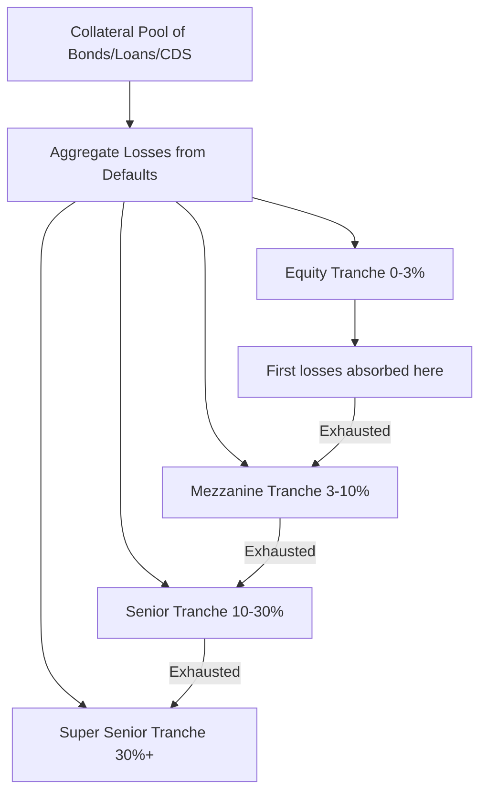

## Collateralized Debt Obligations

### Overview

Collateralized Debt Obligations (CDOs) are structured credit securities that repackage a pool of debt instruments (bonds, loans, or credit derivatives) into multiple tranches with differing seniority, redistributing the pool's aggregate credit risk across investors with varying risk appetites. Unlike MBS, whose primary risk driver is prepayment behavior, CDOs are fundamentally structured around **credit/default risk** and the **correlation** between defaults across the underlying pool, making default correlation modeling the central technical challenge in CDO valuation.

### Basic CDO Structure and Mechanics

**The Waterfall and Tranching**

A CDO pools a portfolio of underlying credit exposures (the **collateral**) and issues tranches with a defined **priority of claims** (the "waterfall") on the pool's cash flows and loss absorption:

- **Equity tranche** (first-loss, typically 0–3% or 0–10% of notional): Absorbs the first losses from defaults in the collateral pool; highest risk, highest expected return; often retained by the originator or sold to specialized risk-seeking investors.
- **Mezzanine tranche(s)** (e.g., 3–7%, 7–10%): Absorb losses after the equity tranche is exhausted; intermediate risk/return, often rated BBB to A.
- **Senior tranche** (e.g., 10–30%): Absorbs losses only after mezzanine tranches are exhausted; typically rated AAA/AA, lowest risk of principal loss.
- **Super-senior tranche** (above 30%, in some structures): The most senior claim, essentially only exposed to catastrophic, pool-wide default scenarios.

### Cash CDOs vs. Synthetic CDOs

**Cash CDOs**

The CDO issuer (a special purpose vehicle, SPV) actually purchases the underlying bonds or loans, funding this purchase through the sale of the tranched notes to investors. Investors receive cash flows directly derived from the physical collateral pool's interest and principal payments.

**Synthetic CDOs**

Rather than owning the physical assets, the SPV enters into a portfolio of **credit default swaps (CDS)** referencing the underlying credits, effectively selling credit protection and receiving CDS premium income, which is then distributed to tranche investors. Losses are triggered by credit events (default, restructuring) on the reference names within the swap portfolio, mirroring the same tranche-based loss allocation as cash CDOs but without requiring the SPV to hold the physical assets.

**CDO-Squared and Further Re-Securitization**

A **CDO-squared** is a CDO whose collateral pool consists of tranches of *other* CDOs (rather than individual bonds or loans directly), creating additional layers of leverage and correlation complexity. This structure, along with related re-securitizations, was a significant contributor to the opacity and mispricing of risk that became widely recognized during the 2007–2008 financial crisis.

### Default Correlation: The Central Modeling Challenge

**Key Points**

- A CDO tranche's value depends not just on the individual default probabilities of names in the collateral pool, but critically on the **joint default behavior** (correlation) across those names, since tranching concentrates exposure to specific segments of the aggregate loss distribution.
- Higher default correlation increases the probability of **extreme outcomes** (either very few defaults or many simultaneous defaults) relative to a scenario of independent defaults, which — due to the nonlinear, threshold-based payoff structure of tranches — benefits senior and equity tranches differently than mezzanine tranches.
- This sensitivity to correlation, combined with the practical difficulty of directly observing or estimating joint default correlation from market data, makes correlation modeling both the most important and most contested aspect of CDO pricing.

### The Gaussian Copula Model

**Concept and Motivation**

The single-factor **Gaussian copula model**, popularized by David Li (2000), became the market-standard approach for CDO tranche pricing due to its computational tractability, despite well-documented theoretical limitations that became especially apparent during the 2008 financial crisis.

**Model Specification**

Each obligor $i$ in the collateral pool is assigned a latent "asset value" variable:

$$X_i = \rho \cdot Z + \sqrt{1-\rho^2}\cdot \epsilon_i$$

where $Z$ is a common systematic factor affecting all obligors, $\epsilon_i$ is an idiosyncratic factor specific to obligor $i$, and $\rho$ is the correlation parameter linking each obligor to the common factor (in the simplest single-factor version, $\rho$ is often assumed identical across all names). Default for obligor $i$ occurs if $X_i$ falls below a threshold $K_i$ calibrated to match that obligor's marginal default probability (typically derived from CDS spreads):

$$\text{Default}_i \iff X_i \leq K_i, \quad K_i = \Phi^{-1}(PD_i)$$

**Conditional Independence and Tranche Loss Distribution**

Conditional on the common factor $Z$, individual defaults become independent, allowing the conditional loss distribution of the pool to be computed as a sum of independent Bernoulli-type outcomes (often via a recursive or Fourier-based algorithm), and then integrated over the distribution of $Z$ to obtain the unconditional pool loss distribution:

$$P(\text{Loss} \leq L) = \int_{-\infty}^{\infty} P(\text{Loss} \leq L \mid Z=z)\, \phi(z)\, dz$$

Tranche values are then computed by applying the tranche's specific attachment/detachment points to this aggregate loss distribution.

### Base Correlation and the Correlation Skew

**Key Points**

- In practice, when the Gaussian copula model is calibrated separately to different tranches of the same underlying index (e.g., CDX or iTraxx index tranches), the **implied correlation** required to match each tranche's market price is **not constant across tranches** — a phenomenon directly analogous to the volatility smile/skew in options markets.
- This gave rise to the **base correlation** framework (McGinty et al., 2004), which expresses each tranche's risk not in terms of its own (non-constant) compound correlation, but via the correlation implied by a series of hypothetical "base tranches" (0% to each detachment point), from which any actual tranche's value can be derived by differencing adjacent base tranche values.
- The existence of a correlation skew is widely interpreted as evidence that the simple single-factor Gaussian copula does not fully capture the true dependence structure of the underlying credit portfolio, motivating extensions discussed below.

### Extensions and Alternatives to the Gaussian Copula

**Student-t Copula**

Replaces the Gaussian common factor with a Student-t distributed factor, which has heavier tails, better capturing the empirically observed tendency for large, simultaneous defaults ("credit contagion" or systemic events) to occur more frequently than a Gaussian dependence structure would imply.

**Double-t and Other Heavy-Tailed Factor Models**

Use different tail behaviors for the systematic and idiosyncratic components (e.g., a t-distributed common factor combined with a t-distributed or Gaussian idiosyncratic term), offering additional flexibility in shaping tail dependence.

**Random Factor Loading Models**

Allow the correlation parameter $\rho$ itself to vary stochastically or depend on the state of the systematic factor (e.g., higher effective correlation during systemic downturns), directly addressing the empirically observed correlation skew by building state-dependent correlation into the model itself rather than treating it as a market anomaly to be separately calibrated per tranche.

**Structural and Intensity-Based Multi-Factor Models**

More sophisticated approaches model default correlation through structural credit models (Merton-style firm value processes with correlated asset returns) or reduced-form intensity models with correlated jump/default intensities, offering theoretically richer dependence structures at the cost of substantially greater calibration complexity.

### Comparison of CDO Correlation Modeling Approaches

| Model | Tail Dependence | Calibration Complexity | Captures Correlation Skew? |
| --- | --- | --- | --- |
| Single-Factor Gaussian Copula | Low (thin tails) | Low | No (motivates base correlation workaround) |
| Base Correlation Framework | N/A (market-convention overlay) | Low-moderate | By construction (per-tranche calibration) |
| Student-t / Double-t Copula | Higher (fat tails) | Moderate | Partially |
| Random Factor Loading | Variable/state-dependent | High | Better, by design |
| Structural Multi-Factor Models | Model-dependent, richer | Very high | Depends on specification |

### Tranche Sensitivity to Correlation (Illustration)

<svg xmlns="http://www.w3.org/2000/svg" viewBox="0 0 700 420">
<text x="350" y="30" font-size="18" text-anchor="middle" font-family="sans-serif" font-weight="bold">Tranche Value Sensitivity to Default Correlation (svg_diagram)</text>
<line x1="80" y1="360" x2="650" y2="360" stroke="black" stroke-width="2" />
<line x1="80" y1="360" x2="80" y2="50" stroke="black" stroke-width="2" />
<text x="365" y="395" font-size="14" text-anchor="middle" font-family="sans-serif">Default Correlation</text>
<text x="30" y="200" font-size="14" text-anchor="middle" font-family="sans-serif" transform="rotate(-90 30 200)">Tranche Value</text>
<path d="M 100 320 Q 300 250 500 180 T 620 120" stroke="#16a34a" stroke-width="3" fill="none" />
<text x="420" y="150" font-size="13" font-family="sans-serif" fill="#16a34a">Equity Tranche (value rises with correlation)</text>
<path d="M 100 100 Q 300 180 500 260 T 620 320" stroke="#dc2626" stroke-width="3" fill="none" />
<text x="420" y="290" font-size="13" font-family="sans-serif" fill="#dc2626">Senior Tranche (value falls with correlation)</text>
<path d="M 100 250 Q 365 230 620 250" stroke="#2563eb" stroke-width="2" stroke-dasharray="5,3" fill="none" />
<text x="440" y="230" font-size="13" font-family="sans-serif" fill="#2563eb">Mezzanine (relatively flat/mixed sensitivity)</text>
</svg>

**Key Points**

- **Equity tranche value generally increases with correlation**: Higher correlation increases the probability of the "good" scenario (very few defaults, benefiting the first-loss holder who otherwise expects to absorb losses under independent-default assumptions) even though it also increases the probability of the "bad" extreme scenario, and the asymmetric payoff structure of the equity tranche (limited additional downside once nearly wiped out, but meaningful upside from avoiding losses entirely) tends to favor higher correlation on net.
- **Senior tranche value generally decreases with correlation**: Higher correlation increases the probability of extreme, pool-wide loss scenarios that could reach the senior tranche's attachment point, which is the primary risk concern for senior investors who are otherwise well-protected under independent-default assumptions.
- **Mezzanine tranches exhibit more mixed, often non-monotonic sensitivity** to correlation, since they sit between the two competing effects described above. [Inference: the exact shape and turning points of mezzanine correlation sensitivity depend on the specific attachment/detachment points and portfolio characteristics; general qualitative direction is well-established but precise magnitudes are portfolio-specific.]

### Managed CDOs vs. Static CDOs

- **Static CDOs**: The collateral pool composition is fixed at issuance and does not change over the life of the deal (aside from scheduled amortization/maturity).
- **Managed CDOs**: A collateral manager has discretion to buy and sell underlying credits within specified guidelines over a defined reinvestment period, introducing manager selection/skill as an additional risk factor beyond the underlying pool's inherent credit characteristics.

### Practical Implementation Notes

- **Post-crisis regulatory and market evolution**: Following the 2008 financial crisis, CDO issuance (particularly of complex re-securitized structures like CDO-squared) declined sharply, and subsequent regulatory reforms (e.g., risk retention requirements, enhanced disclosure standards) significantly changed the market structure for new issuance; **Collateralized Loan Obligations (CLOs)**, a closely related structure backed primarily by leveraged loans rather than bonds or structured products, remain an active and substantial segment of the broader CDO family. [Note: given the pace of regulatory and market evolution in structured credit, practitioners should verify current market size, issuance trends, and regulatory requirements against up-to-date sources.]
- **Model risk awareness**: The Gaussian copula model's well-documented limitations (thin tails, inability to natively capture the correlation skew, sensitivity to correlation assumption) mean CDO valuation should always be understood as significantly model-dependent, with the base correlation framework functioning more as a market quotation convention than a fully structural description of true default dependence.
- **Rating agency methodology divergence**: Historically, rating agencies used varying default correlation and loss modeling assumptions in their CDO tranche rating methodologies, and discrepancies between rating agency assumptions and actual realized default correlation (particularly during systemic stress) were a widely cited factor in the mispricing of senior CDO tranche risk prior to the 2008 crisis.
- **Data requirements**: Accurate CDO valuation requires reliable estimates of individual obligor default probabilities (often derived from CDS spreads or historical default studies) and a chosen correlation/dependence structure; the quality and liquidity of underlying CDS or bond market data for the referenced names directly affects the reliability of the resulting tranche valuation.

### Related Topics

- Credit Default Swaps (CDS) as the building block for synthetic CDO structures
- Collateralized Loan Obligations (CLOs) and their distinct collateral and structural features
- Copula theory and dependence modeling in quantitative finance more broadly
- Base correlation and correlation skew calibration methodology in detail
- Structural credit risk models (Merton model) as an alternative to reduced-form/copula approaches
- CDS index products (CDX, iTraxx) and their tranche markets
- The 2007-2008 financial crisis and structured credit market failures
- Loss distribution modeling via recursive and Fourier-transform-based algorithms