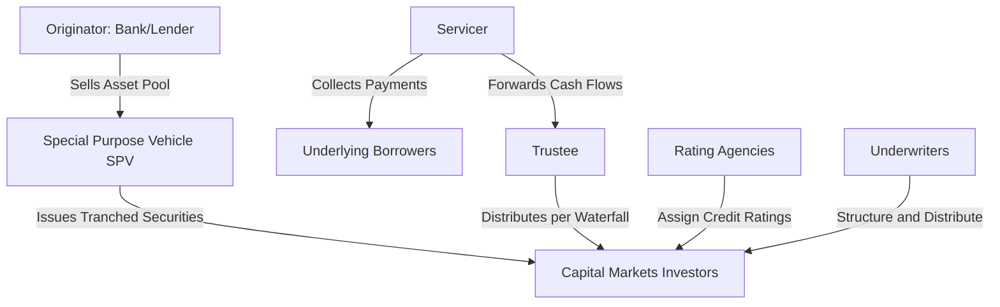

## Securitization Mechanics

### Overview

Securitization is the financial process of pooling illiquid, income-generating financial assets (loans, receivables, leases) and transforming them into tradable securities sold to capital markets investors. It underlies MBS, CDOs, CLOs, and asset-backed securities (ABS) more broadly, and its mechanics — the legal, structural, and cash-flow engineering that convert a pool of individual obligations into rated, tranched securities — form the operational foundation on which those specific products are built.

### The Core Securitization Process

**Key Participants and Roles**

- **Originator**: The entity that initially creates the underlying assets (e.g., a bank originating mortgages, an auto lender originating car loans, a credit card issuer generating receivables).
- **Special Purpose Vehicle (SPV) / Special Purpose Entity (SPE)**: A legally separate entity created specifically to purchase the pool of assets from the originator and issue securities backed by them; critically, the SPV is structured to be **bankruptcy-remote** from the originator.
- **Servicer**: Collects payments from underlying borrowers, manages delinquencies, and forwards cash flows to the SPV/trustee; often the originator itself continues in this role, though servicing can be transferred.
- **Trustee**: Acts on behalf of investors, ensuring the SPV and servicer comply with the transaction's governing documents and administering cash flow distribution per the waterfall.
- **Rating Agencies**: Assess and assign credit ratings to the issued tranches based on the underlying collateral quality, structural protections, and modeled loss scenarios.
- **Underwriters**: Structure and distribute the securities to investors, often assisting in tranche sizing and marketing.

### True Sale and Bankruptcy Remoteness

**Key Points**

- A foundational legal requirement for securitization is achieving a **"true sale"** of the underlying assets from the originator to the SPV, meaning the transfer is structured (and legally opined upon, typically via a "true sale opinion" from counsel) such that the assets would not be considered part of the originator's estate in the event of the originator's bankruptcy.
- **Bankruptcy remoteness** of the SPV itself is equally critical: the SPV is typically structured as a limited-purpose entity with restrictions preventing it from incurring additional debt, engaging in unrelated business activities, or being consolidated into the originator's bankruptcy estate, often reinforced through an "independent director" requirement and specific organizational covenants.
- These structural protections are what allow securitized tranches to potentially achieve credit ratings **higher than the originator's own corporate credit rating** — since investors are relying on the isolated cash flows of the specific asset pool (plus structural credit enhancements) rather than the originating institution's general creditworthiness.

### Credit Enhancement Techniques

Credit enhancement improves the credit quality of senior tranches beyond what the raw underlying collateral would support on a pro-rata basis, and can be **internal** (built into the deal structure itself) or **external** (provided by a third party).

**Internal Credit Enhancement**

- **Subordination/Tranching**: As covered under CDO and MBS structures, junior tranches absorb losses first, protecting senior tranches — the most common and fundamental form of internal credit enhancement.
- **Overcollateralization (OC)**: The face value of the underlying collateral pool exceeds the face value of the issued securities, providing a cushion that can absorb losses before impacting the rated tranches.
- **Excess Spread**: The difference between the interest income generated by the collateral pool and the interest paid to security holders (plus servicing and other fees); this excess can be trapped or used to build reserves/pay down principal if collateral performance deteriorates, functioning as a first line of loss absorption before subordination is impacted.
- **Reserve/Cash Collateral Accounts**: A cash reserve funded at closing (or built up over time from excess spread) specifically earmarked to cover shortfalls in scheduled payments to investors.

**External Credit Enhancement**

- **Financial Guarantee Insurance ("Monoline" wraps)**: A third-party insurer guarantees timely payment of principal and interest on a tranche, historically provided by monoline insurers (e.g., MBIA, Ambac), though the reliability and market presence of this enhancement type diminished significantly following the 2008 financial crisis when many monolines' own creditworthiness was severely impaired.
- **Letters of Credit (LOCs)**: A bank commits to cover shortfalls up to a specified amount, providing similar protection to financial guarantee insurance but structured as a banking product.
- **Third-Party Cash Collateral**: A guarantee or cash deposit provided by an entity other than the originator or SPV itself.

### The Waterfall: Cash Flow Distribution Mechanics

**Sequential Payment Priority**

The **waterfall** defines the precise contractual order in which available cash is distributed among expenses, fees, and tranche holders each payment period. A typical simplified waterfall might proceed:

1. Trustee and servicing fees
2. Senior tranche interest
3. Mezzanine tranche interest
4. Subordinate/equity tranche interest (if any remains)
5. Principal payments per the structural rules (sequential-pay, pro-rata, or PAC/companion as applicable)
6. Residual/excess spread to equity or reserve accounts

**Performance Triggers**

Many securitizations include **triggers** (also called "step-down" or "step-up" tests) that alter the waterfall's normal operation based on collateral performance metrics such as cumulative losses, delinquency rates, or the deal's overcollateralization ratio:

- **Trigger breach (deal underperforming)**: Cash flow that would normally flow to junior tranches or be released to the residual holder is instead redirected to pay down senior tranches faster or build reserves, protecting senior investors from deteriorating collateral performance.
- **Trigger cure/step-down (deal performing well)**: After a specified period of satisfactory performance (and if collateral metrics remain within acceptable bounds), the deal may "step down," allowing more cash flow to flow to junior tranches or be released to the originator/residual holder, reflecting reduced need for continued credit enhancement buildup.

### Amortization Structures

**Pass-Through Amortization**

Principal is passed to investors as it is collected from the underlying pool (scheduled amortization plus any prepayments), directly analogous to MBS pass-through structures.

**Controlled Amortization**

Common in revolving asset securitizations (e.g., credit card receivables), where during an initial **revolving period**, principal collections are used to purchase new receivables (maintaining a constant pool balance) rather than being passed to investors; a subsequent **amortization period** (either controlled/scheduled, or "rapid amortization" triggered by early warning indicators) then repays investor principal.

**Example**

A credit card ABS transaction might specify:

- A 3-year revolving period, during which monthly principal collections are reinvested into new card receivables to maintain the securitized pool size
- A subsequent controlled amortization period, distributing principal to investors in equal monthly installments over 12 months
- Early amortization triggers (e.g., excess spread falling below zero for three consecutive months, indicating the pool is generating insufficient income to cover its own costs) that would immediately convert the structure to rapid amortization, protecting investors from further exposure to a deteriorating pool

### Comparison of Securitization Asset Classes

| Asset Class | Typical Structure | Primary Risk Driver | Amortization Type |
| --- | --- | --- | --- |
| Residential Mortgages (MBS) | Pass-through / CMO tranches | Prepayment risk | Pass-through (with prepayment) |
| Auto Loans (Auto ABS) | Sequential-pay tranches | Credit/default risk | Scheduled amortization |
| Credit Card Receivables | Revolving/master trust | Credit risk, payment rate | Revolving then controlled amortization |
| Student Loans (SLABS) | Sequential/parallel tranches | Credit and prepayment risk | Scheduled, often long tenor |
| Commercial Mortgages (CMBS) | Sequential tranches with call protection | Credit/default risk, limited prepayment (due to prepayment lockouts/yield maintenance) | Bullet/balloon-heavy amortization |
| Corporate Loans (CLOs) | Tranched with reinvestment period | Credit/default risk, manager selection | Revolving reinvestment then amortization |

### Legal and Documentation Framework

**Key Transaction Documents**

- **Pooling and Servicing Agreement (PSA)**: Governs the transfer of assets to the trust/SPV and defines servicing obligations and standards.
- **Indenture**: For note-structured (rather than trust-certificate-structured) deals, defines the terms of the issued debt securities and the trustee's duties to noteholders.
- **Offering Memorandum/Prospectus**: Discloses the transaction structure, collateral characteristics, risk factors, and waterfall mechanics to prospective investors.
- **Servicing Agreement**: Details the servicer's obligations, compensation, and standards for collection and default management on the underlying assets.

### Master Trust Structures

**Key Points**

- Many revolving asset securitizations (particularly credit card ABS) use a **master trust** structure, where a single trust holds a large, continuously replenished pool of receivables, and multiple separate securities ("series") can be issued against that same shared collateral pool over time.
- This structure provides originators with efficient, repeated access to securitization funding without needing to establish an entirely new legal entity and pool for each issuance, while allocating cash flows among the multiple outstanding series according to each series' pro-rata (or otherwise defined) share of the trust's aggregate receivables.

### Securitization Waterfall and Trigger Mechanics (Illustration)

<svg xmlns="http://www.w3.org/2000/svg" viewBox="0 0 700 440">
<text x="350" y="30" font-size="18" text-anchor="middle" font-family="sans-serif" font-weight="bold">Securitization Cash Flow Waterfall (svg_diagram)</text>
<rect x="250" y="50" width="200" height="40" fill="#e0e7ff" stroke="black" />
<text x="350" y="75" font-size="13" text-anchor="middle" font-family="sans-serif">Collateral Pool Cash Flows</text>
<line x1="350" y1="90" x2="350" y2="120" stroke="black" />
<rect x="250" y="120" width="200" height="35" fill="#dbeafe" stroke="black" />
<text x="350" y="142" font-size="12" text-anchor="middle" font-family="sans-serif">Fees and Expenses</text>
<line x1="350" y1="155" x2="350" y2="180" stroke="black" />
<rect x="250" y="180" width="200" height="35" fill="#bfdbfe" stroke="black" />
<text x="350" y="202" font-size="12" text-anchor="middle" font-family="sans-serif">Senior Tranche Interest</text>
<line x1="350" y1="215" x2="350" y2="240" stroke="black" />
<rect x="250" y="240" width="200" height="35" fill="#93c5fd" stroke="black" />
<text x="350" y="262" font-size="12" text-anchor="middle" font-family="sans-serif">Mezzanine Interest</text>
<line x1="350" y1="275" x2="350" y2="300" stroke="black" />
<rect x="250" y="300" width="200" height="35" fill="#60a5fa" stroke="black" />
<text x="350" y="322" font-size="12" text-anchor="middle" font-family="sans-serif">Principal per Structure</text>
<line x1="350" y1="335" x2="350" y2="360" stroke="black" />
<rect x="250" y="360" width="200" height="35" fill="#fca5a5" stroke="black" />
<text x="350" y="382" font-size="12" text-anchor="middle" font-family="sans-serif">Residual / Equity</text>
<path d="M 460 130 L 550 130 L 550 400 L 460 400" stroke="#dc2626" stroke-width="2" fill="none" stroke-dasharray="5,3" />
<text x="555" y="270" font-size="12" font-family="sans-serif" fill="#dc2626">Trigger breach redirects</text>
<text x="555" y="285" font-size="12" font-family="sans-serif" fill="#dc2626">cash flow upward</text>
</svg>

### Practical Implementation Notes

- **Regulatory framework (Risk Retention)**: Post-2008 reforms in major jurisdictions (e.g., Dodd-Frank's "skin in the game" risk retention rules in the US, and similar EU/UK securitization regulations) generally require originators or sponsors to retain a specified minimum economic interest in securitized transactions, intended to align originator incentives with those of investors and discourage the "originate-to-distribute" model criticized following the financial crisis. [Note: specific risk retention percentages, exemptions, and compliance mechanisms vary by jurisdiction and have been subject to periodic regulatory revision; practitioners should verify current requirements against up-to-date regulatory sources for the relevant jurisdiction.]
- **Due diligence and data quality**: The reliability of any securitization's rating and valuation is fundamentally dependent on the quality and completeness of loan-level or receivable-level data provided about the underlying collateral pool; data quality issues were widely cited as a contributing factor to mispriced risk in certain pre-2008 securitizations, particularly in non-agency residential mortgage deals.
- **Servicer quality and alignment**: Since the servicer directly manages collection and default resolution on the underlying assets, servicer quality, incentive alignment (e.g., servicing fee structures, potential conflicts if the servicer also holds a subordinate tranche), and operational capacity are material (though sometimes underappreciated) risk factors in securitization performance.
- **Structuring complexity tradeoffs**: More complex structures (multiple triggers, numerous tranches, revolving periods with intricate eligibility criteria) can more precisely tailor risk allocation to investor preferences, but also increase legal, administrative, and modeling complexity, and can obscure risk transparency if not clearly disclosed — a tension widely discussed in post-crisis securitization reform debates.

### Related Topics

- Mortgage-backed securities (detailed collateral-specific mechanics)
- Collateralized debt obligations and collateralized loan obligations
- Asset-backed securities (auto, credit card, student loan) structural nuances
- Credit rating agency methodologies for structured finance products
- True sale legal opinions and bankruptcy remoteness analysis in structured finance
- Risk retention regulation (Dodd-Frank, EU Securitization Regulation) and originator incentive alignment
- Special purpose vehicle (SPV) governance and independent director requirements
- Master trust structures and multi-series revolving securitizations