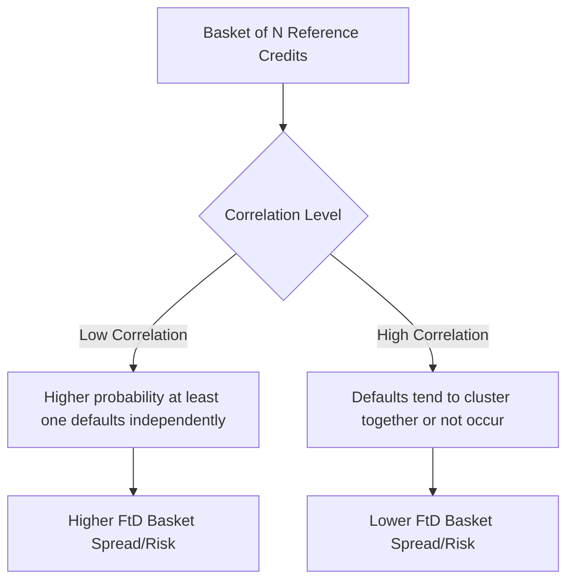

## Structured Credit Products

### Overview

Structured credit products encompass the broad category of instruments that repackage, transfer, or create synthetic exposure to credit risk through contractual and legal structuring, extending beyond the securitization vehicles (MBS, CDOs) already covered to include single-name and portfolio credit derivatives, index products, and hybrid structures. This category is unified by the common goal of isolating, transferring, or customizing exposure to credit risk (default, downgrade, spread widening) independent of the underlying obligor's actual debt instruments.

### Credit Default Swaps: The Foundational Building Block

**Structure and Mechanics**

A Credit Default Swap (CDS) is a bilateral contract in which the **protection buyer** pays a periodic premium (the CDS spread, quoted in basis points per annum) to the **protection seller**, in exchange for a payment if a specified **credit event** occurs on the **reference entity**.

$$\text{Premium Leg (PV)} = \sum_{i=1}^{n} s \cdot \tau_i \cdot P(0,T_i) \cdot Q(T_i)$$

$$\text{Protection Leg (PV)} = (1-R)\int_0^T P(0,t)\, dQ(t)$$

where $s$ is the CDS spread, $\tau_i$ is the accrual period, $P(0,T_i)$ is the discount factor, $Q(T_i)$ is the survival probability to time $T_i$, and $R$ is the assumed recovery rate on the reference entity's debt. At inception, the CDS spread is set such that the premium leg and protection leg have equal present value.

**Credit Events**

Standardized definitions (per ISDA documentation) typically include:

- **Bankruptcy**: The reference entity's formal insolvency filing
- **Failure to Pay**: Missing a scheduled debt payment beyond a grace period
- **Restructuring**: A modification of debt terms adverse to creditors (with various restructuring clause conventions — e.g., "Modified Restructuring," "Modified Modified Restructuring" — affecting which restructured obligations are deliverable)

**Settlement Mechanisms**

- **Physical settlement**: Protection buyer delivers eligible defaulted debt to the protection seller in exchange for par value.
- **Cash settlement**: Following an ISDA-administered auction process that determines the recovery value of the reference entity's debt, the protection seller pays the protection buyer $(1-R) \times$ notional, where $R$ is the auction-determined recovery rate.

### CDS Indices

**Standardized Index Products**

- **CDX**: North American CDS index family, covering investment-grade (CDX.NA.IG) and high-yield (CDX.NA.HY) corporate reference entities.
- **iTraxx**: European and Asian equivalent index family (iTraxx Europe, iTraxx Europe Crossover for high-yield/crossover names, and various Asian series).

Indices roll semi-annually to new "series," updating constituent membership to reflect rating changes, defaults, and other eligibility criteria, and provide a highly liquid, standardized way to gain or hedge broad credit market exposure without needing to trade numerous single-name CDS contracts.

**Index Tranches**

As introduced under CDO mechanics, standardized tranches are quoted on CDS indices (e.g., CDX.IG tranches at 0-3%, 3-7%, 7-10%, 10-15%, 15-30%), providing a liquid, exchange-quoted analog to bespoke CDO tranches and serving as the primary calibration source for base correlation and copula-based correlation models.

### First-to-Default and Nth-to-Default Baskets

**Structure**

A basket credit derivative references a small pool of names (typically 5–10), with the payoff triggered by the **Nth** default to occur within the basket:

- **First-to-Default (FtD) basket**: Protection is triggered by whichever reference name in the basket defaults first; once that credit event occurs and settles, the contract terminates.
- **Nth-to-Default basket**: Protection is triggered specifically by the Nth default in sequence (e.g., a second-to-default basket only pays out on the second default event, remaining unaffected by the first).

**Correlation Sensitivity**

**Key Points**

- FtD basket spreads are **highly sensitive to default correlation among the basket constituents**, but in the *opposite direction* to typical CDO tranche intuition: **lower correlation increases FtD basket risk** (and thus spread), because with low correlation, defaults are more likely to be "independent events," making it more likely that at least one name defaults; conversely, high correlation means names tend to default together or not at all, reducing the probability that exactly one isolated default triggers the FtD payout before others.
- This inverse relationship (relative to equity CDO tranches, which benefit from higher correlation) makes FtD baskets a useful didactic tool for understanding how correlation sensitivity depends critically on the specific payoff structure, not just the general presence of pooled credit risk.
- Pricing FtD/NtD baskets uses the same copula-based joint default modeling framework as CDO tranches, but applied to a much smaller reference pool, which introduces additional idiosyncratic (single-name-specific) sensitivity relative to broad index tranches.

### Total Return Swaps (TRS)

**Structure**

A Total Return Swap transfers the **total economic return** (price appreciation/depreciation plus any coupon/dividend income) of a reference asset from the **total return receiver** to the **total return payer**, in exchange for a periodic financing-rate payment (typically a floating reference rate plus a spread):

$$\text{TRS Receiver Payoff} = (\text{Price Return} + \text{Income}) - (\text{Reference Rate} + \text{Spread})$$

TRS are used both as financing tools (allowing the receiver to gain leveraged exposure to an asset without directly funding its purchase) and as credit risk transfer tools (the payer effectively passes both credit and market risk of the reference asset to the receiver), distinguishing TRS from CDS, which isolates only default/credit event risk without capturing general price/spread movement risk.

### Credit-Linked Notes (CLNs)

**Structure**

A Credit-Linked Note is a funded structured note whose principal repayment is contingent on the credit performance of a specified reference entity or pool. The investor purchases the note (providing upfront funding), and if no credit event occurs, receives coupon payments plus full principal at maturity; if a credit event occurs on the reference entity, principal repayment is reduced according to a predetermined formula (often mirroring CDS-style recovery mechanics).

CLNs effectively combine a funding instrument (a bond) with an embedded short credit protection position (economically similar to selling a CDS), and are often used by protection buyers seeking a **funded** counterparty exposure (eliminating counterparty credit risk on the protection seller, since the CLN investor has already provided the funds upfront) as opposed to the **unfunded** nature of a standard CDS contract.

### Constant Proportion Debt Obligations (CPDOs) and Other Pre-Crisis Innovations

**Brief Overview**

CPDOs were a structured credit innovation (largely pre-2008) that dynamically adjusted leverage on a portfolio of CDS index exposure, targeting a fixed coupon and principal repayment (often rated AAA) by increasing leverage when the portfolio underperformed relative to target, aiming to "cash in" accumulated spread income over time. CPDOs became a widely cited example of a structured credit product whose risk was significantly underestimated by rating methodologies relative to its actual behavior during periods of credit market stress, since the dynamic leverage mechanism could amplify losses substantially under adverse spread-widening scenarios. [Unverified: CPDO issuance has been minimal since the 2008 crisis; current market presence, if any, should be verified against up-to-date sources given the product's largely historical relevance.]

### Comparison of Structured Credit Product Types

| Product | Funded/Unfunded | Primary Risk Transferred | Typical Use Case |
| --- | --- | --- | --- |
| Single-Name CDS | Unfunded | Default risk on one reference entity | Hedging bond exposure, credit speculation |
| CDS Index (CDX/iTraxx) | Unfunded | Broad market credit risk | Portfolio hedging, market exposure |
| Index Tranche / CDO Tranche | Unfunded (synthetic) or Funded (cash) | Correlation-sensitive segment of pool losses | Targeted risk/return credit exposure |
| First-to-Default Basket | Unfunded | Correlation-sensitive, idiosyncratic-heavy | Enhanced yield with correlation view |
| Total Return Swap | Unfunded (financing-based) | Full economic return (price + credit) | Leveraged exposure, balance sheet management |
| Credit-Linked Note | Funded | Default risk on reference entity/pool | Funded credit exposure, eliminating protection-seller counterparty risk |

### CDS Curve and Term Structure Modeling

**Bootstrapping Survival Probabilities**

Given a set of CDS spreads quoted at different maturities for a single reference entity, practitioners bootstrap an implied **survival probability curve** $Q(t)$ and corresponding **hazard rate** (default intensity) term structure $\lambda(t)$, using the relationship:

$$Q(t) = \exp\left(-\int_0^t \lambda(s)\, ds\right)$$

This process is directly analogous to bootstrapping a discount curve from swap rates, but applied to default/survival probabilities rather than discount factors, and the resulting hazard rate curve is a key input for pricing other credit derivatives referencing the same entity (including CDS options, CLNs, and basket products).

### CDS Spread Curve and Survival Probability (Illustration)

<svg xmlns="http://www.w3.org/2000/svg" viewBox="0 0 700 420">
<text x="350" y="30" font-size="18" text-anchor="middle" font-family="sans-serif" font-weight="bold">CDS Term Structure and Implied Survival Probability (svg_diagram)</text>
<line x1="80" y1="360" x2="650" y2="360" stroke="black" stroke-width="2" />
<line x1="80" y1="360" x2="80" y2="50" stroke="black" stroke-width="2" />
<text x="365" y="395" font-size="14" text-anchor="middle" font-family="sans-serif">Maturity (Years)</text>
<text x="30" y="200" font-size="14" text-anchor="middle" font-family="sans-serif" transform="rotate(-90 30 200)">Spread (bps) / Survival Prob</text>
<path d="M 100 300 Q 250 250 400 210 T 620 150" stroke="#dc2626" stroke-width="3" fill="none" />
<text x="440" y="180" font-size="13" font-family="sans-serif" fill="#dc2626">CDS Spread Curve (upward sloping)</text>
<path d="M 100 80 Q 250 130 400 190 T 620 300" stroke="#2563eb" stroke-width="3" fill="none" />
<text x="440" y="320" font-size="13" font-family="sans-serif" fill="#2563eb">Implied Survival Probability (declining)</text>
</svg>

### Practical Implementation Notes

- **ISDA standardization**: The vast majority of structured credit derivative documentation follows ISDA (International Swaps and Derivatives Association) master agreement templates and credit derivative definitions, providing standardized legal terms that significantly improved market liquidity and reduced legal/basis risk relative to earlier, more bespoke documentation practices.
- **Big Bang and Small Bang Protocols**: Market-wide standardization initiatives (2009) introduced fixed coupon conventions (CDS trading with standardized coupons like 100bp or 500bp, with upfront payments making up the difference to the "true" market spread) and standardized auction settlement procedures, which significantly changed CDS trading and quoting conventions industry-wide. [Note: given the historical nature of these protocol changes, current CDS market conventions should be verified against up-to-date ISDA documentation for full implementation accuracy.]
- **Counterparty risk in unfunded structures**: Since CDS, TRS, and unfunded index/tranche exposures involve ongoing bilateral obligations, counterparty credit risk (the risk that the protection seller itself defaults) is a material consideration, historically mitigated through collateral/margin agreements (Credit Support Annexes) and, post-crisis, increasingly through central clearing requirements for standardized CDS index products in many jurisdictions.
- **Model dependency for correlation products**: As with CDO tranches, FtD/NtD baskets and other correlation-sensitive structured credit products remain significantly dependent on the chosen copula/dependence model, and valuations across different market participants can diverge meaningfully based on differing correlation assumptions, particularly for less liquid, bespoke basket structures.

### Related Topics

- Credit Default Swap pricing and hazard rate bootstrapping in detail
- Collateralized debt obligations and base correlation modeling
- Copula-based dependence modeling for basket and portfolio credit products
- Central clearing (CCP) mechanics for standardized derivatives post-crisis
- ISDA documentation standards and credit event determination committees
- Counterparty credit risk (CVA/DVA) in bilateral derivative structures
- Reduced-form (intensity-based) credit risk models
- Structural credit risk models (Merton and first-passage-time models)