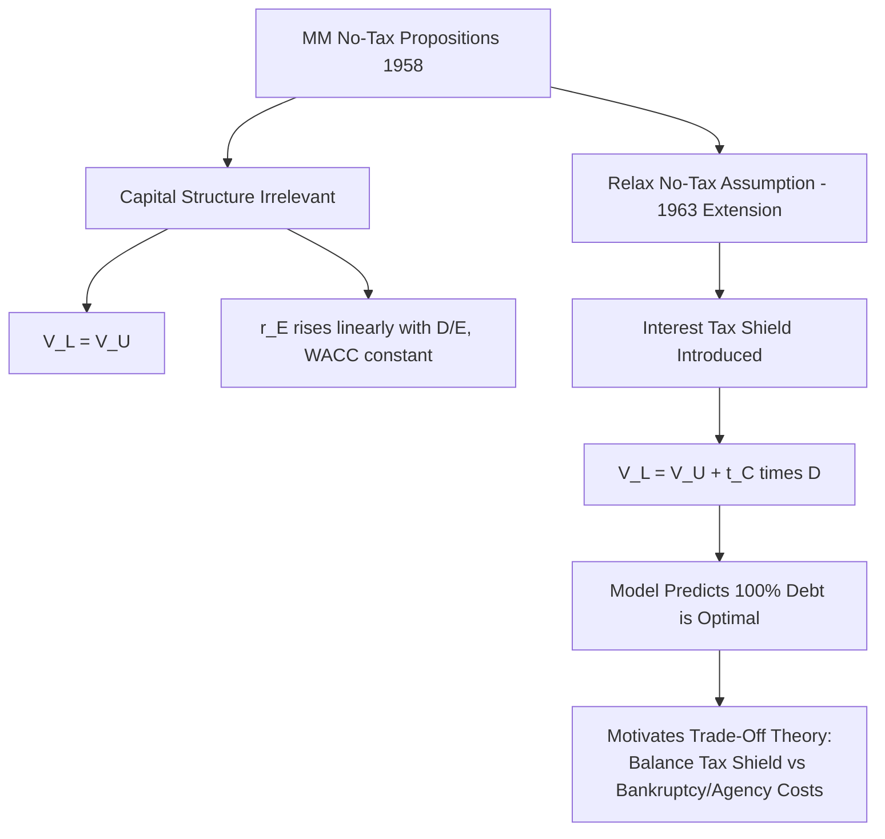

## The Modigliani-Miller Propositions

### Overview

The Modigliani-Miller (MM) propositions, introduced by Franco Modigliani and Merton Miller in their 1958 paper "The Cost of Capital, Corporation Finance and the Theory of Investment" and extended in their 1963 follow-up incorporating corporate taxes, form the foundational theoretical framework of modern capital structure theory. The propositions establish the conditions under which a firm's capital structure (its mix of debt and equity financing) is **irrelevant** to its total value, and then systematically relax those conditions to explain why capital structure matters in practice — making MM simultaneously a benchmark "no-relevance" theorem and the starting point for nearly all subsequent capital structure research.

### The Perfect Capital Markets Assumptions

**Key Points**

The original MM propositions (1958) rest on a set of idealized assumptions collectively known as **perfect capital markets**:

- No taxes (corporate or personal)
- No transaction costs or issuance costs
- No bankruptcy costs
- Symmetric information between managers and investors
- Investors and firms can borrow and lend at the same risk-free rate
- Investment decisions are fixed and independent of financing decisions (no interaction between capital budgeting and capital structure choices)
- No agency costs between managers, shareholders, and bondholders

Under these assumptions, MM demonstrate that capital structure decisions have no effect on firm value, providing a crucial theoretical baseline: any real-world claim that capital structure *does* matter must be traceable to a violation of one or more of these idealized assumptions.

### MM Proposition I (No Taxes): Capital Structure Irrelevance

**Statement**

The total value of a firm is independent of its capital structure; the value of a levered firm equals the value of an otherwise identical unlevered firm:

$$V_L = V_U$$

where $V_L$ is the value of the levered firm (debt + equity) and $V_U$ is the value of an identical firm financed entirely with equity.

**The Arbitrage Argument (Homemade Leverage)**

MM's proof relies on an arbitrage argument: if a levered firm were valued differently from an otherwise identical unlevered firm, investors could exploit the mispricing through **homemade leverage** — replicating or undoing the firm's capital structure choice in their own portfolios by personally borrowing or lending, thereby earning a riskless arbitrage profit until prices adjust to eliminate the discrepancy.

**Example**

Consider two identical firms generating the same operating cash flows: Firm U is unlevered (100% equity, value $V_U = \$100$ million), and Firm L is levered ($40 million debt, $X million equity). Suppose the market temporarily prices $V_L = \$90$ million (i.e., cheaper than $V_U$).

An investor holding 1% of Firm U's equity (worth $1 million) could instead:

1. Sell their 1% of Firm U equity for $1 million
2. Buy 1% of Firm L's debt and 1% of Firm L's equity, costing only $0.90 million (1% of $90 million)
3. Pocket the $0.10 million difference while holding a portfolio with **identical** cash flow rights to their original position (since owning all of Firm L's securities pro-rata replicates owning all of Firm U's assets pro-rata)

This arbitrage opportunity would be exploited until $V_L$ rises back to equal $V_U$, establishing Proposition I.

### MM Proposition II (No Taxes): Cost of Equity and Leverage

**Statement**

The cost of equity capital increases linearly with the firm's debt-to-equity ratio, exactly offsetting the effect of substituting cheaper debt for more expensive equity, such that the firm's overall weighted average cost of capital (WACC) remains constant regardless of capital structure:

$$r_E = r_U + \frac{D}{E}(r_U - r_D)$$

where $r_E$ is the cost of equity for the levered firm, $r_U$ is the cost of capital for the unlevered (all-equity) firm, $r_D$ is the cost of debt, and $D/E$ is the debt-to-equity ratio.

**Intuition**

As a firm takes on more debt, the equity becomes proportionally riskier (since equity holders bear residual risk after fixed debt obligations are met, and this residual claim becomes more volatile as leverage increases), so equity holders demand a correspondingly higher required return. This precisely offsets the mechanical effect of weighting more of the capital structure toward "cheaper" debt, leaving WACC unchanged:

$$WACC = \frac{E}{V}r_E + \frac{D}{V}r_D = r_U \quad \text{(constant, independent of } D/E\text{)}$$

**Example**

An unlevered firm has $r_U = 10\%$. It considers taking on debt at $r_D = 5\%$ to reach a debt-to-equity ratio of $D/E = 1$ (i.e., 50% debt, 50% equity by value).

Applying Proposition II:

$$r_E = 10\% + 1 \times (10\% - 5\%) = 15\%$$

Checking WACC: $WACC = 0.5 \times 15\% + 0.5 \times 5\% = 7.5\% + 2.5\% = 10\%$

WACC remains exactly at 10%, unchanged from the all-equity case, confirming Proposition I's value-irrelevance result holds consistently with Proposition II's cost-of-capital relationship.

### Relationship Between Firm Risk, Leverage, and Beta

Extending the logic of Proposition II to a CAPM framework, the relationship between levered and unlevered equity beta follows an analogous linear form (in the no-tax case):

$$\beta_E = \beta_U + \frac{D}{E}(\beta_U - \beta_D)$$

which, if debt is assumed riskless ($\beta_D = 0$), simplifies to:

$$\beta_E = \beta_U\left(1 + \frac{D}{E}\right)$$

This relationship (sometimes called "unlevering and relevering beta") is a widely used practical tool for adjusting observed equity betas of comparable firms with different capital structures when estimating a project or firm's underlying business risk, independent of financing choices.

### Illustration: Cost of Capital Under MM (No Tax)

<svg xmlns="http://www.w3.org/2000/svg" viewBox="0 0 700 420">
<text x="350" y="30" font-size="18" text-anchor="middle" font-family="sans-serif" font-weight="bold">MM Proposition II: Cost of Capital vs. Leverage (svg_diagram)</text>
<line x1="80" y1="360" x2="650" y2="360" stroke="black" stroke-width="2" />
<line x1="80" y1="360" x2="80" y2="50" stroke="black" stroke-width="2" />
<text x="365" y="395" font-size="14" text-anchor="middle" font-family="sans-serif">Debt-to-Equity Ratio (D/E)</text>
<text x="30" y="200" font-size="14" text-anchor="middle" font-family="sans-serif" transform="rotate(-90 30 200)">Cost of Capital</text>
<path d="M 100 280 L 620 100" stroke="#dc2626" stroke-width="3" fill="none" />
<text x="450" y="140" font-size="13" font-family="sans-serif" fill="#dc2626">Cost of Equity r_E (rises linearly)</text>
<line x1="100" y1="200" x2="620" y2="200" stroke="#16a34a" stroke-width="3" />
<text x="450" y="190" font-size="13" font-family="sans-serif" fill="#16a34a">WACC (constant at r_U)</text>
<line x1="100" y1="320" x2="620" y2="320" stroke="#2563eb" stroke-width="2" stroke-dasharray="5,3" />
<text x="450" y="335" font-size="13" font-family="sans-serif" fill="#2563eb">Cost of Debt r_D (constant, assumed riskless)</text>
</svg>

### MM with Corporate Taxes (1963): The Tax Shield

**Key Points**

- Modigliani and Miller's 1963 extension relaxes the no-tax assumption, introducing the critical insight that interest payments on debt are **tax-deductible** for corporations, while dividend/equity payments are not, creating a **tax shield** that makes debt financing genuinely value-enhancing relative to the original irrelevance result.
- This single relaxed assumption transforms the conclusion dramatically: rather than capital structure being irrelevant, the revised model implies firms should use as much debt as possible (100% debt financing) to maximize the value of the tax shield, absent any offsetting costs of debt — a conclusion widely recognized as unrealistic and understood as motivating further extensions (bankruptcy costs, agency costs) discussed in subsequent capital structure theory.

**Value of the Tax Shield**

For a firm with permanent (perpetual) debt, the value of the interest tax shield is:

$$V_{Tax Shield} = t_C \times D$$

where $t_C$ is the corporate tax rate and $D$ is the (constant, perpetual) market value of debt. This leads to the revised **Proposition I with taxes**:

$$V_L = V_U + t_C \times D$$

**Example**

An unlevered firm has $V_U = \$100$ million. It issues $40 million in perpetual debt, with a corporate tax rate of $t_C = 25\%$.

$$V_L = 100 + 0.25 \times 40 = 100 + 10 = \$110 \text{ million}$$

The firm's value increases by $10 million purely from the tax shield generated by debt financing, illustrating the core mechanism by which the tax-adjusted MM framework predicts capital structure *does* matter.

**Proposition II with Taxes**

The corresponding cost of equity relationship, adjusted for the tax shield, becomes:

$$r_E = r_U + \frac{D}{E}(1-t_C)(r_U - r_D)$$

Note the $(1-t_C)$ term moderates the rate at which cost of equity rises with leverage relative to the no-tax case, since part of the leverage-driven risk is offset by the tax benefit accruing to the firm (and indirectly to shareholders).

### Why the Tax-Adjusted Model Predicts a Corner Solution

Under the pure tax-adjusted MM framework, since $V_L$ increases monotonically with $D$ (more debt always increases the tax shield with no offsetting cost), the model technically predicts an optimal capital structure of **100% debt financing** — a conclusion at odds with observed real-world capital structures, where most firms maintain substantial equity alongside debt. This tension is the primary motivation for the subsequent development of the **trade-off theory** (balancing tax benefits against financial distress/bankruptcy costs) and other extensions covered separately in capital structure theory.

### Miller's Personal Tax Extension (1977)

Merton Miller later extended the framework further to incorporate **personal taxes** on both interest income (taxed at the personal bondholder tax rate $t_D$) and equity income (taxed at the personal equity tax rate $t_E$, capturing dividend and capital gains taxation), yielding a more general expression for the gain from leverage:

$$G_L = \left[1 - \frac{(1-t_C)(1-t_E)}{(1-t_D)}\right] \times D$$

This formulation shows that the net tax advantage of debt depends on the *relative* taxation of corporate income, personal equity income, and personal interest income, and under certain parameter combinations (e.g., if personal tax rates on interest income are sufficiently high relative to equity income, reflecting historical tax code asymmetries), the net tax advantage of debt could be reduced or even eliminated at the aggregate market level, offering a partial theoretical explanation for why observed leverage is far below the 100% level implied by the simpler corporate-tax-only model. [Inference: the practical magnitude of this personal-tax offset is sensitive to the specific tax regime and historical period being analyzed, and its empirical relevance has been debated in the capital structure literature.]

### Comparison of MM Framework Versions

| Version | Key Assumption Change | Capital Structure Conclusion |
| --- | --- | --- |
| MM Proposition I & II (1958) | Perfect markets, no taxes | Capital structure irrelevant; $V_L = V_U$ |
| MM with Corporate Taxes (1963) | Corporate taxes introduced | Debt increases value via tax shield; $V_L = V_U + t_C D$ |
| Miller's Personal Tax Model (1977) | Personal taxes on debt/equity income added | Net tax advantage of debt reduced/offset depending on relative tax rates |
| Trade-off Theory (subsequent) | Adds bankruptcy/financial distress costs | Optimal capital structure balances tax shield against distress costs |

### Practical Implementation Notes

- **Pedagogical role**: MM's propositions are typically taught first specifically *because* their assumptions are unrealistic — the framework's primary practical value lies in identifying, by systematic relaxation of each assumption, precisely which real-world market imperfections (taxes, bankruptcy costs, agency costs, asymmetric information) are the actual drivers of observed capital structure decisions and their relative importance.
- **Unlevering/relevering beta in practice**: The beta relationship derived from Proposition II is a standard practical tool in corporate valuation (e.g., for estimating a project's appropriate discount rate using comparable public company betas adjusted for differing leverage), and practitioners should be aware of variations in the formula depending on assumptions about debt beta and tax treatment (e.g., the Hamada equation, a tax-adjusted version of the unlevering formula, is commonly used in this context).
- **Empirical limitations**: While MM's arbitrage-based logic is theoretically rigorous under its stated assumptions, real-world capital structure decisions are influenced by numerous frictions the base model excludes (bankruptcy costs, agency costs, information asymmetry/signaling, market timing considerations), meaning MM propositions should be understood as a theoretical baseline and organizing framework rather than a directly predictive model of observed corporate financing behavior. [Inference: the relative empirical importance of each friction in explaining actual capital structure choices remains an active area of corporate finance research and is not settled by MM's original theoretical results alone.]

### Related Topics

- Trade-off theory of capital structure (balancing tax benefits and financial distress costs)
- Pecking order theory (Myers and Majluf) and asymmetric information in financing decisions
- Agency costs of debt and equity (Jensen and Meckling)
- Weighted Average Cost of Capital (WACC) estimation methodology
- Hamada equation and beta unlevering/relevering in practice
- Financial distress and bankruptcy costs in capital structure decisions
- Signaling theory and capital structure as a managerial signal
- Miller's personal tax model and its empirical implications for observed leverage