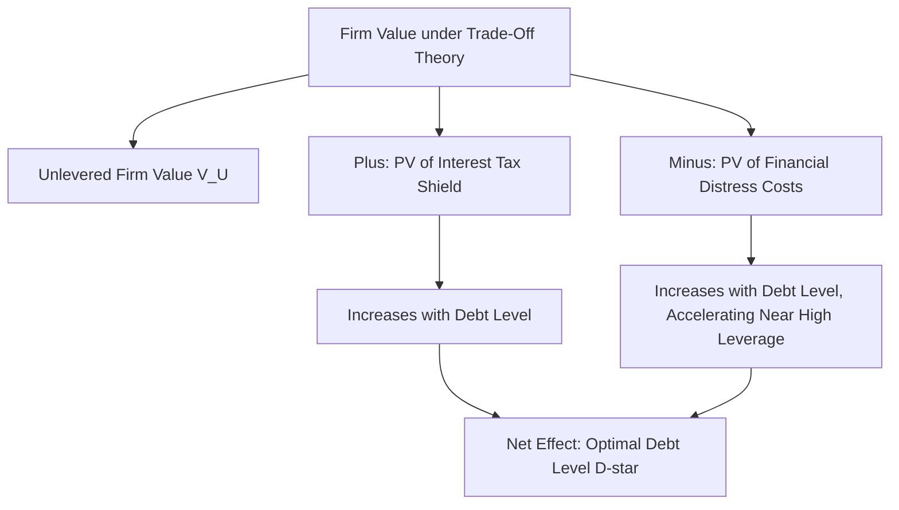

## The Trade-Off Theory of Capital Structure

### Overview

The trade-off theory of capital structure emerged as a direct response to the corner-solution problem generated by the tax-adjusted Modigliani-Miller framework, which predicted that firms should finance with 100% debt to maximize the interest tax shield. Trade-off theory resolves this by introducing **costs of debt** that increase with leverage — principally financial distress costs and agency costs — which offset the tax benefits of debt at higher leverage levels, producing a well-defined **interior optimal capital structure** where the marginal benefit of additional debt equals its marginal cost.

### The Core Trade-Off Equation

**Statement**

The value of a levered firm is expressed as the value of an otherwise identical unlevered firm, plus the present value of the tax shield from debt, minus the present value of expected costs associated with financial distress:

$$V_L = V_U + PV(\text{Tax Shield}) - PV(\text{Costs of Financial Distress})$$

The firm's optimal capital structure is the debt level $D^*$ that maximizes $V_L$, occurring where the marginal tax benefit of an additional dollar of debt exactly equals the marginal expected distress cost of that additional dollar of debt.

### Costs of Financial Distress

**Direct Costs**

Direct costs of financial distress are the explicit, out-of-pocket expenses incurred when a firm approaches or enters formal bankruptcy or reorganization proceedings:

- Legal and administrative fees (attorneys, accountants, court costs)
- Investment banking and advisory fees for restructuring
- Costs associated with asset liquidation at distressed prices

**Indirect Costs**

Indirect costs are typically far larger in magnitude than direct costs and arise from the behavioral and operational consequences of financial distress *even before* formal bankruptcy occurs:

- **Lost sales and customer relationships**: Customers may avoid purchasing from a financially distressed firm, particularly for products requiring ongoing service, warranties, or long-term relationships (e.g., customers being reluctant to buy from an airline perceived as at risk of bankruptcy, given concerns about honoring tickets or frequent flyer programs).
- **Supplier and employee effects**: Suppliers may demand stricter payment terms or refuse to extend credit; key employees may leave for perceived more stable employers, particularly damaging for firms whose value depends heavily on human capital.
- **Underinvestment problem**: Management or shareholders in a financially distressed firm may forgo positive net present value (NPV) projects because the benefits would disproportionately accrue to bondholders (who have a senior claim), rather than to equity holders who would need to fund the investment — a specific manifestation of the broader agency costs of debt discussed below.
- **Asset substitution / risk-shifting**: Conversely, shareholders in a distressed firm have an incentive to take on excessively risky projects (even negative-NPV ones), since equity's option-like payoff structure means shareholders capture most of the upside from a risky bet while bondholders bear a disproportionate share of the downside — a classic agency conflict that intensifies as distress risk rises.

### Agency Costs of Debt

**Key Points**

- Beyond financial distress costs specifically, the trade-off framework (following Jensen and Meckling, 1976) recognizes broader **agency costs of debt** arising from conflicts of interest between shareholders and bondholders once a firm has leverage:
  - **Asset substitution**: As described above, shareholders' incentive to increase asset risk after debt is issued, since equity's convex payoff benefits from higher volatility while bondholders' fixed claim does not.
  - **Underinvestment (debt overhang)**: Shareholders' reluctance to inject additional equity capital into positive-NPV projects when much of the resulting value would flow to existing bondholders rather than to the equity holders funding the investment.
  - **Milking the property / claim dilution**: Existing shareholders extracting value from the firm (e.g., through special dividends) at the expense of bondholders, particularly relevant near financial distress.
- These agency costs are typically anticipated by bondholders *ex ante* and priced into the debt's required yield at issuance, meaning the ultimate cost of these conflicts is borne by shareholders (through a higher cost of debt) even though the conflicts technically arise between shareholders and bondholders after the fact — a standard result in agency cost theory.

### The Optimal Capital Structure: Graphical Intuition

<svg xmlns="http://www.w3.org/2000/svg" viewBox="0 0 700 420">
<text x="350" y="30" font-size="18" text-anchor="middle" font-family="sans-serif" font-weight="bold">Trade-Off Theory: Optimal Capital Structure (svg_diagram)</text>
<line x1="80" y1="360" x2="650" y2="360" stroke="black" stroke-width="2" />
<line x1="80" y1="360" x2="80" y2="50" stroke="black" stroke-width="2" />
<text x="365" y="395" font-size="14" text-anchor="middle" font-family="sans-serif">Debt Level (D)</text>
<text x="30" y="200" font-size="14" text-anchor="middle" font-family="sans-serif" transform="rotate(-90 30 200)">Firm Value</text>
<line x1="100" y1="320" x2="620" y2="120" stroke="gray" stroke-width="2" stroke-dasharray="6,3" />
<text x="450" y="150" font-size="12" font-family="sans-serif" fill="gray">V_U + Tax Shield only (no distress costs)</text>
<path d="M 100 320 Q 250 220 380 160 Q 480 150 560 220 Q 600 260 620 320" stroke="#7c3aed" stroke-width="3" fill="none" />
<text x="420" y="130" font-size="13" font-family="sans-serif" fill="#7c3aed">Actual Firm Value (Trade-Off Curve)</text>
<line x1="380" y1="160" x2="380" y2="360" stroke="#dc2626" stroke-dasharray="4,4" />
<text x="390" y="345" font-size="12" font-family="sans-serif" fill="#dc2626">D* (Optimal Debt Level)</text>
<circle cx="380" cy="160" r="5" fill="#dc2626" />
</svg>

The peak of the trade-off curve represents $D^*$, the optimal debt level where firm value is maximized. To the left of $D^*$, the firm is "underlevered" (foregoing available tax shield benefits at relatively low marginal distress cost); to the right, the firm is "overlevered" (marginal distress costs exceed the marginal tax benefit of further debt).

### Static vs. Dynamic Trade-Off Theory

**Static Trade-Off Theory**

The simplest version of the theory treats the optimal capital structure as a single target ratio that the firm should move toward and maintain, implicitly assuming the firm can costlessly and immediately adjust its capital structure to the optimum at any point in time.

**Dynamic Trade-Off Theory**

**Key Points**

- Recognizing that adjusting capital structure involves real transaction and issuance costs, dynamic trade-off models treat the target debt ratio as a level the firm gradually adjusts *toward* over time, rather than maintains precisely at all times, implying firms will exhibit **partial adjustment behavior**: observed leverage in any given period reflects a mix of the target ratio and the firm's previous leverage level, with adjustment speed determined by the relative cost of rebalancing versus the cost of deviating from the target.
- This dynamic framing helps reconcile trade-off theory with the empirical observation that firm leverage ratios are often quite persistent and slow-moving over time, rather than instantaneously jumping to a theoretically optimal level whenever business conditions change. [Inference: estimated speeds of adjustment toward target leverage vary substantially across empirical studies depending on methodology, sample period, and firm characteristics; there is no single universally agreed-upon adjustment speed.]

### Determinants of the Optimal Debt Level: Cross-Sectional Predictions

**Key Points**

Trade-off theory generates specific, testable cross-sectional predictions about which types of firms should optimally carry more or less debt:

- **Tangible assets**: Firms with more tangible, collateralizable assets (e.g., real estate, heavy equipment) should support higher optimal leverage, since such assets retain more value in liquidation, reducing the severity of financial distress costs and making lenders more willing to extend credit at favorable terms.
- **Profitability and taxable income**: Firms with higher, more stable taxable income benefit more from the tax shield (since they have more income against which to deduct interest expense), suggesting a positive relationship between profitability and optimal leverage under pure trade-off logic — notably, this prediction runs **counter** to commonly observed empirical patterns, where more profitable firms often exhibit *lower* leverage, a discrepancy frequently cited as evidence favoring pecking order theory considerations alongside or instead of pure trade-off logic. [Unverified: the empirical profitability-leverage relationship and its interpretation remain actively debated in the capital structure literature; conclusions are sensitive to sample, time period, and controls used.]
- **Volatility of cash flows/earnings**: Firms with more volatile operating cash flows face higher probability of financial distress at any given debt level, implying lower optimal leverage for higher cash flow volatility, all else equal.
- **Growth opportunities**: Firms with substantial growth opportunities (high market-to-book ratios, significant intangible R&D-driven value) tend to have lower optimal leverage, both because such assets lose value disproportionately in distress (growth options are often firm-specific and non-collateralizable) and because the underinvestment/debt overhang problem is particularly costly for firms relying on continued investment in growth opportunities.
- **Size**: Larger, more diversified firms typically face lower probability and cost of financial distress (due to diversification benefits and potentially better access to capital markets), suggesting a positive relationship between firm size and optimal leverage.

### Comparison: Trade-Off Theory vs. Alternative Capital Structure Theories

| Theory | Core Mechanism | Key Prediction | Notable Tension |
| --- | --- | --- | --- |
| MM (No Tax) | Perfect markets | Capital structure irrelevant | Unrealistic assumptions by design |
| MM (With Corporate Tax) | Tax shield only | 100% debt optimal | Contradicts observed moderate leverage |
| Trade-Off Theory | Tax shield vs. distress/agency costs | Interior optimal leverage exists | Predicts positive profitability-leverage link, often contradicted empirically |
| Pecking Order Theory | Asymmetric information, financing hierarchy | No single "optimal" ratio; firms prefer internal funds, then debt, then equity | Explains profitability-leverage puzzle better, but lacks a defined optimum |

### Reconciling Trade-Off Theory with Observed Behavior

**Key Points**

- The persistent empirical tension between trade-off theory's profitability prediction and observed data has led many researchers to view trade-off theory and pecking order theory as **complementary rather than strictly competing** explanations, with trade-off considerations perhaps better describing long-run target leverage while pecking order/information asymmetry considerations better describe short-run financing choices and deviations from that target.
- Some researchers have also proposed that **market timing** considerations (firms issuing equity when perceived to be overvalued, and debt/repurchasing equity when perceived undervalued) contribute an additional, largely trade-off-independent influence on observed capital structure dynamics. [Inference: the relative explanatory power of trade-off, pecking order, and market timing theories in explaining actual firm behavior remains an active empirical research question without full consensus, and likely varies by firm type, industry, and macroeconomic environment.]

### Practical Implementation Notes

- **Corporate finance application**: In practice, corporate treasurers and CFOs often use trade-off theory intuition qualitatively when setting target credit ratings or leverage ratios, weighing the value of tax shields and financial flexibility against rating agency thresholds and covenant constraints that proxy for financial distress risk, even without formally solving for a precise theoretical optimum.
- **Estimating distress costs empirically**: Quantifying the present value of expected financial distress costs for use in the trade-off framework is inherently difficult, since it requires estimating both the probability of distress at various leverage levels and the magnitude of associated direct and indirect costs — a persistent practical challenge that limits the theory's use as a precise, formulaic tool relative to its value as a conceptual framework.
- **Interaction with credit ratings**: Many firms explicitly manage leverage with reference to maintaining a specific credit rating tier, which can be understood as an operational proxy for managing trade-off-theory-style distress cost exposure, since rating downgrades are associated with higher borrowing costs and, at lower rating tiers, meaningfully higher probability of financial distress.
- **Industry variation**: Trade-off theory's cross-sectional predictions (tangible assets, cash flow volatility, growth opportunities) are broadly consistent with observed industry-level leverage patterns (e.g., asset-heavy industries like utilities and real estate typically carry more debt than R&D-intensive technology firms), even if firm-level empirical tests of the theory's more precise predictions (like the profitability relationship) show mixed results.

### Related Topics

- The Modigliani-Miller propositions (theoretical foundation and tax shield derivation)
- Pecking order theory (Myers and Majluf) and asymmetric information in financing choices
- Agency costs of debt and equity (Jensen and Meckling, 1976)
- Financial distress costs: direct and indirect cost estimation methodologies
- Debt overhang and the underinvestment problem
- Asset substitution and risk-shifting incentives in leveraged firms
- Dynamic capital structure models and partial adjustment speed estimation
- Market timing theory of capital structure