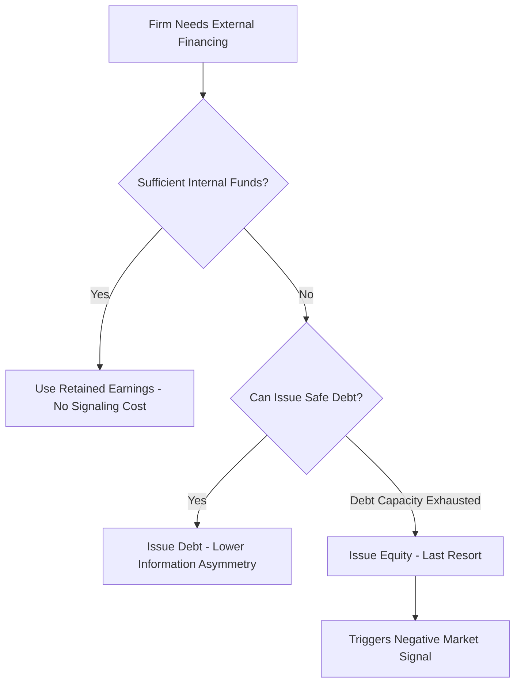

## The Pecking Order Theory

### Overview

The pecking order theory, developed principally by Stewart Myers (1984) and Myers and Nicolas Majluf (1984), offers an alternative explanation for corporate financing behavior that does not rely on the existence of a well-defined optimal capital structure, as trade-off theory does. Instead, the theory proposes that firms follow a **financing hierarchy** driven by information asymmetry between managers (who possess superior information about the firm's true value and prospects) and outside investors, resulting in a strong preference ordering: internal funds first, then debt, and equity issuance only as a last resort.

### The Core Financing Hierarchy

**Statement**

Firms are theorized to prefer financing sources in the following order:

1. **Internal funds** (retained earnings): No information asymmetry cost, no issuance cost, no signaling concern.
2. **Debt financing**: Where internal funds are insufficient, firms prefer debt (starting with the safest, most senior debt) due to relatively lower information sensitivity compared to equity.
3. **Equity issuance**: Used only as a last resort, when debt capacity is exhausted or debt would be prohibitively costly, because equity issuance is the most information-sensitive financing choice and typically triggers the most negative market reaction.

### Theoretical Foundation: Asymmetric Information and Adverse Selection

**Key Points**

- The theory's core mechanism rests on the assumption that managers possess superior, private information about the true value of the firm's assets and growth prospects, which outside investors cannot fully observe.
- When a firm announces an **equity issuance**, rational outside investors interpret this as a signal that managers believe the firm's shares are currently **overvalued** — since managers acting in existing shareholders' interest would only wish to issue new shares (diluting existing owners) if they believed the shares were priced favorably from the issuer's perspective (i.e., worth more to sell now than the true underlying value would suggest).
- This is a classic **adverse selection** problem (analogous to Akerlof's "market for lemons"): outside investors, unable to distinguish overvalued issuers from undervalued ones, rationally discount the price they are willing to pay for newly issued equity, which in turn means equity issuance tends to be associated with a negative announcement effect on the firm's stock price.
- **Debt is less information-sensitive** than equity because its payoff is relatively insensitive to the firm's true underlying value in most states of the world (a bondholder receives the promised fixed payment regardless of whether the firm turns out to be worth somewhat more or less than expected, as long as it remains solvent), making debt issuance a much weaker signal of manager private information relative to equity issuance.

### The Myers-Majluf Model: Formal Intuition

**Setup**

Consider a firm with existing assets and a new positive-NPV investment opportunity requiring external financing. Managers know the true value of existing assets, which may be either "high" or "low," while outside investors only know the probability distribution over these states.

**Key Result**

If the firm can only finance the new project with equity, managers of a **truly high-value firm** may rationally **decline to issue equity and forgo the positive-NPV project**, because doing so would require selling new shares at a price that undervalues the firm's true worth (since the market cannot distinguish it from a low-value firm and prices the new equity at a pooled/average valuation). Managers of a **truly low-value firm**, by contrast, are happy to issue equity at the pooled price, since it exceeds their true underlying value.

**Example**

Suppose a firm has existing assets truly worth either $100 million (high type) or $60 million (low type), each equally likely from the market's perspective, and a new project requiring $20 million investment that will generate $25 million in value (a positive-NPV project).

- If the market cannot distinguish firm type, it will price a new equity issuance based on the **average** expected value, roughly $80 million pre-money (ignoring the new project for a moment).
- A **high-type manager** (true value $100 million), if forced to issue equity, would be diluting existing shareholders at a price reflecting only $80 million of value — effectively transferring value from existing high-type shareholders to new investors, potentially outweighing the NPV benefit of undertaking the project. Rational high-type managers may therefore **reject the project** rather than issue underpriced equity.
- A **low-type manager** (true value $60 million) would happily issue equity at the pooled $80 million valuation, since this overvalues their true worth.
- This asymmetric response is precisely why the *announcement* of an equity issuance is interpreted by the market as more likely to come from a low-type (overvalued) firm, justifying the negative price reaction typically observed.

### Empirical Evidence: Stock Price Reactions to Financing Announcements

**Key Points**

- A large body of empirical event-study literature has documented that stock prices tend to **react negatively** to seasoned equity offering (SEO) announcements, consistent with the adverse selection logic of the pecking order/Myers-Majluf framework.
- Debt issuance announcements typically show a much smaller (often statistically insignificant or only mildly negative) price reaction, consistent with debt's lower information sensitivity relative to equity.
- Some studies have found announcements of straight (non-convertible) debt to have close to zero average price impact, while convertible debt issuance (which contains an equity-like component) tends to show a price reaction intermediate between straight debt and pure equity issuance, consistent with its hybrid information sensitivity. [Unverified: exact magnitudes of these announcement effects vary meaningfully across studies, time periods, and market conditions; specific quantitative figures should be verified against current empirical literature rather than treated as fixed constants.]

### Pecking Order Predictions vs. Trade-Off Theory: The Profitability Puzzle

**Key Points**

- Pecking order theory offers a natural explanation for a well-documented empirical regularity that challenges pure trade-off theory: **more profitable firms tend to exhibit lower leverage**, not higher, as pure tax-shield-driven trade-off logic would suggest.
- Under pecking order logic, this relationship follows naturally: more profitable firms generate more internal funds (retained earnings), reducing their need for external financing altogether, and hence they carry less debt not because it is suboptimal from a trade-off perspective, but simply because they have less need to access external capital markets in the first place.
- This distinction highlights a fundamental conceptual difference between the two theories: trade-off theory implies firms actively target a specific leverage ratio, while pecking order theory implies **leverage is largely a byproduct of the cumulative gap between investment needs and internally generated funds over time**, with no explicit target ratio being pursued.

### Comparison: Trade-Off Theory vs. Pecking Order Theory

| Dimension | Trade-Off Theory | Pecking Order Theory |
| --- | --- | --- |
| Core driver | Balancing tax benefits against distress/agency costs | Information asymmetry between managers and investors |
| Optimal leverage | Well-defined target ratio exists | No explicit target; leverage is a residual outcome |
| Profitability-leverage relationship | Predicts positive relationship (more income, more tax shield value) | Predicts negative relationship (more profit, less need for external funds) |
| Financing preference order | Not explicitly hierarchical | Strict hierarchy: internal funds, then debt, then equity |
| Equity issuance interpretation | Not inherently a negative signal | Strong negative signal (adverse selection) |
| Best empirical fit | Cross-industry leverage variation (tangibility, volatility) | Firm-level profitability-leverage relationship, SEO announcement effects |

### Financial Slack and Debt Capacity

**Key Points**

- A related implication of pecking order theory is that firms have an incentive to maintain **financial slack** (unused debt capacity, cash reserves, or access to committed credit lines) specifically so that future positive-NPV investment opportunities can be financed using higher-priority sources (internal funds or safe debt) without needing to resort to costly, information-sensitive equity issuance.
- This creates a forward-looking rationale for holding **more cash and less current debt than trade-off theory alone would suggest**, since preserving debt capacity for future flexibility has option value under conditions of information asymmetry, even if it appears "suboptimal" from a static, single-period trade-off perspective.

### Illustration: Pecking Order Financing Preference by Information Sensitivity

<svg xmlns="http://www.w3.org/2000/svg" viewBox="0 0 700 400">
<text x="350" y="30" font-size="18" text-anchor="middle" font-family="sans-serif" font-weight="bold">Financing Sources Ranked by Information Sensitivity (svg_diagram)</text>
<line x1="80" y1="340" x2="650" y2="340" stroke="black" stroke-width="2" />
<text x="365" y="375" font-size="14" text-anchor="middle" font-family="sans-serif">Financing Source (increasing information sensitivity right to left is reversed: shown left to right)</text>
<rect x="100" y="260" width="120" height="80" fill="#bbf7d0" stroke="black" />
<text x="160" y="300" font-size="12" text-anchor="middle" font-family="sans-serif">Internal Funds</text>
<text x="160" y="250" font-size="11" text-anchor="middle" font-family="sans-serif">Lowest info sensitivity</text>
<rect x="260" y="220" width="120" height="120" fill="#bfdbfe" stroke="black" />
<text x="320" y="285" font-size="12" text-anchor="middle" font-family="sans-serif">Safe / Senior Debt</text>
<rect x="420" y="150" width="120" height="190" fill="#fde68a" stroke="black" />
<text x="480" y="250" font-size="12" text-anchor="middle" font-family="sans-serif">Risky / Junior Debt</text>
<rect x="530" y="60" width="120" height="280" fill="#fca5a5" stroke="black" />
<text x="590" y="200" font-size="12" text-anchor="middle" font-family="sans-serif">Equity Issuance</text>
<text x="590" y="50" font-size="11" text-anchor="middle" font-family="sans-serif">Highest info sensitivity</text>
</svg>

The increasing bar heights represent increasing information asymmetry cost/signaling severity as a firm moves further down the pecking order, with equity issuance carrying the greatest adverse selection cost and correspondingly reserved for situations where higher-priority financing sources are unavailable or exhausted.

### Criticisms and Limitations of Pecking Order Theory

**Key Points**

- The theory does not explain why firms would ever have a **target leverage ratio** at all, or why observed leverage ratios differ persistently and systematically across industries in ways that align well with trade-off theory's tangibility and volatility predictions — suggesting pecking order alone is an incomplete description of capital structure determination.
- Some empirical studies have found that observed **financing deficits** (the gap between investment needs and internal funds) do not always map as cleanly onto external debt issuance as the simplest pecking order model would predict, particularly for larger or more mature firms, leading some researchers to characterize pecking order behavior as more descriptive of smaller or more information-opaque firms than of large, well-covered public companies with lower information asymmetry. [Unverified: the degree to which pecking order behavior holds across different firm size/maturity segments is a subject of ongoing empirical debate, and conclusions can be sensitive to sample construction and time period.]
- As with trade-off theory, most modern capital structure researchers view pecking order theory as **one important explanatory factor among several** (alongside trade-off considerations and market timing effects) rather than a complete, standalone theory of capital structure.

### Practical Implementation Notes

- **Corporate financing policy**: The pecking order framework provides practical intuition for why corporate finance practitioners often observe firms drawing down cash reserves or revolving credit facilities before considering a public equity offering, and why equity issuances are frequently accompanied by extensive investor communication efforts specifically aimed at mitigating the negative signaling effect predicted by the theory.
- **IPO and SEO timing considerations**: Understanding the adverse selection dynamics underlying pecking order theory is directly relevant to practitioners advising on the timing and structuring of equity offerings, including the common practice of pairing equity issuances with credible signals of firm quality (e.g., insider participation in the offering, use-of-proceeds disclosure) to partially mitigate the negative signaling effect.
- **Convertible securities as a middle ground**: The intermediate information sensitivity of convertible debt (noted in the empirical evidence above) helps explain why convertible securities are sometimes used by firms facing high information asymmetry as a compromise financing tool, offering some of debt's lower signaling cost while providing investors equity-like upside to compensate for residual uncertainty about firm value.
- **Interaction with trade-off theory in practice**: Practitioners and researchers increasingly treat pecking order and trade-off considerations as complementary lenses rather than mutually exclusive theories — for example, a firm might have a long-run target leverage ratio informed by trade-off logic (tangibility, tax position, distress risk) while its short-run financing choices in any given year are better explained by pecking order-style preference for internal funds and debt over equity.

### Related Topics

- The Modigliani-Miller propositions and the theoretical baseline for capital structure irrelevance
- The trade-off theory of capital structure and the tax shield versus distress cost balance
- Myers and Majluf (1984) formal model of adverse selection in security issuance
- Signaling theory in corporate finance more broadly (dividend signaling, IPO underpricing)
- Seasoned equity offering (SEO) announcement effects: empirical event study methodology
- Market timing theory of capital structure
- Agency costs of debt and equity (Jensen and Meckling)
- Convertible securities and their role in mitigating information asymmetry costs