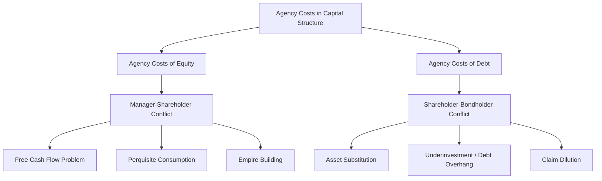

## Agency Costs of Debt and Equity

### Overview

Agency cost theory, formalized in the seminal work of Jensen and Meckling (1976), examines how conflicts of interest between the various parties involved in a firm's financing — managers, shareholders, and bondholders — generate real economic costs that influence optimal capital structure. Unlike pure information-asymmetry theories, agency cost theory does not require that any party have superior information; instead, costs arise purely from **misaligned incentives** among self-interested parties, even under conditions of symmetric information, making it a distinct and complementary strand of capital structure theory alongside trade-off and pecking order considerations.

### The Agency Relationship Framework

**Definition**

An agency relationship exists whenever one party (the **principal**) delegates decision-making authority to another party (the **agent**) who may not perfectly share the principal's objectives. Jensen and Meckling identify two primary agency relationships relevant to capital structure:

1. **Shareholders (principal) and Managers (agent)**: giving rise to **agency costs of equity**
2. **Shareholders (principal, acting through managers) and Bondholders (residual principal)**: giving rise to **agency costs of debt**

### Agency Costs of Equity: The Manager-Shareholder Conflict

**Key Points**

When managers hold less than 100% of a firm's equity (the typical situation in any firm with outside shareholders), a wedge emerges between managerial incentives and shareholder value maximization, since managers bear only a fraction of the cost of value-destroying behavior while potentially capturing significant private benefits from it.

**Perquisite Consumption**

Managers may consume excessive **perquisites** ("perks") — lavish offices, corporate jets, excessive expense accounts — that provide personal benefit to managers at a cost disproportionately borne by outside shareholders, since managers typically own only a small fraction of total equity.

**Empire Building**

Managers may pursue growth in firm size (through acquisitions, capital expenditure, or expansion into new business lines) beyond what maximizes shareholder value, because managerial compensation, prestige, power, and job security are often more closely tied to firm *size* than to firm *profitability* or shareholder returns, creating a systematic bias toward overinvestment and value-destroying acquisitions.

**The Free Cash Flow Problem (Jensen, 1986)**

**Key Points**

- Michael Jensen's influential 1986 extension of agency cost theory identifies **free cash flow** — cash flow in excess of what is needed to fund all positive-NPV investment projects — as a particularly acute source of manager-shareholder conflict, since managers with substantial free cash flow at their discretion have both the *means* and, given empire-building incentives, the *motive* to invest in negative-NPV projects, engage in wasteful diversification, or otherwise dissipate value rather than returning the cash to shareholders.
- Jensen's free cash flow theory provides a specific rationale for why **debt financing can discipline managers**: mandatory interest and principal payments commit the firm to distributing cash that would otherwise be available for managerial discretion, reducing the free cash flow available for potentially value-destroying uses. This is often referred to as the **disciplining role of debt** or the **control hypothesis** of leverage.
- This disciplining effect is theorized to be particularly relevant for **mature firms with substantial cash flow but limited growth opportunities** (precisely the type of firm most prone to empire-building overinvestment), while being less relevant (or potentially counterproductive) for high-growth firms that genuinely need financial flexibility to fund emerging investment opportunities.

**Example**

A mature manufacturing firm generates $500 million in annual free cash flow but has identified only $200 million in positive-NPV investment opportunities. Under agency cost logic, the remaining $300 million is at risk of being deployed toward empire-building acquisitions or excessive capital expenditure unless disciplined by:

- A leveraged recapitalization that increases mandatory debt service obligations, effectively pre-committing much of the $300 million to debt repayment rather than leaving it as discretionary managerial cash
- Increased dividend payouts or share repurchases that similarly reduce cash under managerial discretion

This logic was widely cited as a theoretical justification for the leveraged buyout (LBO) transactions and leveraged recapitalizations prominent in corporate finance during the 1980s, where increasing leverage was explicitly framed as a governance mechanism to curb free-cash-flow-driven overinvestment. [Inference: the empirical extent to which such transactions were genuinely motivated by, or successful in achieving, this disciplining effect versus other motivations (tax benefits, wealth transfers from bondholders, market timing) has been debated in the corporate finance literature.]

### Agency Costs of Debt: The Shareholder-Bondholder Conflict

**Key Points**

Once a firm has issued debt, a distinct set of agency conflicts arises between shareholders (whose interests managers are typically presumed to represent, at least relative to bondholders) and bondholders, stemming from the asymmetric, option-like payoff structures of debt and equity claims.

**Asset Substitution (Risk-Shifting)**

Equity can be understood as a call option on the firm's assets with a strike price equal to the face value of debt; this option-like payoff structure means equity value **increases with asset volatility** (holding asset value constant), since higher volatility increases the value of the upside optionality without proportionately increasing the downside (since equity holders' losses are capped at their initial investment due to limited liability).

$$E = \max(V_A - D, 0)$$

This creates an incentive for shareholders (via management) to **substitute low-risk assets or projects for high-risk ones** after debt has been issued, even when doing so destroys firm value (i.e., even when the risk-shifted project has a lower expected NPV), because the *shareholders'* expected payoff can still increase due to the transfer of value from bondholders (who bear the increased downside risk without corresponding compensation, having priced their debt based on the original, lower-risk asset composition).

**Underinvestment (Debt Overhang)**

As introduced under trade-off theory, when a firm has existing debt outstanding and faces the opportunity to invest in a new positive-NPV project requiring additional equity capital, shareholders may rationally decline to fund the investment if a substantial portion of the resulting value increase would flow to existing bondholders (whose claim becomes safer as firm value rises) rather than to the shareholders providing the new capital. This is sometimes formalized as:

$$\text{Shareholders invest only if: } NPV_{\text{shareholder share}} > \text{Investment Cost}$$

even when the project's total NPV to the firm (inclusive of the benefit to bondholders) is clearly positive, illustrating how debt overhang can cause economically inefficient underinvestment.

**Claim Dilution**

Shareholders (via management) may issue **additional debt** that is equal or senior in priority to existing debt, diluting existing bondholders' claim on firm assets without their consent, transferring value from existing bondholders to shareholders even absent any change in the firm's underlying investment policy.

**Milking the Property**

Particularly relevant for firms approaching financial distress, shareholders may extract value from the firm through **special dividends** or asset sales at favorable prices to related parties, effectively "cashing out" firm value before it can be claimed by bondholders in a bankruptcy or reorganization process.

### Costly Contracting as a Response: Protective Covenants

**Key Points**

- Rational bondholders, anticipating these potential conflicts, incorporate protections into debt contracts *ex ante*, most notably through **protective covenants** — contractual restrictions on managerial/shareholder actions designed to limit the scope for value transfer from bondholders to shareholders.
- **Negative covenants** restrict certain actions (e.g., limits on additional debt issuance, restrictions on dividend payments, limits on asset sales or acquisitions above a certain size, maintenance of minimum financial ratios).
- **Positive/affirmative covenants** require certain actions (e.g., maintaining insurance on collateral, providing regular financial disclosures, maintaining specified minimum levels of working capital).
- While covenants reduce agency costs of debt by constraining value-transferring shareholder behavior, they impose their own costs: reduced managerial flexibility, potential foreclosure of legitimately valuable (but covenant-restricted) investment opportunities, and the direct costs of monitoring and enforcing covenant compliance — meaning covenant design itself reflects a trade-off between reducing agency costs and preserving operational flexibility.

### The Total Agency Cost Framework and Optimal Capital Structure

**Jensen and Meckling's Original Insight**

The original 1976 framework frames optimal capital structure as minimizing the **sum** of agency costs of equity and agency costs of debt:

$$\text{Total Agency Costs} = \text{Agency Costs of Equity} + \text{Agency Costs of Debt}$$

**Key Points**

- As a firm increases debt (and correspondingly reduces outside equity), agency costs of equity tend to **decrease** (since a smaller equity base, combined with managers often holding a larger *percentage* stake in a more leveraged firm, better aligns managerial and shareholder interests, and higher mandatory debt service reduces discretionary free cash flow available for value-destroying managerial behavior).
- Simultaneously, as debt increases, agency costs of debt tend to **increase** (since higher leverage intensifies the shareholder-bondholder conflicts of asset substitution, underinvestment, and claim dilution described above).
- This produces a similar interior-optimum logic to trade-off theory, but driven by a distinct economic mechanism (incentive misalignment and value-transfer conflicts) rather than trade-off theory's core tax-shield-versus-distress-cost mechanism, even though both frameworks predict a well-defined optimal leverage level for broadly similar structural reasons.

### Total Agency Costs vs. Leverage (Illustration)

<svg xmlns="http://www.w3.org/2000/svg" viewBox="0 0 700 420">
<text x="350" y="30" font-size="18" text-anchor="middle" font-family="sans-serif" font-weight="bold">Agency Costs of Debt vs. Equity Across Leverage (svg_diagram)</text>
<line x1="80" y1="360" x2="650" y2="360" stroke="black" stroke-width="2" />
<line x1="80" y1="360" x2="80" y2="50" stroke="black" stroke-width="2" />
<text x="365" y="395" font-size="14" text-anchor="middle" font-family="sans-serif">Debt-to-Equity Ratio</text>
<text x="30" y="200" font-size="14" text-anchor="middle" font-family="sans-serif" transform="rotate(-90 30 200)">Agency Costs</text>
<path d="M 100 100 Q 300 200 620 340" stroke="#2563eb" stroke-width="3" fill="none" />
<text x="420" y="200" font-size="13" font-family="sans-serif" fill="#2563eb">Agency Costs of Equity (falls with leverage)</text>
<path d="M 100 340 Q 300 250 620 100" stroke="#dc2626" stroke-width="3" fill="none" />
<text x="380" y="140" font-size="13" font-family="sans-serif" fill="#dc2626">Agency Costs of Debt (rises with leverage)</text>
<path d="M 100 220 Q 250 170 365 165 Q 480 170 620 220" stroke="#16a34a" stroke-width="3" stroke-dasharray="6,3" fill="none" />
<text x="440" y="150" font-size="13" font-family="sans-serif" fill="#16a34a">Total Agency Costs (minimized at D*)</text>
<line x1="365" y1="165" x2="365" y2="360" stroke="#16a34a" stroke-dasharray="4,4" />
<text x="375" y="350" font-size="12" font-family="sans-serif" fill="#16a34a">Optimal D*</text>
</svg>

### Mechanisms to Mitigate Agency Costs

**Addressing Agency Costs of Equity**

- **Managerial equity ownership / stock-based compensation**: Aligning manager incentives with shareholder value by making managers themselves substantial equity holders
- **Monitoring by the board of directors**: Independent board oversight of managerial decision-making
- **Market for corporate control**: The threat of hostile takeover disciplines managers whose poor performance depresses stock price, since acquirers can profit by replacing underperforming management
- **Leverage itself**: As discussed, increasing debt service obligations reduces discretionary free cash flow

**Addressing Agency Costs of Debt**

- **Protective covenants**: As discussed above, direct contractual restrictions on value-transferring actions
- **Convertible debt and warrants**: Giving bondholders an equity-like upside participation reduces (though does not eliminate) the asset substitution incentive, since bondholders with conversion rights partially share in the upside of increased asset risk
- **Shorter debt maturity**: Requiring more frequent refinancing gives bondholders more frequent opportunities to reassess and reprice credit risk, reducing the window during which shareholders can exploit asset substitution or other value-transferring strategies before facing renewed lender scrutiny
- **Reputation effects**: Firms that repeatedly access debt markets have long-run incentives to avoid opportunistic behavior toward bondholders, since a reputation for exploiting bondholders would raise the cost of future debt issuance

### Comparison: Sources of Agency Cost and Their Primary Mitigants

| Agency Problem | Conflict Type | Primary Mitigation Mechanism |
| --- | --- | --- |
| Perquisite Consumption | Manager-Shareholder | Managerial equity ownership, board monitoring |
| Empire Building / Free Cash Flow | Manager-Shareholder | Increased leverage, dividend/payout policy |
| Asset Substitution | Shareholder-Bondholder | Covenants, convertible debt |
| Underinvestment (Debt Overhang) | Shareholder-Bondholder | Shorter debt maturity, renegotiation, convertible features |
| Claim Dilution | Shareholder-Bondholder | Negative covenants restricting additional senior debt |
| Milking the Property | Shareholder-Bondholder | Dividend restriction covenants |

### Practical Implementation Notes

- **LBO and private equity applications**: The free cash flow disciplining logic of agency cost theory remains a commonly cited (though not the sole) rationale in private equity leveraged buyout transactions, where substantial post-transaction leverage is explicitly intended to impose cash flow discipline on portfolio company management alongside other value-creation levers (operational improvements, governance changes, strategic repositioning).
- **Covenant design in practice**: Modern loan and bond covenant packages (including the debated rise of "covenant-lite" structures in leveraged loan markets in recent years) reflect an ongoing practical negotiation between borrower flexibility and lender protection against agency costs of debt; the relative prevalence and terms of such structures shift with credit market conditions and investor risk appetite over time. [Unverified: current covenant market conventions and the prevalence of covenant-lite structures evolve with credit market cycles; practitioners should verify against current market data for time-sensitive analysis.]
- **Governance interactions**: Agency cost considerations interact closely with broader corporate governance mechanisms (board independence, executive compensation design, shareholder activism), meaning capital structure decisions in practice are often evaluated alongside, rather than independently from, a firm's overall governance framework.
- **Measurement challenges**: Unlike more directly observable costs (interest rates, credit spreads), agency costs are inherently difficult to measure directly, and empirical tests of agency cost theory typically rely on indirect proxies (e.g., free cash flow levels, growth opportunity measures, insider ownership percentages) rather than direct estimation of the theorized costs themselves, a limitation shared with financial distress cost estimation under trade-off theory.

### Related Topics

- The trade-off theory of capital structure and its relationship to agency costs of debt
- The pecking order theory and asymmetric information as a distinct source of financing friction
- Jensen's free cash flow theory and the disciplining role of leveraged buyouts
- Protective covenant design in bond and loan agreements
- Corporate governance mechanisms: board structure, executive compensation, market for corporate control
- Convertible debt and hybrid securities as agency-cost-mitigating instruments
- Debt maturity structure choice and its relationship to agency costs
- Empirical corporate finance methodology for testing capital structure theories