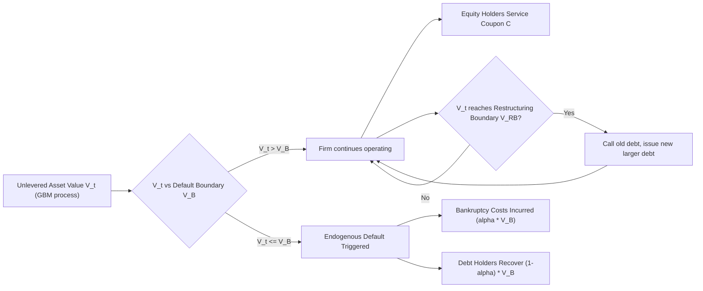

## Dynamic Capital Structure Models

### Overview

Dynamic capital structure models extend the static trade-off framework by treating the debt-equity choice as a sequence of decisions made over time under uncertainty, rather than a one-shot optimization. Firms in these models continuously weigh the tax benefits of debt against bankruptcy costs while facing adjustment costs that prevent instantaneous rebalancing to a target leverage ratio. These models were developed largely in response to empirical puzzles that static trade-off theory could not explain: firms exhibit persistent deviations from target leverage, leverage ratios drift and mean-revert slowly, and financing decisions display path dependence.

### Motivation: Limits of Static Trade-Off Theory

The static trade-off model posits a single-period optimization:

$$V_L = V_U + \tau_C D - PV(\text{bankruptcy costs})$$

where $V_L$ is levered firm value, $V_U$ is unlevered firm value, $\tau_C$ is the corporate tax rate, and $D$ is debt.

**Key Points**

- Static models predict immediate adjustment to an optimal (target) leverage ratio.
- Empirically, observed leverage ratios adjust toward targets slowly, often estimated at 10–30% of the gap closed per year [Unverified — estimates vary substantially across studies, samples, and estimation methods].
- Static models cannot explain why firms hold unused debt capacity (financial slack) or why leverage responds asymmetrically to positive versus negative shocks.
- Dynamic models address this by introducing adjustment costs, timing options, and state-dependent policies.

### Core Modeling Framework

Dynamic capital structure models generally share a common architecture:

1. A stochastic process for firm value or cash flows (typically geometric Brownian motion or a mean-reverting process).
2. A capital structure choice (debt level, coupon, maturity) that can be adjusted only at discrete points or subject to adjustment costs.
3. An optimal stopping or impulse control problem determining when and how much to adjust.
4. Boundary conditions capturing default, refinancing, or recapitalization triggers.

The canonical continuous-time setup models unlevered asset value $V_t$ as:

$$dV_t = \mu V_t \, dt + \sigma V_t \, dW_t$$

where $\mu$ is the drift, $\sigma$ is asset volatility, and $W_t$ is a standard Brownian motion.

### Leland (1994): Structural Model with Endogenous Default

The foundational dynamic capital structure model, developed by Leland, embeds capital structure choice within a structural credit-risk framework.

**Key Points**

- The firm issues a perpetual bond with constant coupon $C$.
- Asset value follows geometric Brownian motion as above.
- Equity holders choose an endogenous default boundary $V_B$ by optimally exercising a default option — they default when continuing to inject capital to service debt is no longer optimal.
- Bankruptcy imposes a deadweight loss (fraction $\alpha$ of asset value at default).
- Interest payments are tax-deductible, generating a tax shield.

The value of the levered firm is decomposed as:

$$v(V) = V + TS(V) - BC(V)$$

where $TS(V)$ is the present value of the tax shield and $BC(V)$ is the present value of bankruptcy costs, both functions of current asset value $V$.

Closed-form solutions exist for debt value $D(V)$, equity value $E(V)$, and the endogenous default threshold $V_B$:

$$V_B = \frac{(1-\tau_C)C}{r} \cdot \frac{\gamma}{1+\gamma}$$

where $\gamma$ relates to the risk-free rate $r$ and volatility $\sigma$ through the characteristic root of the governing ODE. [Unverified — exact closed-form expression depends on parameterization conventions; consult primary source for precise derivation.]

**Example**

A firm with assets following GBM ($\mu = 0.06$, $\sigma = 0.25$), risk-free rate $r = 0.05$, tax rate $\tau_C = 0.35$, and bankruptcy cost fraction $\alpha = 0.5$ chooses a coupon $C$ to maximize initial firm value $v(V_0)$. Increasing $C$ raises the tax shield but also raises $V_B$ (earlier default) and expected bankruptcy costs — the optimal capital structure balances these forces at an interior coupon level.

**Limitations**

- The model is static in the sense that the coupon $C$ is chosen once at time 0 and never adjusted — hence it is sometimes called "static" in its capital structure decision despite being dynamic in default timing.
- This motivated later "dynamic" extensions allowing repeated refinancing.

### Goldstein, Ju, and Leland (2001): Dynamic Capital Structure with Recapitalization

This model extends Leland's framework by allowing the firm to increase debt over time as asset value rises, capturing debt capacity restoration.

**Key Points**

- The firm can call (retire) existing debt and issue new, larger debt when asset value crosses an upward restructuring boundary $V_{RB}$.
- This generates a more realistic pattern in which leverage ratios decline as firm value rises (since debt is fixed between restructuring points) and then jump back up at restructuring — consistent with observed countercyclical leverage dynamics within a firm's life cycle.
- The model produces credit spreads and leverage ratios that better match empirical term structures of credit spreads than the static Leland model.

### Fischer, Heinkel, and Zechner (1989): Dynamic Trade-Off with Adjustment Costs

An earlier and influential dynamic trade-off model incorporating recapitalization costs directly.

**Key Points**

- Firms face fixed and/or proportional costs of adjusting capital structure.
- Because adjustment is costly, firms allow leverage to drift within a band rather than continuously rebalancing to a single target.
- Optimal policy is an $(s, S)$-type rule: the firm refinances only when leverage hits an upper or lower trigger, then resets to a target point inside the band.
- This directly explains why observed leverage ratios show wide cross-sectional and time-series dispersion around any theoretical "target."

**Example**

If a firm's target leverage is 30% but adjustment costs are significant, it may let leverage drift between 20% and 45% before triggering a recapitalization, rather than adjusting continuously to stay at exactly 30%.

### Strebulaev (2007): Reconciling Dynamic Models with Empirical Tests

This paper is important primarily for its methodological contribution: showing that standard partial-adjustment regressions used to test trade-off theory are misspecified when applied to data generated by a dynamic model with adjustment costs.

**Key Points**

- In a world with infrequent rebalancing (due to fixed costs), most observations in any panel are "off-target" by construction, not because firms are irrational or the trade-off theory is wrong.
- Cross-sectional regressions of leverage on its determinants, run on simulated data from a calibrated dynamic trade-off model, reproduce many of the "anomalies" (slow apparent speed of adjustment, weak explanatory power) previously interpreted as evidence against trade-off theory.
- This reframed the empirical capital structure literature: apparent rejections of trade-off theory may reflect the dynamic, infrequent-adjustment nature of the true data-generating process rather than the theory's invalidity.

### Partial Adjustment Models (Empirical Dynamic Framework)

A widely used reduced-form empirical specification models observed leverage as adjusting partially toward a target each period:

$$Lev_{i,t} - Lev_{i,t-1} = \lambda (Lev^*_{i,t} - Lev_{i,t-1}) + \epsilon_{i,t}$$

where $Lev^*_{i,t}$ is the estimated target leverage (typically from a cross-sectional regression on firm characteristics) and $\lambda$ is the speed of adjustment.

**Key Points**

- $\lambda = 1$ implies instantaneous adjustment (static model); $\lambda = 0$ implies no adjustment (leverage is purely determined by historical shocks, consistent with pure pecking-order behavior).
- Estimated $\lambda$ values in the literature range widely, commonly cited between roughly 0.10 and 0.40 annually [Unverified — highly sensitive to estimation technique, e.g., OLS vs. GMM vs. fractional dynamic panel methods; see Flannery and Rangan (2006), Lemmon, Roberts, and Zender (2008)].
- A key econometric concern is that firm fixed effects and target leverage estimation are correlated, biasing $\lambda$ estimates — this remains a debated area in empirical corporate finance. [Unverified/Inference — reflects ongoing methodological disagreement rather than settled consensus.]

### Dynamic Trade-Off vs. Dynamic Pecking Order

**Key Points**

- Dynamic trade-off models predict mean reversion toward a target leverage ratio, with deviations driven by adjustment costs.
- Dynamic pecking-order models (Myers, 1984) predict that leverage is primarily a cumulative record of past financing deficits, with no target — firms use retained earnings first, then debt, then equity only as a last resort due to asymmetric information (adverse selection à la Myers-Majluf).
- Under a pure dynamic pecking-order process, leverage should be a random walk (or near-random walk) driven by cumulative cash flow shortfalls, not mean-reverting.
- Empirical tests (e.g., Shyam-Sunder and Myers, 1999; Frank and Goyal, 2003) find mixed support: the financing deficit has meaningful explanatory power for debt issuance, but leverage also exhibits mean reversion, suggesting elements of both mechanisms operate jointly. [Unverified — interpretation remains actively contested in the literature.]

### Market Timing and Dynamic Models

**Key Points**

- Baker and Wurgler (2002) propose that capital structure is the cumulative outcome of past attempts to time the equity market — firms issue equity when market valuations (e.g., market-to-book ratio) are high and repurchase or issue debt when valuations are low.
- This introduces path dependence: historical market conditions at the time of past financing decisions have persistent effects on current leverage, since firms do not actively rebalance back to a target afterward.
- This contrasts with dynamic trade-off models, where any transitory market-timing-driven deviation should eventually be corrected via the adjustment process.

### Structural Model Diagram: Firm Value Decomposition Over Time

### Illustration: Leverage Path Under Adjustment-Cost Band

<svg xmlns="http://www.w3.org/2000/svg" viewBox="0 0 700 320">
<text x="350" y="20" font-size="14" text-anchor="middle" font-family="sans-serif" font-weight="bold">Leverage Drift Within an Adjustment Band (svg_diagram)</text>
<line x1="60" y1="270" x2="660" y2="270" stroke="black" stroke-width="1.5" />
<line x1="60" y1="270" x2="60" y2="50" stroke="black" stroke-width="1.5" />
<text x="20" y="275" font-size="11" font-family="sans-serif">0%</text>
<text x="345" y="295" font-size="12" font-family="sans-serif" text-anchor="middle">Time</text>
<text x="15" y="45" font-size="11" font-family="sans-serif">60%</text>
<line x1="60" y1="90" x2="660" y2="90" stroke="#d62728" stroke-width="1.5" stroke-dasharray="6,4" />
<text x="665" y="94" font-size="11" font-family="sans-serif" fill="#d62728">Upper trigger</text>
<line x1="60" y1="220" x2="660" y2="220" stroke="#2ca02c" stroke-width="1.5" stroke-dasharray="6,4" />
<text x="665" y="224" font-size="11" font-family="sans-serif" fill="#2ca02c">Lower trigger</text>
<line x1="60" y1="155" x2="660" y2="155" stroke="#1f77b4" stroke-width="1" stroke-dasharray="2,3" />
<text x="665" y="159" font-size="11" font-family="sans-serif" fill="#1f77b4">Target Lev*</text>
<polyline points="60,155 110,175 160,200 190,90 240,110 290,135 320,220 370,190 420,160 460,90 510,120 560,150 610,180 660,205" fill="none" stroke="black" stroke-width="2" />
<circle cx="190" cy="90" r="4" fill="#d62728" />
<circle cx="320" cy="220" r="4" fill="#2ca02c" />
<circle cx="460" cy="90" r="4" fill="#d62728" />
<text x="190" y="80" font-size="10" font-family="sans-serif" text-anchor="middle">Recap (down)</text>
<text x="320" y="240" font-size="10" font-family="sans-serif" text-anchor="middle">Recap (up)</text>
<text x="460" y="80" font-size="10" font-family="sans-serif" text-anchor="middle">Recap (down)</text>
</svg>

### Calibration and Empirical Fit

**Key Points**

- Dynamic trade-off models are typically calibrated to match observed default rates, credit spreads, and leverage ratios by industry.
- Common calibration targets include the 10-year cumulative default probability, average credit spread on BBB-rated debt, and average book/market leverage ratios.
- A well-known challenge is the "credit spread puzzle": structural models like Leland's tend to under-predict observed credit spreads on investment-grade debt relative to actual market spreads, even after accounting for default risk. [Unverified — magnitude of the puzzle depends on model specification, sample period, and whether liquidity/tax factors are included; this remains a subject of ongoing research debate rather than settled fact.]
- Adding features such as stochastic volatility, jumps in asset value, or macroeconomic state variables (recession indicators) generally improves fit to observed spreads. [Inference — based on the general direction of extensions in the subsequent structural credit risk literature.]

### Practical Applications

**Key Points**

- Corporate treasury: informs decisions on when to refinance debt versus let leverage drift, given transaction costs of issuance.
- Credit risk modeling: dynamic default boundaries are used in structural credit risk models for pricing corporate bonds and credit default swaps.
- Rating agency behavior: dynamic models can help explain why credit ratings display "rating stability" (through-the-cycle ratings) despite continuous fluctuations in market-implied default probabilities.
- Regulatory capital requirements for banks parallel these ideas: dynamic buffers (e.g., countercyclical capital buffers) are conceptually related to bands around a target capital ratio.

### Conclusion

Dynamic capital structure models replace the static, one-shot optimization of trade-off theory with a continuous-time or discrete-time control problem in which firms manage leverage subject to adjustment costs, stochastic asset value, and endogenous default. The Leland (1994) model established the core machinery of endogenous default in continuous time; Fischer, Heinkel, and Zechner (1989) introduced adjustment-cost bands generating realistic leverage drift; and Goldstein, Ju, and Leland (2001) added dynamic recapitalization. Strebulaev's (2007) methodological critique reshaped how empirical tests of trade-off theory are interpreted, showing that infrequent rebalancing alone can generate patterns previously read as rejections of the theory. Collectively, these models better match empirically observed features of leverage — persistence, path dependence, and slow mean reversion — that static models cannot capture.

**Related Topics**

- Leland (1994) structural credit risk model in depth
- Speed-of-adjustment estimation methods (GMM, fractional dynamic panel)
- Pecking order theory and asymmetric information (Myers-Majluf)
- Market timing theory of capital structure (Baker and Wurgler)
- Structural credit risk models and the credit spread puzzle
- Real options and capital structure interaction
- Empirical tests of trade-off vs. pecking order theory
- Bank capital buffer dynamics and regulatory capital models