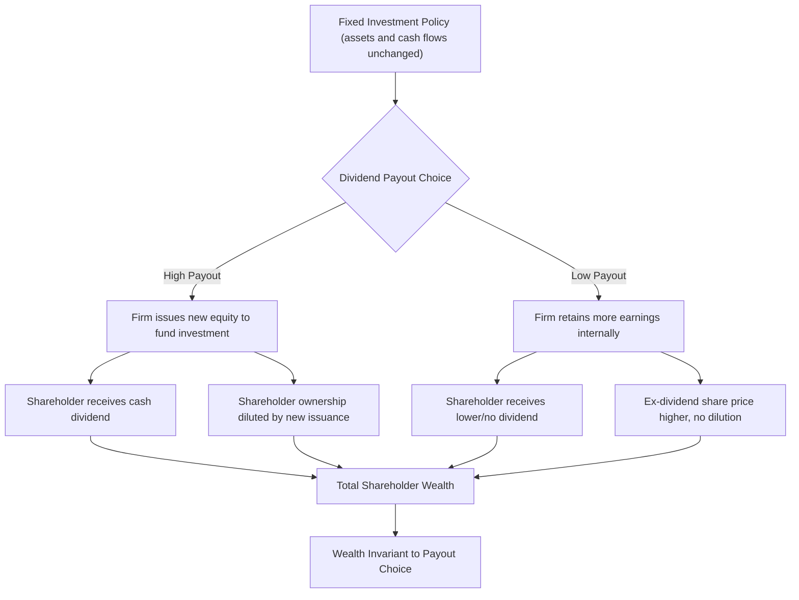

## The Dividend Irrelevance Theorem

### Overview

The dividend irrelevance theorem, formulated by Merton Miller and Franco Modigliani (1961), states that under a set of idealized market conditions, a firm's dividend policy has no effect on its value or on shareholder wealth. In such a world, the split of a firm's earnings between dividends and retained earnings is irrelevant because investors can costlessly replicate any desired payout pattern themselves, and the firm's value is determined solely by its investment policy — the real assets it holds and the cash flows those assets generate.

### Core Statement

**Key Points**

- Firm value is determined by the earning power of its assets and its investment decisions, not by how earnings are distributed between dividends and retained earnings.
- Given a fixed investment policy, a firm's choice of dividend payout ratio does not affect its share price or total shareholder wealth.
- Investors are indifferent between receiving a dollar in current dividends and receiving a dollar in capital gains, since both are equivalent in perfect capital markets.

### The MM (1961) Framework and Assumptions

The theorem is a direct application of the same no-arbitrage logic underlying the Modigliani-Miller capital structure irrelevance propositions, applied to payout policy instead.

**Key Points**

- **Perfect capital markets**: no transaction costs, no taxes, no flotation costs, securities are infinitely divisible.
- **Rational behavior**: investors prefer more wealth to less and are indifferent between dividends and capital gains.
- **Certainty or symmetric information**: in the original formulation, investment policy is fixed and known, so dividend policy conveys no new information (later relaxed in signaling extensions).
- **No agency costs**: managers act perfectly in shareholders' interests with no conflicts between managers and owners.
- **Perfect substitutability of internal and external financing**: the firm can always issue new shares at fair value to fund any shortfall caused by paying dividends.

### Formal Derivation

Consider a firm with a fixed investment policy. Let $V_0$ be the value of the firm at time 0, $D_1$ the dividend paid at time 1, $P_1$ the ex-dividend share price at time 1, and $r$ the cost of equity capital. For a shareholder holding one share, total return satisfies:

$$P_0 = \frac{D_1 + P_1}{1+r}$$

If the firm needs to raise external capital to pay $D_1$ while maintaining its investment plan, it issues new shares. Let $n$ be the original number of shares and $m$ the number of new shares issued at price $P_1$. The firm's total value at time 1, before the newly raised funds are deployed, must equal:

$$(n+m)P_1 = V_1 + D_1 \cdot n - I$$

where $V_1$ is the value of pre-existing assets at time 1 and $I$ is planned new investment. Substituting and simplifying, Miller and Modigliani show that total shareholder wealth $nP_0$ is independent of the dividend $D_1$ chosen — the dilution from issuing new shares to fund the dividend exactly offsets the cash received as dividend income, dollar for dollar.

**Key Points**

- The intuition: paying a dividend reduces firm value (and thus $P_1$) by exactly the amount paid out; if new shares must be issued to fund investment, the resulting dilution to existing shareholders exactly offsets the dividend they received.
- Total wealth = dividends received + value of remaining shares, and this sum is invariant to the payout choice.

### Homemade Dividends: The Investor Replication Argument

A central pillar of the theorem is the "homemade dividend" argument, which shows why firm-level payout policy cannot create value even if some investors have payout preferences.

**Key Points**

- If a firm pays less in dividends than an investor wants, the investor can sell a portion of their shares to generate homemade cash flow equivalent to a higher dividend.
- If a firm pays more in dividends than an investor wants, the investor can use the excess dividend cash to purchase additional shares, effectively reinvesting and replicating a lower-payout policy.
- Because this replication is costless (under the perfect-market assumptions), no investor needs the firm to choose any specific payout policy — any clientele's preferred cash flow stream can be self-manufactured.

**Example**

An investor holding 100 shares at $50 each ($5,000 total) wants $500 in cash this year but the firm pays no dividend. The investor sells 10 shares at $50 to generate exactly $500, leaving 90 shares worth $4,500 — total wealth unchanged at $5,000 (ignoring any transaction costs). Conversely, if the firm pays a $500 dividend the investor doesn't want, the investor can use the $500 to buy back approximately 10 shares (at the lower ex-dividend price), restoring the original position.

### Illustration: Wealth Invariance Diagram

### Numerical Illustration

**Example**

A firm has assets generating a fixed cash flow stream with a total value of $10 million and 1 million shares outstanding, so $P_0 = \$10$ per share with no dividend.

*Scenario A (no dividend):* Share price remains $10; shareholder wealth = $10 per share held.

*Scenario B (firm pays a $1/share dividend, funded by issuing new equity):* Ex-dividend firm value falls to $9 million (cash paid out), so ex-dividend price per old share = $9. The shareholder now holds one share worth $9 plus $1 cash dividend = $10 total. Wealth is identical to Scenario A. The new equity issued to replace the $1 million paid out simply transfers ownership share to new investors without affecting existing shareholders' total wealth, since new shares are issued at fair value.

### Relation to the Modigliani-Miller Capital Structure Propositions

**Key Points**

- The dividend irrelevance theorem is the payout-policy analogue of the MM capital structure irrelevance propositions (1958) — both rest on the same no-arbitrage, perfect-markets logic.
- Just as capital structure (debt/equity mix) cannot change firm value when investment policy is fixed and markets are perfect, payout policy (dividends/retained earnings mix) cannot change firm value under the same conditions.
- In both cases, firm value is pinned down entirely by the cash flows generated by real assets (investment policy), discounted at the appropriate risk-adjusted rate — financial policy is a "veil" over these fundamentals.

### Why the Theorem Matters Despite Being Empirically Unrealistic

**Key Points**

- The theorem's primary value is as a *null hypothesis* or benchmark: it isolates which market imperfections must be present for dividend policy to matter in practice.
- By identifying the conditions under which dividends are irrelevant, MM implicitly catalogued the frictions that could make dividends *relevant* in the real world — taxes, transaction costs, asymmetric information, and agency conflicts.
- This "irrelevance-as-baseline" methodology mirrors the use of the MM capital structure theorem: both results are widely regarded as foundational not because they describe real markets accurately, but because they cleanly separate real economic value creation (investment policy) from purely financial repackaging (payout/financing mix). [Inference — reflects standard characterization of MM's contribution in corporate finance pedagogy.]

### Real-World Frictions That Break Irrelevance

The theorem's assumptions are systematically violated in practice, giving rise to the broader payout policy literature. These are typically covered as extensions/critiques of dividend irrelevance:

**Key Points**

- **Taxes**: differential taxation of dividends versus capital gains can make one form of payout more or less attractive to a given investor, creating "tax clientele" effects (Litzenberger and Ramaswamy).
- **Transaction costs**: selling shares to create homemade dividends is not costless in practice (brokerage fees, bid-ask spreads), so investors may prefer firms whose payout policy matches their needs directly.
- **Asymmetric information / signaling**: since managers know more about the firm's prospects than outside investors, changes in dividend policy can convey information about future earnings (Bhattacharya's dividend signaling model; the empirical "dividend smoothing" behavior documented by Lintner, 1956).
- **Agency costs**: dividends can reduce the free cash flow available to managers, mitigating agency conflicts between managers and shareholders (Jensen's free cash flow hypothesis, 1986) — here, payout policy has real governance value.
- **Flotation costs**: issuing new equity to fund dividends is costly in reality, meaning high-payout policies combined with external financing needs destroy value net of these costs.
- **Behavioral/clientele effects**: certain investor types (e.g., retirees seeking income) may exhibit a preference for cash dividends independent of tax considerations ("bird-in-hand" fallacy, and catering theory of Baker and Wurgler).

### Empirical Status

**Key Points**

- Empirical dividend policy is not irrelevant in practice: stock prices react to dividend initiation, increase, decrease, and omission announcements, consistent with signaling and/or clientele effects.
- Lintner's (1956) survey-based finding that firms smooth dividends and are reluctant to cut them is widely cited as inconsistent with pure irrelevance, since a truly irrelevant policy variable would not be managed so deliberately.
- The persistence of dividend payments as a corporate practice, despite tax disadvantages in many jurisdictions relative to capital gains, is often referred to as the "dividend puzzle" (Fischer Black, 1976) — a body of research aimed at explaining why dividends are paid at all given MM's irrelevance baseline. [Unverified — the "puzzle" framing and its resolution remain subjects of ongoing debate rather than settled consensus.]

### Conclusion

The dividend irrelevance theorem establishes that, under perfect and complete capital markets with a fixed investment policy, a firm's choice of dividend payout has no effect on shareholder wealth or firm value, because investors can costlessly create homemade dividends or reinvest unwanted dividends to replicate any payout pattern they desire. While the theorem does not describe real-world payout behavior accurately — due to taxes, transaction costs, signaling, and agency considerations — it remains foundational as an analytical benchmark that isolates investment policy as the true driver of firm value and frames the entire subsequent literature on why and how dividend policy matters in practice.

**Related Topics**

- Modigliani-Miller capital structure irrelevance propositions
- Dividend signaling theory (Bhattacharya, 1979)
- Lintner's model of dividend smoothing
- Tax clientele effects and the dividend puzzle
- Agency costs of free cash flow (Jensen, 1986)
- Share repurchases as an alternative payout mechanism
- Catering theory of dividends (Baker and Wurgler, 2004)
- Empirical event studies on dividend announcements