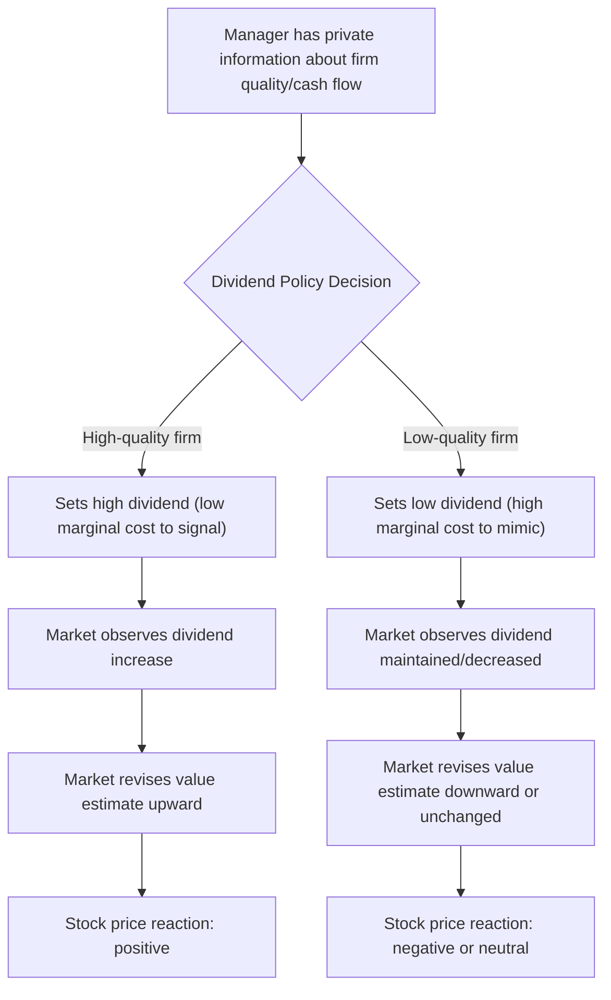

## Dividend Signaling Theories

### Overview

Dividend signaling theories propose that dividend policy conveys information from managers to outside investors under conditions of asymmetric information. Because managers possess superior knowledge of the firm's current performance and future prospects, changes in dividend policy can serve as a costly, credible signal that separates firms with genuinely favorable prospects from those without. These theories directly address the empirical failure of the dividend irrelevance theorem's information-symmetry assumption and help explain why stock prices react systematically to dividend announcements.

### Theoretical Motivation

**Key Points**

- Under asymmetric information, managers know more about the firm's true value and future cash flow prospects than outside shareholders.
- Cheap talk (managers simply announcing "we expect strong future earnings") is not credible, since low-quality firms have an incentive to mimic high-quality firms' announcements.
- A credible signal must be costly to send and, critically, costlier for low-quality firms to send than for high-quality firms — this is the standard separating-equilibrium condition from signaling theory (Spence, 1973).
- Dividends can satisfy this condition because committing to a higher payout is costly if it is not backed by sustainable future cash flows (e.g., forcing the firm to cut the dividend later, raise costly external capital, or forgo positive-NPV investments).

### Bhattacharya (1979): The Foundational Signaling Model

Sudipto Bhattacharya's model is generally credited as the first formal dividend signaling model.

**Key Points**

- Managers have private information about the firm's future cash flows; outside investors do not.
- Paying dividends is costly because a firm that pays out more than its realized cash flow must resort to external financing, which carries transaction costs (e.g., flotation costs, underpricing).
- In equilibrium, only firms with sufficiently high expected future cash flows choose to commit to a high dividend, since low-cash-flow firms would face a higher probability of costly external financing shortfalls.
- The dividend level thus signals the manager's private assessment of future project quality/cash flows, and the market rationally updates share price upward in response to a dividend increase.

The core trade-off in Bhattacharya's framework can be represented schematically: a firm chooses dividend $D$ to maximize signaling benefit net of expected transaction costs of external financing, where the cost function is convex in the shortfall between the dividend and realized cash flow.

### John and Williams (1985): Dividends and Personal Taxes

**Key Points**

- This model incorporates a real-world friction — the tax disadvantage of dividends relative to capital gains — directly into the signaling framework.
- Because dividends are tax-disadvantaged, only managers with sufficiently favorable private information will bear this tax cost to signal quality; the tax burden itself functions as the costly signaling mechanism.
- This model explains why signaling can persist even when it appears privately costly (via taxes) for shareholders in aggregate — the signal's value in reducing information asymmetry outweighs the tax cost for high-quality firms.

### Miller and Rock (1985): Dividends as a Signal of Current Cash Flow

**Key Points**

- Miller and Rock model dividends as revealing information about the firm's *current* period cash flow (rather than long-run project quality specifically).
- Because investment and financing decisions are observed with a lag, the dividend paid (as a residual after investment) can reveal current earnings that outsiders cannot directly observe.
- An unexpectedly high dividend implies unexpectedly high current cash flow, all else equal, and vice versa — this generates the empirically observed positive stock price reaction to dividend increases and negative reaction to decreases.
- A key implication: firms may sometimes forgo positive-NPV investments to maintain a dividend signal, generating a potential real cost (underinvestment) associated with signaling. [Inference — a standard implication drawn from the model's structure regarding investment-dividend trade-offs.]

### Formal Signaling Equilibrium Structure

A simplified representation of the separating equilibrium logic common to these models:

$$D^*(\theta) = \arg\max_D \; \left[ V(\theta \mid D) - C(D, \theta) \right]$$

where $\theta$ denotes the manager's private information about firm quality/future cash flow, $V(\theta \mid D)$ is the market-inferred firm value conditional on observing dividend $D$, and $C(D, \theta)$ is the cost of paying dividend $D$ given true type $\theta$ (e.g., expected external financing costs, forgone investment, or tax costs).

**Key Points**

- The single-crossing property — that the marginal cost of increasing $D$ is lower for high-$\theta$ (high-quality) firms than for low-$\theta$ firms — is what supports a separating equilibrium in which dividend level reveals $\theta$.
- In a separating equilibrium, the market can perfectly infer $\theta$ from the observed dividend, so $V(\theta \mid D^*(\theta)) = V(\theta)$, the true firm value.

### Diagram: Signaling Mechanism

### Empirical Predictions and Evidence

**Key Points**

- **Announcement effects**: dividend increases are associated with positive abnormal stock returns; dividend decreases/omissions are associated with negative abnormal returns — this pattern is well documented across numerous event studies. [Unverified — precise magnitude and statistical significance vary by sample period, market, and event-window methodology; the general directional finding is broadly replicated.]
- **Asymmetric magnitude**: the negative price reaction to dividend cuts is often found to be larger in magnitude than the positive reaction to increases, consistent with cuts being a stronger negative signal (since firms are reluctant to cut dividends, per Lintner). [Unverified — asymmetry findings vary across studies.]
- **Initiation and omission**: dividend initiations tend to produce especially strong positive reactions, and omissions especially strong negative reactions, since these represent discrete regime changes in payout policy rather than incremental adjustments.
- **Lintner's (1956) dividend smoothing**: firms adjust dividends toward a long-run target payout ratio gradually rather than immediately, consistent with managers avoiding sending a "false" signal that might later need reversal. The commonly cited partial-adjustment model is:

$$D_t - D_{t-1} = c \cdot (D_t^* - D_{t-1})$$

where $D_t^*$ is the target dividend (often based on target payout ratio times current earnings) and $c$ is the adjustment speed (Lintner's survey evidence suggested a speed roughly in the range of 0.3, i.e., firms close about 30% of the gap per year [Unverified — original survey-based estimate; magnitude varies across replications and later samples]).

**Example**

A firm reports a surprise dividend increase from $0.50 to $0.75 per share. Under signaling theory, this is interpreted by the market as management's credible (costly) assertion that future cash flows are strong enough to sustain the higher payout without needing costly external financing or project cuts. The stock price rises on the announcement, reflecting the market's upward revision of expected future cash flows — not because the cash itself is "new" value, but because the announcement resolved information asymmetry.

### Distinguishing Signaling from Free Cash Flow / Agency Explanations

**Key Points**

- Dividend increases can also be explained by the free cash flow hypothesis (Jensen, 1986): higher payouts reduce cash available for managers to waste on low-NPV projects, which is a governance/agency-cost story rather than an information story.
- Empirically distinguishing pure signaling from free-cash-flow-reduction effects is difficult, since both predict positive price reactions to dividend increases; researchers often examine cross-sectional variation (e.g., dividend changes at firms with high vs. low free cash flow and high vs. low growth opportunities) to separate the two channels. [Inference — reflects the standard empirical identification strategy discussed in the literature; results are not fully conclusive.]

### Critiques and Limitations of Signaling Theories

**Key Points**

- Signaling models generally struggle to explain the widespread use of share repurchases as an alternative or complementary payout channel, since repurchases can in principle serve a similar signaling role but with different tax and flexibility characteristics — the relative use of dividends versus repurchases as signals is not fully resolved theoretically. [Unverified — remains an active area of research.]
- Empirical tests have found that dividend changes are, in some studies, weak predictors of subsequent actual earnings changes, casting some doubt on the "cash flow information content" interpretation specifically (as opposed to the market reaction being driven by other factors like reduced uncertainty or agency-cost reduction). [Unverified — findings on the earnings-predictive power of dividend changes are mixed across studies and time periods, e.g., DeAngelo, DeAngelo, and Skinner's work casting doubt on strong predictive content.]
- Signaling costs (transaction costs of external financing, tax costs, forgone investment) may be economically small relative to observed price reactions in some calibrations, raising the question of whether signaling costs are large enough to sustain a separating equilibrium in practice. [Speculation — a theoretical concern raised in critical assessments of signaling models, not a settled empirical finding.]

### Conclusion

Dividend signaling theories explain the price-relevant information content of dividend changes by modeling dividends as a costly signal that managers use to credibly convey private information about firm quality or current/future cash flows to outside investors. Foundational models — Bhattacharya (1979), John and Williams (1985), and Miller and Rock (1985) — differ in the precise mechanism generating signaling costs (external financing frictions, personal taxes, and investment distortions, respectively), but share the common structure of a separating equilibrium sustained by a single-crossing cost condition. These theories are broadly consistent with the empirical pattern of positive stock price reactions to dividend increases and negative reactions to decreases, and with Lintner's classic finding that firms smooth dividends deliberately, though they compete with and are difficult to fully disentangle from agency-cost-based (free cash flow) explanations for the same empirical patterns.

**Related Topics**

- The dividend irrelevance theorem (Miller and Modigliani, 1961)
- Lintner's partial-adjustment model of dividend policy
- Free cash flow hypothesis and agency costs (Jensen, 1986)
- Share repurchases as a payout and signaling mechanism
- Asymmetric information and the pecking order theory of financing
- Event study methodology in corporate finance
- Catering theory of dividends (Baker and Wurgler)
- Empirical tests of dividend signaling content (DeAngelo, DeAngelo, and Skinner)