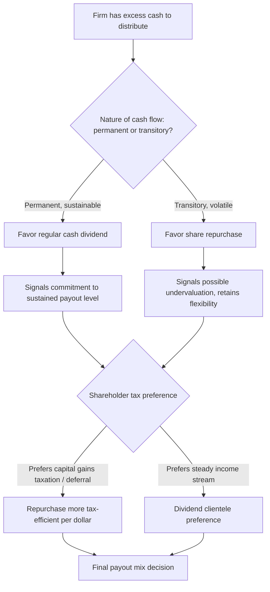

## Share Repurchases Versus Dividends

### Overview

Share repurchases (buybacks) and cash dividends are the two primary mechanisms by which firms return capital to shareholders. While both reduce the firm's cash balance and, in principle, can distribute equivalent aggregate value to shareholders, they differ substantially in their tax treatment, flexibility, signaling properties, effect on ownership structure, and use across firms and time periods. Understanding the trade-offs between these two payout channels is central to modern payout policy analysis, particularly given the dramatic rise of repurchases relative to dividends since the 1980s.

### Mechanics of Each Payout Method

**Key Points**

- **Cash dividend**: a pro-rata cash distribution paid to all shareholders of record, typically on a regular (often quarterly) schedule, at a fixed dollar amount per share.
- **Share repurchase**: the firm buys back its own shares from the market or from shareholders, reducing shares outstanding. Common repurchase mechanisms include:
  - **Open-market repurchases**: the firm buys shares gradually on the open market over time, the most common method in the U.S. [Unverified — relative prevalence varies by market and period; open-market repurchases are widely cited as the dominant form in U.S. markets.]
  - **Fixed-price tender offers**: the firm offers to buy a specific number of shares at a specified price (usually at a premium to market price) within a fixed window.
  - **Dutch auction tender offers**: the firm specifies a price range, and shareholders submit shares at prices within that range; the firm determines the clearing price that allows it to repurchase the target quantity.
  - **Targeted (privately negotiated) repurchases**: the firm buys shares directly from a specific large shareholder, often at a negotiated price.

### Equivalence Under Perfect Markets (MM Baseline)

**Key Points**

- Under the same idealized assumptions as the dividend irrelevance theorem (no taxes, no transaction costs, no signaling asymmetries, fixed investment policy), a dollar distributed via repurchase is equivalent in value to a dollar distributed via dividend.
- In a repurchase, the shareholder who sells receives cash directly; the shareholder who retains shares holds a smaller total number of outstanding shares but the same proportional stake in a firm whose per-share value is mechanically higher (fewer shares dividing the same reduced equity value), since cash left the firm.
- In a dividend, all shareholders receive cash pro-rata and the ex-dividend share price falls by (approximately) the dividend per share, with share count unchanged.
- Under the MM baseline, a rational shareholder is indifferent between the two, since total wealth (cash received/foregone plus post-distribution share value) is identical in expectation.

**Example**

A firm with 100 shares outstanding, no debt, and total equity value of $1,000 ($10/share) wants to distribute $100.

*Dividend route:* Pays $1/share dividend. Ex-dividend value = $900 across 100 shares = $9/share. A shareholder holding 10 shares receives $10 cash + holds shares worth $90 = $100 total.

*Repurchase route:* Buys back 10 shares at $10/share ($100 total), leaving 90 shares outstanding and $900 remaining equity value = $10/share (unchanged, since cash left at fair value). A shareholder who sold 1 of their 10 shares receives $10 cash and holds 9 shares worth $90 = $100 total; a shareholder who does not sell continues to hold 10 shares worth $100 (their proportional ownership stake in the firm has risen slightly since fewer shares remain outstanding).

### Tax Treatment Differences

**Key Points**

- In most tax jurisdictions historically, dividends have been taxed as ordinary income (or at a specified dividend tax rate) upon receipt by all shareholders, regardless of their cost basis.
- Repurchases are typically taxed as capital gains, and only for shareholders who choose to sell — shareholders who retain their shares defer any tax liability until they eventually sell, and only pay tax on the gain relative to their cost basis (not on the full distribution).
- This creates a **tax-timing option** for shareholders under a repurchase regime that is unavailable under a dividend regime: investors can choose *whether and when* to realize a taxable event, whereas dividends impose an immediate, involuntary tax event on all shareholders.
- Where capital gains tax rates are lower than ordinary dividend tax rates, repurchases are tax-advantaged per dollar distributed relative to dividends. [Unverified — relative tax rates and treatment vary significantly by jurisdiction and over time, e.g., changes under various tax reform acts; general direction of the tax-timing and often tax-rate advantage of repurchases is well established in the literature, though exact magnitudes are time- and jurisdiction-specific.]

### Flexibility and Commitment Differences

**Key Points**

- Dividends are subject to strong market expectations of continuity and smoothing (per Lintner, 1956); cutting a regular dividend typically triggers a strongly negative market reaction, since it signals financial distress or a downward revision in prospects.
- Repurchases carry no such implicit commitment — firms can reduce, pause, or eliminate a repurchase program with comparatively little negative signaling cost, since repurchase authorizations are typically discretionary and not announced as a recurring per-share commitment. [Unverified — the asymmetry in signaling cost between cutting dividends versus reducing repurchases is a well-documented empirical regularity, but the precise magnitude of any repurchase-reduction penalty varies across studies.]
- This makes repurchases better suited to distributing *transitory* or volatile excess cash flow, while dividends are better suited to signaling a *sustainable* level of ongoing payout — a distinction formalized in models by Guay and Harford (2000) and Jagannathan, Stephens, and Weisbach (2000), which find repurchases are used to distribute temporary cash flow shocks while dividends track permanent earnings.

### Signaling Differences

**Key Points**

- Both dividend increases and repurchase announcements are generally associated with positive abnormal stock returns, but the strength and interpretation of the signal differ.
- Repurchase announcements (particularly tender offers) are often interpreted as signaling that management believes shares are **undervalued**, since a rational manager would only buy back stock below its true intrinsic value.
- Dividend signaling (per Bhattacharya, Miller and Rock, John and Williams) is more closely tied to conveying information about sustainable future cash flow levels, given the smoothing/commitment norm.
- Tender offer repurchases (especially Dutch auctions) tend to elicit larger positive price reactions than open-market repurchase announcements, plausibly because tender offers represent a firmer, more immediately executed commitment, while open-market programs are often only partially completed. [Unverified — relative magnitude findings vary across studies and time periods.]

### Effect on Ownership and EPS

**Key Points**

- Repurchases mechanically reduce shares outstanding, which increases earnings per share (EPS) even with no change in total net income — a frequently cited (and sometimes criticized) motivation for repurchases tied to management compensation structures linked to EPS targets. [Inference — the EPS-management-incentive critique is a widely discussed concern in the corporate governance literature but represents an interpretation of motive rather than a directly observable universal fact.]
- Repurchases allow shareholders to self-select whether to sell (adjusting their ownership stake) or hold (increasing their proportional ownership as other shareholders exit), offering more individual-level flexibility than the pro-rata, non-optional nature of dividends.
- Large sustained repurchase programs can materially alter a firm's ownership concentration and capital structure over time (since repurchases funded by debt increase leverage), an effect that pure dividend payout does not have on the same scale unless dividends are also debt-funded.

### Diagram: Payout Method Selection Framework

### Empirical Trends: The Rise of Repurchases

**Key Points**

- Aggregate share repurchases in the U.S. grew substantially relative to dividends beginning in the 1980s and accelerated in subsequent decades, with total repurchase volume exceeding total dividend payments in aggregate for U.S. public firms in various years since the late 1990s. [Unverified — precise crossover timing and relative magnitudes vary by data source, sample, and year; the general directional trend of rising repurchase prominence is well documented, e.g., in Fama and French (2001) and related studies on the "disappearing dividends" phenomenon.]
- Contributing factors commonly cited in the literature include: relative tax advantages of repurchases in various periods, increased use of equity-based executive compensation (repurchases offset dilution from option/RSU issuance), greater managerial flexibility, and regulatory changes (e.g., SEC Rule 10b-18 in 1982 in the U.S., which provided a safe harbor for open-market repurchases and is widely credited with facilitating their growth). [Unverified — causal attribution among these factors remains debated in the literature.]
- Fama and French (2001) documented a broader decline in the propensity of firms to pay dividends at all ("disappearing dividends"), attributing this partly to changing firm characteristics (more small, high-growth, low-profitability firms) rather than solely to substitution toward repurchases. [Unverified — interpretation of this finding, and the relative role of firm characteristics versus substitution, remains a subject of ongoing academic discussion.]

### Agency Cost Considerations

**Key Points**

- Both dividends and repurchases can serve the free cash flow reduction role described by Jensen (1986), disciplining managers by reducing cash available for potential value-destroying investments (empire building, negative-NPV projects).
- Repurchases may be a more agency-cost-efficient distribution mechanism in some contexts because they can be executed opportunistically and do not create the same rigid future funding obligation that a sustained dividend commitment does — reducing the risk that a firm locks itself into a payout it cannot sustain. [Inference — a commonly cited rationale in the corporate payout literature, not a universally quantified empirical result.]

### Practical Considerations for Firms Choosing Between Methods

**Key Points**

- **Signal desired**: dividends for sustained commitment/income signaling; repurchases for undervaluation signaling or flexible capital return.
- **Cash flow volatility**: repurchases better suited to firms with variable or cyclical cash flows; dividends better suited to firms with stable, predictable cash flows.
- **Shareholder base/clientele**: firms with income-oriented shareholder bases (e.g., pension funds, retirees) may face demand for dividends regardless of tax efficiency, per dividend clientele theory.
- **Capital structure goals**: debt-funded repurchases can be used deliberately to increase leverage toward a target capital structure, functioning simultaneously as a payout and financing decision.
- **Regulatory/legal environment**: repurchase regulations (safe harbors, disclosure requirements, and in some jurisdictions repurchase taxes, such as the U.S. 1% excise tax on net repurchases introduced under the Inflation Reduction Act) affect the relative attractiveness of each method and change over time. [Unverified — specific tax rate and regulatory details should be verified against current law, as these are subject to legislative change.]

### Conclusion

Share repurchases and dividends are economically substitutable mechanisms for returning cash to shareholders under idealized market conditions, but they diverge meaningfully once realistic frictions — taxes, signaling asymmetries, flexibility needs, and agency considerations — are introduced. Dividends function as a relatively rigid, smoothed commitment well-suited to signaling sustainable earnings power, while repurchases offer greater flexibility, potential tax efficiency through deferral, and a signal more closely associated with perceived undervaluation. The substantial rise of repurchases as a share of total corporate payout since the 1980s reflects a combination of tax considerations, executive compensation structures, regulatory changes, and evolving corporate preferences for flexible capital distribution, though the precise weighting of these causes remains actively debated in the academic literature.

**Related Topics**

- The dividend irrelevance theorem (Miller and Modigliani, 1961)
- Dividend signaling theories (Bhattacharya; Miller and Rock; John and Williams)
- Lintner's model of dividend smoothing
- Free cash flow hypothesis and agency costs (Jensen, 1986)
- Dutch auction and fixed-price tender offer mechanics
- Tax clientele effects in payout policy
- Fama and French's "disappearing dividends" study
- Regulatory framework for repurchases (e.g., SEC Rule 10b-18)