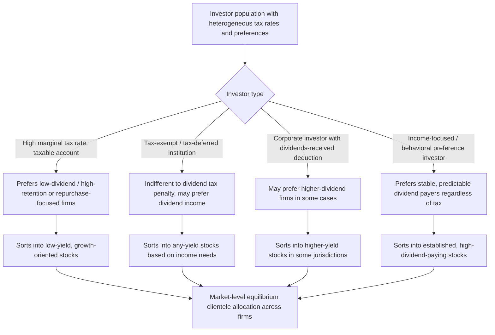

## Clientele Effects and Tax Considerations

### Overview

Clientele effects describe the phenomenon in which investors sort themselves into holding shares of firms whose dividend payout policies match their individual tax situations, income needs, or institutional constraints. Tax considerations are the primary but not exclusive driver of clientele formation, since differential taxation of dividends versus capital gains creates systematic incentives for different investor types to prefer different payout policies. Together, these concepts form a major real-world departure from the dividend irrelevance theorem, explaining observed patterns in shareholder composition, stock price behavior around ex-dividend dates, and firm-level payout policy choices.

### The Clientele Effect: Core Concept

**Key Points**

- The clientele effect hypothesis, most closely associated with Miller and Modigliani's own 1961 paper (as an acknowledged real-world qualification to their irrelevance theorem) and later formalized by Elton and Gruber (1970), holds that investors self-select into firms whose dividend policies suit their personal circumstances.
- Because clienteles form through this sorting process, a firm's *aggregate* clientele composition may be relatively stable even though individual investors are attracted to or repelled by specific payout policies.
- A key implication (originally noted by Miller and Modigliani themselves) is the **clientele irrelevance corollary**: if clienteles already exist and are in equilibrium (i.e., the supply of firms with various payout policies matches investor demand across preference groups), then a given firm's marginal dividend policy change may still not affect its value — it simply attracts a different clientele mix — unless the *aggregate* supply-demand balance across all payout policy types in the market is disturbed.

### Tax-Based Clientele Formation

**Key Points**

- **High-tax-bracket individual investors** in jurisdictions where dividends are taxed at higher rates than long-term capital gains have a strong incentive to prefer low-dividend, high-retention (or repurchase-focused) firms, since capital gains taxation can often be deferred until realization and may be taxed at a preferential rate.
- **Tax-exempt or tax-deferred institutional investors** (pension funds, some retirement accounts, certain endowments) are indifferent to the dividend/capital-gains tax distinction at the investor level and may therefore gravitate toward high-dividend stocks without tax penalty, sometimes actively preferring dividend income for cash-flow or fiduciary reasons (e.g., income-generation mandates).
- **Corporate investors** in jurisdictions offering a dividends-received deduction (partial or full exclusion of intercorporate dividends from taxable income, as under U.S. tax law) face a *lower* effective tax rate on dividends than on capital gains in some cases, creating an incentive for corporate shareholders to prefer higher-dividend stocks. [Unverified — the relative tax treatment depends on the specific ownership percentage thresholds and jurisdiction-specific rules, e.g., varying dividends-received deduction percentages under U.S. tax code depending on ownership stake.]

**Example**

An investor in a high marginal income tax bracket, facing a 37% ordinary/dividend tax rate versus a 20% long-term capital gains rate, will have an after-tax preference for a firm that retains earnings and grows share price (generating capital gains) over an economically identical firm that pays the equivalent value out as dividends, all else equal. A retired investor in a tax-deferred account, indifferent between the two tax rates, faces no such distortion and may instead simply prefer the dividend-paying firm for predictable income.

### The Elton and Gruber (1970) Ex-Dividend Day Test

Elton and Gruber's classic empirical approach uses ex-dividend day price behavior to infer the marginal tax rate of the dominant clientele holding a given stock.

**Key Points**

- In a world with no taxes, the share price should fall by exactly the dividend amount on the ex-dividend date (consistent with the MM irrelevance logic).
- With differential taxation of dividends and capital gains, the price drop on the ex-dividend date should reflect the after-tax value of the dividend relative to the after-tax value of the capital loss avoided by selling just before the ex-date, implying the price drop will generally be *less* than the full dividend amount when dividends are taxed more heavily than capital gains.
- The ex-dividend price drop ratio is commonly expressed as:

$$\frac{P_{cum} - P_{ex}}{D} = \frac{1 - \tau_D}{1 - \tau_G}$$

where $P_{cum}$ is the cum-dividend price, $P_{ex}$ is the ex-dividend price, $D$ is the dividend per share, $\tau_D$ is the effective dividend tax rate, and $\tau_G$ is the effective capital gains tax rate for the marginal (price-setting) investor.

- Elton and Gruber found empirical price drop ratios consistent with dividend clienteles differing systematically by the dividend yield of the stock, interpreted as evidence that high-yield stocks are disproportionately held by lower-tax-rate investors (for whom the tax penalty on dividends is smaller). [Unverified — original 1970 findings; subsequent literature using more refined methodologies, controlling for factors like bid-ask spreads and short-term trading around ex-dividend dates, has produced more mixed or qualified results regarding the precise magnitude and interpretation of the price-drop ratio.]

**Example**

If a stock's price falls by only $0.70 on the ex-dividend date for every $1.00 dividend paid, this is consistent with a marginal investor facing a meaningfully higher effective tax rate on dividends than on capital gains, since the after-tax value lost by holding through the ex-date (receiving the taxed dividend) is less attractive relative to the after-tax capital loss than a simple 1:1 price adjustment would suggest.

### Dividend Yield-Based Clienteles

**Key Points**

- Beyond simple tax bracket sorting, empirical work has examined whether stocks with different dividend yields attract systematically different investor clienteles by characteristics such as marginal tax rate, age, and investment horizon.
- Some studies find that high-yield stocks are disproportionately held in tax-advantaged accounts or by tax-exempt institutions, consistent with tax-based clientele sorting. [Unverified — empirical support for yield-based tax clienteles is mixed; some studies find weaker or more nuanced patterns than a simple monotonic relationship, and results are sensitive to sample period and methodology.]
- Behavioral/preference-based clienteles also exist independent of tax considerations — e.g., retirees or income-focused investors preferring predictable dividend income streams for consumption-smoothing or psychological "mental accounting" reasons (treating dividends as spendable income distinct from principal), a explanation associated with behavioral finance research (e.g., Shefrin and Statman, 1984, on the "bird-in-hand" and self-control motivations for dividend preference). [Inference — behavioral clientele explanations are a recognized complement to tax-based explanations in the literature, though their relative empirical importance versus tax effects is debated.]

### Diagram: Clientele Sorting Mechanism

### Tax Regime Variation and Historical Changes

**Key Points**

- The relative tax treatment of dividends versus capital gains has varied substantially across countries and over time, materially affecting the strength of tax-based clientele incentives in a given period.
- In the U.S., the Jobs and Growth Tax Relief Reconciliation Act of 2003 reduced the tax rate on qualified dividends to align more closely with long-term capital gains rates, which some studies find was associated with an increase in dividend-paying behavior among U.S. firms, consistent with reduced tax cost of paying dividends. [Unverified — causal attribution of dividend initiation trends to this specific tax change versus other contemporaneous factors remains debated in the empirical literature, e.g., work by Chetty and Saez (2005) and subsequent critiques/extensions.]
- Some jurisdictions use imputation tax systems (e.g., historically in Australia) in which shareholders receive a tax credit for corporate taxes already paid on distributed profits, substantially reducing or eliminating the double-taxation penalty on dividends relative to a classical tax system — this materially weakens or reverses typical tax-based clientele incentives observed in classical-system countries like the historical U.S. system. [Unverified — imputation system details and their specific effects vary by country and have changed over time; general mechanism described is standard but current status should be verified for any specific jurisdiction.]

### Implications for Corporate Payout Policy

**Key Points**

- If dividend clienteles exist and are costly for investors to switch between (due to transaction costs of rebalancing portfolios), a firm changing its established dividend policy may face a temporary price effect as its existing clientele exits and a new clientele is attracted — sometimes cited as a reason for the empirically observed reluctance of firms to change dividend policy frequently (reinforcing Lintner's smoothing behavior).
- Clientele considerations may factor into a firm's choice between dividends and repurchases: firms with shareholder bases concentrated among high-tax-bracket individual investors have a stronger incentive to favor repurchases (with their tax-deferral/tax-timing advantage) over dividends, all else equal.
- From a market equilibrium perspective, if the supply of dividend-paying versus non-dividend-paying firms adjusts to match clientele demand, then any individual firm's payout choice may have limited effect on its own valuation at the margin — the clientele effect can thus be seen as a mechanism that is *consistent with* aggregate dividend irrelevance at the market level, even while individual investors clearly have strong tax-driven preferences. [Inference — this synthesis view, connecting clientele theory back to an aggregate irrelevance argument, reflects a standard theoretical reconciliation offered in corporate finance texts, though it depends on the assumption that clientele supply and demand are in full equilibrium.]

### Limitations and Empirical Challenges

**Key Points**

- Isolating pure tax-clientele effects from other confounding factors (signaling, agency effects, transaction costs, short-term trading/dividend capture strategies around ex-dividend dates) is empirically difficult, and the ex-dividend day price drop methodology in particular has been critiqued for being confounded by microstructure effects such as bid-ask spread bounce and tick-size constraints. [Unverified — this is a well-recognized methodological critique in the literature, e.g., subsequent work by Kalay (1982) and others questioning whether ex-day price drops cleanly identify marginal tax rates.]
- "Dividend capture" trading — short-term traders buying shares just before the ex-dividend date to capture the dividend and selling shortly after — can distort the marginal price-setting investor's apparent tax rate inferred from ex-day price behavior, complicating clean identification of clientele effects from this methodology.
- The relative importance of tax-based versus behavioral/institutional clientele effects remains an open empirical question, and results are sensitive to the specific time period, country, and tax regime studied. [Unverified — reflects genuine ongoing disagreement in the empirical payout policy literature rather than a settled conclusion.]

### Conclusion

Clientele effects arise because investors with differing tax situations, income needs, and institutional constraints rationally sort into holding shares of firms whose dividend policies best match their circumstances, with tax considerations — particularly the differential treatment of dividend income versus capital gains — serving as a primary driver of this sorting alongside behavioral and institutional preferences. Empirical evidence, notably the Elton and Gruber (1970) ex-dividend day methodology, has historically supported the existence of tax-based clienteles, though later work has raised methodological concerns about cleanly isolating tax effects from market microstructure and short-term trading confounds. Clientele theory represents an important qualification to the dividend irrelevance theorem: while it explains substantial cross-sectional variation in who holds which dividend-paying stocks, it does not necessarily imply that any individual firm can create value simply by changing its payout policy, since clientele markets may already be in equilibrium at the aggregate level.

**Related Topics**

- The dividend irrelevance theorem (Miller and Modigliani, 1961)
- Elton and Gruber (1970) ex-dividend day empirical methodology
- Dividend signaling theories (Bhattacharya; Miller and Rock)
- Share repurchases versus dividends and tax-timing advantages
- Behavioral finance explanations for dividend preference (Shefrin and Statman)
- Imputation versus classical corporate tax systems
- Dividend capture trading strategies
- Lintner's model of dividend smoothing