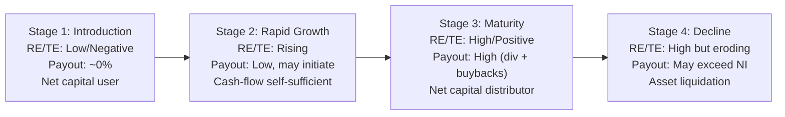

## The Life-Cycle Theory of Payout Policy

### Overview

The life-cycle theory of payout policy holds that a firm's optimal mix and level of dividends (and repurchases) should evolve systematically with its position in the corporate life cycle — from young, high-growth firms that retain nearly all earnings, to mature, low-growth firms that distribute large fractions of free cash flow back to shareholders. The theory reframes payout policy as a dynamic, endogenous outcome of the trade-off between investment opportunities and the accumulation of internally generated cash, rather than a static preference or a fixed target ratio.

### Theoretical Foundations

**Key Points**

- Rooted in the trade-off between the marginal benefit of retaining capital for investment and the marginal cost of retaining excess cash (agency costs of free cash flow)
- Formalized primarily by DeAngelo, DeAngelo, and Stulz (2006), building on earlier agency-cost intuition from Jensen (1986) and Easterbrook (1984)
- Explains cross-sectional and time-series patterns in payout that pure signaling or tax-clientele models struggle to account for

The core mechanism rests on an evolving balance sheet identity. As a firm matures, the relative weight of two components shifts:

$$\text{Firm Value Allocation} = \underbrace{\text{Growth Opportunities (NPV of future investments)}}_{\text{dominant when young}} + \underbrace{\text{Assets in Place (accumulated earned capital)}}_{\text{dominant when mature}}$$

A firm's **earned/contributed capital mix** is the theory's central explanatory variable. This is typically proxied empirically by the ratio of retained earnings to total equity (RE/TE) or retained earnings to total assets (RE/TA):

$$\text{RE/TE Ratio} = \frac{\text{Retained Earnings}}{\text{Total Book Equity}}$$

A low or negative RE/TE ratio indicates the firm is still largely funded by contributed capital (external equity/debt raised to finance growth) and has not yet accumulated significant internally generated earnings. A high RE/TE ratio indicates the firm has shifted toward being self-financed out of past profits, with fewer positive-NPV projects able to absorb all internally generated cash.

### The Life-Cycle Stages

**Stage 1 — Introduction/Early Growth**

- Investment opportunities (NPV of growth options) vastly exceed internally generated funds
- Firm is a net user of external capital (equity issuances, venture funding, debt)
- Optimal payout ≈ 0; retaining every dollar of earnings, and often raising external capital simultaneously, maximizes value because the marginal return on reinvested capital exceeds the shareholder's opportunity cost of capital
- RE/TE ratio is low or negative

**Stage 2 — Rapid Growth/Expansion**

- Internally generated cash flow begins to grow, but investment opportunities remain abundant
- Firm becomes cash-flow self-sufficient but continues retaining nearly all earnings
- Some firms begin small, symbolic payouts (or initiate repurchases) as a costly signal of confidence, but this is secondary to the life-cycle mechanism itself

**Stage 3 — Maturity**

- Growth opportunities shrink relative to the firm's asset base and cash-generating capacity
- Free cash flow (cash flow beyond what is needed to fund all positive-NPV projects) becomes persistently positive
- Optimal payout rises sharply; the firm transitions from a net capital user to a net capital distributor
- RE/TE ratio becomes high and positive
- Agency costs of retaining unneeded cash (empire-building, negative-NPV diversification, perquisite consumption) become the dominant concern, making high payout value-increasing

**Stage 4 — Decline**

- Investment opportunities may turn negative in the sense that the firm is running down assets faster than replacing them
- Payout can exceed net income for a period (funded by asset liquidation or debt), and eventually the firm may be acquired, restructured, or wound down

### Formal Prediction: Payout as a Function of Earned/Contributed Capital Mix

DeAngelo, DeAngelo, and Stulz (2006) test the theory by regressing dividend-paying propensity on the earned/contributed capital mix, controlling for profitability, size, growth (market-to-book), and firm assets:

$$P(\text{Dividend Payer}_{i,t}=1) = f(\text{RE/TE}_{i,t}, \text{Size}_{i,t}, \text{Profitability}_{i,t}, \text{Growth}_{i,t})$$

The theory's central, testable prediction is that **RE/TE (or RE/TA) should be strongly and positively related to the probability and magnitude of dividend payout, even after controlling for profitability and growth separately** — because RE/TE captures the *cumulative* stock of the trade-off (how much capital has already been earned and not yet paid out), not merely current-period profitability or investment opportunity, which are flow variables.

### Life Cycle and the Repurchase Margin

The theory extends naturally to explain the choice between dividends and repurchases:

- **Dividends** are used for the "permanent" or sustainable component of the firm's distributable free cash flow, since dividend cuts are costly (negative signaling, clientele disruption)
- **Repurchases** are used for the "transitory" or variable component, since they are more flexible and can be scaled up/down (or skipped) without the same penalty
- As firms mature further, and especially post-2000s in the U.S., large mature firms have increasingly favored repurchases as the marginal payout vehicle precisely because they preserve flexibility while still returning excess free cash flow

### The "Disappearing Dividends" Puzzle and Life-Cycle Resolution

Fama and French (2001) documented a sharp decline in the percentage of U.S. industrial firms paying dividends from the 1970s to the late 1990s, driven substantially by a wave of newly listed firms with low profitability and high growth (i.e., firms structurally in Stage 1–2 of the life cycle).

**Key Points**

- Fama and French attributed this partly to changing firm characteristics (more small, unprofitable, high-growth firms going public)
- DeAngelo, DeAngelo, and Stulz reconcile this with the life-cycle theory: it is not that dividends became less attractive per se, but that the population of listed firms shifted younger, and the *aggregate* earned/contributed capital mix of the market shifted down
- Despite the falling percentage of *payers*, the *dollar amount* of aggregate dividends paid by the small number of mature, high-RE/TE firms actually rose over the same period — consistent with life-cycle concentration of payout among mature firms

### Worked Example

Consider two firms, both in a "Payout Policy" case study set, with identical current-year net income of $100 million.

**Firm A ("GrowthCo")**

- 5 years old, market-to-book ratio = 4.5
- RE/TE ratio = −0.15 (accumulated deficit; still funded mostly by IPO/VC proceeds)
- Identified positive-NPV projects requiring $180 million in capital this year
- Life-cycle prediction: Firm A should pay **zero dividends** and likely raise additional external capital, since investment needs ($180M) exceed internal funds ($100M)

**Firm B ("MatureCo")**

- 40 years old, market-to-book ratio = 1.3
- RE/TE ratio = 0.72 (majority of book equity is accumulated retained earnings)
- Identified positive-NPV projects requiring only $20 million in capital this year
- Life-cycle prediction: Firm B has $80 million in free cash flow with no productive use; the theory predicts this should be distributed via dividends and/or repurchases to avoid agency costs of cash hoarding

$$\text{Free Cash Flow}_{\text{MatureCo}} = \text{Net Income} - \text{NPV-Positive Investment} = \$100M - \$20M = \$80M \text{ (distributable)}$$

### Diagram: Life-Cycle Payout Trajectory

### Empirical Support and Extensions

**Key Points**

- DeAngelo, DeAngelo, and Stulz (2006) find RE/TE and RE/TA are highly significant predictors of dividend-paying status in large-sample U.S. data, robust to controlling for profitability, size, and growth
- Denis and Osobov (2008) extend the test internationally (U.S., Canada, U.K., Germany, France, Japan) and find the earned/contributed capital mix predicts payout propensity in most of these markets, supporting the theory's generality
- The life-cycle framework has been used to explain **special dividends** (one-time payouts of unusually large, non-recurring free cash flow) as a life-cycle-consistent alternative to a permanent regular dividend increase when a mature firm has a temporary cash windfall
- [Inference] Some later work in the M&A and payout literature interprets acquisitions by mature, high-RE/TE firms as an alternative (imperfect) substitute for direct payout — spending free cash flow on acquisitions instead of distributing it — though this is more contested and closer to classical agency-cost (Jensen 1986) reasoning than to the DeAngelo-DeAngelo-Stulz formalization specifically

### Relationship to Other Payout Theories

| Theory | Core Driver of Payout | Life-Cycle Relationship |
| --- | --- | --- |
| Signaling (Bhattacharya, Miller-Rock) | Private information about future earnings | Complementary — signaling motives may explain payout *initiation timing* within a life-cycle stage |
| Tax-clientele | Differential taxation of dividends vs. capital gains | Largely orthogonal — clientele effects operate within a given life-cycle stage |
| Agency costs of free cash flow (Jensen 1986; Easterbrook 1984) | Reducing managerial discretion over surplus cash | Direct ancestor — life-cycle theory is essentially agency theory made dynamic across firm age/maturity |
| Catering theory (Baker-Wurgler) | Investor sentiment/demand for dividend-paying stocks | Competing — catering emphasizes time-varying investor demand rather than firm-level fundamentals as the driver |

### Limitations and Open Questions

- [Inference] The theory is descriptive of *average* cross-sectional patterns; it does not pin down the exact payout ratio a mature firm should choose, only the directional relationship between life-cycle stage and payout propensity
- RE/TE can be mechanically affected by share buybacks, write-offs, and accounting choices (e.g., goodwill impairments), which may introduce measurement noise unrelated to the true economic life-cycle stage [Unverified — magnitude of this noise is not settled in the literature]
- The theory offers a weaker account of the specific *choice* between dividends versus repurchases as payout vehicles, which is addressed more directly by flexibility-based theories (e.g., Jagannathan, Stephens, and Weisbach 2000)
- Behavior may vary by legal regime, ownership concentration, and market development; the international evidence (Denis and Osobov 2008) shows the RE/TE relationship holds but with varying strength across countries

### SVG Diagram: Payout vs. Investment Opportunity Across the Life Cycle (svg_diagram)

<svg xmlns="http://www.w3.org/2000/svg" viewBox="0 0 720 420">
<text x="360" y="25" text-anchor="middle" font-size="16" font-weight="bold" font-family="sans-serif">Payout vs. Investment Opportunity Across the Life Cycle (svg_diagram)</text>
<line x1="70" y1="360" x2="680" y2="360" stroke="black" stroke-width="2" />
<line x1="70" y1="360" x2="70" y2="50" stroke="black" stroke-width="2" />
<text x="375" y="400" text-anchor="middle" font-size="13" font-family="sans-serif">Firm Age / Life-Cycle Stage</text>
<text x="30" y="200" text-anchor="middle" font-size="13" font-family="sans-serif" transform="rotate(-90 30 200)">Relative Magnitude</text>
<path d="M 70,80 C 250,80 350,300 680,340" stroke="#c0392b" stroke-width="3" fill="none" />
<text x="150" y="70" font-size="12" fill="#c0392b" font-family="sans-serif">Investment Opportunities (NPV of Growth)</text>
<path d="M 70,340 C 250,340 350,120 680,80" stroke="#2980b9" stroke-width="3" fill="none" />
<text x="450" y="70" font-size="12" fill="#2980b9" font-family="sans-serif">Optimal Payout Ratio</text>
<line x1="375" y1="50" x2="375" y2="360" stroke="gray" stroke-width="1" stroke-dasharray="4,4" />
<text x="380" y="45" font-size="11" fill="gray" font-family="sans-serif">Crossover Point</text>
<text x="130" y="380" font-size="11" font-family="sans-serif">Stage 1: Intro</text>
<text x="280" y="380" font-size="11" font-family="sans-serif">Stage 2: Growth</text>
<text x="450" y="380" font-size="11" font-family="sans-serif">Stage 3: Maturity</text>
<text x="600" y="380" font-size="11" font-family="sans-serif">Stage 4: Decline</text>
</svg>

**Next Topics**

- Agency costs of free cash flow (Jensen 1986) as the microfoundation for life-cycle payout behavior
- The dividend signaling hypothesis and its interaction with firm maturity
- Catering theory of dividends (Baker and Wurgler) as a competing/complementary framework
- Empirical measurement of the retained earnings-to-total equity (RE/TE) ratio and its accounting pitfalls
- Special dividends versus regular dividend increases as life-cycle-consistent payout choices
- The dividend-repurchase substitution decision and flexibility theory (Jagannathan, Stephens, Weisbach)
- Cross-country evidence on payout life-cycle patterns (Denis and Osobov 2008)