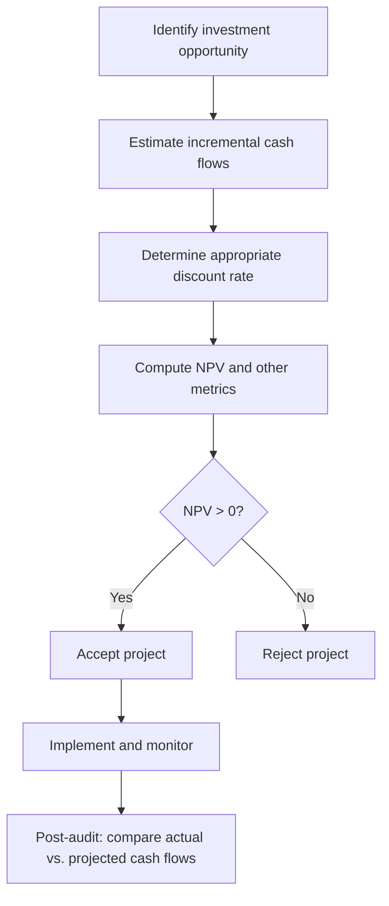

## Net Present Value and Capital Budgeting

### Overview

Net present value (NPV) is the central decision criterion in capital budgeting, the process by which firms evaluate long-term investment projects. NPV measures the dollar value a project adds to the firm by discounting all expected future cash flows to the present using an appropriate risk-adjusted discount rate, then subtracting the initial investment outlay.

$$NPV = \sum_{t=0}^{n} \frac{CF_t}{(1+r)^t}$$

where $CF_t$ is the cash flow at time $t$ (with $CF_0$ typically negative, representing the initial outlay), $r$ is the discount rate (cost of capital), and $n$ is the project's life in periods.

### The Time Value of Money Foundation

NPV rests on the principle that a dollar today is worth more than a dollar in the future, because of opportunity cost, inflation, and risk. Discounting converts future cash flows into present-value equivalents using a discount rate that reflects the riskiness of those cash flows.

**Key Points**

- The discount rate $r$ should reflect the opportunity cost of capital for projects of similar risk
- Cash flows, not accounting earnings, are the relevant inputs (NPV ignores non-cash items like depreciation except through their tax effects)
- Only incremental cash flows attributable to the project should be included

### The NPV Decision Rule

- **Accept** a project if $NPV > 0$ (it adds value to the firm)
- **Reject** a project if $NPV < 0$ (it destroys value)
- **Indifferent** if $NPV = 0$ (the project earns exactly the required return)

When choosing among **mutually exclusive** projects, select the one with the highest positive NPV. When projects are **independent**, accept all projects with $NPV > 0$, subject to capital constraints.

### Why NPV Is Theoretically Superior

**Key Points**

- **Additivity (value additivity principle):** $NPV(A+B) = NPV(A) + NPV(B)$. This allows firms to evaluate projects independently and sum their contributions to firm value.
- **Direct link to shareholder wealth:** A positive-NPV project increases the market value of equity by that amount, in a frictionless, efficient market [Inference: assumes market efficiency and no signaling frictions].
- **Reinvestment assumption:** NPV implicitly assumes intermediate cash flows are reinvested at the discount rate $r$ (the cost of capital), which is more realistic than the Internal Rate of Return's (IRR) assumption of reinvestment at the IRR itself.
- **Consistent ranking:** Unlike IRR or the Profitability Index, NPV does not produce ranking conflicts when comparing mutually exclusive projects of different scale or timing, because it is measured in absolute currency units that map directly to wealth creation.

### Capital Budgeting Process

### Estimating Incremental Cash Flows

The accuracy of NPV depends entirely on correctly specified cash flows. Standard components include:

**Initial Investment (Time 0)**

- Capital expenditures (equipment, construction)
- Net working capital (NWC) increases
- After-tax proceeds from sale of any replaced assets
- Opportunity costs of assets already owned but redirected to the project

**Operating Cash Flows (Time 1 to n)**

$$OCF_t = (Revenue_t - Costs_t - Depreciation_t)(1 - T) + Depreciation_t$$

Equivalently:

$$OCF_t = EBIT_t \times (1-T) + Depreciation_t$$

Depreciation itself is not a cash flow, but it reduces taxable income and therefore generates a **depreciation tax shield** equal to $Depreciation_t \times T$.

**Terminal Cash Flow (Time n)**

- Recovery of net working capital
- After-tax salvage value: $SalvageValue - T(SalvageValue - BookValue)$

**Key Points — Costs to Include or Exclude**

- Include: opportunity costs, side effects on other product lines (erosion or synergy), changes in net working capital
- Exclude: sunk costs (already incurred, irrecoverable), financing costs (interest expense — captured instead in the discount rate, not the cash flows, to avoid double-counting)

### Determining the Discount Rate

The discount rate typically used is the **Weighted Average Cost of Capital (WACC)**:

$$WACC = \frac{E}{V}r_E + \frac{D}{V}r_D(1-T)$$

where $E$ and $D$ are the market values of equity and debt, $V = E + D$, $r_E$ is the cost of equity (often via CAPM), and $r_D$ is the pre-tax cost of debt.

**Key Points**

- WACC is appropriate only when the project has similar risk and financing mix to the firm as a whole
- For projects with different risk profiles, a project-specific discount rate (e.g., derived from a pure-play comparable firm's beta) should be used instead
- Using firm-wide WACC on a higher-risk project understates required return and can lead to overinvestment in risky ventures; the reverse holds for lower-risk projects

### Worked Example

A firm considers a project requiring an initial investment of $500,000 in equipment (straight-line depreciated to zero over 5 years) plus $50,000 in net working capital. The project is expected to generate revenues of $300,000/year and costs of $150,000/year for 5 years. Tax rate is 25%, WACC is 10%. Salvage value at year 5 is $40,000, and NWC is recovered at year 5.

**Step 1: Operating Cash Flow**

Depreciation $= 500,000 / 5 = 100,000$/year

$$EBIT = 300,000 - 150,000 - 100,000 = 50,000$$

$$OCF = 50,000(1-0.25) + 100,000 = 137,500 \text{ per year}$$

**Step 2: Terminal Cash Flow (Year 5)**

Book value at year 5 = $0

After-tax salvage $= 40,000 - 0.25(40,000 - 0) = 30,000$

NWC recovery $= 50,000$

Terminal cash flow $= 30,000 + 50,000 = 80,000$

**Step 3: Cash Flow Timeline**

| Year | Cash Flow |
| --- | --- |
| 0 | −550,000 |
| 1 | 137,500 |
| 2 | 137,500 |
| 3 | 137,500 |
| 4 | 137,500 |
| 5 | 137,500 + 80,000 = 217,500 |

**Step 4: Compute NPV**

$$NPV = -550{,}000 + \frac{137{,}500}{1.10} + \frac{137{,}500}{1.10^2} + \frac{137{,}500}{1.10^3} + \frac{137{,}500}{1.10^4} + \frac{217{,}500}{1.10^5}$$

$$NPV \approx -550{,}000 + 125{,}000 + 113{,}636 + 103{,}306 + 93{,}914 + 135{,}041 \approx 20{,}897$$

**Output**

$NPV \approx \$20{,}897 > 0$ → **Accept the project.** It is expected to increase firm value by approximately $20,897 in present-value terms.

### NPV Profile

A **NPV profile** plots NPV against varying discount rates, illustrating sensitivity to the cost of capital assumption and revealing the IRR (the rate at which NPV crosses zero).

<svg xmlns="http://www.w3.org/2000/svg" viewBox="0 0 640 380" font-family="sans-serif">
<text x="320" y="24" text-anchor="middle" font-size="15" font-weight="bold" fill="#1a1a1a">NPV Profile (svg_diagram)</text>
<line x1="70" y1="320" x2="600" y2="320" stroke="#333" stroke-width="1.5" />
<line x1="70" y1="40" x2="70" y2="320" stroke="#333" stroke-width="1.5" />
<text x="335" y="355" text-anchor="middle" font-size="12" fill="#333">Discount Rate (%)</text>
<text x="25" y="180" text-anchor="middle" font-size="12" fill="#333" transform="rotate(-90 25 180)">NPV ($)</text>
<path d="M 90 70 Q 250 90 340 200 Q 430 280 560 310" stroke="#2563eb" stroke-width="2.5" fill="none" />
<line x1="70" y1="200" x2="600" y2="200" stroke="#999" stroke-width="1" stroke-dasharray="4,4" />
<circle cx="345" cy="200" r="4" fill="#dc2626" />
<text x="355" y="195" font-size="11" fill="#dc2626">IRR (NPV = 0)</text>
<text x="55" y="205" text-anchor="end" font-size="10" fill="#333">0</text>
<text x="100" y="335" font-size="10" fill="#333">0%</text>
<text x="580" y="335" font-size="10" fill="#333">20%</text>
<text x="90" y="65" font-size="10" fill="#2563eb">NPV at low r</text>
</svg>

### NPV vs. Other Capital Budgeting Criteria

| Method | Decision Rule | Key Limitation |
| --- | --- | --- |
| **NPV** | Accept if NPV > 0 | Requires accurate discount rate estimate |
| **IRR** | Accept if IRR > cost of capital | Can give multiple/no solutions with non-conventional cash flows; assumes reinvestment at IRR; ranking conflicts with NPV for mutually exclusive projects |
| **Payback Period** | Accept if payback < threshold | Ignores time value of money (unless discounted) and cash flows beyond the cutoff |
| **Discounted Payback** | Accept if discounted payback < threshold | Still ignores cash flows after cutoff |
| **Profitability Index (PI)** | Accept if PI > 1 | Useful for capital rationing but can misrank mutually exclusive projects of different scale |
| **Accounting Rate of Return (ARR)** | Accept if ARR > target | Uses accounting income, not cash flow; ignores time value of money |

$$PI = \frac{PV(\text{future cash flows})}{\text{Initial Investment}} = 1 + \frac{NPV}{\text{Initial Investment}}$$

### Common NPV–IRR Conflicts

**Key Points**

- **Scale differences:** A small project may have a higher IRR but lower NPV than a large project. NPV should govern because it reflects absolute wealth creation.
- **Timing differences:** Projects with cash flows concentrated early vs. late can cross in their NPV profiles (the "crossover rate"), causing IRR and NPV to disagree at certain discount rates.
- **Non-conventional cash flows:** Multiple sign changes in the cash flow stream can produce multiple IRRs or no real IRR, per Descartes' Rule of Signs — NPV remains well-defined regardless.
- **Resolution:** When IRR and NPV disagree for mutually exclusive projects, NPV should be used as the decision criterion, since it directly measures value added, consistent with the value additivity principle.

### Handling Unequal Project Lives

When comparing mutually exclusive projects with different lifespans, raw NPV comparison is biased toward longer-lived projects. Two standard adjustments:

**1. Equivalent Annual Annuity (EAA) / Equivalent Annual Cost (EAC):**

$$EAA = \frac{NPV \times r}{1-(1+r)^{-n}}$$

Compare the EAA across projects; select the highest.

**2. Least Common Multiple (LCM) of Lives (Replacement Chain Method):**

Replicate each project until a common time horizon is reached, then compare total NPVs over that horizon.

### Sensitivity and Scenario Analysis

Because NPV depends on estimated inputs (revenue growth, costs, discount rate), practitioners commonly supplement the base-case NPV with:

- **Sensitivity analysis:** Vary one input at a time (e.g., sales volume) to see NPV's responsiveness
- **Scenario analysis:** Evaluate NPV under discrete best-case, base-case, and worst-case combinations of inputs
- **Break-even analysis:** Solve for the input value (e.g., unit sales) at which NPV = 0
- **Monte Carlo simulation:** Model input uncertainty via probability distributions and simulate a distribution of possible NPVs [Inference: this is a standard extension in practice, though implementation details vary by firm]

### Real Options and Strategic NPV

Traditional NPV assumes a static, now-or-never decision. In practice, projects often embed managerial flexibility, valued using **real options analysis**:

- **Option to expand:** Value of scaling up if conditions are favorable
- **Option to abandon:** Value of exiting if conditions deteriorate
- **Option to delay:** Value of waiting for more information before committing capital
- **Option to switch:** Flexibility to change inputs or outputs

$$\text{Strategic (Expanded) NPV} = \text{Static NPV} + \text{Value of Embedded Real Options}$$

A project with a negative static NPV may still be worth pursuing if it carries valuable follow-on options — a rationale frequently cited in R&D and natural resource investment decisions [Inference: option value can be material but is often difficult to estimate precisely in practice].

### Capital Rationing

When a firm faces a constrained capital budget and cannot fund all positive-NPV projects, ranking by NPV alone can be suboptimal. Instead, firms often rank by the **Profitability Index** to maximize total NPV per dollar of scarce capital, solving a constrained optimization problem:

$$\max \sum NPV_i \quad \text{subject to} \quad \sum I_i \le \text{Capital Budget}$$

For indivisible or multi-period rationing problems, this becomes a knapsack-style integer programming problem [Inference: linear programming/integer programming formulations are standard textbook treatments of capital rationing].

### Common Pitfalls in Practice

**Key Points**

- Including sunk costs in the analysis
- Forgetting to account for opportunity costs of existing assets
- Ignoring cannibalization/erosion effects on existing product lines
- Double-counting financing costs by both discounting at WACC and subtracting interest expense from cash flows
- Using a single firm-wide discount rate for projects of heterogeneous risk
- Failing to adjust for inflation consistently (nominal cash flows must be discounted at nominal rates; real cash flows at real rates)
- Overoptimistic cash flow forecasts without post-audit discipline

### Related Topics

- Weighted Average Cost of Capital (WACC) estimation
- Capital Asset Pricing Model (CAPM) and cost of equity
- Internal Rate of Return (IRR) and its limitations
- Real options valuation
- Capital structure and the Modigliani-Miller theorems
- Free cash flow forecasting and pro forma modeling
- Risk-adjusted discount rates and certainty equivalents
- Capital rationing and linear programming approaches
- Depreciation methods and tax shield valuation
- Cost-benefit analysis in public sector capital budgeting