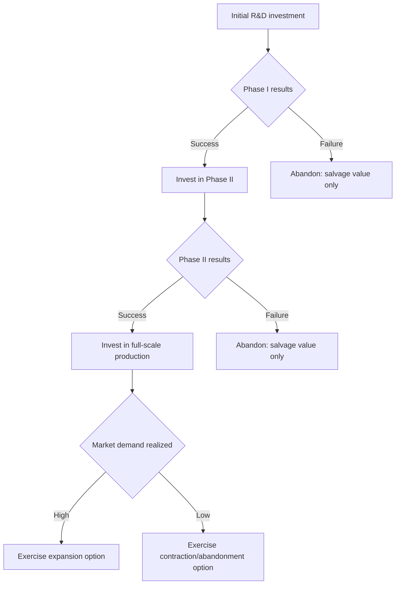

## Real Options in Corporate Investment

### Overview

Real options theory extends financial option-pricing concepts to investments in physical or intangible assets. Unlike traditional NPV analysis, which treats investment decisions as static, now-or-never commitments, real options recognize that managers possess valuable flexibility to adapt decisions as uncertainty resolves over time — flexibility that itself has economic value analogous to a financial option.

$$\text{Expanded (Strategic) NPV} = \text{Static NPV} + \text{Value of Real Options}$$

### Why Traditional NPV Understates Project Value

**Key Points**

- Standard discounted cash flow (DCF) analysis assumes a fixed, irreversible operating strategy over the project's life
- In reality, managers can expand, contract, delay, abandon, or switch uses of an investment in response to new information
- This managerial flexibility is valuable precisely because uncertainty exists — the greater the uncertainty, the more valuable the option to wait or adapt
- Ignoring this flexibility systematically undervalues projects, particularly in R&D, natural resources, and technology investments where uncertainty is high and decisions are staged

### The Options Analogy

Real options mirror the structure of financial options, mapping directly onto the Black-Scholes framework:

| Financial Call Option | Real Option Analog |
| --- | --- |
| Stock price ($S$) | Present value of expected project cash flows |
| Strike price ($K$) | Investment cost required to exercise |
| Time to expiration ($T$) | Time until the investment opportunity disappears |
| Volatility ($\sigma$) | Uncertainty over the value of underlying project cash flows |
| Risk-free rate ($r_f$) | Risk-free rate |
| Option value | Value of the flexibility (deferral, expansion, etc.) |

**Key Points**

- A project not yet undertaken but available for future investment resembles a **call option** on the underlying assets
- Higher volatility in project value *increases* real option value, in contrast to standard NPV, where volatility is typically treated as a risk to be penalized via a higher discount rate
- This is a critical conceptual departure: option-pricing logic treats uncertainty as an asset (source of upside optionality with downside protection via non-exercise), not purely a cost

### Types of Real Options

**Option to Delay (Deferral Option)**

The right, but not the obligation, to postpone investment until more information arrives (e.g., waiting to see how demand, prices, or regulation evolve before committing capital). Common in natural resource extraction (mineral rights, oil leases) and land development.

**Option to Expand**

The ability to scale up production or capacity if conditions turn favorable. Often embedded in the initial design of a project (e.g., building a factory with excess land or modular infrastructure that permits low-cost future expansion).

**Option to Contract or Abandon**

The right to reduce scale or exit a project entirely if conditions deteriorate, salvaging remaining value (equipment resale, asset repurposing) rather than continuing to sustain losses. Structurally analogous to a **put option** on the project's continuation value.

**Option to Switch (Flexibility Option)**

The ability to alter inputs (e.g., switching between fuel sources based on relative prices) or outputs (e.g., a flexible manufacturing plant producing different products depending on demand).

**Growth Options (Compound Options)**

Early-stage investments (e.g., a pilot plant, an initial R&D phase) that, if successful, create the right — but not the obligation — to make follow-on investments. These are especially significant in staged industries such as pharmaceuticals (Phase I/II/III trials), technology platforms, and mining exploration, where each stage is itself an option on the next.

### Decision Tree Representation

### Valuation Approaches

**1. Binomial (Lattice) Model**

The underlying asset value is modeled as moving up or down over discrete time steps, with the option value computed by backward induction from terminal payoffs.

$$u = e^{\sigma\sqrt{\Delta t}}, \quad d = \frac{1}{u}$$

$$p = \frac{e^{r_f \Delta t} - d}{u - d}$$

$$C_0 = e^{-r_f \Delta t}\left[p \cdot C_u + (1-p)\cdot C_d\right]$$

where $p$ is the risk-neutral probability of an up-move, and $C_u$, $C_d$ are option values in the up and down states. Backward induction proceeds node by node from expiration to the present, and at each node the model also checks whether early exercise (immediate investment) dominates continuation — a feature standard binomial models handle naturally, unlike the closed-form Black-Scholes formula.

**2. Black-Scholes-Merton Analogy**

For simple, single-stage European-style real options (deferral, single expansion), the Black-Scholes formula can be applied directly with the analog inputs above:

$$C = S_0 N(d_1) - Ke^{-r_f T}N(d_2)$$

$$d_1 = \frac{\ln(S_0/K) + (r_f + \sigma^2/2)T}{\sigma\sqrt{T}}, \quad d_2 = d_1 - \sigma\sqrt{T}$$

**Key Points**

- Black-Scholes assumes a single exercise date and no dividends (cash flow leakage); many real options are American-style (exercisable anytime) and involve "dividends" in the form of cash flows foregone by waiting, requiring adjustment or a lattice approach
- Estimating $\sigma$ (volatility of project value) is far more difficult for real assets than for traded securities, since there is no market price history; common approaches include using volatility of comparable public firms, Monte Carlo simulation of project cash flow drivers, or scenario-based standard deviation estimates [Inference: no single standard method dominates in practice; estimates vary considerably by methodology]

**3. Monte Carlo Simulation**

Simulates thousands of paths for underlying value drivers (prices, demand, costs) and models optimal exercise decisions along each path, averaging discounted payoffs. Particularly suited to path-dependent or multi-source-of-uncertainty options where closed-form or lattice methods become unwieldy.

**4. Decision Tree Analysis (DTA)**

A more accessible, if less rigorous, alternative: cash flows and probabilities are estimated at each decision node, and the tree is solved by backward induction using a (single) risk-adjusted discount rate rather than risk-neutral probabilities. DTA is easier to communicate to management but conflates the discount rate for risk across different types of decisions, which can bias results relative to formal option-pricing methods [Inference: this is a widely noted critique in the corporate finance literature, though DTA remains common in practice for its intuitive appeal].

### Worked Example: Option to Delay

A firm can invest $100 million today in a mining project, or wait one year to decide. Current estimated project value (PV of future cash flows) is $100 million, but this value is uncertain: in one year, it will either rise to $140 million or fall to $75 million, depending on commodity prices. Risk-free rate is 5%.

**Step 1: Static NPV (invest now)**

$$NPV_{now} = 100 - 100 = 0$$

Under naive NPV, the firm is indifferent.

**Step 2: Value the Option to Wait**

If the firm waits, it only invests if the up-state occurs:

- Up-state payoff: $\max(140 - 100, 0) = 40$
- Down-state payoff: $\max(75 - 100, 0) = 0$

**Step 3: Risk-Neutral Probability**

Assume up-factor $u = 1.40$, down-factor $d = 0.75$:

$$p = \frac{(1+0.05) - 0.75}{1.40 - 0.75} = \frac{0.30}{0.65} \approx 0.4615$$

**Step 4: Discount Expected Payoff**

$$C_0 = \frac{0.4615(40) + 0.5385(0)}{1.05} = \frac{18.46}{1.05} \approx 17.58$$

**Output**

The option to delay is worth approximately **$17.58 million**, even though the static NPV of investing immediately is zero. This demonstrates that the firm should **wait**, not invest now — a conclusion invisible to conventional NPV analysis alone.

### Real Options Value Drivers

<svg xmlns="http://www.w3.org/2000/svg" viewBox="0 0 640 340" font-family="sans-serif">
<text x="320" y="24" text-anchor="middle" font-size="15" font-weight="bold" fill="#1a1a1a">Sensitivity of Real Option Value (svg_diagram)</text>
<line x1="200" y1="50" x2="200" y2="290" stroke="#ccc" stroke-width="1" />
<text x="120" y="45" text-anchor="middle" font-size="12" font-weight="bold" fill="#333">Driver</text>
<text x="420" y="45" text-anchor="middle" font-size="12" font-weight="bold" fill="#333">Effect on Option Value</text>
<text x="120" y="80" text-anchor="middle" font-size="11" fill="#333">Uncertainty (σ) ↑</text>
<rect x="230" y="68" width="260" height="16" fill="#16a34a" />
<text x="360" y="80" text-anchor="middle" font-size="10" fill="white">Increases</text>
<text x="120" y="120" text-anchor="middle" font-size="11" fill="#333">Time to expiration ↑</text>
<rect x="230" y="108" width="220" height="16" fill="#16a34a" />
<text x="340" y="120" text-anchor="middle" font-size="10" fill="white">Increases</text>
<text x="120" y="160" text-anchor="middle" font-size="11" fill="#333">Underlying PV ↑</text>
<rect x="230" y="148" width="240" height="16" fill="#16a34a" />
<text x="350" y="160" text-anchor="middle" font-size="10" fill="white">Increases</text>
<text x="120" y="200" text-anchor="middle" font-size="11" fill="#333">Investment cost ↑</text>
<rect x="230" y="188" width="150" height="16" fill="#dc2626" />
<text x="305" y="200" text-anchor="middle" font-size="10" fill="white">Decreases</text>
<text x="120" y="240" text-anchor="middle" font-size="11" fill="#333">Risk-free rate ↑</text>
<rect x="230" y="228" width="180" height="16" fill="#16a34a" />
<text x="320" y="240" text-anchor="middle" font-size="10" fill="white">Increases (call)</text>
<text x="120" y="280" text-anchor="middle" font-size="11" fill="#333">Cash flow leakage ↑</text>
<rect x="230" y="268" width="150" height="16" fill="#dc2626" />
<text x="305" y="280" text-anchor="middle" font-size="10" fill="white">Decreases</text>
</svg>

### Applications by Industry

**Key Points**

- **Natural resources (oil, gas, mining):** Option to defer extraction until commodity prices are favorable; option to abandon marginal wells/mines
- **Pharmaceuticals/biotech:** Staged R&D as compound growth options across clinical trial phases
- **Technology/venture capital:** Platform investments that create follow-on option value (e.g., initial product enabling future feature expansion)
- **Real estate/infrastructure:** Option to develop land now vs. later; option to expand a facility incrementally
- **Manufacturing:** Flexible production technology enabling input/output switching in response to price changes

### Limitations and Critiques

**Key Points**

- **Volatility estimation difficulty:** Real assets lack the continuous market pricing of financial securities, making $\sigma$ inherently an estimate rather than an observable input
- **Market completeness assumption:** Option-pricing models assume the underlying risk is spanned by traded securities (replicable), which may not hold for idiosyncratic project-specific risks
- **Complexity and communication:** Formal option-pricing models can be difficult to explain to non-specialist decision-makers relative to standard NPV/IRR outputs
- **Overuse risk:** Real options reasoning can be misapplied to rationalize otherwise negative-NPV projects by invoking vague "strategic value," when much of that value may not meet the rigorous conditions (genuine flexibility, resolvable uncertainty, credible exercise decision) required for option logic to apply [Inference: this is a recognized practitioner and academic caution rather than a formal theorem]
- **Competitive erosion:** Standard option models assume the firm has exclusive rights to the opportunity; in competitive markets, waiting to exercise a deferral option risks a competitor pre-empting the investment, which can reduce or eliminate the option's practical value

### Real Options vs. Traditional NPV: Summary Comparison

| Dimension | Traditional NPV | Real Options |
| --- | --- | --- |
| Treatment of uncertainty | Penalized via discount rate | Source of option value |
| Decision timing | Fixed, now-or-never | Flexible, contingent on information |
| Managerial flexibility | Not valued | Explicitly valued |
| Best suited for | Simple, low-uncertainty, reversible projects | Staged, high-uncertainty, irreversible investments with embedded flexibility |
| Computational complexity | Low | Moderate to high |

### Related Topics

- Black-Scholes-Merton option pricing model
- Binomial lattice methods for option valuation
- Risk-neutral valuation and the replicating portfolio approach
- Decision tree analysis in capital budgeting
- Net present value and capital budgeting fundamentals
- Monte Carlo simulation for project valuation
- Staged financing and compound options in venture capital
- Volatility estimation techniques for non-traded assets
- Competitive strategy and preemption in option exercise timing
- Weighted Average Cost of Capital (WACC) vs. risk-neutral pricing frameworks