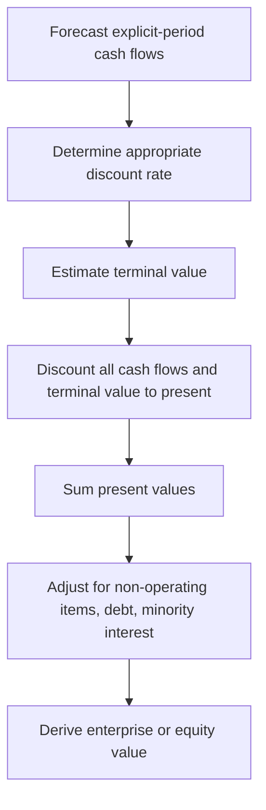

## Discounted Cash Flow Valuation

### Overview

Discounted cash flow (DCF) valuation estimates the intrinsic value of an asset, project, or firm by projecting its future cash flows and discounting them to present value at a rate reflecting their risk. It is the foundational valuation methodology in corporate finance, underlying capital budgeting, equity valuation, M&A analysis, and fairness opinions.

$$V_0 = \sum_{t=1}^{n} \frac{CF_t}{(1+r)^t} + \frac{TV_n}{(1+r)^n}$$

where $V_0$ is present value, $CF_t$ is the cash flow in period $t$, $r$ is the discount rate, and $TV_n$ is the terminal value at the end of the explicit forecast horizon.

### Core Steps in DCF Valuation

### Choice of Cash Flow Measure

**Free Cash Flow to the Firm (FCFF)**

Represents cash available to all capital providers (debt and equity holders) before financing effects.

$$FCFF = EBIT(1-T) + Depreciation \& Amortization - CapEx - \Delta NWC$$

Alternative derivation from net income:

$$FCFF = NI + Interest(1-T) + D\&A - CapEx - \Delta NWC$$

FCFF is discounted at the **WACC**, producing **enterprise value (EV)**.

**Free Cash Flow to Equity (FCFE)**

Represents cash available to common equity holders after debt obligations.

$$FCFE = FCFF - Interest(1-T) + Net\ Borrowing$$

Or directly from net income:

$$FCFE = NI + D\&A - CapEx - \Delta NWC + Net\ Borrowing$$

FCFE is discounted at the **cost of equity** $r_E$, producing **equity value** directly.

**Key Points**

- FCFF/WACC and FCFE/$r_E$ should, in principle, yield consistent equity values once enterprise value is adjusted for net debt — discrepancies typically indicate an inconsistency in assumptions (e.g., mismatched leverage between WACC and FCFE growth)
- FCFF is generally preferred when capital structure is expected to change materially, since WACC-based valuation more cleanly separates operating performance from financing decisions
- Dividends can also be discounted directly (Dividend Discount Model), a special case appropriate when dividends closely track free cash flow, such as for stable, mature financial institutions

### Determining the Discount Rate

**For FCFF: Weighted Average Cost of Capital (WACC)**

$$WACC = \frac{E}{V}r_E + \frac{D}{V}r_D(1-T)$$

**For FCFE: Cost of Equity via CAPM**

$$r_E = r_f + \beta(r_m - r_f)$$

**Key Points**

- $\beta$ should reflect the target capital structure; when using comparable-company betas, the standard approach is to unlever each comparable's beta, average the unlevered (asset) betas, then relever at the target firm's capital structure
- Unlevering formula (Hamada equation, no-tax-shield-risk assumption): $\beta_U = \dfrac{\beta_L}{1 + (1-T)\frac{D}{E}}$
- The discount rate and cash flow definitions must be internally consistent (nominal cash flows discounted at nominal rates; real cash flows at real rates; FCFF at WACC; FCFE at $r_E$)

### Terminal Value Estimation

Because forecasting cash flows indefinitely is impractical, DCF models typically split the horizon into an explicit forecast period (commonly 5–10 years) followed by a terminal value capturing all subsequent cash flows.

**1. Gordon Growth (Perpetuity) Method**

$$TV_n = \frac{CF_{n+1}}{r-g} = \frac{CF_n(1+g)}{r-g}$$

where $g$ is the perpetual growth rate, which must be less than $r$ and is typically capped near the long-run nominal GDP growth rate or inflation rate for conservatism.

**2. Exit Multiple Method**

$$TV_n = \text{Metric}_n \times \text{Multiple}$$

using a multiple (e.g., EV/EBITDA) derived from comparable company trading multiples or precedent transactions, applied to the terminal year's financial metric.

**Key Points**

- Terminal value frequently represents 60–80% or more of total DCF value in a standard 5-year explicit forecast, making its assumptions disproportionately influential [Inference: the exact proportion varies significantly by industry, growth stage, and discount rate, but this dominance is a widely cited practical concern]
- The Gordon Growth method is theoretically cleaner (internally consistent with a DCF framework) but highly sensitive to the $(r-g)$ spread; small changes in $g$ near $r$ cause large swings in terminal value
- The exit multiple method anchors to observable market pricing but implicitly imports current market sentiment and comparable-company assumptions into an otherwise intrinsic valuation, and should be cross-checked for consistency with the implied perpetuity growth rate

### Worked Example: FCFF-Based Enterprise Valuation

A firm has current-year EBIT of $50 million, tax rate 25%, D&A of $8 million, CapEx of $12 million, and $\Delta NWC$ of $3 million. Revenue and EBIT are projected to grow 8% annually for 5 years, then FCFF grows at a perpetual rate of 3%. WACC is 9%.

**Step 1: Base-Year FCFF**

$$FCFF_0 = 50(1-0.25) + 8 - 12 - 3 = 37.5 + 8 - 12 - 3 = 30.5$$

**Step 2: Project FCFF (8% growth), Years 1–5**

| Year | FCFF ($M) |
| --- | --- |
| 1 | $30.5 \times 1.08 = 32.94$ |
| 2 | $32.94 \times 1.08 = 35.58$ |
| 3 | $35.58 \times 1.08 = 38.43$ |
| 4 | $38.43 \times 1.08 = 41.51$ |
| 5 | $41.51 \times 1.08 = 44.83$ |

**Step 3: Terminal Value (Gordon Growth, at end of Year 5)**

$$TV_5 = \frac{44.83 \times 1.03}{0.09 - 0.03} = \frac{46.17}{0.06} \approx 769.5$$

**Step 4: Discount Explicit Cash Flows and Terminal Value at WACC = 9%**

| Year | Cash Flow | PV Factor | PV |
| --- | --- | --- | --- |
| 1 | 32.94 | 0.9174 | 30.22 |
| 2 | 35.58 | 0.8417 | 29.94 |
| 3 | 38.43 | 0.7722 | 29.68 |
| 4 | 41.51 | 0.7084 | 29.41 |
| 5 | 44.83 + 769.5 = 814.33 | 0.6499 | 529.2 |

**Step 5: Sum**

$$EV \approx 30.22 + 29.94 + 29.68 + 29.41 + 529.2 \approx 648.5 \text{ million}$$

**Output**

Implied **Enterprise Value ≈ $648.5 million**. To derive equity value, subtract net debt (total debt less cash and equivalents) and any minority interest or preferred equity claims.

### From Enterprise Value to Equity Value

$$\text{Equity Value} = EV - \text{Total Debt} + \text{Cash \& Equivalents} - \text{Minority Interest} - \text{Preferred Stock}$$

$$\text{Implied Share Price} = \frac{\text{Equity Value}}{\text{Diluted Shares Outstanding}}$$

### DCF Sensitivity Structure

DCF outputs are highly sensitive to two parameters in particular: the discount rate and the terminal growth rate (or exit multiple). A sensitivity (two-way data) table is standard practice.

<svg xmlns="http://www.w3.org/2000/svg" viewBox="0 0 640 320" font-family="sans-serif">
<text x="320" y="24" text-anchor="middle" font-size="15" font-weight="bold" fill="#1a1a1a">DCF Sensitivity: EV vs. WACC and Terminal Growth (svg_diagram)</text>
<g font-size="11" fill="#333">
<rect x="60" y="50" width="520" height="220" fill="none" stroke="#333" stroke-width="1" />
<text x="320" y="45" text-anchor="middle" font-weight="bold">Terminal Growth Rate (g)</text>
<text x="30" y="160" text-anchor="middle" transform="rotate(-90 30 160)" font-weight="bold">WACC</text>
<line x1="190" y1="50" x2="190" y2="270" stroke="#ddd" />
<line x1="320" y1="50" x2="320" y2="270" stroke="#ddd" />
<line x1="450" y1="50" x2="450" y2="270" stroke="#ddd" />
<line x1="60" y1="105" x2="580" y2="105" stroke="#ddd" />
<line x1="60" y1="160" x2="580" y2="160" stroke="#ddd" />
<line x1="60" y1="215" x2="580" y2="215" stroke="#ddd" />
<text x="125" y="65" text-anchor="middle">2%</text>
<text x="255" y="65" text-anchor="middle">3%</text>
<text x="385" y="65" text-anchor="middle">4%</text>
<text x="515" y="65" text-anchor="middle">5%</text>
<text x="70" y="80" text-anchor="start">8%</text>
<text x="70" y="135" text-anchor="start">9%</text>
<text x="70" y="190" text-anchor="start">10%</text>
<text x="70" y="245" text-anchor="start">11%</text>
<text x="125" y="90" text-anchor="middle" fill="#16a34a">712</text>
<text x="255" y="90" text-anchor="middle" fill="#16a34a">745</text>
<text x="385" y="90" text-anchor="middle" fill="#16a34a">788</text>
<text x="515" y="90" text-anchor="middle" fill="#16a34a">846</text>
<text x="125" y="145" text-anchor="middle">620</text>
<text x="255" y="145" text-anchor="middle">648</text>
<text x="385" y="145" text-anchor="middle">683</text>
<text x="515" y="145" text-anchor="middle">728</text>
<text x="125" y="200" text-anchor="middle">545</text>
<text x="255" y="200" text-anchor="middle">567</text>
<text x="385" y="200" text-anchor="middle">594</text>
<text x="515" y="200" text-anchor="middle">628</text>
<text x="125" y="255" text-anchor="middle" fill="#dc2626">483</text>
<text x="255" y="255" text-anchor="middle" fill="#dc2626">500</text>
<text x="385" y="255" text-anchor="middle" fill="#dc2626">521</text>
<text x="515" y="255" text-anchor="middle" fill="#dc2626">547</text>
</g>
</svg>

*[Note: Illustrative sensitivity values shown for structural demonstration purposes, not derived from a live recalculation of the worked example above.]*

### DCF Variants and Related Methods

| Method | Discounted Item | Discount Rate | Best Suited For |
| --- | --- | --- | --- |
| **FCFF / Enterprise DCF** | Free cash flow to firm | WACC | Firms with changing or complex capital structure |
| **FCFE / Equity DCF** | Free cash flow to equity | Cost of equity | Firms with stable, targeted leverage |
| **Dividend Discount Model (DDM)** | Dividends | Cost of equity | Mature, dividend-paying firms (esp. financials) |
| **Adjusted Present Value (APV)** | Unlevered FCF + financing side effects | Unlevered cost of capital + separate discount for tax shields | Firms with changing leverage over time, LBOs |
| **Residual Income Model** | Economic (residual) income | Cost of equity | Firms with unreliable near-term FCF (e.g., high-CapEx growth firms) |

**Adjusted Present Value (APV) Note:** APV separates the value of the unlevered firm from the value of financing side effects (primarily the interest tax shield), which is often preferred in leveraged buyout (LBO) analysis or situations with a changing debt schedule, since a single constant WACC becomes an inappropriate simplification when leverage varies significantly over the projection period.

### Strengths and Limitations of DCF

**Key Points — Strengths**

- Grounded in fundamental cash-generating capacity rather than market sentiment or comparable pricing
- Explicit, transparent, and auditable assumptions
- Flexible enough to incorporate firm-specific operating and strategic detail

**Key Points — Limitations**

- Highly sensitive to terminal value assumptions, which are inherently the most speculative component of the model
- Requires numerous long-horizon forecasts (growth, margins, CapEx, working capital) that carry substantial estimation uncertainty [Inference: forecast reliability generally deteriorates further into the projection horizon, though the degree varies by industry stability]
- Does not directly capture managerial flexibility (see real options analysis as a complement)
- Garbage-in-garbage-out risk: small input changes compound across a multi-year forecast and terminal value
- Should be triangulated against relative valuation (comparable company multiples, precedent transactions) rather than relied upon in isolation

### Cross-Checking a DCF

Standard practice is to validate a DCF's implied terminal multiple and to compare the resulting valuation against:

- Comparable company trading multiples (EV/EBITDA, EV/Revenue, P/E)
- Precedent M&A transaction multiples
- Implied perpetuity growth rate embedded in an exit-multiple-based terminal value (and vice versa)
- Football field / valuation summary charts overlaying multiple methodologies

### Related Topics

- Weighted Average Cost of Capital (WACC) estimation
- Capital Asset Pricing Model (CAPM) and cost of equity
- Terminal value methodologies and the Gordon Growth Model
- Comparable company and precedent transaction analysis
- Adjusted Present Value (APV) and leveraged buyout valuation
- Free cash flow forecasting and pro forma financial modeling
- Net present value and capital budgeting
- Real options in corporate investment
- Sensitivity and scenario analysis in financial modeling
- Beta unlevering and relevering (Hamada equation)