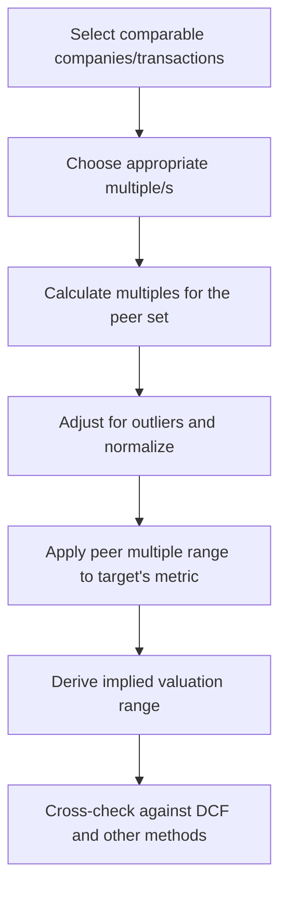

## Relative Valuation and Trading Multiples

### Overview

Relative valuation estimates an asset's value by comparing it to similar assets using standardized ratios, or **multiples**, rather than projecting and discounting cash flows directly. The core premise is the **law of one price**: similar assets generating similar cash flows, growth, and risk should trade at similar valuation multiples. It is widely used alongside DCF valuation as a market-based cross-check and is the dominant methodology in equity research, M&A fairness opinions, and IPO pricing.

$$\text{Implied Value} = \text{Comparable Multiple} \times \text{Target's Financial Metric}$$

### Core Steps in Relative Valuation

### Categories of Multiples

**Equity Value Multiples**

Numerator is equity value (market capitalization); denominator is an equity-level metric (net income, book value, etc.). These are affected by capital structure differences across firms.

- **Price-to-Earnings (P/E):** $\dfrac{\text{Share Price}}{\text{EPS}} = \dfrac{\text{Equity Value}}{\text{Net Income}}$
- **Price-to-Book (P/B):** $\dfrac{\text{Equity Value}}{\text{Book Value of Equity}}$
- **Price-to-Sales (P/S):** $\dfrac{\text{Equity Value}}{\text{Revenue}}$
- **Price/Earnings-to-Growth (PEG):** $\dfrac{P/E}{\text{Expected EPS Growth Rate (\%)}}$

**Enterprise Value Multiples**

Numerator is enterprise value (capital-structure-neutral); denominator is a pre-financing metric. Preferred for comparing firms with differing leverage.

- **EV/EBITDA:** $\dfrac{EV}{EBITDA}$ — the most widely used multiple, as it is unaffected by depreciation policy and capital structure
- **EV/EBIT:** $\dfrac{EV}{EBIT}$ — accounts for differences in capital intensity (D&A) across firms
- **EV/Revenue (EV/Sales):** $\dfrac{EV}{\text{Revenue}}$ — useful for early-stage or negative-earnings companies
- **EV/Invested Capital:** used in capital-intensive industries as a proxy for return on capital comparisons

**Industry-Specific / Operating Multiples**

Used when standard financial multiples are less meaningful (e.g., pre-revenue or asset-heavy businesses):

- EV/EBITDAR (hospitality, airlines — adds back rent)
- EV/Subscribers or EV/Monthly Active Users (SaaS, media, telecom)
- EV/Proved Reserves (oil & gas)
- Price/Assets Under Management (asset managers)
- EV/Square Foot or EV/Bed (real estate, healthcare facilities)

### Enterprise Value Bridge

$$EV = \text{Market Cap} + \text{Total Debt} + \text{Minority Interest} + \text{Preferred Equity} - \text{Cash \& Equivalents}$$

**Key Points**

- EV represents the total value of the firm's operations, claimable by all capital providers, independent of how the firm is financed
- Equity multiples (P/E, P/B) are appropriate for comparing firms with similar capital structures, or in industries (e.g., banks, insurers) where leverage is integral to the business model and enterprise value is not a meaningful construct
- EV multiples are generally preferred for cross-company comparisons because they neutralize capital structure differences, allowing an apples-to-apples comparison of operating performance

### Selecting Comparable Companies

**Key Points — Screening Criteria**

- **Industry and business model:** Same or closely related sector, similar products/services, similar customer base
- **Size:** Comparable revenue, market capitalization, or enterprise value (multiples often scale with size due to liquidity and diversification effects)
- **Growth profile:** Similar historical and projected growth rates (a key driver of P/E and other earnings multiples)
- **Profitability and margins:** Comparable margin structure, since multiples embed profitability expectations
- **Geography:** Similar market exposure (developed vs. emerging markets carry different risk premia)
- **Capital structure and risk:** Similar leverage, particularly when using equity multiples

A typical comparable company set includes 5–10 peer firms; a smaller set risks idiosyncratic distortion, while an overly broad set risks including firms that are not truly comparable [Inference: this range reflects common equity research and investment banking practice conventions rather than a universal rule].

### Calculating and Normalizing Multiples

**Adjustments for Comparability**

- **Non-recurring items:** Exclude one-time charges, restructuring costs, litigation settlements, and asset impairments from earnings-based metrics
- **Calendarization:** Align fiscal year-ends across peers with differing reporting periods to a common calendar basis
- **Operating leases:** Under modern lease accounting standards (e.g., ASC 842/IFRS 16), most operating leases are capitalized on the balance sheet, which affects EV and EBITDA comparability across firms with differing lease-vs-buy policies
- **Minority interests and equity-method investments:** Adjust EBITDA/EBIT to exclude income from non-consolidated affiliates unless the associated enterprise value component is added back consistently
- **Stock-based compensation:** Analysts differ on whether to treat as a cash or non-cash expense; consistency across the peer set is essential regardless of the convention chosen

**Statistical Aggregation**

- Report the **mean**, **median**, and **quartile range** (25th–75th percentile) of peer multiples rather than relying on a single point estimate
- The median is generally preferred over the mean for the central estimate, as it is less sensitive to outliers from unusually high- or low-multiple peers

### Worked Example: EV/EBITDA-Based Valuation

A target company has trailing EBITDA of $40 million. Five comparable public companies trade at the following EV/EBITDA multiples:

| Comparable | EV/EBITDA |
| --- | --- |
| Company A | 8.2x |
| Company B | 9.5x |
| Company C | 7.8x |
| Company D | 10.1x |
| Company E | 8.9x |

**Step 1: Aggregate Statistics**

Mean $= (8.2+9.5+7.8+10.1+8.9)/5 = 8.9x$

Median $= 8.9x$

**Step 2: Apply to Target**

$$EV_{implied} = 8.9 \times 40 = 356 \text{ million (using median)}$$

Using the full range (7.8x–10.1x):

$$EV_{low} = 7.8 \times 40 = 312, \quad EV_{high} = 10.1 \times 40 = 404$$

**Step 3: Convert to Equity Value**

Assuming the target has $60 million in net debt:

$$\text{Equity Value} = 356 - 60 = 296 \text{ million (midpoint estimate)}$$

**Output**

Implied Enterprise Value range: **$312 million – $404 million**, with a point estimate of **$356 million** (median multiple). Implied Equity Value ≈ **$296 million** at the midpoint.

### Precedent Transaction Analysis

A related relative valuation method that applies multiples derived from **historical M&A transactions** involving comparable target companies, rather than current public trading multiples.

**Key Points**

- Transaction multiples typically embed a **control premium**, reflecting the value of acquiring a controlling stake (synergies, strategic control), making them generally higher than trading multiples for otherwise similar companies
- Useful specifically for M&A valuation contexts (fairness opinions, negotiating a sale price) since they reflect actual prices paid, not merely quoted market prices
- Limitations: transaction data can be stale (deal environment, interest rates, and sentiment shift over time), deal terms are sometimes not fully disclosed, and sample sizes for closely comparable transactions are often small

### Trading Comps vs. Transaction Comps vs. DCF

| Dimension | Trading Comps | Precedent Transactions | DCF |
| --- | --- | --- | --- |
| Basis | Current public market pricing | Historical M&A deal pricing | Intrinsic cash flow projection |
| Includes control premium | No | Yes | No (unless explicitly added) |
| Reflects current market sentiment | Yes | Partially (dated) | No (in theory) |
| Data availability | High (liquid public markets) | Variable, often limited disclosure | N/A (model-driven) |
| Typical use | Public market valuation, IPO pricing | M&A pricing, fairness opinions | Intrinsic value, LBO/DCF cross-check |

### Football Field Chart Concept

Investment bankers commonly present a **"football field"** chart summarizing the implied valuation ranges from multiple methodologies (DCF, trading comps, precedent transactions, 52-week trading range, LBO analysis) side by side as horizontal bars, allowing decision-makers to visually triangulate a reasonable valuation range.

<svg xmlns="http://www.w3.org/2000/svg" viewBox="0 0 640 320" font-family="sans-serif">
<text x="320" y="24" text-anchor="middle" font-size="15" font-weight="bold" fill="#1a1a1a">Football Field: Valuation Summary (svg_diagram)</text>
<line x1="140" y1="50" x2="140" y2="280" stroke="#999" stroke-width="1" />
<line x1="280" y1="50" x2="280" y2="280" stroke="#999" stroke-width="1" />
<line x1="420" y1="50" x2="420" y2="280" stroke="#999" stroke-width="1" />
<line x1="560" y1="50" x2="560" y2="280" stroke="#999" stroke-width="1" />
<text x="140" y="45" text-anchor="middle" font-size="10">\$250M</text>
<text x="280" y="45" text-anchor="middle" font-size="10">\$350M</text>
<text x="420" y="45" text-anchor="middle" font-size="10">\$450M</text>
<text x="560" y="45" text-anchor="middle" font-size="10">\$550M</text>
<text x="80" y="80" font-size="11" text-anchor="end">DCF</text>
<rect x="230" y="65" width="180" height="24" fill="#2563eb" />
<text x="80" y="130" font-size="11" text-anchor="end">Trading Comps</text>
<rect x="200" y="115" width="140" height="24" fill="#16a34a" />
<text x="80" y="180" font-size="11" text-anchor="end">Precedent Trans.</text>
<rect x="330" y="165" width="170" height="24" fill="#d97706" />
<text x="80" y="230" font-size="11" text-anchor="end">52-Wk Trading</text>
<rect x="180" y="215" width="150" height="24" fill="#7c3aed" />
</svg>

### Common Pitfalls in Relative Valuation

**Key Points**

- **Poor comparable selection:** Including peers with materially different growth, margin, or risk profiles distorts the implied valuation
- **Market-wide mispricing:** Relative valuation assumes the comparable set is itself fairly valued; if the entire peer group or sector is over/undervalued (e.g., during a bubble), the target's implied valuation inherits that mispricing
- **Ignoring accounting differences:** Differing depreciation methods, inventory accounting (FIFO/LIFO), lease treatment, or R&D capitalization policies across peers can distort multiples if not adjusted for
- **Circular logic risk:** Applying a peer multiple that itself was derived from a DCF-based analyst consensus can understate the independence of a "market-based" cross-check
- **Small sample sensitivity:** With few comparables, one outlier can skew the median or mean significantly
- **Static snapshot:** Trading multiples reflect a point-in-time market view and can shift materially with changes in interest rates, sector sentiment, or macroeconomic conditions

### Related Topics

- Discounted cash flow valuation
- Enterprise value vs. equity value reconciliation
- Precedent transaction analysis and control premiums
- Leveraged buyout (LBO) valuation
- Comparable company screening methodology
- Football field valuation summary construction
- Capital structure normalization and lease accounting adjustments (ASC 842/IFRS 16)
- Sum-of-the-parts (SOTP) valuation for diversified firms
- Initial public offering (IPO) pricing methodology
- Fairness opinions in M&A transactions