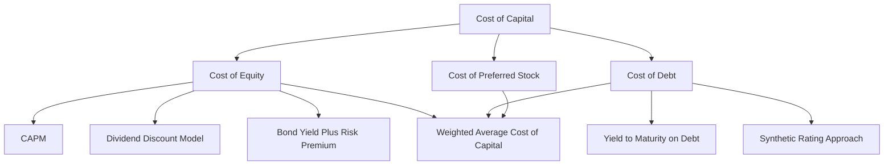

## Estimating the Cost of Capital

### Overview

The cost of capital represents the minimum required rate of return that compensates investors for the risk of providing funds to a firm or project. It serves as the discount rate in DCF valuation, the hurdle rate in capital budgeting, and a benchmark for evaluating whether a firm is creating or destroying economic value. Estimating it accurately requires separately deriving the cost of each capital source and combining them according to the firm's target financing mix.

### Components of the Cost of Capital

### Cost of Equity: Capital Asset Pricing Model (CAPM)

The most widely used approach to estimating the cost of equity.

$$r_E = r_f + \beta(r_m - r_f)$$

where $r_f$ is the risk-free rate, $\beta$ measures systematic (non-diversifiable) risk relative to the market, and $(r_m - r_f)$ is the **equity risk premium (ERP)**.

**Estimating the Risk-Free Rate ($r_f$)**

**Key Points**

- Typically proxied by the yield on long-term government bonds (e.g., 10-year or 30-year Treasury yield in the U.S.) matching the duration of the projected cash flows
- Should be denominated in the same currency as the projected cash flows to maintain internal consistency
- Using a short-term rate (e.g., T-bill) introduces reinvestment rate mismatch with long-duration cash flow projections and is generally discouraged for long-horizon valuation

**Estimating Beta ($\beta$)**

Beta measures the sensitivity of a stock's returns to overall market returns, typically estimated via regression:

$$R_{i,t} = \alpha + \beta R_{m,t} + \epsilon_t$$

- **Historical (regression) beta:** Regress the firm's historical stock returns against a market index (e.g., 2–5 years of monthly or weekly data)
- **Bottom-up (unlevered/relevered) beta:** Average the unlevered betas of comparable public companies, then relever at the target firm's capital structure — generally preferred for private companies, newly public firms, or firms with unstable capital structures, since it draws on a broader sample and reduces estimation noise from any single firm's regression

$$\beta_U = \frac{\beta_L}{1 + (1-T)\frac{D}{E}} \quad \text{(unlevering, Hamada formula)}$$

$$\beta_L = \beta_U\left[1 + (1-T)\frac{D}{E}\right] \quad \text{(relevering at target capital structure)}$$

**Key Points**

- Regression betas are sensitive to the estimation window, return frequency, and choice of market index, often producing meaningfully different results across data providers [Inference: this sensitivity is a well-documented empirical observation, though the degree varies by data source and methodology]
- Adjusted (Bloomberg-style) beta: $\beta_{adj} = \frac{2}{3}\beta_{raw} + \frac{1}{3}(1.0)$, which shrinks the estimate toward the market average of 1.0, reflecting the empirical tendency of betas to mean-revert over time

**Estimating the Equity Risk Premium (ERP)**

- **Historical ERP:** Average realized excess return of equities over risk-free bonds over a long historical sample (varies by country, sample period, and arithmetic vs. geometric averaging convention)
- **Implied (forward-looking) ERP:** Derived from current market pricing (e.g., solving for the discount rate that equates the market index level to the present value of expected aggregate dividends/cash flows)
- **Survey-based ERP:** Aggregated estimates from academic and practitioner surveys

**Key Points**

- Choice of ERP materially affects the cost of equity and is one of the most debated inputs in valuation practice; commonly cited long-run U.S. ERP estimates have historically clustered in a broad range depending on methodology and period [Unverified: specific current point estimates should be sourced from up-to-date market data, as ERP estimates shift with market conditions]

### Alternative Cost of Equity Methods

**Dividend Discount Model (DDM) / Gordon Growth Approach**

$$r_E = \frac{D_1}{P_0} + g$$

where $D_1$ is the expected next-period dividend, $P_0$ is current price, and $g$ is the expected perpetual dividend growth rate. Best suited to stable, mature, dividend-paying firms where growth assumptions are reasonably reliable.

**Bond Yield Plus Risk Premium**

$$r_E = r_{d} + \text{Equity Risk Premium (firm-specific)}$$

Adds a subjective risk premium (commonly 3–5%) to the firm's own cost of debt, used as a rough sanity check or for firms where CAPM inputs are unreliable [Inference: the specific premium range is a common rule-of-thumb convention rather than a precisely derived figure].

**Fama-French Multi-Factor Models**

Extends CAPM with additional risk factors beyond market beta:

$$r_E = r_f + \beta_{MKT}(r_m - r_f) + \beta_{SMB}(SMB) + \beta_{HML}(HML)$$

where $SMB$ (small-minus-big) captures the size premium and $HML$ (high-minus-low) captures the value premium. More recent extensions (e.g., five-factor models) add profitability and investment factors. Used primarily in academic asset pricing and by sophisticated institutional investors; less common in standard corporate valuation practice.

### Cost of Debt

**Key Points**

- **Yield to maturity (YTM) approach:** Use the current market yield on the firm's outstanding traded debt, which reflects the market's current assessment of default risk
- **Synthetic rating approach:** For firms without actively traded debt, estimate a synthetic credit rating from financial ratios (e.g., interest coverage ratio) and apply the yield spread typically associated with that rating category
- **After-tax adjustment:** Because interest expense is tax-deductible, the relevant cost of debt for WACC purposes is the after-tax cost: $r_D(1-T)$
- Book value of debt is commonly used as a proxy for market value when debt trades near par or market pricing is unavailable, though market value is theoretically preferred when materially different from book value

$$\text{Interest Coverage Ratio} = \frac{EBIT}{\text{Interest Expense}}$$

Higher interest coverage generally corresponds to a higher (safer) synthetic credit rating and a lower implied cost of debt.

### Cost of Preferred Stock

$$r_P = \frac{D_P}{P_P}$$

where $D_P$ is the annual preferred dividend and $P_P$ is the current market price of preferred stock (or net issuance proceeds, for a newly issued security).

### Weighted Average Cost of Capital (WACC)

$$WACC = \frac{E}{V}r_E + \frac{D}{V}r_D(1-T) + \frac{P}{V}r_P$$

where $V = E + D + P$ (market values of equity, debt, and preferred stock).

**Key Points**

- **Market values, not book values**, should be used for weighting whenever possible, since WACC represents the current opportunity cost of capital to investors
- **Target capital structure**, rather than current structure, is theoretically preferred when the firm's financing mix is expected to shift materially, since WACC should reflect the risk profile of future cash flows
- WACC is appropriate as the discount rate only when the project or firm being valued has similar business risk and financing mix to that used in the WACC calculation

### Worked Example: Full WACC Calculation

A firm has:

- Market capitalization (E) = $800 million
- Total debt (D) = $400 million (market value ≈ book value)
- No preferred stock
- Risk-free rate $r_f$ = 4.0%
- Equity risk premium = 5.5%
- Levered beta $\beta_L$ = 1.15
- Pre-tax cost of debt $r_D$ = 6.0% (based on YTM of outstanding bonds)
- Tax rate $T$ = 25%

**Step 1: Cost of Equity (CAPM)**

$$r_E = 4.0\% + 1.15(5.5\%) = 4.0\% + 6.325\% = 10.325\%$$

**Step 2: After-Tax Cost of Debt**

$$r_D(1-T) = 6.0\%(1-0.25) = 4.5\%$$

**Step 3: Capital Weights**

$$V = 800 + 400 = 1{,}200$$

$$\frac{E}{V} = \frac{800}{1200} = 0.667, \quad \frac{D}{V} = \frac{400}{1200} = 0.333$$

**Step 4: WACC**

$$WACC = 0.667(10.325\%) + 0.333(4.5\%) = 6.887\% + 1.499\% = 8.386\%$$

**Output**

$WACC \approx 8.39\%$, the appropriate discount rate for this firm's average-risk projects funded with its target capital structure.

### Sensitivity of WACC to Capital Structure

<svg xmlns="http://www.w3.org/2000/svg" viewBox="0 0 640 340" font-family="sans-serif">
<text x="320" y="24" text-anchor="middle" font-size="15" font-weight="bold" fill="#1a1a1a">WACC vs. Leverage (svg_diagram)</text>
<line x1="70" y1="290" x2="600" y2="290" stroke="#333" stroke-width="1.5" />
<line x1="70" y1="50" x2="70" y2="290" stroke="#333" stroke-width="1.5" />
<text x="335" y="320" text-anchor="middle" font-size="12" fill="#333">Debt-to-Value Ratio (D/V)</text>
<text x="25" y="170" text-anchor="middle" font-size="12" fill="#333" transform="rotate(-90 25 170)">Cost of Capital (%)</text>
<path d="M 100 130 L 560 90" stroke="#dc2626" stroke-width="2" fill="none" stroke-dasharray="5,3" />
<text x="565" y="88" font-size="10" fill="#dc2626">Cost of Equity</text>
<path d="M 100 220 L 560 240" stroke="#16a34a" stroke-width="2" fill="none" stroke-dasharray="5,3" />
<text x="565" y="243" font-size="10" fill="#16a34a">After-tax Cost of Debt</text>
<path d="M 100 175 Q 300 155 400 165 Q 500 185 560 220" stroke="#2563eb" stroke-width="2.5" fill="none" />
<text x="565" y="218" font-size="10" fill="#2563eb">WACC</text>
<text x="90" y="305" font-size="10" fill="#333">0%</text>
<text x="580" y="305" font-size="10" fill="#333">80%</text>
</svg>

**Key Points**

- As leverage increases, the cost of equity rises (reflecting increased financial risk borne by shareholders — Modigliani-Miller Proposition II), while the after-tax cost of debt may stay relatively flat at low leverage and rise as default risk increases at high leverage
- WACC often exhibits a U-shape or gradual decline-then-rise pattern as leverage increases, consistent with trade-off theory: initial leverage lowers WACC via the tax shield, until financial distress costs begin to dominate
- This relationship underlies the theoretical concept of an **optimal capital structure** that minimizes WACC (see Modigliani-Miller theorems and trade-off theory)

### Special Considerations

**Private Companies and Divisions**

- No directly observable stock price or beta; requires the bottom-up (comparable company) beta approach
- May require a **size premium** or **illiquidity discount** added to the CAPM-derived cost of equity, reflecting the additional risk and lower marketability of private/small-cap investments [Inference: the application and magnitude of size premia remain debated in academic and practitioner literature]

**Multinational Firms and Country Risk**

- Cash flows generated in higher-risk jurisdictions may warrant a **country risk premium (CRP)** added to the discount rate, or alternatively be captured by adjusting cash flow projections for country-specific risk (adjusting the discount rate and the cash flows for the same risk simultaneously double-counts the effect and should be avoided)
- Currency denomination of the discount rate must match the currency of the projected cash flows (nominal local-currency cash flows require a local-currency nominal discount rate)

**Project-Specific vs. Firm-Wide Discount Rates**

- Using a single firm-wide WACC across all projects biases the firm toward accepting high-risk projects (whose true required return exceeds WACC) and rejecting low-risk projects (whose true required return is below WACC)
- Divisional or project-specific costs of capital, often derived via pure-play comparable betas for that business line, are theoretically preferable when a firm operates across meaningfully different risk segments

### Common Pitfalls in Estimating Cost of Capital

**Key Points**

- Using book value weights instead of market value weights for WACC
- Mismatching nominal/real or currency-denomination between cash flows and the discount rate
- Applying a single firm-wide WACC to projects or divisions with materially different risk profiles
- Failing to unlever and relever beta when using comparable companies with different capital structures
- Double-counting risk by adjusting both the discount rate and the cash flows for the same risk factor
- Using stale or inappropriately short-duration risk-free rate proxies relative to the cash flow horizon

### Related Topics

- Capital Asset Pricing Model (CAPM) and systematic risk
- Weighted Average Cost of Capital (WACC) application in DCF
- Beta estimation, unlevering, and relevering (Hamada equation)
- Modigliani-Miller theorems and capital structure theory
- Equity risk premium estimation methodologies
- Fama-French multi-factor asset pricing models
- Credit ratings and synthetic rating estimation
- Country risk premium in international valuation
- Adjusted Present Value (APV) as an alternative to WACC-based valuation
- Trade-off theory and optimal capital structure