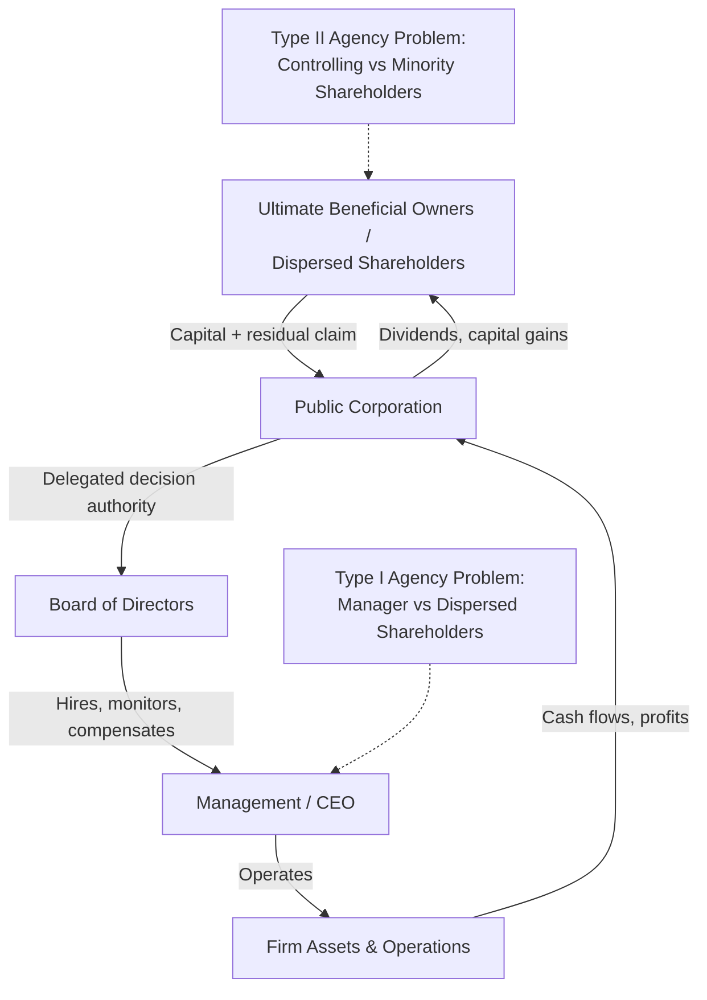

## The Separation of Ownership and Control

### Overview

The separation of ownership and control describes a structural feature of the modern corporation in which the individuals who bear residual financial risk (shareholders) are distinct from the individuals who make operational and strategic decisions (managers). This separation, first systematically analyzed by Adolf Berle and Gardiner Means in *The Modern Corporation and Private Property* (1932), gives rise to the foundational conflict studied in agency theory: managers may pursue objectives that diverge from shareholder wealth maximization because they bear only a fraction of the costs of their decisions while capturing private benefits of control.

### Historical and Conceptual Origins

**Key Points**

- Berle and Means observed that as U.S. corporations grew and equity became dispersed across many small shareholders, no single shareholder retained sufficient stake or information to monitor management effectively.
- Dispersed ownership creates a collective action problem: monitoring costs are borne individually by each shareholder, but the benefits of monitoring (better-managed firms) accrue to all shareholders proportionally. This produces free-riding and systematic underinvestment in oversight.
- The separation is not binary but a matter of degree, varying by ownership concentration, legal regime, and capital market structure (e.g., diffuse ownership is more pronounced in the US/UK "outsider" systems than in "insider" systems common in continental Europe and much of Asia, where block-holding families, banks, or the state retain concentrated stakes).

### The Agency Relationship

Jensen and Meckling (1976) formalized the manager-shareholder relationship as a principal-agent problem. The shareholder (principal) delegates decision-making authority to the manager (agent), who is expected to act in the principal's interest but whose own utility function may differ.

**Sources of divergence:**

- **Effort aversion** — managers may shirk since they do not capture the full marginal product of their effort.
- **Perquisite consumption** — managers may divert corporate resources toward private benefits (lavish offices, corporate jets, empire-building acquisitions) that raise their utility without raising firm value.
- **Risk-preference mismatch** — undiversified managers (whose human capital and often compensation are tied to one firm) tend to be more risk-averse than diversified shareholders, leading to underinvestment in positive-NPV but risky projects.
- **Horizon problems** — managers approaching retirement may discount long-term projects excessively relative to shareholders' longer effective horizon.
- **Empire building** — managers may prefer growth (revenue, headcount, assets under control) over profitability, since compensation, prestige, and power are often more closely tied to firm size than to shareholder returns.

### Formal Framework: Agency Costs

Jensen and Meckling decompose the total cost of the agency relationship into three components:

$$AC = M + B + RL$$

Where:

- $M$ = monitoring expenditures incurred by the principal (audits, board oversight, bonding of managers)
- $B$ = bonding expenditures incurred by the agent to credibly commit to acting in the principal's interest (e.g., contractual restrictions, voluntary disclosure)
- $RL$ = residual loss, the dollar-equivalent value lost because the agent's decisions still diverge from the value-maximizing decision even after optimal monitoring and bonding

The firm's owners rationally invest in $M$ and $B$ up to the point where the marginal cost of an additional unit of monitoring/bonding equals the marginal reduction in residual loss — agency costs are minimized, not eliminated.

**Example**

A shareholder base collectively spends $2 million annually on external audits and a compliance function (monitoring, $M$). The CEO agrees to a compensation contract with clawback provisions and forgoes discretionary spending authority above a threshold (bonding, $B$, costing the firm an estimated $500,000 in reduced managerial flexibility/value). Even with these mechanisms, the firm still overinvests in a marginally negative-NPV acquisition that entrenches the CEO, destroying $3 million in shareholder value (residual loss, $RL$). Total agency cost: $AC = \$2M + \$0.5M + \$3M = \$5.5M$.

### Ownership Structure and the Degree of Separation

**Diffuse (dispersed) ownership**

- Characteristic of large, widely-held public corporations, especially in the US and UK.
- No single shareholder has enough stake to unilaterally discipline management; reliance on market mechanisms (takeovers, proxy contests) and institutional investors for monitoring.

**Concentrated ownership**

- A dominant blockholder (founding family, another corporation, the state, or a private equity sponsor) retains enough equity to exercise direct control.
- Reduces the classical shareholder-manager agency problem (Type I) but introduces a *second* agency problem: **conflicts between controlling and minority shareholders** (Type II), where the blockholder can extract private benefits of control (tunneling, related-party transactions, dilutive share issuances) at the expense of minority shareholders. This is especially prominent under **pyramidal ownership structures** and **dual-class share** arrangements, where voting rights exceed cash-flow rights.

**Institutional ownership**

- The rise of mutual funds, pension funds, and index funds has partially re-concentrated effective voting power even where legal ownership remains dispersed among millions of underlying beneficiaries.
- Institutional investors face their own agency problem (they are themselves agents for their beneficiaries) and vary widely in their willingness to engage in active monitoring ("Wall Street Walk" vs. shareholder activism).

### Mechanisms That Mitigate the Separation Problem

**Internal governance mechanisms**

- **Board of directors** — fiduciary monitor elected by shareholders; effectiveness depends on independence, expertise, and separation of CEO/Chair roles.
- **Executive compensation design** — equity-based pay (stock options, restricted stock, performance shares) aligns managerial payoffs with shareholder value; however, poorly designed incentive contracts can encourage excessive risk-taking or short-termism (see also earnings management incentives).
- **Internal audit and disclosure controls**.

**External (market-based) mechanisms**

- **Market for corporate control** — the threat of hostile takeover disciplines underperforming management; an inefficient manager depresses the stock price, making the firm a target for an acquirer who can install better management and capture the value gain.
- **Managerial labor market** — reputational consequences for poor performance affect a manager's future employability.
- **Product market competition** — competitive pressure limits the scope for managerial slack, since inefficiency threatens firm survival.
- **Debt as a disciplining device** (Jensen's "control hypothesis" of free cash flow, 1986) — mandatory debt service reduces the discretionary free cash flow available for managers to misallocate into empire-building or perquisites.
- **Large shareholder / activist monitoring** — hedge fund activism, proxy contests, and "wolf pack" tactics that concentrate de facto monitoring capacity among a subset of investors.
- **Say-on-pay votes and shareholder proposals** — legal mechanisms allowing dispersed shareholders to signal disapproval without full-scale takeover.

**Legal mechanisms**

- Fiduciary duties (duty of care, duty of loyalty) enforceable through derivative litigation.
- Mandatory disclosure regimes (e.g., SEC reporting requirements) reducing information asymmetry.
- Minority shareholder protections (appraisal rights, related-party transaction approval requirements) particularly relevant in concentrated-ownership regimes.

### Free Cash Flow Theory

Jensen (1986) argues that agency costs are most severe in firms generating **free cash flow** — cash flow in excess of that required to fund all positive-NPV projects. Managers of such firms face weaker discipline from capital markets (since they do not need to raise external funds) and stronger temptation to overinvest.

$$FCF = OperatingCashFlow - CapitalExpenditures_{NPV>0}$$

**[Inference]** Empirically, this theory helps explain patterns such as the wave of value-destroying diversifying acquisitions among cash-rich firms in mature industries during the 1970s–80s, and the subsequent disciplining role played by leveraged buyouts (LBOs), which convert free cash flow into mandatory debt service.

### Empirical Measures of the Separation

Researchers commonly proxy the degree of ownership-control separation using:

- **Wedge between voting rights and cash-flow rights** — particularly relevant in dual-class structures; a founder holding 10% of cash-flow rights but 40% of votes has a large wedge.
- **Ownership concentration ratios** — percentage of shares held by the top 1, 3, or 5 shareholders.
- **Institutional ownership percentage**.
- **Insider (managerial) ownership percentage** — Morck, Shleifer, and Vishny (1988) find a non-monotonic relationship between insider ownership and firm value (Tobin's Q): alignment effects dominate at low ownership levels, while entrenchment effects dominate at intermediate levels.

**[Unverified]** Precise inflection points in the ownership-performance relationship vary substantially across studies, time periods, and countries, and should not be treated as universal constants.

### Illustrative Voting-Cash Flow Wedge Diagram

<svg xmlns="http://www.w3.org/2000/svg" viewBox="0 0 640 320">
<text x="320" y="24" font-size="16" font-weight="bold" text-anchor="middle" fill="#1a1a1a">Pyramidal Ownership Wedge (svg_diagram)</text>
<rect x="260" y="50" width="120" height="50" rx="6" fill="#dbeafe" stroke="#2563eb" stroke-width="1.5" />
<text x="320" y="80" font-size="13" text-anchor="middle" fill="#1a1a1a">Founding Family</text>
<line x1="320" y1="100" x2="320" y2="140" stroke="#374151" stroke-width="1.5" />
<text x="345" y="122" font-size="11" fill="#374151">51% votes / 51% cash flow</text>
<rect x="260" y="140" width="120" height="50" rx="6" fill="#dcfce7" stroke="#16a34a" stroke-width="1.5" />
<text x="320" y="170" font-size="13" text-anchor="middle" fill="#1a1a1a">Holding Company A</text>
<line x1="320" y1="190" x2="320" y2="230" stroke="#374151" stroke-width="1.5" />
<text x="345" y="212" font-size="11" fill="#374151">51% votes / 51% cash flow</text>
<rect x="260" y="230" width="120" height="50" rx="6" fill="#fef3c7" stroke="#d97706" stroke-width="1.5" />
<text x="320" y="255" font-size="13" text-anchor="middle" fill="#1a1a1a">Operating Firm B</text>
<text x="320" y="272" font-size="11" text-anchor="middle" fill="#7c2d12">Family votes: ~26% | Family cash flow: ~26%</text>
<rect x="440" y="140" width="150" height="70" rx="6" fill="#fee2e2" stroke="#dc2626" stroke-width="1.5" />
<text x="515" y="165" font-size="12" text-anchor="middle" fill="#1a1a1a">Minority Public</text>
<text x="515" y="182" font-size="12" text-anchor="middle" fill="#1a1a1a">Shareholders of A</text>
<text x="515" y="199" font-size="10" text-anchor="middle" fill="#7f1d1d">49% cash flow, 49% votes</text>
<line x1="440" y1="175" x2="380" y2="165" stroke="#dc2626" stroke-width="1.2" stroke-dasharray="4,3" />

<text x="20" y="300" font-size="11" fill="`#4b5563`">Note: at each tier the family's effective cash-flow claim compounds down (0.51 × 0.51 ≈ 26%),</text>

<text x="20" y="316" font-size="11" fill="`#4b5563`">while control (majority voting block at each level) is preserved undiluted — the "wedge."</text>

</svg>

### Cross-Country Variation

**[Inference]** La Porta, Lopez-de-Silanes, and Shleifer (1999) document that widely-held corporations (Berle-Means style dispersed ownership) are relatively uncommon outside a small number of common-law countries with strong minority-investor protections; concentrated family or state control is the more prevalent global pattern. This suggests the "separation of ownership and control" as classically described is a special case tied to specific legal-institutional environments (strong shareholder protection, deep and liquid capital markets, effective takeover regimes) rather than a universal feature of the corporate form.

### Related Theoretical Extensions

- **Stewardship theory** — a counter-perspective arguing managers are not inherently self-interested shirkers but can be intrinsically motivated stewards of firm value, weakening the need for costly monitoring in some contexts.
- **Managerial entrenchment** — the use of anti-takeover devices (poison pills, staggered boards, golden parachutes) to insulate management from the disciplining mechanisms described above.
- **Shareholder primacy vs. stakeholder theory debate** — whether the appropriate objective function for resolving the agency problem should be shareholder wealth maximization alone or a broader set of stakeholder interests.

**Next Steps**

- **Related Topics**
  - Agency costs of free cash flow and the disciplining role of leverage
  - Executive compensation design and pay-performance sensitivity
  - The market for corporate control and hostile takeover defenses
  - Dual-class share structures and the voting-cash flow wedge
  - Institutional investor activism and shareholder engagement
  - Board independence and governance codes (e.g., Sarbanes-Oxley, UK Corporate Governance Code)
  - Minority shareholder expropriation ("tunneling") in concentrated ownership systems
  - Comparative corporate governance (insider vs. outsider systems)