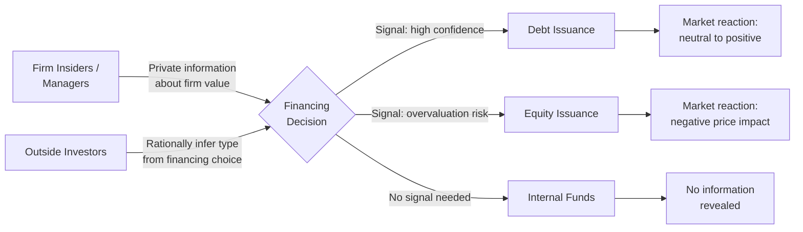

## Information Asymmetry in Corporate Finance

### Overview

Information asymmetry refers to situations in which one party to a financial transaction possesses material information unavailable to the other party. In corporate finance, this typically manifests as managers/insiders knowing more about the firm's true value, prospects, and risks than outside investors (shareholders, bondholders, and prospective capital providers). This informational gap distorts financing decisions, capital allocation, contract design, and market pricing, and constitutes one of the central pillars of modern corporate finance theory alongside agency theory.

### Taxonomy of Information Problems

**Adverse selection (hidden information)**

- Occurs *before* a transaction. The informed party (e.g., firm insiders) knows something about quality/type that the uninformed party (investors) cannot observe, leading uninformed parties to price assets at an average that penalizes high-quality issuers.
- Classic origin: Akerlof's (1970) "market for lemons," extended to capital markets by Myers and Majluf (1984).

**Moral hazard (hidden action)**

- Occurs *after* a transaction. The informed party can take actions unobservable to the uninformed party that affect the transaction's outcome (e.g., risk-shifting by shareholders/managers after debt is issued).
- Overlaps with, but is analytically distinct from, the agency cost framework — moral hazard is specifically about the *informational* inability to observe/verify actions, whereas agency costs are the broader welfare loss from misaligned incentives.

**Signaling and screening**

- **Signaling**: the informed party takes a costly, verifiable action to credibly reveal private information (e.g., issuing debt instead of equity, paying dividends).
- **Screening**: the uninformed party designs a menu of contracts to induce self-selection that reveals the informed party's type.

### The Pecking Order Theory (Myers & Majluf, 1984)

**Key Points**

- If managers know more about firm value than outside investors, and act in the interest of existing shareholders, equity issuance is interpreted by the market as a signal that the stock is *overvalued* — because a rational manager would only issue new (underpriced-relative-to-true-value) claims on the firm if the current stock price were favorable to existing owners.
- This produces a negative stock price reaction to seasoned equity offering (SEO) announcements, robustly documented empirically.
- The theory predicts a financing hierarchy driven purely by information costs (not target leverage ratios as in trade-off theory):

$$\text{Internal funds} \succ \text{Debt} \succ \text{Hybrid securities} \succ \text{Equity}$$

**Formal intuition**

Let $V$ = true firm value (known to managers), and let the market's assessment be $E[V]$. A firm with assets in place worth $A$ and a new project requiring investment $I$ with NPV $N$ will only issue equity if:

$$\frac{A + N}{A + I} \cdot (\text{shares outstanding after issuance}) \geq \text{existing shareholders' pre-issuance claim}$$

When managers possess favorable private information ($V$ high relative to market's $E[V]$), issuing underpriced equity transfers wealth from existing to new shareholders, even for positive-NPV projects — potentially causing firms to *forgo* profitable investments rather than issue undervalued equity. This is the core "underinvestment" prediction of the model.

**Example**

A biotech firm's management knows an unannounced clinical trial (to be disclosed in 3 months) will succeed, implying true equity value of $50/share versus the current market price of $30/share. The firm needs $100 million for a new positive-NPV manufacturing facility. Issuing equity at $30/share to raise $100 million would require issuing shares now worth (post-disclosure) far more than $100 million — diluting existing shareholders by an amount exceeding the project's NPV. Management instead finances the project with bank debt or delays until after the trial results are public.

### Signaling Models

**Dividend signaling (Bhattacharya, 1979; Miller & Rock, 1985)**

- Dividend increases signal management's confidence in sustainable future cash flows, since cutting a dividend later imposes reputational and (in some models) real costs.
- **[Inference]** Empirically, dividend initiations/increases are associated with positive abnormal announcement returns and dividend cuts with negative abnormal returns, broadly consistent with signaling, though free cash flow and catering explanations offer competing interpretations for the same stylized facts.

**Capital structure signaling (Ross, 1977)**

- Debt issuance signals managerial confidence because higher leverage increases bankruptcy risk that only a manager confident in future cash flows would willingly accept; a manager credibly "bonds" themselves to a penalty (financial distress) if cash flows disappoint.
- Leverage increases are, on average, associated with positive announcement returns; leverage decreases (e.g., equity-for-debt exchange offers) with negative returns.

**Insider ownership as a signal (Leland & Pyle, 1977)**

- In IPO settings, the fraction of equity retained by founding entrepreneurs signals firm quality, since a manager with private knowledge of poor prospects would rationally sell down their stake before value-relevant bad news becomes public.

**IPO underpricing as a screening/signaling equilibrium (Rock, 1986; Welch, 1989)**

- Rock's "winner's curse" model: uninformed investors face adverse selection because informed investors selectively subscribe to underpriced (good) IPOs and avoid overpriced ones, leaving uninformed investors disproportionately allocated shares in the *worse* offerings. Underwriters must underprice IPOs on average to keep uninformed investors participating in the market at all.

### Effects on Cost of Capital

**Bid-ask spreads and liquidity**

- Market makers facing informed traders widen bid-ask spreads to compensate for expected losses to better-informed counterparties (Glosten & Milgrom, 1985; Kyle, 1985). Greater information asymmetry raises a stock's effective cost of capital via reduced liquidity.
- Firms with higher information asymmetry (e.g., smaller, younger, less analyst coverage) exhibit systematically higher costs of equity.

**Cost of debt**

- Lenders price information asymmetry through higher interest rate spreads, more restrictive covenants, collateral requirements, and shorter maturities.
- Relationship lending (e.g., bank debt) partially mitigates this via repeated interaction and private information production, explaining why bank debt is often cheaper on the margin than public bond issuance for opaque borrowers.

### Mitigating Mechanisms

**Disclosure and reporting**

- Mandatory financial reporting, audited statements, and regulatory disclosure regimes (e.g., SEC Regulation FD, IFRS/GAAP standards) reduce (but do not eliminate) the informational gap.
- Voluntary disclosure theory (Grossman 1981; Milgrom 1981) shows that under certain conditions ("unraveling"), firms with good news have an incentive to disclose voluntarily, and non-disclosure is itself informative — though real-world frictions (disclosure costs, litigation risk, proprietary cost concerns) prevent full unraveling.

**Financial intermediaries**

- Investment banks, credit rating agencies, and equity research analysts specialize in information production and certification, reducing due diligence costs for dispersed investors. Underwriter reputation acts as a bonding mechanism in IPOs (Booth & Smith, 1986).
- **[Inference]** The 2008 financial crisis is often cited as an example of the limits of this mechanism, where certification by credit rating agencies on structured products failed to resolve — and arguably exacerbated — underlying information asymmetries; this remains a debated interpretation among researchers.

**Contractual mechanisms**

- Covenants in debt contracts (restricting further leverage, asset sales, dividend payouts) constrain post-financing actions that exploit moral hazard.
- Convertible securities and staged financing (common in venture capital) allow investors to limit downside exposure while retaining upside participation, reducing the adverse selection premium demanded upfront.
- Earnouts and contingent consideration in M&A deals bridge valuation gaps arising from asymmetric information between buyer and seller.

**Reputation and repeated interaction**

- Firms accessing capital markets repeatedly have incentives to maintain credibility, as one instance of exploiting information asymmetry (e.g., an opportunistically overvalued SEO) damages the terms of future financing.

### Empirical Proxies for Information Asymmetry

Common measures used in empirical corporate finance research:

- **Bid-ask spread** (or components thereof, e.g., the adverse-selection component from spread decomposition models).
- **Analyst forecast dispersion** — higher disagreement among analysts proxies for greater informational uncertainty.
- **Probability of informed trading (PIN)** — a market microstructure measure estimating the fraction of trades driven by private information (Easley, Kiefer, O'Hara & Paperman, 1996).
- **Firm size, age, and analyst coverage** — smaller, younger, less-covered firms are typically assumed to face greater informational opacity.

**[Unverified]** The relative validity and comparability of these proxies across empirical studies is itself contested in the market microstructure literature; results using one proxy do not always replicate with another.

### Interaction with Agency Theory

Information asymmetry and agency costs are related but distinct: agency problems can exist even under symmetric information (e.g., a manager who is simply lazy, observably so, but whose effort cannot be contractually specified), while information asymmetry can exist even absent any conflict of interest (e.g., a sole owner-manager who alone knows firm value but has no divergent objective from outside financiers). In practice, the two interact and compound: informational opacity makes it harder for principals to monitor and verify whether observed outcomes reflect bad luck or agent misbehavior, amplifying the residual loss component of agency costs.

**Next Steps**

- **Related Topics**
  - Pecking order theory vs. trade-off theory of capital structure
  - IPO underpricing and the winner's curse
  - Dividend policy and signaling theory
  - Debt covenants and contractual mitigation of moral hazard
  - Market microstructure: bid-ask spreads and price discovery
  - Voluntary disclosure theory and the unraveling result
  - Credit rating agencies and certification theory
  - Venture capital staged financing and asymmetric information