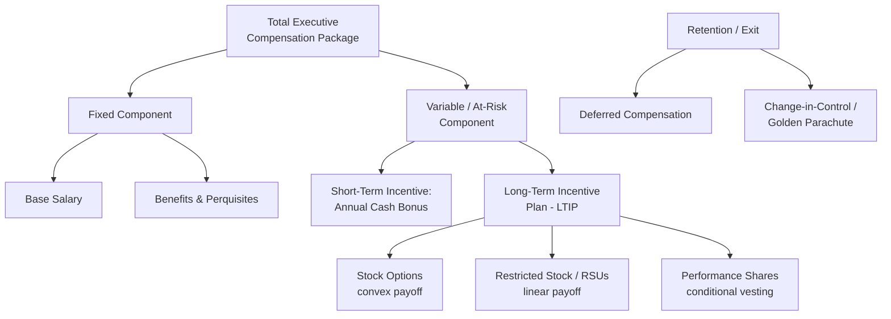

## Executive Compensation Design

### Overview

Executive compensation design is the primary contractual mechanism through which boards attempt to align managerial incentives with shareholder interests, functioning as both a bonding device (in Jensen-Meckling terms) and a screening/retention tool in a competitive managerial labor market. The central design challenge is constructing a pay package that induces value-maximizing effort and risk-taking under conditions where managerial effort is unobservable, firm outcomes are noisy signals of effort, and managers are typically risk-averse and under-diversified relative to outside shareholders.

### The Core Trade-off: Incentives vs. Risk

**Key Points**

- Because firm performance reflects both managerial effort/skill and exogenous noise (market conditions, luck), any compensation scheme that ties pay to performance imposes risk on a risk-averse manager.
- This is the foundational tension of the principal-agent model applied to compensation (Holmstrom, 1979): the optimal contract balances the benefit of stronger incentives (higher pay-performance sensitivity) against the cost of imposing risk on a risk-averse agent, who must be compensated with a risk premium for bearing it.
- The classic linear contract solution (Holmstrom & Milgrom, 1987):

$$w = \alpha + \beta \cdot \pi$$

Where $w$ is total compensation, $\alpha$ is a fixed base component, $\pi$ is observed firm performance (profit, stock price, etc.), and $\beta$ is the pay-performance sensitivity ("incentive intensity"). The optimal $\beta^*$ decreases with the manager's risk aversion and the variance of the noise term, and increases with the responsiveness of performance to effort.

$$\beta^* = \frac{1}{1 + r \cdot \sigma^2 \cdot C''(e)}$$

**[Inference]** This stylized formula (where $r$ is the manager's risk-aversion coefficient, $\sigma^2$ is outcome variance, and $C''(e)$ is the convexity of the manager's effort-cost function) captures the qualitative comparative statics of the Holmstrom-Milgrom framework; exact functional forms vary across model specifications in the literature and should not be treated as a single universal formula.

### Components of a Modern Executive Pay Package

**Base salary**

- Fixed cash component, typically set with reference to peer-group benchmarking. Provides income stability but contributes no direct performance incentive at the margin; primarily addresses participation/retention constraints.

**Annual (short-term) cash bonus**

- Tied to annual accounting metrics (EPS, revenue, EBITDA, operating margin) or strategic/individual objectives, often structured with a threshold, target, and maximum payout (a "bonus bank" or payout curve).
- Prone to manipulation via earnings management when metrics are narrowly accounting-based and thresholds create discontinuous payout incentives (bonus "ratcheting" near threshold points is a well-documented empirical pattern).

**Long-term incentive plans (LTIPs)**

- **Stock options** — grant the right to purchase shares at a fixed strike price (typically at-the-money at grant date) after a vesting period. Payoff is convex:

$$\text{Option payoff} = \max(S_T - K, 0)$$

This convexity is deliberate: it rewards upside performance and can encourage risk-taking, which is useful for addressing managerial risk-aversion-induced underinvestment but can also incentivize excessive risk-taking, especially for options that are deep out-of-the-money ("gambling for resurrection").

- **Restricted stock / restricted stock units (RSUs)** — outright grants of shares (or promises thereof) that vest over time, sometimes with performance conditions. Payoff is linear in stock price with no downside asymmetry relative to options, generally considered to produce more risk-neutral incentive alignment than options.
- **Performance shares/units** — vest only if specified multi-year performance targets are met (e.g., relative total shareholder return (TSR) vs. a peer index, cumulative EPS growth, ROIC targets). Increasingly the dominant LTIP vehicle in large-cap US compensation post-2010s say-on-pay reforms.

**Pension and deferred compensation**

- Defined-benefit supplemental executive retirement plans (SERPs) and deferred compensation arrangements, which can create horizon and risk-shifting incentives distinct from equity-based pay (some research treats large inside debt holdings by executives as risk-reducing, partially offsetting the risk-shifting incentives created by option-heavy pay).

**Severance and change-in-control provisions ("golden parachutes")**

- Guaranteed payouts upon termination or a change of control, intended to reduce managerial resistance to value-increasing takeovers (removing the manager's private incentive to entrench against an acquisition that would cost them their job) but criticized as a transfer to management independent of performance.

### Pay-Performance Sensitivity (PPS)

Jensen and Murphy (1990) popularized measuring the dollar change in CEO wealth per dollar change in shareholder wealth as the key empirical metric of incentive alignment:

$$PPS = \frac{\Delta \text{CEO Wealth}}{\Delta \text{Firm Value}}$$

- Their original estimate ($3.25 per $1,000 of shareholder wealth change) was widely characterized as surprisingly low, sparking debate over whether real-world compensation contracts reflected optimal contracting.
- **[Inference]** Subsequent work incorporating the full value of stock and option holdings (not just annual flow compensation) found substantially higher PPS, as the sensitivity from an executive's *accumulated equity stake* dwarfs the sensitivity embedded in that year's incremental pay grant; the magnitude of "optimal" PPS remains an area of ongoing empirical and theoretical disagreement.

### Managerial Power Theory: A Critique of Optimal Contracting

Bebchuk and Fried (2003, 2004) offer a competing lens: rather than compensation being the output of arm's-length optimal contracting between a board and a manager, boards themselves may be captured or weak monitors (due to CEO influence over director nomination, social ties, or limited board time/expertise), allowing powerful CEOs to extract rents through the compensation-setting process itself.

**Key predictions distinguishing "managerial power" from "optimal contracting":**

- Compensation practices that camouflage the true cost/value of pay to outside observers (e.g., historically, off-market loans, opaque pension arrangements, backdated options) are predicted primarily under managerial power, not optimal contracting.
- Pay levels correlate with the strength of governance/monitoring quality (weaker boards → higher, less-justified pay) under managerial power; optimal contracting predicts no such systematic relationship conditional on economic fundamentals.
- **[Unverified]** Which framework better explains observed compensation patterns is empirically contested; most contemporary researchers treat the two as complementary rather than mutually exclusive explanations, with different mechanisms dominant in different governance contexts (e.g., weaker board independence, more dispersed ownership).

### Say-on-Pay and Regulatory Developments

- Post-2008 financial crisis reforms (Dodd-Frank Act in the US, 2010) introduced mandatory non-binding shareholder "say-on-pay" votes on executive compensation, along with pay ratio disclosure (CEO-to-median-employee pay ratio) and clawback requirements for compensation tied to later-restated financials.
- **[Inference]** Say-on-pay votes are widely believed to have shifted compensation committee practice toward greater use of performance-conditioned equity (relative TSR plans) and away from purely discretionary or time-vesting awards, though isolating the causal effect of the regulation from concurrent trends in governance practice is methodologically difficult.

### Risk-Taking Incentives: Vega and Delta

Compensation researchers commonly decompose an executive's equity-based incentives into two sensitivities:

- **Delta** — sensitivity of the executive's wealth to a $1 change in stock price (captures pay-performance alignment / effort incentives).
- **Vega** — sensitivity of the executive's wealth to a change in stock return *volatility* (captures risk-taking incentives, arising primarily from the convexity of option holdings).

**Example**

Two CEOs each hold equity-linked wealth of $20 million. CEO A's holdings are entirely RSUs (high delta, near-zero vega): she has strong incentives to increase the stock price but no incentive from her pay structure to increase firm risk. CEO B holds the same dollar value in at-the-money stock options (high delta *and* high vega): he shares CEO A's incentive to raise the stock price, but additionally has an incentive to increase firm volatility, since option value rises with volatility per the Black-Scholes relationship, independent of expected value. **[Inference]** This is one channel researchers use to explain why heavily options-compensated management teams in some studies exhibit greater R&D intensity, leverage, or acquisition activity — although reverse causality and omitted firm-characteristic explanations remain live concerns in this literature.

### International and Cross-Sectional Variation

- US executive pay levels and the proportion of pay delivered as equity are, on average, higher than in most other developed markets; **[Inference]** this is commonly attributed to a combination of more dispersed US ownership structures (weaker direct blockholder monitoring, per the separation-of-ownership-and-control discussion), a more active managerial labor market, and historically more permissive tax and disclosure treatment of equity compensation, though the relative weight of these explanations is debated.
- Say-on-pay and related shareholder-voice mechanisms have been adopted with varying degrees of bindingness across jurisdictions (e.g., binding votes in the UK vs. advisory votes in the US).

**Next Steps**

- **Related Topics**
  - Holmstrom's principal-agent model and optimal contract theory
  - Stock option valuation (Black-Scholes) and executive option accounting
  - Say-on-pay regulation and shareholder voting mechanisms
  - Managerial power theory vs. optimal contracting debate
  - Clawback provisions and compensation recoupment policy
  - Relative performance evaluation and peer benchmarking design
  - Risk-shifting incentives and the vega/delta framework
  - Board compensation committee independence and governance quality