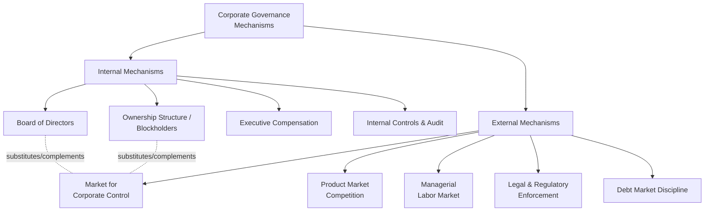

## Corporate Governance Mechanisms

### Overview

Corporate governance mechanisms are the set of institutional, contractual, and market-based devices that constrain managerial discretion and align the actions of those who control a firm's resources with the interests of its capital providers. They are commonly classified into **internal mechanisms** (operating within the firm's formal governance structure — boards, ownership, compensation, internal controls) and **external mechanisms** (operating through markets and legal institutions outside direct firm control — the market for corporate control, product market competition, litigation, and regulation). Governance mechanisms exist precisely because the agency and information problems discussed elsewhere in this chapter cannot be fully resolved through complete contracting; they substitute imperfect monitoring and incentive alignment for the unobservability of managerial effort and private information.

### Classification Framework

**Key Points**

- No single mechanism is sufficient on its own; governance is best understood as a *bundle* of partially substitutable and partially complementary devices (Rediker & Seth, 1995; Agrawal & Knoeber, 1996).
- Substitution effects are well documented empirically: firms with weaker external discipline (e.g., protected from takeover by state antitakeover statutes) tend to compensate with stronger internal mechanisms (more independent boards, higher insider ownership), and vice versa.
- Governance mechanisms address different combinations of the Type I (manager-shareholder) and Type II (controlling-minority shareholder) agency problems described in the ownership-and-control discussion.

### Internal Mechanism: The Board of Directors

**Structure and independence**

- Boards are legally charged with fiduciary duties (duty of care, duty of loyalty) and are the primary internal monitor of management on behalf of shareholders.
- **Board independence** — the proportion of directors with no material business or personal ties to management — is the most widely studied board characteristic. Regulatory reforms (e.g., NYSE/NASDAQ listing standards post-Sarbanes-Oxley 2002) mandate majority-independent boards and fully independent audit, compensation, and nominating committees for US listed firms.
- **CEO duality** — whether the CEO also serves as board chair — is debated: duality may impair independent oversight, but unified leadership can also improve decision-making speed and reduce coordination costs; empirical evidence on the value consequences of duality is mixed and context-dependent.

**Board committees**

- **Audit committee** — oversees financial reporting integrity and the external auditor relationship; typically required to be fully independent and to include at least one "financial expert" under SOX.
- **Compensation committee** — designs and approves executive pay (see prior chapter item on executive compensation design).
- **Nominating/governance committee** — manages director recruitment, succession planning, and governance policy.

**[Inference]** The empirical relationship between board independence and firm performance is notably weaker and less consistent than the theoretical prediction would suggest, which some researchers attribute to endogeneity (board structure and firm performance are jointly determined) and to independence being a necessary but not sufficient condition for effective monitoring (independent directors may still lack firm-specific information, time, or incentive to monitor intensively).

### Internal Mechanism: Ownership Structure

Discussed in depth under the separation-of-ownership-and-control topic; summarized here as a governance lever:

- **Blockholders** (institutional investors, founding families, private equity sponsors) with large stakes have both the incentive (large residual claim) and the capability (voting power, board representation) to monitor management directly, mitigating the free-rider problem inherent in fully dispersed ownership.
- **Insider (managerial) ownership** aligns incentives directly but at high levels can produce **entrenchment**, where insiders hold enough voting power to resist external discipline (e.g., takeover threats) even when replacement would raise firm value — the non-monotonic relationship documented by Morck, Shleifer, and Vishny (1988).
- **Institutional investor activism** — engagement ranging from private engagement ("behind the scenes" dialogue) to public activist campaigns (shareholder proposals, proxy contests, "vote no" campaigns against directors).

### External Mechanism: The Market for Corporate Control

- The threat of hostile takeover disciplines management: a firm trading below its potential value under better management becomes an acquisition target, and a successful acquirer can replace underperforming management and capture the value gain (Manne, 1965; Jensen, 1988).
- **Antitakeover defenses** weaken this discipline:
  - **Poison pills** (shareholder rights plans) — dilute a hostile acquirer's stake if a threshold ownership level is crossed without board approval.
  - **Staggered (classified) boards** — only a fraction of directors stand for election each year, slowing an acquirer's ability to gain board control even after winning a majority stake.
  - **Golden parachutes** — large severance payments to management upon a change of control, which can *reduce* managerial resistance to value-increasing takeovers (aligning with the shareholder interest in enabling beneficial deals) even though they appear to entrench management.
  - **State antitakeover statutes** (e.g., business combination statutes, control share acquisition statutes in various US states) — impose additional legal hurdles on hostile acquirers.
- **[Inference]** The empirical evidence on whether antitakeover provisions destroy or preserve shareholder value is mixed and provision-specific: Gompers, Ishii, and Metrick (2003) find a negative relationship between an aggregate antitakeover "G-Index" and firm value/returns over their 1990s sample period, but later work (Bebchuk, Cohen, and Wang, 2013) finds this relationship weakens or disappears in subsequent periods, suggesting the original result may partly reflect a period-specific market mispricing of governance risk rather than a stable causal relationship.

### External Mechanism: Product Market and Managerial Labor Market Competition

- Intense product market competition constrains managerial slack because inefficient firms risk being competed out of existence, providing a "hard" disciplining mechanism that does not rely on financial market monitoring.
- The managerial labor market disciplines through reputation: a manager's track record affects future employability and compensation at other firms, creating career-concern incentives (Fama, 1980) independent of current-firm compensation contracts.

### External Mechanism: Debt and Creditor Monitoring

- Debt financing constrains managerial free cash flow discretion (Jensen's control hypothesis, discussed under information asymmetry) and creditors impose their own monitoring through covenants, collateral requirements, and — in periods of financial distress — direct control rights that shift effective governance power toward creditors.
- **[Inference]** This creditor-control shift is most pronounced in and around formal bankruptcy/restructuring proceedings, where creditor committees and covenant-triggered control rights can supersede shareholder-oriented governance, though the precise threshold and mechanism vary by jurisdiction's insolvency regime.

### External Mechanism: Legal and Regulatory Enforcement

- **Securities regulation** (disclosure mandates, insider trading prohibitions, anti-fraud rules) reduces information asymmetry and constrains self-dealing.
- **Derivative litigation** — allows shareholders to sue on behalf of the corporation for breaches of fiduciary duty, though procedural hurdles (demand requirements, business judgment rule deference) limit its practical disciplining power in many jurisdictions.
- **La Porta, Lopez-de-Silanes, Shleifer, and Vishny (1998, "LLSV")** — influential comparative law-and-finance literature arguing that the strength of legal investor protection (particularly minority shareholder and creditor rights) is a first-order determinant of financial market development and ownership concentration patterns across countries; common-law legal origin countries are found to offer stronger investor protections on average than civil-law origin countries in their framework.
- **[Unverified]** The LLSV "legal origins" thesis remains actively debated in comparative corporate governance research, with critiques focused on measurement of legal protection indices and the direction of causality between legal rules and financial development.

### Governance Codes and "Comply-or-Explain" Regimes

- Many jurisdictions (notably the UK Corporate Governance Code, and similar codes across the EU and other markets) rely on principles-based "comply-or-explain" regulation rather than hard mandates: firms must either follow a governance code's recommendations or publicly explain their departure, leaving markets/investors to judge the adequacy of the explanation.
- Contrasts with the more rules-based US approach post-Sarbanes-Oxley and Dodd-Frank, which mandates specific structural requirements (board independence thresholds, committee composition, say-on-pay votes) rather than allowing broad discretion with disclosure.

### Interaction and Substitution Among Mechanisms

**Example**

A firm operating in a jurisdiction with strong antitakeover statutes (weak external market-for-control discipline) and diffuse ownership (weak blockholder monitoring) faces elevated agency risk from both directions. Empirically, such firms are more likely to compensate with a more independent board, more performance-conditioned executive pay, and higher voluntary disclosure — internal substitutes stepping in where external and ownership-based discipline is structurally weak. Conversely, a firm with a dominant founder-blockholder retaining 40% ownership may exhibit a less independent board (family representation) without necessarily indicating weaker overall governance, since the ownership-based mechanism is already providing strong (if concentrated) monitoring incentive.

### Measuring Governance Quality

Commonly used composite indices in empirical research:

- **G-Index (Gompers, Ishii, Metrick, 2003)** — counts the presence of 24 antitakeover/governance provisions; higher values indicate weaker shareholder rights.
- **E-Index (Bebchuk, Cohen, Ferrell, 2009)** — a refined six-provision subset argued to capture most of the G-Index's explanatory power with a more parsimonious measure.
- **[Unverified]** Both indices are backward-looking, provision-count measures developed primarily from US data in a specific historical period; their applicability and predictive validity in other legal regimes or more recent periods should not be assumed without direct verification against contemporary evidence.

**Next Steps**

- **Related Topics**
  - Board independence and the effectiveness of monitoring
  - Antitakeover provisions: poison pills, staggered boards, and state statutes
  - The market for corporate control and hostile takeover mechanics
  - Comparative corporate governance: legal origins and investor protection (LLSV)
  - Creditor governance and control rights in financial distress
  - Institutional investor activism and shareholder engagement strategies
  - Say-on-pay and executive compensation regulation
  - Comply-or-explain governance codes vs. rules-based mandates