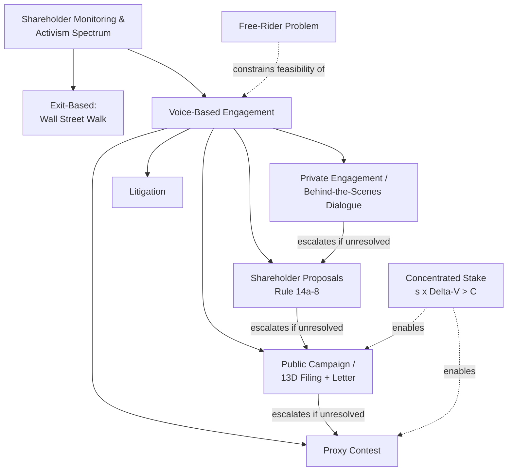

## Shareholder Activism and Monitoring

### Overview

Shareholder activism refers to the range of actions taken by investors — individually or in coordinated groups — to influence corporate decision-making, governance structure, or strategy, motivated by the belief that current management or board oversight is failing to maximize firm value. Activism is best understood as an endogenous market response to the free-rider problem inherent in dispersed ownership: since monitoring is individually costly but the benefits accrue to all shareholders proportionally, only investors who can capture a sufficiently large private benefit (through concentrated stakes, fee structures tied to performance, or reputational returns) find it rational to bear monitoring costs voluntarily.

### The Free-Rider Problem and the Economic Logic of Activism

**Key Points**

- Grossman and Hart (1980) formalize why dispersed shareholders rationally under-invest in monitoring: an individual small shareholder who spends resources improving firm value captures only their proportional share of the resulting gain, while bearing the full private cost of monitoring.
- Activism becomes economically viable when an investor can accumulate a large enough stake that the private benefit of value improvement exceeds the private cost of the activist campaign — this is the core rationale for hedge fund activist campaigns typically targeting 5%+ ownership stakes.
- Activist hedge funds partially resolve the free-rider problem through their compensation structure (performance fees under the standard "2-and-20" model) which more closely ties fund manager incentives to the value gains they generate than a passive institutional investor's typically flat fee structure.

$$\text{Activist's net benefit} = s \cdot \Delta V - C$$

Where $s$ is the activist's ownership stake, $\Delta V$ is the total firm value improvement achieved, and $C$ is the private cost of the campaign (research, legal, proxy solicitation, reputational risk). Activism is rational only where $s \cdot \Delta V > C$ — explaining why activist campaigns concentrate among investors who can achieve meaningful $s$ relative to campaign costs.

### Forms of Shareholder Activism

**Private (behind-the-scenes) engagement**

- Direct, non-public dialogue between institutional investors and management/boards — requesting strategic changes, governance reforms, or capital allocation shifts without public confrontation.
- **[Inference]** Widely believed to be the dominant mode of institutional investor engagement by volume (most large asset managers report primarily using private engagement), though because it is by design non-public, its frequency and effectiveness are harder to observe and verify systematically compared to public campaigns.

**Shareholder proposals**

- Formal proposals submitted for a vote at the annual general meeting, typically on governance topics (declassifying the board, majority voting for directors, say-on-pay frequency) or increasingly on environmental and social ("ESG") matters.
- In the US, governed by SEC Rule 14a-8, which sets ownership and holding-period thresholds for proposal eligibility and grounds on which management may exclude a proposal from the proxy statement.
- Most shareholder proposals are precatory (non-binding) even when passed by a majority vote, relying on reputational pressure and the norm of board responsiveness rather than legal compulsion.

**Proxy contests ("proxy fights")**

- An activist nominates an alternative slate of director candidates and solicits other shareholders' proxies to vote for them, seeking to gain board representation without a full takeover.
- Costly and historically had a low base rate of full success, but the credible *threat* of a proxy fight is itself a disciplining mechanism, often inducing negotiated settlements (board seats granted, strategic changes adopted) before a vote occurs.
- **Universal proxy rules** (adopted by the SEC, effective 2022) require both management and dissident slates to appear on the same proxy card, allowing shareholders to mix-and-match individual director votes across slates rather than choosing one full slate — **[Inference]** widely viewed by practitioners as lowering the practical barrier to electing individual activist-nominated directors, though the longer-run effect on overall activism volume and campaign design is still an evolving empirical question.

**Public activist campaigns ("wolf pack" activism)**

- A lead activist publicly announces a stake and thesis (via a 13D filing in the US, required when a stake exceeds 5% with an intent to influence control), often accompanied by a public letter or presentation to management and other shareholders, sometimes followed by other funds independently building parallel stakes ("wolf pack" behavior) that amplify pressure without formal coordination (which would trigger group-filing and disclosure obligations).
- Common asks: board seats, capital return (buybacks/special dividends), operational restructuring, divestitures/spinoffs, or a sale of the company.

**Litigation**

- Derivative suits (on behalf of the corporation against fiduciaries) and direct/class action suits (for direct harm to shareholders, e.g., securities fraud) provide an ex-post enforcement mechanism, complementing the primarily ex-ante/ongoing mechanisms above.

**Exit ("Wall Street Walk" / voting with your feet)**

- Selling shares in response to dissatisfaction with management is not "activism" in the engagement sense, but Admati and Pfleiderer (2009) and Edmans (2009) formalize how the *threat* of exit by a large, informed blockholder can itself discipline management, since anticipated selling pressure depresses the stock price and can trigger performance-sensitive consequences (compensation, takeover vulnerability) for management even without direct engagement.

### Types of Activist Investors

**Hedge fund activists**

- Specialize in identifying undervalued or underperforming firms, building meaningful stakes, and pursuing an active thesis (operational, strategic, financial, or governance-focused) over a typically shorter time horizon (often 1–3 years) than other institutional investor types.
- **[Inference]** A substantial body of empirical research (e.g., Brav, Jiang, Partnoy, and Thomas, 2008, and subsequent work) finds positive average abnormal stock returns around activist campaign announcements; interpretation of these returns — whether they reflect genuine value creation, wealth transfers from other stakeholders (e.g., via reduced long-term investment or reduced bondholder value), or market overreaction/short-term repricing without durable operational improvement — remains actively debated in the literature, and results vary by campaign type and sample period.

**Passive/index institutional investors ("Big Three" and similar large asset managers)**

- Cannot exit individual holdings without tracking-error cost (as index funds), which structurally shifts their incentive toward voice-based engagement over exit, since they are effectively permanent, diversified holders of the entire market.
- Typically engage through stewardship teams via private dialogue and voting policy, rather than public campaigns, given resource constraints from managing engagement across thousands of portfolio companies with relatively thin per-company staffing.
- **[Unverified]** The real-world effectiveness of large passive managers' stewardship activity — as opposed to their voting policies and public commitments — is a matter of ongoing empirical debate, with critics questioning whether engagement resources are proportionate to the scale of assets under management.

**Public pension funds and labor-affiliated funds**

- Historically prominent in shareholder proposal activity (e.g., CalPERS in the US), often focused on governance reforms (board declassification, majority voting) rather than operational/strategic activism.

**Activist short sellers**

- A distinct category that profits from identifying overvalued or fraudulent firms and taking short positions, often combined with public research reports — functions as a monitoring mechanism operating from the opposite direction of long-oriented activists, disciplining overvaluation and disclosure fraud rather than underperformance per se.

### Empirical Effects and Debates

**Operational and financial outcomes**

- Studies commonly examine changes in payout policy (dividends, buybacks), leverage, R&D and capex intensity, asset sales/divestitures, executive turnover, and subsequent operating performance following activist campaigns.
- **[Inference]** A frequent finding across studies is that activist targets increase leverage and payout to shareholders and reduce R&D/capex intensity following a campaign; whether this represents efficient reallocation of free cash flow (consistent with Jensen's free-cash-flow theory) or value-destroying short-termism that sacrifices long-run investment is a central point of disagreement between proponents and critics of activism, and likely varies by target firm characteristics and campaign type.

**The "short-termism" critique**

- Critics (notably including some corporate law scholars and practitioners, e.g., Bebchuk in earlier work has argued *against* this critique, while others such as Lipton have argued *for* it) contend that activist pressure induces management to prioritize near-term stock price performance over long-term value creation, particularly given activists' typically shorter holding periods relative to the horizon of long-term capital investment.
- Counter-argument (associated with researchers such as Bebchuk, Brav, and Jiang in later empirical work): if activism were systematically value-destroying in the long run, this should manifest as negative long-run abnormal stock returns following campaigns, and much of the empirical evidence does not support this pattern, though **[Unverified]** measurement of "long-run" abnormal returns is methodologically contested (choice of benchmark, survivorship considerations), and this remains an active area of disagreement rather than a settled empirical question.

**Wolf pack coordination and disclosure concerns**

- Regulatory attention (e.g., SEC scrutiny of 13D "group" filing rules) has focused on whether informal wolf-pack coordination among nominally independent activist funds circumvents disclosure requirements designed to give the market timely notice of accumulating control-relevant stakes.

### Say-on-Pay as a Structured Activism Channel

- Beyond ad hoc campaigns, regulatory mechanisms like mandatory say-on-pay votes (discussed under executive compensation design) institutionalize a recurring, low-cost channel for shareholder voice on a specific governance dimension, without requiring the concentrated stake-building of full activist campaigns.
- Proxy advisory firms (Institutional Shareholder Services (ISS), Glass Lewis) play an outsized role in this channel by issuing voting recommendations that many institutional investors follow to economize on the cost of independently evaluating each proposal — **[Inference]** this concentration of influence in a small number of proxy advisors is itself a debated governance topic, since it may substitute one form of collective-action/agency problem (dispersed shareholder monitoring) for another (delegated, possibly imperfectly-aligned advisory recommendations).

**Next Steps**

- **Related Topics**
  - Hedge fund activism campaign mechanics and case studies
  - Proxy advisory firms (ISS, Glass Lewis) and their governance influence
  - The free-rider problem in dispersed ownership monitoring
  - Wolf pack activism and Schedule 13D group disclosure rules
  - Exit vs. voice: blockholder governance theory (Edmans, Admati-Pfleiderer)
  - Say-on-pay votes as an institutionalized activism channel
  - Short-termism debate in corporate governance
  - ESG shareholder proposals and stewardship codes