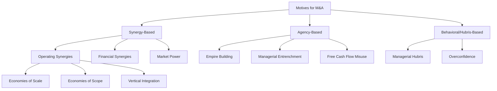

## Motives for Mergers and Acquisitions

### Overview

The motives for mergers and acquisitions (M&A) span a spectrum from value-creating, economically rational drivers (synergy realization, market power, efficiency gains) to value-destroying or neutral drivers rooted in managerial agency problems and behavioral biases. Understanding these motives is central to evaluating why deals occur, predicting which deals create shareholder value, and interpreting empirical patterns such as merger waves and the generally poor average post-merger performance of acquirers.

### Classification Framework

**Key Points**

- Motives are broadly classified into three categories: (1) synergy-based/value-maximizing, (2) agency-based/managerialist, and (3) behavioral/hubris-driven
- Not mutually exclusive — a single deal often reflects a blend, with the *stated* rationale (synergies) sometimes masking the *actual* driver (agency or hubris)
- The empirical M&A literature consistently finds that **target shareholders capture most of the value gains**, while **acquirer shareholders often experience zero or negative abnormal returns**, a pattern several of these motives help explain

### 1. Synergy-Based Motives

**Operating Synergies**

Operating synergies arise when the combined firm's operations generate cash flows exceeding the sum of the two firms' standalone cash flows.

$$V_{AB} > V_A + V_B$$

where the synergy value is defined as:

$$\text{Synergy} = V_{AB} - (V_A + V_B)$$

*Economies of Scale* — Spreading fixed costs (R&D, corporate overhead, distribution infrastructure) over a larger output base, lowering average cost:

$$AC = \frac{FC + VC(Q)}{Q}$$

As combined output $Q$ rises post-merger while much of fixed cost $FC$ does not scale proportionally, average cost $AC$ falls. Common in industries with high fixed costs relative to variable costs (telecommunications, pharmaceuticals, banking).

*Economies of Scope* — Cost savings from producing multiple related products/services jointly rather than separately, typically via shared inputs, distribution channels, or brand equity (e.g., a bank acquiring an insurance company to cross-sell through existing branches).

*Vertical Integration* — Combining firms at different stages of the same supply chain (a manufacturer acquiring a supplier or distributor) to reduce transaction costs, eliminate double marginalization, secure input supply, or reduce holdup risk from opportunistic trading partners. Rooted in Williamson's transaction cost economics.

**Financial Synergies**

- **Increased debt capacity / lower cost of capital**: Combining firms with imperfectly correlated cash flows can reduce the volatility of combined earnings, lowering default risk and enabling higher leverage (the "coinsurance effect")
- **Tax benefits**: Utilizing acquired net operating loss (NOL) carryforwards, or in some jurisdictions restructuring to lower the combined entity's effective tax rate [Inference: specific tax treatments are highly jurisdiction- and era-dependent, and many such motives have been curtailed by subsequent tax law changes, e.g., U.S. NOL limitation rules post-1986 and post-2017]
- **Internal capital markets**: Diversified conglomerates can theoretically allocate capital more efficiently across divisions than external capital markets would, though empirical evidence on this is mixed and diversification discounts are commonly documented

**Market Power / Horizontal Motives**

Acquiring a competitor to increase market concentration and pricing power. This motive raises antitrust concerns and is scrutinized using concentration measures such as the Herfindahl-Hirschman Index (HHI):

$$HHI = \sum_{i=1}^{n} s_i^2$$

where $s_i$ is the market share (in percentage points) of firm $i$. Regulators (e.g., U.S. DOJ/FTC, EU Commission) use HHI thresholds and the change in HHI ($\Delta HHI$) from a proposed merger to assess likely competitive harm.

**Growth and Diversification**

- Faster route to entering new markets, geographies, or product lines than organic (internal) growth, avoiding the time lag and execution risk of building capabilities from scratch
- **Risk diversification**: Reducing cash flow volatility by combining businesses with imperfectly correlated revenues — though this motive is theoretically weak from a pure shareholder-value standpoint, since investors can diversify their own portfolios more cheaply than firms can diversify operations (the "diversification discount" literature, e.g., Berger and Ofek 1995, documents that diversified firms often trade at a discount to the sum of their parts)

### 2. Agency-Based (Managerialist) Motives

**Key Points**

- Rooted in the separation of ownership and control (Jensen and Meckling 1976): managers may pursue acquisitions that serve their own interests rather than maximizing shareholder value
- Central reference: Jensen's (1986) free cash flow theory

**Empire Building / Managerial Empire Building**

Managers derive private benefits — prestige, compensation tied to firm size, power, career risk diversification — from running a larger firm, independent of whether the acquisition creates shareholder value. Compensation structures tied to revenue or asset growth rather than return on capital exacerbate this incentive.

**Free Cash Flow Misuse**

Jensen's agency-cost-of-free-cash-flow theory argues that when a firm generates cash flow in excess of positive-NPV investment opportunities, managers have an incentive to spend it on acquisitions (even negative-NPV ones) rather than return it to shareholders, because retained cash and asset growth increase managerial power and reduce the discipline that would come from raising external capital.

$$\text{Free Cash Flow} = \text{Operating Cash Flow} - \text{Positive-NPV Investment Requirements}$$

This directly connects to payout policy: firms with large uncommitted free cash flow and weak governance are theorized to be more likely to pursue value-destroying acquisitions as an alternative to dividends/buybacks.

**Managerial Entrenchment**

Acquisitions structured to make the acquiring firm's management harder to remove or replace — for example, diversifying acquisitions that reduce the firm's dependence on any single manager's specific expertise, or that increase firm complexity in ways that raise the cost of monitoring by the board or of a hostile takeover.

### 3. Behavioral / Hubris-Based Motives

**Managerial Hubris (Roll 1986)**

Richard Roll's hubris hypothesis proposes that acquiring managers, even when acting in good faith to maximize shareholder value, systematically overestimate their ability to identify undervalued targets and to realize synergies, paying premiums that exceed the true (if any) synergy value.

$$\text{Offer Premium} = \text{True Synergy Value} + \text{Valuation Error (Hubris)}$$

Under the hubris hypothesis, the target's stock price rises (capturing the premium), the acquirer's stock price falls by a corresponding or greater amount (reflecting overpayment), and the combined entity's value may be roughly unchanged or negative — consistent with widely documented empirical patterns of negative acquirer announcement returns.

**Overconfidence (Malmendier and Tate 2008)**

Extends hubris into a testable managerial-trait framework: CEOs classified as overconfident (based on proxies like personal over-investment in company stock options) are empirically more likely to make acquisitions, and those acquisitions are more likely to destroy value, particularly when funded with internal cash rather than requiring external capital-market scrutiny.

### Defensive and Strategic Motives

- **Preventing a competitor from acquiring the target** (pre-emptive acquisition)
- **Acquiring to prevent being acquired**: growing large enough, or acquiring a target that creates antitrust/financing complications for a potential acquirer of the firm itself
- **Undervaluation motive**: acquiring a target believed to be undervalued by the market relative to its intrinsic value (a "bargain hunting" rationale, distinct from synergy creation — the acquirer profits purely from correcting a market mispricing rather than from combining operations)

### Worked Example: Decomposing an Announced Deal

Suppose Acquirer Corp announces a bid for Target Inc at a 35% premium to Target's pre-announcement market price. Standalone values: $V_A = \$10\text{bn}$ (Acquirer), $V_B = \$4\text{bn}$ (Target, pre-announcement).

$$\text{Offer Price} = V_B \times 1.35 = \$4\text{bn} \times 1.35 = \$5.4\text{bn}$$

$$\text{Premium Paid} = \$5.4\text{bn} - \$4\text{bn} = \$1.4\text{bn}$$

If management's synergy estimate is $1.0bn (present value of operating and financial synergies), then:

$$\text{Value Created (if synergy estimate correct)} = \text{Synergy} - \text{Premium} = \$1.0\text{bn} - \$1.4\text{bn} = -\$0.4\text{bn}$$

This negative net value under management's own synergy estimate is a common empirical pattern flagged in event studies — the deal only creates value for the combined entity if realized synergies exceed $1.4bn, and the acquirer's negative announcement-date stock reaction often reflects market skepticism that this threshold will be met. [Inference: whether a specific real-world deal's ex-post synergies exceed the ex-ante premium is an empirical question resolved only with post-merger performance data, which the literature shows is frequently disappointing relative to deal-time projections]

### Motive Identification: Empirical Signals

| Motive | Typical Deal Signal | Typical Acquirer CAR* |
| --- | --- | --- |
| Operating synergy (horizontal) | Same industry, cost-cutting rationale disclosed | Near zero to slightly positive |
| Diversification | Unrelated industry, "conglomerate" framing | Often negative (diversification discount) |
| Free cash flow misuse | Acquirer has high cash reserves, low growth, low leverage pre-deal | Negative, more negative with more free cash flow |
| Hubris/overconfidence | High premium, all-cash deal, serial acquirer, prior deal "success" | Negative, larger premium correlates with more negative CAR |
| Undervaluation | Low target market-to-book, hostile or unsolicited bid | Mixed |

*CAR = Cumulative Abnormal Return around announcement

### SVG Diagram: Value Split Across M&A Motive Types (svg_diagram)

<svg xmlns="http://www.w3.org/2000/svg" viewBox="0 0 700 400">
<text x="350" y="25" text-anchor="middle" font-size="16" font-weight="bold" font-family="sans-serif">Value Creation vs. Motive Type (svg_diagram)</text>
<line x1="80" y1="340" x2="650" y2="340" stroke="black" stroke-width="2" />
<line x1="80" y1="340" x2="80" y2="60" stroke="black" stroke-width="2" />
<text x="365" y="375" text-anchor="middle" font-size="12" font-family="sans-serif">Dominant Deal Motive</text>
<line x1="80" y1="200" x2="650" y2="200" stroke="gray" stroke-dasharray="3,3" />
<text x="655" y="204" font-size="10" font-family="sans-serif">Zero</text>
<rect x="130" y="120" width="60" height="80" fill="#27ae60" />
<text x="160" y="215" text-anchor="middle" font-size="10" font-family="sans-serif">Horizontal Synergy</text>
<rect x="240" y="180" width="60" height="20" fill="#f39c12" />
<text x="270" y="215" text-anchor="middle" font-size="10" font-family="sans-serif">Diversification</text>
<rect x="350" y="200" width="60" height="60" fill="#c0392b" />
<text x="380" y="275" text-anchor="middle" font-size="10" font-family="sans-serif">Free Cash Flow</text>
<rect x="460" y="200" width="60" height="90" fill="#8e44ad" />
<text x="490" y="305" text-anchor="middle" font-size="10" font-family="sans-serif">Hubris</text>
<text x="20" y="200" font-size="11" font-family="sans-serif" transform="rotate(-90 20 200)">Acquirer CAR</text>
</svg>

### Distinguishing Motives from Justifications

**Key Points**

- Synergy is the near-universal *stated* justification in deal announcements and proxy filings, even when the underlying driver is agency- or hubris-based
- Practitioners and analysts should distinguish disclosed rationale from underlying incentive structure by examining: acquirer's pre-deal free cash flow and leverage, CEO compensation structure, deal financing method (cash vs. stock — cash deals financed by free cash flow are more consistent with agency motives), and the acquirer's track record of prior deals
- Stock-financed deals carry an additional signaling dimension (Myers and Majluf 1984 framework): an acquirer paying with (potentially overvalued) stock may itself be a signal about the acquirer's own valuation, independent of the target's characteristics

### Limitations and Open Questions

- [Inference] Ex-ante classification of a deal's true motive is inherently difficult since managers rarely disclose non-synergy rationales explicitly; empirical tests rely on indirect proxies (free cash flow levels, CEO overconfidence indices, deal announcement returns) that carry measurement uncertainty
- The relative empirical importance of synergy versus agency versus hubris motives varies across merger waves and regulatory/governance regimes, and the literature does not offer a single settled decomposition of "how much" value destruction is attributable to each channel [Unverified — estimates vary substantially by sample period and methodology]
- Behavior of announcement returns as a *proxy* for true value creation is itself contested, since market reactions reflect the market's revision of synergy/agency-cost expectations at announcement, not the ultimate realized outcome, which may only be observable years later (if at all)

**Related Topics**

- Types of mergers: horizontal, vertical, conglomerate classification and antitrust implications
- Merger valuation methods (DCF, comparable transactions, synergy valuation)
- Methods of payment: cash vs. stock deals and the Myers-Majluf signaling framework
- Takeover defenses and the market for corporate control
- Post-merger integration and the empirical evidence on M&A performance
- Free cash flow theory of takeovers (Jensen 1986) in depth
- Merger waves and macroeconomic/regulatory drivers of M&A activity timing