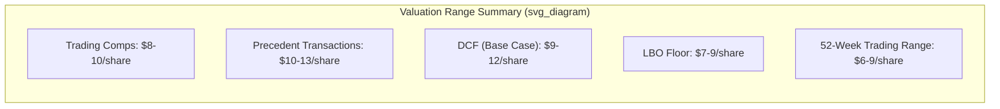

## Valuation Methods in M&A Transactions

### Overview

Valuation in M&A determines the price a bidder should pay and the minimum a target should accept. Because a single "true" value rarely exists, practitioners triangulate across several methods, each resting on different assumptions about markets, cash flows, and comparability.

### Discounted Cash Flow (DCF) Analysis

**Key Points**

- Values a firm as the present value of its projected future free cash flows (FCF), discounted at a rate reflecting risk.
- Standalone DCF values the target as-is; a separate synergy DCF values the combined entity to isolate deal-specific value creation.

$$V_0 = \sum_{t=1}^{n} \frac{FCF_t}{(1+r)^t} + \frac{TV_n}{(1+r)^n}$$

where $r$ is the discount rate (typically WACC for firm-level FCF) and $TV_n$ is the terminal value at year $n$.

**Free Cash Flow to Firm (FCFF):**

$$FCFF = EBIT(1-t) + D\&A - CapEx - \Delta NWC$$

**Terminal Value** — most commonly the Gordon Growth (perpetuity growth) method:

$$TV_n = \frac{FCF_{n+1}}{r - g}$$

An alternative is the exit multiple method, applying a comparable EV/EBITDA multiple to the final projected year's EBITDA. [Inference] Practitioners often cross-check the two TV methods against each other, since perpetuity growth assumptions can implicitly embed unrealistic long-run multiples.

**WACC:**

$$WACC = \frac{E}{V}r_e + \frac{D}{V}r_d(1-t)$$

with $r_e$ typically from CAPM:

$$r_e = r_f + \beta(r_m - r_f)$$

**In M&A specifically:**

- The discount rate should reflect the *target's* risk profile, not the acquirer's, unless the target will be fully integrated and re-levered to the acquirer's capital structure.
- Synergies (revenue, cost, tax) are often modeled as a separate cash flow stream and discounted at a rate reflecting their own risk (sometimes higher than the core business due to execution uncertainty).
- Control premium is implicitly captured when synergies and post-deal strategic changes are included in projected cash flows, rather than added as an ad hoc adjustment.

**Example**

A target has Year 1 FCFF of $50M, growing 5% annually, discounted at a WACC of 10%, with terminal growth $g = 2\%$:

$$TV = \frac{50 \times 1.05^{4} \times 1.02}{0.10 - 0.02} \approx \$791M \text{ (terminal value at Year 5)}$$

This is then discounted back to present value and summed with the explicit-period PVs.

**Limitations**

- Highly sensitive to $g$, $r$, and terminal year assumptions — small changes produce large valuation swings. [Inference] This sensitivity is often addressed with sensitivity tables or Monte Carlo simulation in practice, though the base method itself does not require this.
- Requires reliable multi-year projections, which are harder to construct for the target when the acquirer has limited information access (pre-signing).

### Comparable Company Analysis (CCA / "Trading Comps")

**Key Points**

- Values the target using valuation multiples observed for publicly traded peer companies.
- Common multiples: EV/EBITDA, EV/EBIT, EV/Revenue, P/E, EV/EBITDA is generally preferred as it is capital-structure-neutral and excludes non-operating/non-cash items.

$$EV = Multiple \times Metric$$

Common construction:

$$EV/EBITDA_{peer} \times EBITDA_{target} = EV_{target}$$

**Selection criteria for comparables:** industry, size, growth profile, margin structure, geography, capital intensity.

**Adjustments:**

- Normalize EBITDA for one-time items, non-recurring charges, and accounting differences.
- Apply a **control premium** to trading comps (since public market prices reflect minority, non-controlling stakes) when valuing a target for acquisition — typically layered on top of the comps-derived value rather than baked into the multiple itself.

**Limitations**

- Assumes market efficiency and true comparability, which rarely holds perfectly.
- Reflects minority-stake pricing unless explicitly adjusted, understating what a controlling acquirer would pay.

### Precedent Transaction Analysis ("Deal Comps")

**Key Points**

- Uses multiples paid in prior, comparable M&A transactions rather than public trading multiples.
- Inherently includes a control premium and synergy expectations already embedded in historical deal pricing — no separate premium adjustment is typically needed, unlike trading comps.

**Process:**

1. Identify precedent deals (similar industry, size, deal rationale, time period).
2. Compute transaction multiples (EV/EBITDA, EV/Revenue) at the time of announcement.
3. Apply the resulting multiple range to the target's financials.

**Limitations**

- Historical deals reflect market conditions (interest rates, sentiment, competitive dynamics) at the time of the transaction, which may not match current conditions.
- Deal terms and true synergy assumptions are often not fully disclosed, so multiples can be noisy.
- Precedent transaction data becomes stale; older deals are typically weighted less or excluded.

### Leveraged Buyout (LBO) Analysis / "Valuation Floor"

**Key Points**

- Not a valuation method in the traditional sense but a **capacity-to-pay** analysis: it determines the maximum price a financial sponsor could pay while still achieving a target internal rate of return (IRR), typically 20–25%, given feasible leverage levels.
- Frequently used as a valuation "floor" in M&A processes, since financial sponsors set a competitive baseline bid.

**Mechanics:**

1. Determine entry EV using assumed leverage (Debt/EBITDA multiple) and equity contribution.
2. Project cash flows, use them to pay down debt over a holding period (typically 3–7 years).
3. Assume an exit multiple (often similar to or conservative relative to the entry multiple) to determine exit EV.
4. Back-solve for the entry price that generates the sponsor's target IRR:

$$IRR = \left(\frac{Equity_{exit}}{Equity_{entry}}\right)^{1/n} - 1$$

**Example**

Entry EV $500M at 5.0x Debt/EBITDA ($100M EBITDA) implies $500M debt raised against $100M equity contributed (simplified, ignoring fees). If debt paydown and EBITDA growth bring exit equity value to $250M after 5 years:

$$IRR = (250/100)^{1/5} - 1 \approx 20.1\%$$

### Asset-Based Valuation

**Key Points**

- Values the firm based on the fair market value of its net assets (assets minus liabilities), rather than earnings or cash flow potential.
- More relevant for asset-heavy industries (real estate, natural resources, holding companies) or distressed/liquidation scenarios.

**Variants:**

- **Book value approach** — uses balance sheet carrying values (rarely reflects true market value).
- **Adjusted net asset value (NAV)** — restates assets and liabilities to fair market value, common in real estate and financial institutions.
- **Liquidation value** — estimates proceeds from an orderly or forced sale, typically the valuation floor in distressed M&A.

**Limitations**

- Ignores going-concern value, intangible assets (brand, customer relationships), and future earnings potential unless intangibles are explicitly appraised.

### Sum-of-the-Parts (SOTP) Valuation

**Key Points**

- Values a multi-segment or conglomerate target by valuing each business unit separately (using the most appropriate method per segment — DCF, comps, or asset-based) and summing the results, net of corporate-level costs and debt.
- Common when a target has genuinely distinct business lines that trade or would be valued at different multiples if standalone.

$$V_{firm} = \sum_{i=1}^{k} V_i - Corporate\ Overhead\ PV - Net\ Debt$$

### Synergy Valuation

**Key Points**

- Synergies are the incremental value created by combining the acquirer and target beyond their standalone values.
- Categorized as:
  - **Revenue synergies** — cross-selling, market access (generally discounted more heavily as less certain).
  - **Cost synergies** — headcount reduction, procurement scale, facility consolidation (generally more reliably quantified and realized).
  - **Financial synergies** — tax shields, lower cost of capital, improved debt capacity.

$$Synergy\ Value = PV(Combined\ FCF) - PV(Acquirer\ FCF) - PV(Target\ FCF)$$

**Practical note:** [Inference] Empirical M&A studies broadly find that cost synergies are realized more often and more fully than revenue synergies, which frequently fall short of initial estimates; the degree of shortfall is deal- and integration-specific.

### Football Field Chart (Valuation Summary)

Investment bankers typically present the output of multiple methods as overlapping value ranges — colloquially a "football field" — to show where valuation methods converge or diverge.

### Method Comparison Table

| Method | Reflects Control Premium? | Data Dependency | Best Used When |
| --- | --- | --- | --- |
| DCF | No (unless synergies added) | Internal projections | Stable, forecastable cash flows |
| Trading Comps | No (minority basis) | Public market data | Liquid peer set exists |
| Precedent Transactions | Yes (embedded) | Historical deal data | Recent comparable deals exist |
| LBO | N/A (floor/ceiling for sponsor) | Financing assumptions | Sponsor competitive bid benchmark |
| Asset-Based / NAV | No | Balance sheet/appraisals | Asset-heavy or distressed targets |
| SOTP | Depends on segment method | Segment-level data | Diversified/conglomerate targets |

### Valuation Bridge (Equity Value to Enterprise Value)

$$EV = Equity\ Value + Total\ Debt + Minority\ Interest + Preferred\ Equity - Cash\ \&\ Equivalents$$

This bridge is essential in M&A because offer prices are usually quoted per share (equity value), while valuation multiples are typically built on enterprise value, requiring consistent conversion.

**Related Topics**

- Accretion/dilution analysis
- Deal structuring: cash vs. stock consideration
- Control premiums and minority discounts
- Synergy realization and post-merger integration (PMI) risk
- Fairness opinions and the role of the financial advisor
- Contingent value rights (CVRs) and earnouts in valuation gaps
- Tax structuring: asset deals vs. stock deals