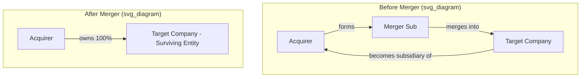

## Deal Financing and Structuring

### Overview

Deal structuring determines how an acquisition is legally organized and paid for. These two dimensions — consideration mix (financing) and transaction structure (legal/tax form) — are interdependent: financing sources constrain structure options, and structure choice affects tax treatment, liability exposure, and shareholder approval requirements.

### Consideration Structures (Method of Payment)

**Key Points**

- The three primary forms of consideration are cash, stock (acquirer shares), and a combination of both. Debt/notes and contingent instruments (earnouts, CVRs) are frequently layered on top.

**Cash Consideration**

- Funded via balance sheet cash, new debt issuance, or a combination.
- Target shareholders receive certain, fixed value — no exposure to post-deal combined-company performance.
- Fully taxable to target shareholders in the U.S. (capital gains recognized immediately), unlike stock deals which can qualify for tax deferral.
- Does not dilute acquirer's existing shareholders' ownership percentage, but increases financial leverage if debt-funded.

**Stock Consideration**

- Target shareholders receive acquirer shares, typically at a fixed exchange ratio or, less commonly, a fixed dollar value (floating exchange ratio, subject to collars).
- **Fixed exchange ratio:** target receives a set number of acquirer shares per target share regardless of price movement before closing — target shareholders bear acquirer share price risk.
- **Fixed value with collar:** exchange ratio floats within a band to deliver a target dollar value, protecting against extreme price swings up to the collar bounds.
- Can qualify as a tax-free reorganization under IRC Section 368 (U.S.) if structural requirements are met (continuity of interest, continuity of business enterprise, valid business purpose).
- Dilutes acquirer's existing shareholders proportional to shares issued.
- Gives target shareholders ongoing exposure to the combined entity — often used to align interests or when acquirer cash/debt capacity is limited.

**Exchange Ratio:**

$$Exchange\ Ratio = \frac{Offer\ Price\ per\ Target\ Share}{Acquirer\ Share\ Price}$$

**Mixed Consideration**

- Combines cash and stock, allowing the acquirer to manage leverage, dilution, and tax outcomes while giving target shareholders choice or a blended profile.
- Often structured with a proration mechanism if shareholders can elect their preferred mix but aggregate caps apply.

### Financing Sources

**Key Points**

- Acquirers fund cash considerations and refinance target debt through a capital stack blending several instrument types, balancing cost of capital, covenant flexibility, and speed of execution.

**Primary sources, roughly in order of seniority/cost:**

| Source | Cost | Seniority | Speed | Typical Use |
| --- | --- | --- | --- | --- |
| Cash on hand | Lowest (opportunity cost) | N/A | Fastest | Smaller deals, strong balance sheets |
| Revolving credit facility | Low-moderate | Senior secured | Fast | Bridge/interim funding |
| Term loans (bank debt) | Moderate | Senior secured | Moderate | Core leveraged financing |
| High-yield bonds | Higher | Senior unsecured/subordinated | Slower (market dependent) | Larger, sponsor-backed deals |
| Mezzanine/subordinated debt | High | Junior | Moderate | Gap financing |
| Preferred equity | High | Junior to debt | Moderate | Flexible, non-dilutive-ish capital |
| Common equity (new issuance) | Highest (in expected return terms) | Most junior | Slower (market/approval dependent) | Large deals, deleveraging |
| Seller financing/earnouts | Varies | Structurally junior | Fast to negotiate | Bridging valuation gaps |

**Bridge Financing**

- Short-term facility ("bridge loan") used to guarantee funding at signing when permanent financing (bonds, syndicated loans) hasn't yet been placed.
- Typically replaced ("taken out") by permanent debt shortly after closing; carries step-up pricing to incentivize refinancing.

**Commitment Letters and Financing Conditionality**

- In competitive processes, acquirers typically secure debt commitment letters from lenders before signing, so the deal isn't conditioned on financing (a "financing-out" is viewed negatively by sellers and increases deal risk premium).

### Leverage and Capital Structure Considerations

**Key Points**

- Post-deal leverage (Debt/EBITDA) is a central constraint, particularly in sponsor-led (LBO) deals, and affects credit ratings, covenant headroom, and interest coverage.

$$Interest\ Coverage = \frac{EBIT}{Interest\ Expense}$$

- Rating agencies and lenders evaluate pro forma leverage against industry norms; excessive leverage risks credit downgrades, raising the acquirer's cost of capital across its entire debt stack (not just the new deal debt).
- [Inference] Strategic (corporate) acquirers generally target more conservative leverage than financial sponsors, since sponsors typically size leverage to a target IRR within a defined holding period, while corporates manage leverage against long-term credit ratings and ongoing capital needs.

### Legal/Transaction Structures

**Key Points**

- The legal structure determines how ownership transfers, which liabilities pass to the acquirer, tax basis step-up eligibility, and approval requirements.

**Stock (Share) Purchase**

- Acquirer buys target shares directly from shareholders; target becomes a subsidiary with its corporate identity, contracts, and liabilities intact.
- Simpler to execute (contracts/licenses typically don't need re-assignment) but acquirer inherits all known and unknown liabilities.
- Generally does not permit a step-up in asset tax basis (in the U.S., absent a Section 338(h)(10) or 336(e) election to treat the stock purchase as an asset purchase for tax purposes).

**Asset Purchase**

- Acquirer buys specific assets and assumes only specified liabilities, leaving other liabilities with the seller entity.
- Allows selective acquisition (cherry-picking desired assets/contracts) and provides a stepped-up tax basis in acquired assets, generating higher future depreciation/amortization deductions.
- More operationally complex — contracts, licenses, and permits often require third-party consent to assign ("change of control" provisions).
- Sales/transfer taxes may apply to asset transfers depending on jurisdiction.

**Statutory Merger**

- Target merges into the acquirer (or a merger subsidiary) by operation of law; target's assets and liabilities transfer automatically without individual conveyance.
- **Forward merger:** target merges into acquirer (or its subsidiary), target ceases to exist.
- **Reverse triangular merger:** acquirer forms a merger subsidiary that merges into the target; target survives as a wholly owned subsidiary. This structure is common because it preserves the target's contracts and licenses (avoiding many "change of control" consent issues) while still allowing the deal to qualify as a tax-free reorganization if structured correctly.
- **Forward triangular merger:** target merges into the acquirer's merger subsidiary, which survives; less common than reverse triangular due to greater consent/assignment issues.

### Structuring Diagram — Reverse Triangular Merger

### Contingent Consideration Structures

**Key Points**

- Used to bridge valuation disagreements between buyer and seller, particularly when future performance is uncertain (e.g., early-stage or high-growth targets).

**Earnouts**

- Portion of purchase price paid contingent on the target achieving specified post-closing financial or operational milestones (revenue, EBITDA, product milestones) over a defined period.
- Aligns incentives and reduces upfront cash/financing needs, but introduces post-closing disputes risk over accounting treatment and operational control during the earnout period.

**Contingent Value Rights (CVRs)**

- Tradable or non-tradable rights entitling target shareholders to additional consideration if specified future events occur (e.g., regulatory approval of a drug, asset sale proceeds above a threshold).
- Common in biotech/pharma M&A given binary regulatory outcomes.

### Tax Structuring Considerations

**Key Points**

- Tax treatment is a primary driver of structure choice, balancing immediate tax cost to sellers against future tax benefits to buyers.

**Taxable transactions:**

- Cash deals and most asset purchases are taxable events for the seller at closing.
- Buyer benefits from a stepped-up asset basis (higher future depreciation/amortization shields).

**Tax-deferred reorganizations (U.S. context, IRC §368):**

- Stock-for-stock mergers can qualify for tax deferral to target shareholders if continuity-of-interest and continuity-of-business-enterprise requirements are met.
- [Unverified] Specific percentage thresholds for continuity of interest are IRS/case-law-derived guidelines rather than fixed statutory bright lines, and practitioners typically build in buffers (e.g., structuring for meaningfully more stock consideration than the minimum informally referenced) to preserve qualification; exact requirements should be confirmed with current tax counsel given the fact-specific nature of this test.

### Regulatory and Approval Considerations

**Key Points**

- Structure affects the approval pathway and timeline.
- **Shareholder approval:** typically required for statutory mergers and large asset sales; stock purchases from consenting shareholders may not require target-wide shareholder votes.
- **Antitrust/competition clearance:** required across structures if size thresholds are met (e.g., Hart-Scott-Rodino in the U.S., EU Merger Regulation); structure choice does not exempt a deal from antitrust review.
- **Third-party consents:** more extensive in asset purchases and forward mergers due to contract assignment requirements; minimized in reverse triangular mergers and stock purchases.

### Deal Structure Decision Framework

| Consideration | Cash Deal | Stock Deal | Asset Purchase | Stock Purchase | Reverse Triangular Merger |
| --- | --- | --- | --- | --- | --- |
| Seller tax treatment | Taxable | Potentially deferred | Taxable | Taxable (unless election) | Potentially deferred |
| Buyer tax basis step-up | N/A (financing) | N/A (financing) | Yes | No (unless election) | No |
| Liability exposure to buyer | N/A (financing) | N/A (financing) | Selective | Full (inherited) | Full (inherited) |
| Third-party consents needed | Varies | Varies | Extensive | Minimal | Minimal |
| Acquirer dilution | None | Yes | None | None | None |
| Shareholder vote (target) | Often required | Often required | Sometimes | Sometimes | Typically required |

**Related Topics**

- Accretion/dilution analysis for stock-funded deals
- Debt covenants and credit agreement structuring
- Section 338(h)(10) and 336(e) elections
- Antitrust review process (HSR Act, EU Merger Regulation)
- Merger agreement key terms (reps & warranties, MAC clauses, break fees)
- Post-merger integration and financing refinancing (bridge take-out)