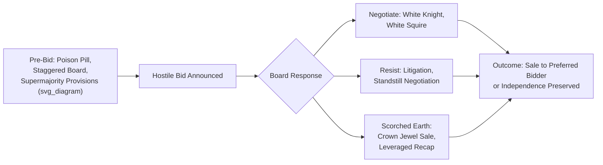

## Takeover Defenses

### Overview

Takeover defenses are legal and financial mechanisms that a target company's board and management use to prevent, delay, or increase the cost of an unsolicited (hostile) acquisition attempt. Defenses are typically classified as **preventive** (put in place before any bid emerges) or **active/reactive** (deployed in response to an actual hostile approach).

### Preventive (Pre-Bid) Defenses

**Poison Pill (Shareholder Rights Plan)**

**Key Points**

- Grants existing shareholders (other than the hostile acquirer) the right to purchase additional shares at a steep discount if an acquirer's ownership crosses a specified threshold (commonly 10–20%), massively diluting the acquirer's stake and voting power.
- Two main forms:
  - **Flip-in pill:** existing shareholders (excluding the triggering acquirer) can buy target shares at a discount.
  - **Flip-over pill:** target shareholders can buy *acquirer* shares at a discount if the hostile deal proceeds to completion, diluting the acquirer's own shareholders.
- Typically adopted by board resolution without shareholder vote and can be rescinded by the board — this redeemability is central to its legal defensibility, since it functions as a negotiating tool (forcing the bidder to negotiate with the board) rather than an absolute bar.
- [Inference] Courts (notably in Delaware) have generally upheld poison pills under the *Unocal* proportionality standard, provided the pill is a proportionate response to a legitimate, board-perceived threat — the specific proportionality analysis is fact-specific and jurisdiction-dependent, so this should not be treated as a guarantee of validity in all circumstances.

**Staggered (Classified) Board**

**Key Points**

- Divides the board into classes (typically three), with only one class up for election each year, meaning a hostile acquirer cannot replace the entire board in a single proxy contest even after winning a shareholder vote.
- Significantly slows down (though does not prevent) an acquirer's ability to gain board control, since a takeover of full board control would take multiple annual meeting cycles.

**Supermajority Voting Provisions**

**Key Points**

- Charter/bylaw provisions requiring a supermajority vote (e.g., 66.7% or 80%) rather than a simple majority to approve mergers, remove directors, or amend certain charter provisions.
- Raises the practical bar for a hostile acquirer to secure the votes needed to complete a merger or restructure the board.

**Dual-Class Share Structures**

**Key Points**

- Issues share classes with disproportionate voting rights (e.g., founder/insider shares carrying 10 votes per share vs. 1 vote for public shares), concentrating voting control with insiders regardless of economic ownership percentage.
- Common at IPO for founder-controlled companies; makes a hostile takeover structurally difficult since acquiring a majority of *economic* shares does not confer majority *voting* control.

**Fair Price Provisions**

**Key Points**

- Charter provisions requiring an acquirer to pay all shareholders the same (typically highest recently paid) price, preventing two-tier tender offers where an acquirer pays a premium for a controlling stake and a lower price for remaining shares.

### Active/Reactive Defenses

**White Knight**

**Key Points**

- Target management solicits a friendlier, more acceptable acquirer to make a competing bid, intending to displace the hostile bidder while still resulting in the company being acquired.
- Board fiduciary duties under *Revlon* (Delaware) generally apply once a sale of control becomes inevitable, requiring the board to seek the best reasonably available value for shareholders among competing offers — the applicability threshold and precise obligations are fact-specific.

**White Squire**

**Key Points**

- Target places a significant block of shares (often via a private placement) with a friendly investor to dilute the hostile acquirer's potential ownership and create a blocking minority stake, without fully selling the company.

**Pac-Man Defense**

**Key Points**

- Target turns the tables and launches a counter-tender offer for the hostile acquirer's own shares, attempting to acquire the acquirer instead.
- Rarely used in practice, as it requires the (smaller, targeted) company to have sufficient financing capacity to credibly bid for the acquirer — [Inference] generally only feasible when the target is of comparable or greater financial capacity than the acquirer, which is uncommon in typical hostile-bid size dynamics.

**Greenmail**

**Key Points**

- Target repurchases the hostile acquirer's accumulated shares at a premium in exchange for the acquirer agreeing to halt the takeover attempt (often via a standstill agreement).
- Largely disfavored/restricted today: subject to punitive taxation in the U.S. (IRC Section 5881 imposes a substantial excise tax on greenmail gains) and generally viewed skeptically by courts and shareholders as benefiting the acquirer and management at the expense of remaining shareholders.

**Standstill Agreements**

**Key Points**

- Contractual agreement in which an acquirer agrees not to purchase additional shares, launch a tender offer, or wage a proxy contest for a specified period, often negotiated in exchange for board representation, information access, or a share repurchase.

**Litigation**

**Key Points**

- Target challenges the legality of the tender offer, disclosure adequacy, or antitrust implications in court, primarily to delay the hostile bid and create negotiating leverage or buy time for other defenses to be deployed.

**Recapitalization ("Leveraged Recap")**

**Key Points**

- Target takes on significant debt to fund a large special dividend or share buyback, increasing leverage and reducing the cash/balance sheet capacity that would otherwise make the company an attractive (and more easily financed) target, while also increasing insider ownership percentage if buybacks are used.

### Structural / Operational Defenses ("Scorched Earth")

**Crown Jewel Defense**

**Key Points**

- Target agrees to sell or grants an option to a friendly third party (often the white knight) on its most valuable assets or business units ("crown jewels") if a hostile takeover succeeds, making the company significantly less attractive to the original hostile bidder.
- Considered an aggressive, high-risk defense as it can permanently impair the company's value regardless of whether the takeover is ultimately repelled; subject to heightened judicial scrutiny.

**Golden Parachutes**

**Key Points**

- Employment agreements guaranteeing senior executives substantial severance payments/benefits if they are terminated following a change of control.
- Functions partly as a defense by raising the acquirer's effective cost of the transaction, and partly as a retention/alignment tool to reduce management's personal incentive to resist a deal that would benefit shareholders.

**Golden/Tin/Silver Parachutes (Tiered)**

**Key Points**

- **Golden parachutes:** senior executives.
- **Silver parachutes:** middle management, typically smaller payouts.
- **Tin parachutes:** broader employee base, often modest severance enhancements — sometimes used to build broader internal resistance to a hostile deal.

### Legal/Fiduciary Framework (U.S., Delaware-centric)

**Key Points**

- *Unocal Corp. v. Mesa Petroleum (1985):* established the standard that defensive measures must be a reasonable and proportionate response to an identified threat to corporate policy and effectiveness.
- *Revlon, Inc. v. MacAndrews & Forbes (1986):* once a company's sale or breakup becomes inevitable, the board's duty shifts to maximizing shareholder value in the immediate transaction ("Revlon duties"), constraining the use of defenses that would foreclose a higher-value competing bid.
- *Moran v. Household International (1985):* upheld the validity of poison pills as a legitimate defensive tool under board fiduciary authority.
- [Unverified] The precise triggers for when *Revlon* duties attach (versus *Unocal*'s more general reasonableness standard continuing to apply) are fact-specific and have been refined across subsequent case law; this summary reflects commonly cited foundational precedent rather than a complete or current survey of case law, and should be verified against current legal counsel for any specific transaction.

### Defense Selection Considerations

| Defense | Timing | Primary Effect | Reversibility |
| --- | --- | --- | --- |
| Poison pill | Preventive | Dilutes hostile acquirer | Yes (board can redeem) |
| Staggered board | Preventive | Delays board control | Requires charter amendment |
| Supermajority vote | Preventive | Raises approval threshold | Requires charter amendment |
| White knight | Reactive | Introduces competing bidder | N/A (deal-specific) |
| Greenmail | Reactive | Buys out hostile stake | N/A (one-time) |
| Crown jewel | Reactive | Reduces target attractiveness | Largely irreversible |
| Golden parachute | Preventive | Raises acquisition cost | Contractual, hard to unwind |
| Leveraged recap | Preventive/Reactive | Increases leverage, reduces attractiveness | Partially reversible over time |

### Takeover Defense Timeline

**Related Topics**

- Tender offers and the Williams Act disclosure regime (Schedule 13D/TO)
- Proxy contests and proxy fights
- Fiduciary duty standards: *Unocal*, *Revlon*, *Blasius*
- Activist investor campaigns and defense implications
- Board composition and governance best practices
- Comparative takeover defense regimes (U.S. vs. UK City Code, which restricts most defenses without shareholder approval)