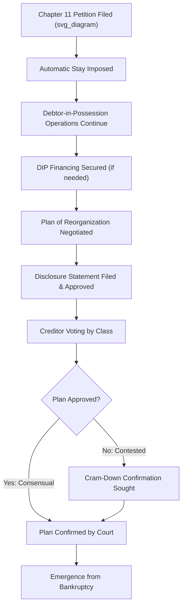

## Corporate Bankruptcy and Restructuring

### Overview

Corporate bankruptcy and restructuring address situations where a firm cannot meet its obligations as they come due (insolvency) or faces unsustainable capital structure/operating distress. Restructuring can occur formally, through court-supervised bankruptcy proceedings, or informally, through negotiated out-of-court agreements. The choice of path depends on creditor consensus, urgency, litigation risk, and jurisdiction-specific legal frameworks.

### Financial Distress: Definitions and Triggers

**Key Points**

- **Economic distress:** the firm's business model or industry is fundamentally unprofitable, independent of capital structure.
- **Financial distress:** the firm's operations may be viable, but its capital structure (debt burden) is unsustainable relative to cash flow generation.
- **Insolvency** — two standards commonly applied:
  - **Balance sheet insolvency:** liabilities exceed the fair market value of assets.
  - **Cash flow (equitable) insolvency:** the firm cannot pay debts as they come due, regardless of balance sheet position.

**Common triggers:** covenant breaches, missed interest/principal payments, liquidity shortfalls, going-concern audit qualifications, credit rating downgrades below investment grade thresholds, and loss of vendor/supplier trade credit.

### Out-of-Court Restructuring (Workouts)

**Key Points**

- Negotiated directly between the debtor and creditors without filing for bankruptcy protection, generally faster and less costly than formal proceedings, but requires broad creditor consensus since dissenting creditors cannot be legally bound (no "cram-down" mechanism exists outside court).

**Common workout tools:**

- **Debt rescheduling:** extending maturities, deferring interest, or amending covenants ("amend and extend").
- **Debt-for-equity swap:** creditors exchange debt claims for equity ownership, reducing leverage and cash interest burden while giving creditors upside participation.
- **Exchange offers:** existing bondholders are offered new securities (often with lower face value, longer maturity, or different seniority) in exchange for existing debt.
- **Standstill agreements:** creditors agree to temporarily forbear from exercising default remedies while negotiations proceed.

**Limitations**

- Requires near-unanimous creditor cooperation; a single holdout creditor can refuse to participate and potentially free-ride on concessions made by others (the "holdout problem"), which often pushes complex cases toward formal bankruptcy despite its higher cost.
- No automatic stay protection from litigation or creditor collection actions during negotiations.

### Formal Bankruptcy: U.S. Framework

**Key Points**

- The U.S. Bankruptcy Code provides the dominant reference framework in most finance curricula; other jurisdictions (UK Administration/CVA, EU Insolvency Regulation frameworks) have analogous but distinct mechanisms. [Unverified] Specific procedural details vary significantly by jurisdiction and this section focuses on U.S. Chapters 7 and 11 as the standard reference points.

**Chapter 7 — Liquidation**

- Business ceases operations; a court-appointed trustee liquidates assets and distributes proceeds to creditors according to absolute priority.
- Used when the business is not viable as a going concern or when reorganization is not feasible.

**Chapter 11 — Reorganization**

- Debtor typically continues operating as "debtor-in-possession" (DIP), retaining management control (subject to court and creditor oversight) while restructuring debts and operations under a court-supervised plan.
- Objective is to emerge as a viable going concern with a sustainable capital structure, rather than liquidate.

### Chapter 11 Process Flow

### Key Mechanisms in Chapter 11

**Automatic Stay**

**Key Points**

- Filing immediately halts virtually all collection actions, litigation, foreclosures, and creditor enforcement efforts against the debtor, providing breathing room to negotiate a plan without piecemeal creditor actions.

**Debtor-in-Possession (DIP) Financing**

**Key Points**

- New financing extended to a company operating under Chapter 11, typically necessary to fund operations during the case.
- Usually granted priority status (often senior to pre-petition secured debt, "priming" liens) under Bankruptcy Code Section 364, making it attractive to lenders despite the debtor's distressed state, since DIP loans are typically repaid first upon emergence or liquidation.

**Absolute Priority Rule**

**Key Points**

- Governs the order in which claims must be satisfied in a reorganization plan: senior secured creditors, junior secured creditors, unsecured creditors, preferred equity, and common equity, in that order — with each class needing to be paid in full before a more junior class receives any recovery, unless senior classes consent otherwise.

$$\text{Typical priority stack (highest to lowest):}$$

1. DIP financing / administrative claims
2. Secured debt (by lien priority)
3. Unsecured claims (bonds, trade creditors)
4. Subordinated debt
5. Preferred equity
6. Common equity

**Cram-Down**

**Key Points**

- Allows a bankruptcy court to confirm a reorganization plan over the objection of a dissenting class of creditors, provided the plan is "fair and equitable" and does not "unfairly discriminate" against the dissenting class — typically requiring strict adherence to the absolute priority rule for that class unless consent is given.
- Effectively solves the out-of-court holdout problem, since a cram-down binds dissenting creditors within an already-approving class structure once statutory requirements are met.

**Plan of Reorganization**

**Key Points**

- Legal document specifying how each class of claims and interests will be treated (paid in cash, converted to new debt, converted to equity, or extinguished).
- Requires acceptance by creditor classes (generally, a class accepts if holders of at least two-thirds in amount and more than one-half in number of voting claims in that class approve) and court confirmation.

**Fresh-Start Accounting**

**Key Points**

- Upon emergence, if pre-emergence shareholders receive less than 50% of the reorganized entity's equity and reorganization value is less than pre-petition liabilities, the company may apply fresh-start reporting: assets and liabilities are restated to fair value, and accumulated deficit is reset, similar to purchase accounting in an acquisition.

### Valuation in Restructuring

**Key Points**

- **Enterprise value (reorganization value)** is central to bankruptcy proceedings, as it determines which creditor classes receive recovery and how much — commonly estimated via DCF, comparable company, and precedent transaction methods (see standard M&A valuation methodologies), adapted for distressed-scenario projections.
- **Fulcrum security:** the tranche of debt where recovery value transitions from full (senior, more secured) to partial/zero (more junior) — this class typically receives the reorganized equity and drives negotiating leverage, since it stands to gain or lose the most based on the final valuation determination.

$$\text{If } EV_{reorg} < \text{Senior Debt} + \text{Junior Debt}: \text{Junior debt holders receive partial/no recovery, often converting into new equity}$$

### Distressed Debt Investing Context

**Key Points**

- Distressed debt investors ("vulture funds," special situations funds) purchase claims at a discount, often targeting the fulcrum security to gain control of the reorganized company's equity upon emergence.
- Claims trading is common during the case; investors may accumulate blocking positions within a creditor class to influence plan negotiations.

### Alternative and Cross-Border Mechanisms

**Prepackaged and Prearranged Bankruptcy**

**Key Points**

- **Prepackaged ("prepack"):** the reorganization plan is negotiated and creditor votes are largely solicited *before* the formal filing, allowing the company to move through Chapter 11 in a compressed timeframe (sometimes weeks rather than months/years).
- **Prearranged:** key terms and major creditor support are negotiated pre-filing, but formal solicitation/voting occurs after filing — a middle ground between a full prepack and a traditional freefall filing.

**Section 363 Sales**

**Key Points**

- Allows the debtor to sell assets (or the entire business) free and clear of liens, claims, and encumbrances during the bankruptcy case, subject to court approval — often used for speed when preserving going-concern value quickly is more important than a full plan negotiation process.
- Frequently structured with a "stalking horse" bidder (an initial bidder who sets a floor price and receives bid protections such as break-up fees) followed by a competitive auction process.

**Cross-Border Insolvency**

**Key Points**

- Multinational restructurings may involve coordination across jurisdictions; Chapter 15 of the U.S. Bankruptcy Code (adopting the UNCITRAL Model Law framework) provides a mechanism for U.S. courts to recognize and cooperate with foreign insolvency proceedings.

### Restructuring Outcomes Comparison

| Dimension | Out-of-Court Workout | Chapter 11 Reorganization | Chapter 7 Liquidation |
| --- | --- | --- | --- |
| Speed | Fastest (if consensual) | Moderate to slow | Slowest (asset disposition) |
| Cost | Lowest | High (legal/advisory fees) | Moderate |
| Binding on dissenters | No | Yes (via cram-down) | Yes |
| Business continuity | Preserved | Preserved (going concern) | Ceases |
| Management control | Retained | Retained (as DIP), subject to oversight | Lost (trustee-controlled) |
| Creditor recovery certainty | Lower (holdout risk) | Structured, priority-based | Priority-based, often lower recovery |

**Related Topics**

- Distressed debt valuation and fulcrum security analysis
- Absolute priority rule and creditor class negotiations
- DIP financing structures and priming liens
- Section 363 asset sales and stalking horse bidding
- Fresh-start accounting and emergence balance sheets
- Cross-border insolvency (Chapter 15, UNCITRAL Model Law)
- Distressed M&A (acquiring assets/companies out of bankruptcy)