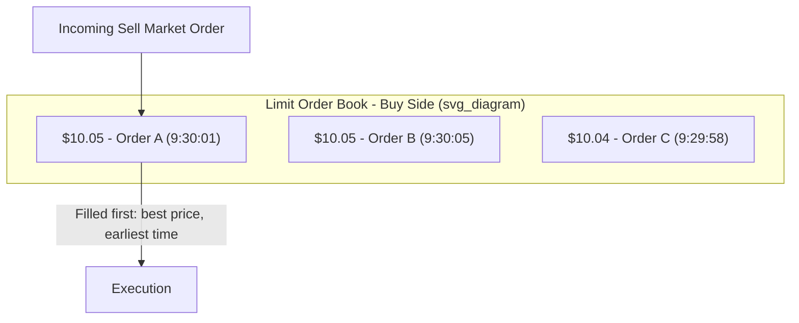

## Order Types and Trading Mechanisms

### Overview

Market microstructure examines how the specific mechanics of trading — order types, matching rules, and venue design — affect price formation, liquidity, and transaction costs. Order types are the basic instructions traders submit; trading mechanisms are the venue-level rules (continuous auction, periodic auction, dealer market) that determine how those orders interact and execute.

### Core Order Types

**Market Order**

**Key Points**

- Instructs immediate execution at the best available price(s), prioritizing certainty of execution over price certainty.
- Guarantees a fill (assuming sufficient liquidity exists) but exposes the trader to price uncertainty, particularly in thin or volatile markets — large market orders can "walk the book," consuming multiple price levels and resulting in a worse average execution price than the quoted best bid/offer.

**Limit Order**

**Key Points**

- Specifies a maximum price willing to pay (buy limit) or minimum price willing to accept (sell limit); executes only at the specified price or better.
- Guarantees price but not execution — the order may never fill if the market doesn't reach the limit price.
- Limit orders that do not immediately execute rest on the order book, providing liquidity to the market (the trader submitting it becomes a "liquidity provider" or "maker").

**Stop Order (Stop-Loss Order)**

**Key Points**

- Becomes a market order once a specified trigger price ("stop price") is reached, typically used to limit losses on an existing position or to enter a position on a breakout.
- Once triggered, execution price is not guaranteed — in fast-moving markets, the actual fill can be significantly worse than the stop price ("slippage"), particularly during gaps or low-liquidity conditions.

**Stop-Limit Order**

**Key Points**

- Combines stop and limit mechanics: once the stop price is triggered, the order becomes a *limit* order (not a market order) at a specified limit price, rather than executing at whatever price is available.
- Reduces slippage risk relative to a plain stop order but introduces the risk of non-execution if the market moves past the limit price before the order can fill.

**Market-If-Touched (MIT) / Take-Profit Order**

**Key Points**

- Similar mechanics to a stop order but typically used to enter a position or take profit when a favorable price level is reached, converting to a market order upon being touched.

### Order Duration / Time-in-Force Instructions

**Key Points**

| Instruction | Meaning |
| --- | --- |
| Day order | Valid only for the current trading session; cancelled if unfilled at close |
| Good-'Til-Cancelled (GTC) | Remains active until executed or explicitly cancelled (subject to broker/exchange maximum duration) |
| Immediate-or-Cancel (IOC) | Executes whatever portion is immediately available; unfilled remainder is cancelled |
| Fill-or-Kill (FOK) | Must execute in full immediately, or the entire order is cancelled |
| Good-'Til-Date (GTD) | Remains active until a specified expiration date |
| All-or-None (AON) | Must be filled in its entirety (can remain resting if not immediately fully fillable, unlike FOK) |

### Advanced/Algorithmic Order Types

**Iceberg (Reserve) Order**

**Key Points**

- Displays only a small portion of the total order size to the market at any time, with the remainder hidden and automatically replenished as the visible portion executes.
- Used by large institutional traders to minimize market impact and information leakage that would otherwise result from revealing the full order size.

**Pegged Order**

**Key Points**

- Price automatically adjusts relative to a reference point (e.g., the National Best Bid and Offer midpoint, the primary market's best bid/offer) as the market moves, rather than being fixed at submission.

**Discretionary Order**

**Key Points**

- Displays a specific limit price but grants the broker/algorithm discretion to execute within a specified additional price range if needed to complete the trade.

**VWAP/TWAP Algorithmic Orders**

**Key Points**

- **VWAP (Volume-Weighted Average Price):** algorithm slices a large parent order into smaller child orders, targeting execution proportional to expected trading volume throughout the day, aiming to achieve an average execution price close to the market's VWAP.
- **TWAP (Time-Weighted Average Price):** slices the order evenly across specified time intervals rather than weighting by volume.
- Both are designed to minimize market impact by spreading large orders over time rather than executing all at once.

$$VWAP = \frac{\sum (Price_i \times Volume_i)}{\sum Volume_i}$$

### Trading Mechanisms and Market Structures

**Continuous Auction (Order-Driven) Market**

**Key Points**

- Orders are matched continuously throughout the trading session as they arrive, typically using **price-time priority**: orders are ranked first by price (best price first), then by time of submission among orders at the same price.
- Most major equity exchanges (NYSE, Nasdaq for continuous trading) operate primarily as continuous, order-driven, price-time priority markets during regular trading hours.

**Price-Time Priority Matching Example**

**Periodic (Call) Auction**

**Key Points**

- Orders accumulate over a specified period without executing, then are matched simultaneously at a single clearing price that maximizes the volume of shares that can be executed (uncrossing algorithm).
- Commonly used for market opens and closes (opening/closing auctions) to establish a robust reference price from accumulated overnight or end-of-day order flow, reducing the volatility and manipulation risk associated with thin continuous trading at the open/close.

**Dealer (Quote-Driven) Market**

**Key Points**

- Designated market makers/dealers continuously post bid and ask quotes and stand ready to trade at those prices, providing liquidity, in contrast to order-driven markets where liquidity comes from resting customer limit orders.
- Historical Nasdaq dealer market and most OTC/bond markets operate on this model; dealers earn the bid-ask spread as compensation for providing continuous liquidity and bearing inventory risk.

**Hybrid Markets**

**Key Points**

- Combine order-driven continuous trading with designated market makers who supplement liquidity, particularly during periods of order imbalance or volatility (e.g., NYSE's Designated Market Maker system operating alongside its continuous electronic limit order book).

### Dark Pools and Alternative Trading Systems (ATS)

**Key Points**

- **Dark pools:** private trading venues where order size and price are not displayed pre-trade, only reported post-trade, allowing institutional traders to execute large orders with reduced information leakage and market impact.
- Typically match orders at a reference price derived from the public "lit" market (e.g., the NBBO midpoint) rather than through independent price discovery.
- [Inference] Regulatory attention to dark pool market share has increased over time due to concerns about fragmented price discovery and potential conflicts of interest at broker-operated venues, though specific regulatory requirements vary by jurisdiction and evolve over time; current rules should be verified against the applicable regulator's current guidance.

### Bid-Ask Spread and Liquidity

**Key Points**

- The bid-ask spread compensates liquidity providers for inventory risk and adverse selection risk (the risk of trading against better-informed counterparties).

$$Spread = Ask - Bid$$

$$Effective\ Spread = 2 \times |Execution\ Price - Midpoint|$$

- Spreads are generally narrower for liquid, high-volume securities and wider for illiquid, small-cap, or volatile securities, reflecting the market maker's compensation requirements for the risks involved.

### Market Impact and Execution Cost

**Key Points**

- **Market impact:** the price movement caused by the act of trading itself, generally increasing with order size relative to available liquidity (typically modeled as increasing with the square root of order size relative to average daily volume, though the specific functional form varies by model and market).
- **Implementation shortfall:** the total cost of executing a trade relative to the price at the time the investment decision was made, capturing both market impact and the opportunity cost of any unfilled/delayed portion of the order.

$$Implementation\ Shortfall = (P_{execution} - P_{decision}) \times Shares\ Executed + Opportunity\ Cost\ on\ Unfilled\ Shares$$

### Order Type / Mechanism Summary

| Order Type | Price Certainty | Execution Certainty | Primary Use Case |
| --- | --- | --- | --- |
| Market | No | High | Immediate execution priority |
| Limit | Yes | No | Price control, passive liquidity provision |
| Stop | No (once triggered) | Moderate | Loss limitation, breakout entry |
| Stop-limit | Yes (once triggered) | Lower | Loss limitation with price control |
| Iceberg | Yes | Depends on total size | Large order, minimize market impact |
| VWAP/TWAP algo | Approximate (benchmark-relative) | High (over time horizon) | Large order execution, cost minimization |

**Related Topics**

- Bid-ask spread decomposition (order processing, inventory, adverse selection costs)
- High-frequency trading and latency arbitrage
- Regulation NMS and order routing obligations (U.S. context)
- Market maker inventory management models (Glosten-Milgrom, Kyle model)
- Payment for order flow and broker routing conflicts
- Price discovery and informational efficiency across fragmented venues