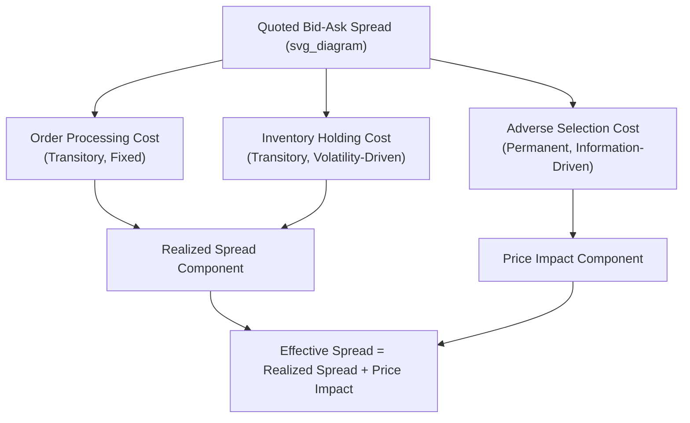

## Bid-Ask Spread Decomposition

### Overview

Bid-ask spread decomposition breaks down the observed quoted or effective spread into its underlying economic components. This matters because the spread is not simply a market maker's arbitrary markup — it is compensation for specific, quantifiable risks and costs, and understanding its composition explains cross-sectional variation in liquidity across securities and time.

### The Three Classical Components

**Key Points**

- The dominant theoretical framework decomposes the bid-ask spread into three components: order processing costs, inventory holding costs, and adverse selection (information asymmetry) costs.

$$Spread = Order\ Processing\ Cost + Inventory\ Holding\ Cost + Adverse\ Selection\ Cost$$

### Order Processing Costs

**Key Points**

- The fixed and variable costs a market maker incurs simply to operate: exchange fees, clearing and settlement costs, technology infrastructure, and normal profit margin for providing the service of continuous liquidity.
- This component is largely **transitory** — it does not depend on information content and would exist even in a market with no informed traders, since it reflects the mechanical cost of running a dealing operation.
- Generally the least variable of the three components across securities of similar exchange listing, though absolute magnitude scales inversely with trading volume (fixed costs are spread over more trades in liquid names).

### Inventory Holding Costs

**Key Points**

- Compensation for the risk a market maker bears by holding a non-zero, potentially unbalanced inventory position while waiting to offload it, since holding inventory exposes the dealer to adverse price movements before the position can be unwound.
- Market makers adjust quotes based on current inventory levels: a dealer long a security will lower both bid and ask (skewing quotes to encourage selling to them less and buying from them more, or more precisely to attract sell-side flow and discourage further accumulation) to rebalance toward a target (often zero) inventory position.
- **Garman (1976)** and **Amihud-Mendelson (1980)** inventory models are foundational: they show optimal bid-ask spreads and quote adjustments emerge from a dealer managing inventory risk and the probability of order arrival, absent any informational asymmetry.
- Inventory cost is a function of the security's return volatility (higher volatility = higher risk of adverse price moves while holding inventory) and the dealer's risk aversion/capital constraints.

$$\text{Inventory risk} \propto \sigma^2 \times \text{Holding Period} \times \text{Position Size}$$

### Adverse Selection Costs

**Key Points**

- Compensation for the risk of trading against a counterparty who possesses superior private information about the security's true value — informed traders will only transact when it's profitable for them, meaning the dealer is systematically disadvantaged on the other side of informed trades.
- This is the only component of the three that reflects genuine information asymmetry, and is central to market microstructure theory's focus on price discovery.
- **Glosten-Milgrom (1985) model:** dealers set bid and ask prices as conditional expectations of asset value, given that a trade occurs on that side — the dealer rationally widens the spread to protect against the probability that any given counterparty is informed.

$$Ask = E[V | \text{buy order arrives}], \quad Bid = E[V | \text{sell order arrives}]$$

- As the proportion of informed traders in the order flow increases, the dealer must widen the spread to break even on average across informed and uninformed (noise) trades.
- Unlike order processing and inventory costs, adverse selection costs are **permanent** — the price impact from an informed trade is not fully reversed afterward because it reflects a genuine, lasting update to the market's estimate of fundamental value.

### Distinguishing Permanent vs. Transitory Price Impact

**Key Points**

- A core empirical technique for decomposition relies on distinguishing the **permanent** component of a trade's price impact (informational) from the **transitory** component (inventory/order processing, which reverses as the dealer manages inventory and other traders react).

$$\Delta P_t = \text{Permanent Component (Adverse Selection)} + \text{Transitory Component (Inventory/Processing)}$$

- Empirically, researchers often measure this by observing price behavior *after* a trade: if prices continue moving in the direction of the trade (buy triggers further price increase), this signals adverse selection; if prices revert toward the pre-trade level, this signals inventory/processing effects.

### The Roll (1984) Model

**Key Points**

- One of the earliest and simplest empirical approaches to estimating the effective spread from transaction price data alone, without requiring quote data.
- Assumes the fundamental value follows a random walk and that the observed transaction price bounces between bid and ask due to order flow, inducing negative serial covariance in consecutive price changes.

$$Spread_{Roll} = 2\sqrt{-Cov(\Delta P_t, \Delta P_{t-1})}$$

- **Limitation:** the Roll model assumes no adverse selection component (it attributes the entire spread to the bid-ask bounce mechanism), so it tends to underestimate the true spread when informed trading is present, and can produce an undefined (negative-radicand) result if serial covariance is positive.

### Glosten and Harris (1988) Decomposition

**Key Points**

- Extends the Roll framework to formally separate the spread into an adverse selection component and a transitory (order processing/inventory) component using regression-based estimation on transaction price changes and signed order flow, rather than assuming the entire spread is transitory as Roll does.

$$\Delta P_t = (\text{Adverse Selection Component}) \times Q_t + (\text{Transitory Component}) \times \Delta Q_t + \epsilon_t$$

where $Q_t$ is a trade direction indicator (+1 for buy, -1 for sell).

### Empirical Proxies and Measures

**Quoted Spread**

$$Quoted\ Spread = Ask - Bid$$

**Effective Spread** (accounts for trades executing inside the quoted spread, e.g., via price improvement or midpoint crossing)

$$Effective\ Spread = 2 \times |P_{trade} - Midpoint_{quote}|$$

**Realized Spread** (captures only the transitory/order-processing-plus-inventory component, by comparing execution price to the midpoint *after* the trade, once information has been incorporated)

$$Realized\ Spread = 2 \times D_t \times (P_{trade} - Midpoint_{t+\Delta})$$

where $D_t = +1$ for a buyer-initiated trade, $-1$ for a seller-initiated trade, and $Midpoint_{t+\Delta}$ is the quote midpoint some interval after the trade (e.g., 5 minutes).

**Price Impact (Adverse Selection Component)**

$$Price\ Impact = Effective\ Spread - Realized\ Spread$$

This follows directly from the effective spread being decomposable into the realized spread (transitory) plus price impact (permanent/informational).

### Decomposition Diagram

### Cross-Sectional Determinants of Spread Components

**Key Points**

- **Adverse selection component tends to be larger for:** securities with greater information asymmetry (e.g., stocks with more dispersed analyst forecasts, smaller/less-followed companies, periods around earnings announcements or corporate events).
- **Inventory component tends to be larger for:** more volatile securities and securities where dealers face greater difficulty offloading positions (lower trading volume, higher search costs to find a counterparty).
- **Order processing component tends to be relatively stable** across securities on the same venue, primarily reflecting fixed operational costs, and thus represents a smaller share of the total spread for high-priced or high-volume securities where the fixed cost is amortized over more activity.

### Practical Implications

**Key Points**

- Spread decomposition informs execution strategy: a spread dominated by adverse selection suggests trading around news events carries higher implicit cost, while a spread dominated by inventory/processing costs suggests cost is more a function of venue and timing rather than information leakage.
- Regulators and exchanges use these frameworks to evaluate market quality and the effects of market structure changes (e.g., tick size reforms, maker-taker fee changes) on the relative weight of each spread component.
- [Inference] Since informed trading concentrates disproportionately around scheduled information events, the adverse selection component of the spread is generally expected to be time-varying and elevated around such events relative to normal trading periods, though the precise magnitude is empirically estimated on a case-by-case basis rather than following a fixed rule.

**Related Topics**

- Glosten-Milgrom and Kyle (1985) models of informed trading
- Order types and trading mechanisms (price-time priority, dark pools)
- Market impact models and implementation shortfall
- High-frequency trading and its effect on adverse selection dynamics
- PIN (Probability of Informed Trading) model
- Tick size and its effect on spread components