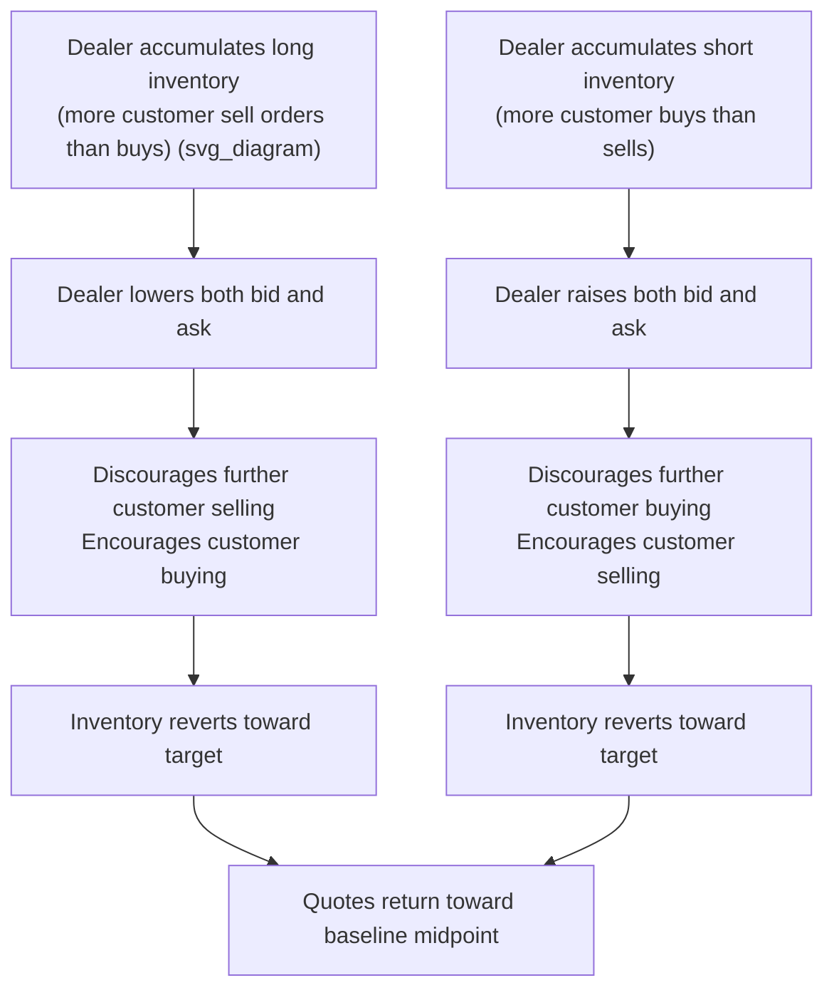

## Inventory Models of Market Making

### Overview

Inventory models explain how market makers set bid and ask quotes as a function of the inventory risk they bear, independent of information asymmetry. Where adverse-selection models (Glosten-Milgrom, Kyle) focus on the risk of trading against informed counterparties, inventory models focus on a distinct risk: holding a non-zero position exposes the dealer to unfavorable price movements before the position can be unwound, and this risk alone justifies a positive bid-ask spread and quote skewing even in a market with no informed traders.

### Core Economic Intuition

**Key Points**

- A market maker who accumulates a long position bears the risk that the asset's price falls before the position is sold; a market maker who is short bears the risk that price rises before the position can be covered.
- Because holding inventory is costly (in risk terms), a risk-averse dealer wants to keep inventory near a target level (often zero, or a small comfortable range) and will adjust quotes to encourage order flow that moves inventory back toward that target.
- This gives rise to two related but distinct effects on quotes:
  1. **Spread width** — inventory risk justifies a spread wider than zero even absent information asymmetry, since immediacy provision itself carries risk.
  2. **Quote skewing** — inventory *level* (not just risk) causes the dealer to shift both bid and ask up or down (not just widen or narrow the spread) to bias order flow in the direction that rebalances inventory.

### The Garman (1976) Model

**Key Points**

- One of the foundational inventory-based market microstructure models. Garman frames the dealer's problem in terms of stochastic order arrival: buy and sell orders arrive as random (Poisson) processes, and the dealer sets bid and ask prices to manage the risk of running out of either cash or inventory ("failure" states).
- Central insight: because order arrival is stochastic and asymmetric flow can deplete the dealer's cash or securities inventory, the dealer must set prices (not just spreads) to balance the *expected* rate of buy vs. sell order arrival, avoiding depletion of either side of the balance sheet.
- The model treats the market maker as a monopolist setting prices to maximize expected profit subject to the probabilistic risk of inventory exhaustion, laying groundwork for viewing spreads as a rational response to operational constraints rather than pure market power.

### The Stoll (1978) Model

**Key Points**

- Frames the spread as compensation demanded by a risk-averse dealer for bearing the risk of holding an undesired inventory position over a return-generating (uncertain) holding period.
- Decomposes dealer cost into three components consistent with the broader spread-decomposition literature: order processing costs, inventory holding costs, and adverse selection costs — with Stoll's specific contribution centered on formalizing the inventory-cost component as a function of the dealer's risk aversion, the variance of the security's returns, and the dealer's wealth/capital position.
- Implies that dealers with greater risk aversion or with a larger position relative to their capital base will demand wider spreads.

### The Amihud and Mendelson (1980) Model

**Key Points**

- Models the dealer as setting bid and ask prices as a function of current inventory position, where the objective is to keep inventory within a preferred range around a target level (often assumed to be zero) to minimize the risk of extreme long or short positions.
- Key implication: **quotes are inventory-dependent** — both the bid and ask prices shift together (not just the spread width) based on how far current inventory deviates from the target, creating a systematic quote-skewing mechanism.
- As the dealer's inventory grows longer (further above target), both bid and ask are lowered to discourage further buying by the dealer (i.e., discourage sell orders arriving from customers, which would add to the dealer's long position) and encourage selling from the dealer's own inventory (i.e., encourage buy orders arriving from customers).
- Symmetrically, as the dealer's inventory grows shorter, both bid and ask are raised.

**Quote Skewing Illustration**

$$Bid_t = M_t - \frac{s}{2} - \lambda \times I_t, \quad Ask_t = M_t + \frac{s}{2} - \lambda \times I_t$$

where $M_t$ is the "fair" midpoint absent inventory effects, $s$ is the base spread (from processing/adverse selection components), $I_t$ is current inventory relative to target, and $\lambda$ is the inventory-skew sensitivity parameter. [Inference] This linear-skew formulation is a common simplified representation used to illustrate the mechanism pedagogically; actual functional forms in the original models and subsequent literature vary in specification and are typically derived from an explicit optimization problem rather than posited directly.

### Ho and Stoll (1981) Multi-Period Extension

**Key Points**

- Extends single-period inventory models to a dynamic, multi-period setting where the dealer optimizes quotes over time considering the trade-off between current period profit and the risk of holding inventory into future periods with uncertain price evolution.
- Incorporates the dealer's utility function (typically constant absolute risk aversion) directly into the optimization, formalizing the risk-return trade-off dealers face in setting quotes across a trading horizon rather than a single transaction.
- Extended further (Ho and Stoll 1983) to consider **multiple competing dealers**, showing how competition among market makers affects equilibrium spreads and the degree to which any single dealer's inventory position influences market-wide quotes.

### Inventory vs. Adverse Selection: Distinguishing Predictions

**Key Points**

- The two model families make different empirical predictions that allow researchers to distinguish their relative importance:
  - **Pure inventory effects** predict that price changes following a trade should be **transitory** — prices should partially revert as the dealer manages inventory back toward target, since the price movement reflects inventory-driven quote adjustment rather than new information.
  - **Pure adverse selection effects** predict that price changes following a trade should be **permanent** — no reversion, since the price change reflects a genuine update to the market's estimate of fundamental value.
- Empirical studies (e.g., examining serial correlation in quote midpoint changes, or return reversals following large trades) generally find evidence of *both* components operating simultaneously, though relative magnitude varies by security, market structure, and time period.

### Inventory Dynamics Diagram

### Determinants of Inventory Cost Magnitude

**Key Points**

- **Return volatility** ($\sigma$) — higher volatility increases the risk of adverse price movement while holding a position, raising required inventory compensation.
- **Holding period** — the expected time until the dealer can rebalance inventory; longer expected holding periods (e.g., in illiquid securities with infrequent offsetting order flow) increase risk exposure.
- **Dealer risk aversion and capital constraints** — more risk-averse or capital-constrained dealers demand greater compensation per unit of inventory risk, and are more sensitive to skewing quotes aggressively to offload unwanted positions.
- **Position size relative to capital** — larger positions relative to the dealer's risk-bearing capacity amplify the marginal cost of additional inventory.

$$\text{Inventory Cost} \propto \sigma^2 \times \text{Position Size}^2 \times \text{Risk Aversion} \times \text{Expected Holding Period}$$

[Inference] This functional form (particularly the quadratic position-size term, consistent with mean-variance-style risk penalties) is a common way to summarize the qualitative comparative statics implied by the Stoll/Ho-Stoll optimization frameworks; the exact functional form differs across specific model formulations and is not a single universally agreed-upon equation.

### Practical/Empirical Relevance

**Key Points**

- Inventory models explain observable market maker behavior such as end-of-day inventory flattening (dealers reducing positions before overnight risk exposure) and quote skewing around large block trades.
- In modern electronic and high-frequency market making, inventory management is frequently automated: algorithmic market makers continuously adjust quotes based on real-time inventory levels, often blending inventory-based skewing with adverse-selection-based spread widening (e.g., widening around scheduled news events) in a unified quoting engine.
- [Inference] The relative weight algorithmic market makers place on inventory-based versus information-based quote adjustments is generally proprietary and firm-specific, and is not something that can be stated as a general market-wide parameter.

### Comparison of Major Inventory Model Contributions

| Model | Key Contribution | Focus |
| --- | --- | --- |
| Garman (1976) | Stochastic order arrival, dealer solvency risk | Price-setting to avoid inventory/cash exhaustion |
| Stoll (1978) | Formal spread decomposition; risk-aversion-based inventory cost | Static single-period risk compensation |
| Amihud & Mendelson (1980) | Explicit inventory-target quote skewing | Dynamic quote adjustment relative to target inventory |
| Ho & Stoll (1981, 1983) | Multi-period dynamic optimization; multi-dealer competition | Intertemporal risk-return trade-off, competitive equilibrium |

**Related Topics**

- Bid-ask spread decomposition (order processing, inventory, adverse selection)
- Glosten-Milgrom and Kyle models of adverse selection
- High-frequency market making and algorithmic quoting
- Order types and trading mechanisms
- Liquidity risk and market maker capital requirements
- Price impact and implementation shortfall