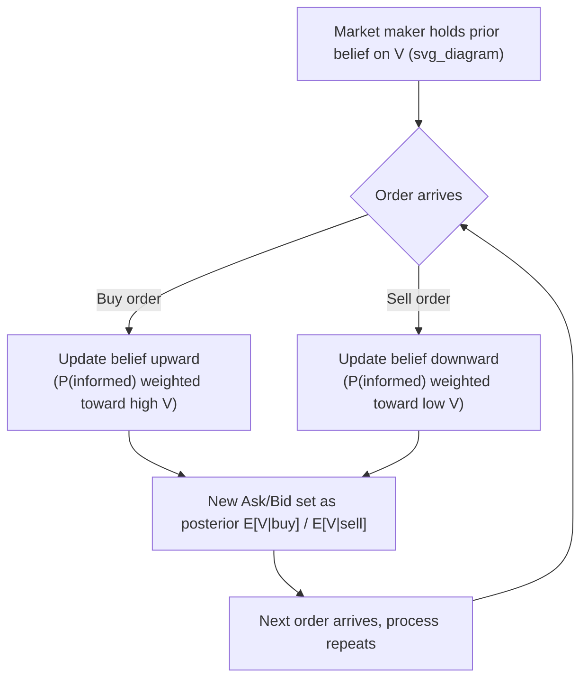

## Information-Based Models of Trading

### Overview

Information-based models explain how prices, spreads, and trading behavior are shaped by asymmetric information among market participants — some traders possess private information about an asset's fundamental value, while others (market makers, noise/liquidity traders) do not. These models form the theoretical counterpart to inventory-based models: rather than treating the spread as compensation for holding-period risk, information-based models treat it as compensation for the risk of trading against better-informed counterparties, and they explain how prices come to reflect private information through the trading process itself.

### Core Conceptual Framework

**Key Points**

- Markets are populated by (at minimum) two trader types:
  - **Informed traders** — possess private signals about the asset's true value and trade strategically to profit from that informational edge.
  - **Uninformed (noise/liquidity) traders** — trade for reasons unrelated to private information (portfolio rebalancing, liquidity needs), and are, on average, uninformed about short-term mispricing.
- A market maker (or the market as a whole, in models without an explicit dealer) cannot distinguish an individual informed trader from an individual noise trader in real time, and must set prices that account for the *probability* that any given order originates from an informed trader.
- This asymmetry is the source of **adverse selection**: the market maker systematically loses money trading against informed flow and must recoup this loss by pricing appropriately against the pooled (informed + uninformed) order flow.

### The Glosten-Milgrom (1985) Model

**Key Points**

- A sequential trade model: at each point in time, a single trader (randomly informed or uninformed) arrives and submits either a buy or sell order (typically a market order for a single unit).
- The market maker, unable to observe trader type, sets bid and ask prices as **conditional expectations** of the asset's true value given that a trade occurs at that price:

$$Ask = E[V \mid \text{buy order arrives}], \qquad Bid = E[V \mid \text{sell order arrives}]$$

- Because informed traders only buy when they know the true value exceeds current price (and only sell when they know it's below), the arrival of a buy order is itself informative — it shifts the market maker's posterior belief about $V$ upward, and a sell order shifts it downward.
- The market maker updates quotes **after every trade** using Bayesian updating, meaning the bid-ask spread and the sequence of quotes trace out a path that converges toward the true value as more trades reveal information over time — this is the model's core mechanism for **price discovery**.
- The resulting bid-ask spread is entirely attributable to adverse selection in the pure form of the model (no separate inventory or processing cost terms), making it a useful theoretical baseline for isolating the information component of the spread.

**Bayesian Updating Structure**

- As the proportion of informed traders in the population ($\mu$ or $\alpha$, notation varies) increases, both the spread and the magnitude of quote revision per trade increase, since each trade carries more informational weight on average.

### The Kyle (1985) Model

**Key Points**

- Models a single, risk-neutral **strategic informed trader** (the "insider") who possesses precise private information about the asset's liquidation value, trading against a competitive, risk-neutral market maker and a stochastic flow of noise traders.
- Unlike Glosten-Milgrom's sequential single-unit trades, Kyle's informed trader chooses **order size** strategically, balancing the profit from exploiting private information against the price impact that a large order would reveal, since the market maker cannot distinguish the informed trader's order from noise trader flow when both are aggregated into total order flow.
- The market maker sets price as a linear function of aggregate (net) order flow, since they cannot observe the informed trader's order individually:

$$P = P_0 + \lambda \times (\text{Aggregate Order Flow})$$

- $\lambda$ (**Kyle's lambda**) is the model's central measure of **market depth/illiquidity** — it quantifies how much the price moves per unit of net order flow, and is inversely related to noise trading volume (more noise trading provides "camouflage" for the informed trader, allowing larger positions without proportionally larger price impact) and directly related to the precision of the informed trader's information.

$$\lambda = \frac{\sigma_v}{2\sigma_u}$$

where $\sigma_v$ is the standard deviation of the asset's fundamental value uncertainty and $\sigma_u$ is the standard deviation of noise trader order flow.

- **Key equilibrium result:** the informed trader optimally trades only a *fraction* of their informational advantage in any given period, gradually revealing information over time to avoid excessive price impact — this produces **gradual, continuous price discovery** rather than instantaneous full revelation, distinguishing Kyle's dynamic from a setting where information is immediately and fully reflected in price.
- In the multi-period extension, price volatility and market depth evolve predictably over the trading horizon, with information being progressively incorporated as the liquidation date approaches.

### Comparing Glosten-Milgrom and Kyle

**Key Points**

| Dimension | Glosten-Milgrom (1985) | Kyle (1985) |
| --- | --- | --- |
| Order structure | Sequential, single-unit trades | Continuous/batch order flow, variable size |
| Informed trader behavior | Binary buy/sell decision, non-strategic on size | Strategic optimal order size choice |
| Market maker pricing | Discrete Bayesian updating per trade | Linear pricing rule on aggregate order flow |
| Price discovery pattern | Trade-by-trade convergence via updating | Gradual revelation via strategic trading intensity |
| Central output | Bid-ask spread as adverse selection compensation | $\lambda$ (market depth/illiquidity measure) |

- [Inference] Both models are generally regarded as complementary rather than competing — Glosten-Milgrom is typically favored for spread decomposition and quote-setting analysis, while Kyle is typically favored for analyzing strategic order-splitting behavior and market depth; the specific choice of framework in applied research depends on which empirical question (spread composition vs. price impact/depth) is being addressed.

### The PIN Model (Probability of Informed Trading)

**Key Points**

- Developed by Easley, Kiefer, O'Hara, and Paperman (building on the Glosten-Milgrom framework) to provide an empirically estimable measure of the proportion of trading activity attributable to informed traders, using observed buy and sell order arrival rates.
- Models order arrival as a mixture of Poisson processes: uninformed buy/sell orders arrive at a baseline rate, and an information event (occurring with some probability) triggers informed order arrival concentrated on one side (buy or sell, depending on whether the news is good or bad).

$$PIN = \frac{\alpha \mu}{\alpha \mu + 2\varepsilon}$$

where $\alpha$ is the probability an information event occurs, $\mu$ is the arrival rate of informed trades conditional on an event, and $\varepsilon$ is the baseline arrival rate of uninformed buy/sell orders.

- PIN is estimated via maximum likelihood on daily buy/sell trade count data and has been widely used in empirical asset pricing to test whether information asymmetry is priced (i.e., whether stocks with higher PIN command a return premium as compensation for adverse selection risk borne by liquidity providers and outside investors).
- [Unverified] The use of PIN as a priced risk factor in expected returns has been a subject of ongoing empirical debate in the literature, with some studies questioning whether PIN estimates are confounded by market maker rebalancing or the numerical properties of the MLE estimation itself; this remains a contested area rather than settled consensus and current literature should be consulted for the state of the debate.

### Price Discovery and Market Efficiency Implications

**Key Points**

- Information-based models formalize how a security's price transitions from reflecting only public information to fully reflecting available private information as trading occurs — this is the microstructure-level mechanism underlying the semi-strong and strong forms of the Efficient Market Hypothesis.
- The **speed** of price discovery depends on model parameters: higher informed-trader concentration (Glosten-Milgrom's $\mu$) or higher noise trading volume relative to informed trading intensity (affecting Kyle's $\lambda$) changes how quickly and smoothly private information becomes impounded into observed prices.
- These models predict measurable empirical phenomena: wider spreads and greater price impact around scheduled information events (earnings announcements, macro releases), and elevated adverse selection costs for securities with more dispersed or uncertain fundamental value estimates (e.g., less analyst coverage, smaller firms).

### Extensions and Related Frameworks

**Key Points**

- **Easley and O'Hara (1987, 1992):** extended sequential trade models to incorporate trade size as an additional signal, since informed traders may prefer larger trade sizes when profitable, and to model the timing of trades (or lack thereof) as informative.
- **Admati and Pfleiderer (1988):** examined strategic behavior of *discretionary liquidity traders* who can choose *when* to trade, showing how they cluster their trading with periods of high informed-trader activity to minimize adverse selection costs by "hiding" among informed order flow — helping explain intraday volume and volatility patterns (e.g., U-shaped volume patterns around market open/close).
- **Holden and Subrahmanyam (1992):** extended Kyle's framework to multiple competing informed traders, showing that competition among informed traders accelerates information revelation relative to the single-insider Kyle setting.

### Practical and Empirical Relevance

**Key Points**

- Information-based models underpin the "price impact" component identified in empirical spread decomposition (effective spread minus realized spread), providing the theoretical justification for treating that residual as compensation for adverse selection.
- Trading algorithms designed to minimize implementation shortfall (e.g., VWAP/TWAP, implementation-shortfall algorithms) implicitly draw on Kyle-style intuition: splitting large orders over time to avoid revealing informational content (or simply size) through price impact, similar to how Kyle's informed trader optimally paces their trading.
- Regulatory and exchange design questions (tick size, order transparency rules, circuit breakers) are frequently analyzed through the lens of how they affect the balance between informed and noise trading, and consequently the speed and cost of price discovery.

**Related Topics**

- Bid-ask spread decomposition (order processing, inventory, adverse selection)
- Inventory models of market making (Garman, Stoll, Amihud-Mendelson)
- Market impact models and implementation shortfall
- Efficient Market Hypothesis and price discovery
- High-frequency trading and latency-based information advantages
- Order types and trading mechanisms