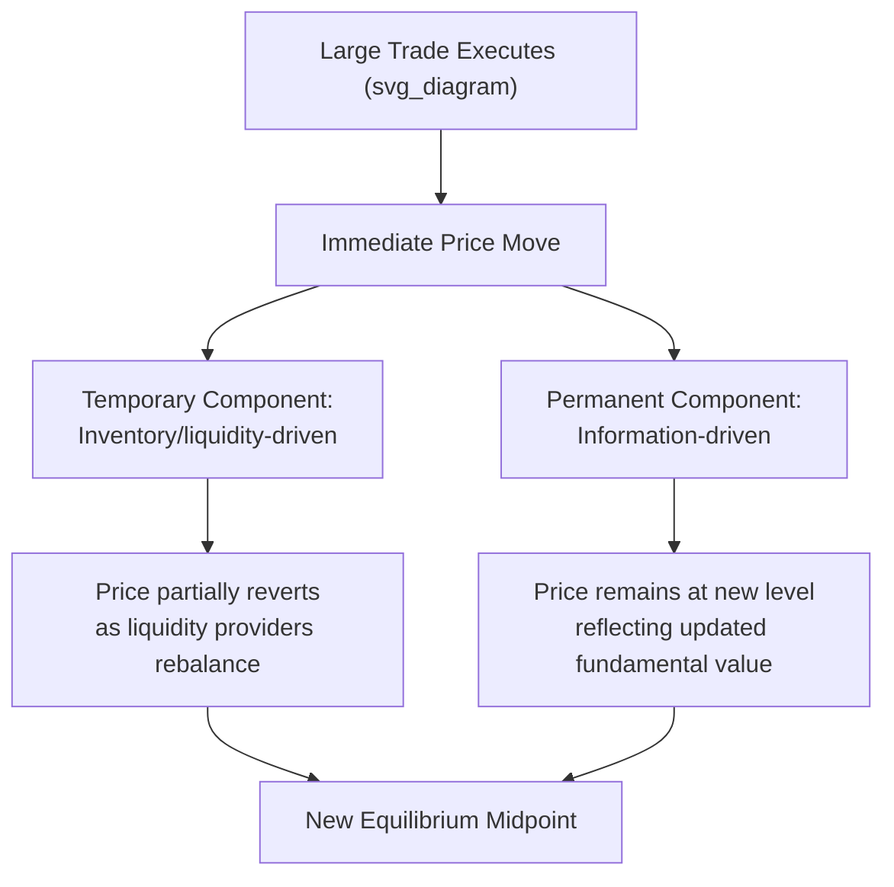

## Price Impact and Liquidity Measurement

### Overview

Liquidity is a multidimensional concept describing how easily an asset can be traded without materially affecting its price. Price impact measurement provides the quantitative tools for capturing one of liquidity's core dimensions — how much prices move in response to trading activity — and connects directly to the theoretical frameworks of inventory and information-based microstructure models.

### Dimensions of Liquidity

**Key Points**

- Liquidity is commonly decomposed into four related but distinct dimensions, each requiring different measurement approaches:
  - **Tightness** — the cost of executing a small trade quickly, typically measured by the bid-ask spread.
  - **Depth** — the volume of orders available at or near the best bid/offer without moving the price significantly.
  - **Resiliency** — the speed with which prices recover toward equilibrium after a temporary order-flow shock or large trade.
  - **Immediacy** — the speed with which a trade of a given size can be executed at all.
- No single metric fully captures liquidity; empirical liquidity measurement typically combines several proxies depending on which dimension is most relevant to the research or trading question.

### Price Impact: Conceptual Framework

**Key Points**

- Price impact is the price movement attributable to the act of trading itself, distinct from price movements caused by new public information arriving independently of the trade.
- Standard decomposition separates price impact into **temporary** and **permanent** components:

$$\Delta P = \text{Permanent Impact (information-driven)} + \text{Temporary Impact (liquidity/inventory-driven, reverses)}$$

- **Permanent impact** reflects the market's updated assessment of fundamental value based on the informational content the market infers from the trade (consistent with adverse-selection/information-based models).
- **Temporary impact** reflects the mechanical cost of demanding immediacy — walking through resting limit orders, inducing dealer inventory skewing — and dissipates as liquidity providers replenish the book and rebalance inventory.

### Kyle's Lambda as a Price Impact Measure

**Key Points**

- Kyle's (1985) $\lambda$, introduced in the informed-trading literature, doubles as a foundational **price impact / illiquidity measure**: it quantifies the price change per unit of net (signed) order flow.

$$\Delta P = \lambda \times (\text{Net Order Flow})$$

- Higher $\lambda$ indicates a less liquid/"shallower" market — a given order size moves price more — while lower $\lambda$ indicates a deeper, more liquid market where large order flow can be absorbed with minimal price disturbance.
- $\lambda$ is typically estimated empirically via regression of price changes on contemporaneous signed order flow over a chosen sampling interval.

### Amihud (2002) Illiquidity Measure

**Key Points**

- One of the most widely used empirical illiquidity proxies in asset pricing research, valued for requiring only daily return and volume data (no intraday quote or order-book data needed), making it applicable across long historical samples and broad cross-sections of securities.

$$ILLIQ_i = \frac{1}{D}\sum_{d=1}^{D} \frac{|R_{i,d}|}{VOLD_{i,d}}$$

where $|R_{i,d}|$ is the absolute daily return and $VOLD_{i,d}$ is daily dollar trading volume, averaged over $D$ trading days.

- Interpreted as the average absolute price response per dollar of trading volume — a direct, low-data-requirement proxy for Kyle's $\lambda$-style price impact.
- Widely used in asset pricing studies examining whether illiquidity is a priced risk factor (i.e., whether less liquid stocks earn a return premium as compensation for the higher trading costs and price impact investors bear).
- **Limitation:** because it uses daily aggregated data, it cannot distinguish permanent from temporary impact, and can be influenced by non-trading-related return volatility (e.g., news-driven moves with high volume, which would not indicate high price impact per se).

### Market Depth and Order Book Measures

**Key Points**

- **Quoted depth:** the total volume available at the best bid and best ask, indicating how much can be traded at the top of book without moving the quoted price.
- **Cumulative depth / book depth profile:** volume available at multiple price levels beyond the best bid/offer, used to estimate the price impact of larger orders that would need to "walk the book."
- **Quote slope / order book slope:** measures how quickly available depth diminishes as price moves away from the midpoint — a steeper slope indicates that even modest order sizes cause meaningfully larger price impact.

$$\text{Estimated impact of order size } Q = \int_{0}^{Q} \text{Price}(q)\, dq \Big/ Q - Midpoint$$

(the average execution price across the volume-weighted book levels needed to fill $Q$, relative to the pre-trade midpoint)

### Resiliency Measures

**Key Points**

- Resiliency captures how quickly the order book replenishes and prices revert to a new equilibrium after a large trade or temporary liquidity shock, distinguishing genuinely persistent price impact (informational) from transient impact that liquidity providers quickly correct.
- Commonly measured empirically by examining price behavior over short windows following large trades: strong, fast reversion toward the pre-trade midpoint (net of any permanent component) indicates high resiliency; slow or incomplete reversion indicates low resiliency.
- [Inference] Resiliency is generally considered harder to measure cleanly than spread or depth, since it requires isolating the "true" permanent price level from transitory effects in real time, and empirical approaches vary across studies without a single dominant standardized metric comparable to Amihud's illiquidity ratio.

### Realized Spread and Price Impact Decomposition (Empirical)

**Key Points**

- As introduced in spread decomposition frameworks, the effective spread can be split empirically into a **realized spread** (compensates the liquidity provider net of adverse price movement, i.e., the transitory component) and a **price impact** component (the permanent, information-driven component).

$$Effective\ Spread = Realized\ Spread + Price\ Impact$$

$$Realized\ Spread = 2 \times D_t \times (P_{trade} - Midpoint_{t+\Delta})$$

$$Price\ Impact = 2 \times D_t \times (Midpoint_{t+\Delta} - Midpoint_{t})$$

where $D_t = +1$ for buyer-initiated trades, $-1$ for seller-initiated trades, and $Midpoint_{t+\Delta}$ is measured some interval (commonly 5 or 30 minutes) after the trade to allow transitory effects to dissipate.

### Price Impact Measurement Diagram

### Other Commonly Used Liquidity Proxies

**Turnover Ratio**

$$Turnover = \frac{\text{Trading Volume (shares)}}{\text{Shares Outstanding}}$$

- A coarse activity-based liquidity proxy; higher turnover generally associated with (but not a direct measure of) tighter spreads and lower price impact.

**Roll's Implied Spread (see also spread decomposition)**

$$Spread_{Roll} = 2\sqrt{-Cov(\Delta P_t, \Delta P_{t-1})}$$

- Uses serial covariance in transaction price changes as an indirect liquidity proxy, requiring only transaction price data.

**Pastor and Stambaugh (2003) Liquidity Measure**

- A market-wide, return-reversal-based liquidity factor: constructed from the tendency of stock returns to reverse following high-volume days, under the logic that greater illiquidity produces stronger volume-induced return reversals.
- Used primarily as a systematic (market-wide) liquidity risk factor in asset pricing tests, rather than a security-specific microstructure diagnostic.

### Liquidity Measure Comparison

| Measure | Data Requirement | Dimension Captured | Common Use |
| --- | --- | --- | --- |
| Quoted/Effective Spread | Intraday quotes/trades | Tightness | Direct transaction cost estimate |
| Kyle's Lambda | Intraday order flow + price | Depth/Price Impact | Theoretical price impact estimation |
| Amihud Illiquidity | Daily return + volume | Price Impact (proxy) | Long-sample cross-sectional asset pricing |
| Quoted/Book Depth | Order book (Level 2) data | Depth | Large-order execution cost estimation |
| Realized Spread / Price Impact split | Intraday quotes/trades | Tightness + Permanent Impact | Isolating adverse selection cost |
| Resiliency (reversion speed) | Intraday quotes/trades, event windows | Resiliency | Assessing market recovery after shocks |
| Turnover | Daily volume + shares outstanding | Immediacy (coarse) | Broad activity screening |

### Practical and Regulatory Relevance

**Key Points**

- Institutional trading desks use price impact models (often calibrated versions of the square-root or linear impact models) to estimate expected execution costs before placing large orders, directly informing algorithm selection (e.g., more aggressive vs. more passive scheduling) and venue choice.
- Regulators and exchanges monitor liquidity measures to assess market quality, particularly around structural changes (tick size pilots, new order types, changes to maker-taker fee schedules) and during periods of market stress, where liquidity dimensions (especially depth and resiliency) can deteriorate sharply even without a corresponding widening in quoted spreads.
- [Inference] During stressed market conditions, multiple liquidity dimensions often deteriorate together rather than in isolation (e.g., depth withdrawal accompanying spread widening), though the specific relationship and sequencing between dimensions during any particular stress event is empirically observed case-by-case rather than governed by a fixed universal pattern.

**Related Topics**

- Bid-ask spread decomposition (order processing, inventory, adverse selection)
- Information-based models of trading (Kyle, Glosten-Milgrom)
- Inventory models of market making
- Implementation shortfall and algorithmic execution strategies
- Market microstructure invariance and price impact scaling laws
- Systematic liquidity risk and asset pricing (Pastor-Stambaugh, Amihud)