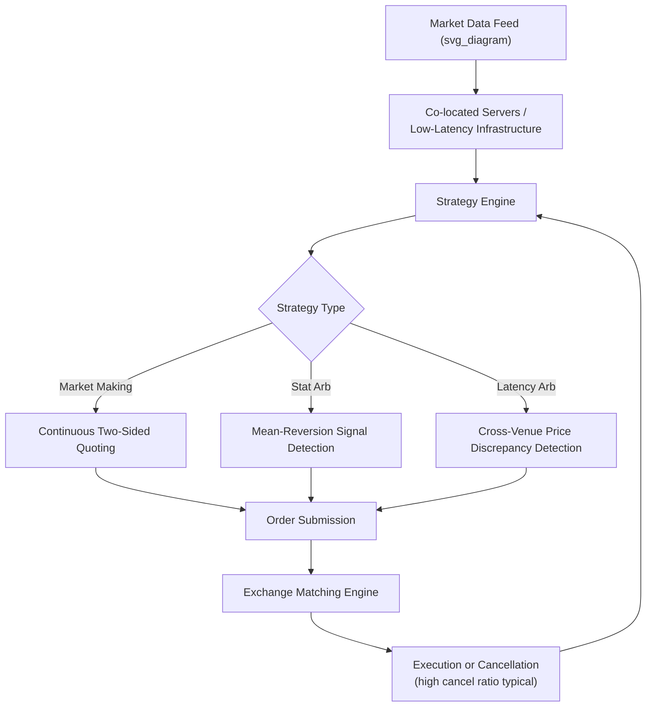

## High-Frequency and Algorithmic Trading

### Overview

Algorithmic trading (algo trading) refers broadly to the use of computer programs to automate trading decisions according to predefined rules or models. High-frequency trading (HFT) is a specialized subset characterized by extremely short holding periods, very high order-to-trade ratios, and a competitive reliance on speed/latency advantages. Both sit at the applied intersection of the theoretical microstructure frameworks (inventory models, information-based models, liquidity measurement) covered elsewhere in this chapter.

### Algorithmic Trading: Categories and Objectives

**Key Points**

- Algorithmic trading strategies are broadly categorized by their objective, which determines the design of the algorithm's decision logic.

**Execution Algorithms**

- Objective: minimize the cost (market impact, timing risk, implementation shortfall) of executing a large parent order, rather than generating alpha directly.
- Includes VWAP, TWAP, Percentage-of-Volume (POV), and Implementation Shortfall algorithms (see Order Types and Trading Mechanisms), which slice large orders into smaller child orders scheduled according to volume patterns, time, or a cost-risk optimization.

**Statistical Arbitrage**

- Objective: exploit temporary, statistically identified mispricings between related securities (e.g., pairs trading, index arbitrage, mean-reversion strategies), typically holding positions from minutes to days.
- Relies on quantitative models identifying historically stable relationships (cointegration, correlation) that are expected to revert after temporary divergence.

**Market Making Algorithms**

- Objective: continuously quote both sides of the market, profiting from the bid-ask spread while managing inventory risk, directly operationalizing the inventory models (Garman, Stoll, Amihud-Mendelson, Ho-Stoll) discussed elsewhere in this chapter.
- Modern electronic market-making algorithms dynamically adjust quotes based on real-time inventory position, realized/implied volatility, and signals correlated with informed trading risk (adverse selection proxies).

**Momentum/Trend-Following and News-Based Algorithms**

- Objective: capitalize on short-term directional price trends or react to structured/unstructured information (news feeds, economic releases, social media sentiment) faster than the broader market can process it.

### High-Frequency Trading: Defining Characteristics

**Key Points**

- HFT is generally distinguished from broader algorithmic trading by several characteristic features rather than a single precise definition:
  - **Extremely short holding periods** — positions often held for seconds or fractions of a second, with intraday flat (zero overnight) positions common.
  - **High order-to-trade (cancellation) ratios** — a large proportion of submitted orders are cancelled or modified rather than executed, reflecting continuous quote adjustment in response to changing information and order book conditions.
  - **Low latency infrastructure dependence** — competitive advantage is substantially derived from minimizing the time between observing market information and acting on it (network transmission speed, co-location, hardware/software optimization).
  - **High trading volume relative to capital deployed** — capturing small, per-trade profit margins across very high transaction volumes.
- [Unverified] Precise quantitative thresholds distinguishing "HFT" from other algorithmic trading (e.g., specific holding period or cancellation ratio cutoffs) are not uniformly standardized across regulators, academic literature, or industry usage; this description reflects commonly cited qualitative characteristics rather than a single authoritative definition.

### Common HFT Strategy Types

**Electronic Market Making**

**Key Points**

- HFT firms acting as de facto market makers post continuous, rapidly updated two-sided quotes across many securities and venues, earning the bid-ask spread while managing inventory risk at very short time horizons.
- Distinguished from traditional designated market maker roles by the absence of formal obligations in most cases (in many venues, HFT market making is voluntary/opportunistic rather than contractually obligated), and by extremely rapid quote adjustment in response to changing conditions.

**Latency Arbitrage**

**Key Points**

- Exploits minute timing differences in information dissemination or price updates across venues or data feeds — for example, reacting to a price change on one exchange fractionally faster than competitors to trade on a related, not-yet-updated venue before its price adjusts.
- [Inference] This category of strategy has drawn particular regulatory and academic scrutiny because it is often characterized as extracting rents from speed advantages rather than contributing directly to price discovery or liquidity provision, though this characterization itself remains an area of active debate rather than settled consensus across the literature.

**Order Anticipation / Order Flow Prediction**

**Key Points**

- Attempts to detect the presence of large institutional orders (e.g., by identifying patterns consistent with algorithmic execution slicing, such as iceberg order replenishment patterns) and trade ahead of the anticipated remaining flow.

**Momentum Ignition**

**Key Points**

- A strategy (viewed as manipulative and restricted/prohibited under most regulatory regimes when intent to manipulate can be demonstrated) involving submission of orders designed to trigger a rapid price movement, with the intent of profiting from other market participants' (including other algorithms') reactive trading.

### Market Quality Effects: Theoretical and Empirical Debate

**Key Points**

- The net effect of HFT on market quality is a genuinely contested empirical question rather than a settled matter, with the literature generally identifying both potential benefits and potential costs.

**Commonly cited potential benefits:**

- Narrower quoted and effective spreads in many studied markets, consistent with increased competition among liquidity providers.
- Faster price discovery and more rapid incorporation of information into prices, particularly across related securities and venues.
- Increased trading volume and, in many contexts, improved measured market depth.

**Commonly cited potential costs/concerns:**

- Liquidity provided by HFT market makers may be less reliable during stressed conditions ("phantom liquidity") if HFT firms withdraw quotes rapidly when volatility spikes, potentially exacerbating illiquidity precisely when it is most costly.
- Adverse selection costs for slower traditional traders and institutional investors may increase if HFT firms possess persistent speed-based informational advantages.
- Contribution to short-term volatility events (e.g., the 2010 "Flash Crash") has been a focus of regulatory investigation, though causal attribution in specific events remains debated.

[Inference] Given the genuinely mixed and continuing nature of this empirical debate, any general claim that HFT is unambiguously beneficial or harmful to market quality overall should be treated with caution; the balance of evidence appears to depend substantially on which market quality dimension, time period, and specific strategy type is being examined.

### Flash Crash (May 6, 2010) — Illustrative Case

**Key Points**

- A widely studied event in which major U.S. equity indices experienced an extremely rapid decline (roughly 5-9% depending on the index) followed by a similarly rapid recovery within approximately 30-36 minutes.
- The joint SEC-CFTC investigation identified a large automated sell algorithm (executing without regard to price or time, tied to trading volume) as a triggering factor, with subsequent HFT behavior (including rapid liquidity withdrawal and "hot potato" trading among HFT firms passing the same positions back and forth) contributing to the severity and speed of the price decline.
- [Unverified] The precise causal weighting between the triggering algorithm, HFT liquidity withdrawal, and other contributing factors has been subject to differing interpretations across subsequent academic and regulatory analyses; specifics should be verified against the official joint SEC-CFTC report and subsequent peer-reviewed literature for a rigorous account.

### Regulatory Responses

**Key Points**

- **Circuit breakers:** market-wide and single-stock trading halts triggered by specified price movement thresholds within specified time windows, designed to provide a pause for liquidity and price discovery to stabilize during extreme volatility.
- **Limit Up-Limit Down (LULD) mechanisms (U.S.):** price bands preventing trades outside a specified percentage range of recent average price, replacing simple circuit breakers with a more continuous constraint mechanism.
- **Minimum resting times / order-to-trade ratio limits:** implemented in some jurisdictions (particularly in the EU under MiFID II) to reduce excessive order cancellation and quote flickering associated with certain HFT strategies.
- **Market maker obligations:** some venues impose minimum quoting time or two-sided quoting obligations on firms receiving market-making incentives, aimed at ensuring liquidity provision persists during stressed conditions rather than being withdrawn precisely when most needed.
- [Inference] Regulatory approaches to HFT vary meaningfully across jurisdictions and continue to evolve; the specific rules cited here reflect commonly discussed mechanisms in the literature rather than a complete or current survey, and current requirements should be verified against the applicable regulator's current rulebook.

### HFT Strategy Flow

### Infrastructure Considerations

**Key Points**

- **Co-location:** HFT firms pay exchanges for server placement physically close to the exchange's matching engine, minimizing network transmission latency to microsecond or nanosecond scales.
- **Direct market access (DMA) and sponsored access:** allows firms to route orders directly to exchange matching engines with minimal intermediary processing delay.
- **Hardware acceleration:** use of FPGAs (field-programmable gate arrays) and specialized networking equipment to reduce processing latency below what general-purpose software/CPU processing can achieve.
- [Inference] The specific latency thresholds considered "competitive" in HFT continue to compress over time as infrastructure technology advances; any specific numerical latency benchmark should be treated as a point-in-time reference rather than a stable industry standard.

### Algo/HFT Strategy Comparison

| Strategy Type | Typical Holding Period | Primary Objective | Relation to Microstructure Theory |
| --- | --- | --- | --- |
| Execution algorithms (VWAP/TWAP) | Minutes to full trading day | Minimize execution cost of a known parent order | Market impact / implementation shortfall models |
| Statistical arbitrage | Minutes to days | Exploit temporary relative mispricing | Price discovery / mean reversion |
| Electronic market making | Seconds (often flat overnight) | Capture bid-ask spread, manage inventory | Inventory models (Garman, Stoll, Amihud-Mendelson) |
| Latency arbitrage | Milliseconds to seconds | Exploit cross-venue timing differences | Price discovery speed, information diffusion |
| Momentum/news-based | Seconds to minutes | Capitalize on rapid information reaction | Information-based models (Kyle, Glosten-Milgrom) |

**Related Topics**

- Inventory models of market making and dynamic quote skewing
- Information-based models of trading (Kyle, Glosten-Milgrom)
- Price impact and liquidity measurement
- Order types and trading mechanisms (IOC, pegged, iceberg orders)
- Market microstructure regulation (MiFID II, Regulation NMS)
- Flash crashes and systemic market stability