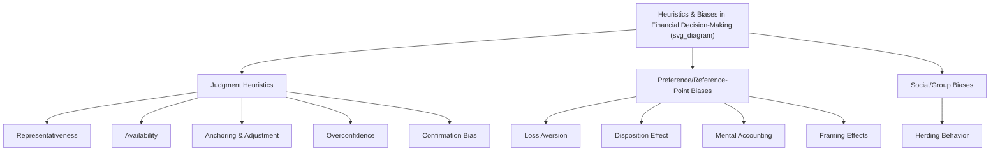

## Heuristics and Cognitive Biases in Decision-Making

### Overview

Behavioral finance departs from the classical rational-agent assumption underlying much of neoclassical finance theory, instead drawing on cognitive psychology to explain systematic patterns of investor decision-making that deviate from expected-utility-maximizing behavior. Heuristics are mental shortcuts that reduce cognitive effort in decision-making under uncertainty; they are often adaptive and useful, but can produce systematic, predictable errors — cognitive biases — particularly in the complex, probabilistic environment of financial markets.

### Foundational Framework: Kahneman and Tversky

**Key Points**

- The modern heuristics-and-biases research program originates primarily with Amos Tversky and Daniel Kahneman's work beginning in the early 1970s, which catalogued specific, systematic ways human judgment under uncertainty departs from normative statistical/probabilistic reasoning.
- Their subsequent development of **Prospect Theory** (1979) provided a formal alternative to Expected Utility Theory, modeling how individuals evaluate gains and losses relative to a reference point rather than in terms of final wealth states — this is treated as a related but distinct topic from the heuristics catalogued here, given its role as a standalone descriptive model of choice under risk.

### Representativeness Heuristic

**Key Points**

- Judging the probability of an event or category membership based on how closely it resembles a prototype or stereotype, rather than on objective statistical likelihood (e.g., base rates).
- In financial contexts, manifests as investors extrapolating a company's recent strong performance into an assumption of a "good company" and therefore a "good stock," even though these are conceptually distinct (a company can be excellent operationally while being an overpriced, poor investment).

**Related sub-biases:**

- **Base rate neglect** — underweighting or ignoring the prior probability (base rate) of an outcome in favor of specific, salient case information.
- **Sample size neglect** — failing to adequately account for sample size when judging whether an observed pattern (e.g., a fund manager's recent outperformance) is statistically meaningful versus attributable to chance.
- **Gambler's fallacy** — believing that a run of one outcome (e.g., a stock price rising several days in a row) makes the opposite outcome more likely to occur next, as if independent random events must "balance out."
- **Hot hand fallacy** — the related but distinct belief that a streak of success indicates a genuinely elevated probability of continued success (sometimes valid in skill-based contexts but frequently misapplied to genuinely random or near-random processes).

### Availability Heuristic

**Key Points**

- Judging the probability or frequency of an event based on how easily relevant examples come to mind, rather than on objective frequency — events that are vivid, recent, or emotionally salient are judged as more probable than they objectively are.
- In financial contexts, manifests as investors overweighting the probability of dramatic but rare events (market crashes, specific stock scandals) shortly after they receive significant media coverage, and underweighting risks that are less vivid or narratively compelling even if statistically more relevant.
- Helps explain herding-adjacent behavior around widely publicized events and the tendency for investor risk perception to be driven more by recent salient news than by underlying statistical base rates.

### Anchoring and Adjustment

**Key Points**

- Initial exposure to a reference value (an "anchor") — even an arbitrary or irrelevant one — disproportionately influences subsequent numerical estimates or judgments, because adjustment away from the anchor tends to be insufficient.
- In financial contexts, manifests as investors anchoring valuation judgments to a stock's purchase price, a recent 52-week high, or an analyst's initial price target, and being insufficiently responsive to new information that should warrant larger adjustments.
- Closely related to the **disposition effect** (see below), where the original purchase price serves as a psychological anchor/reference point for the decision to hold or sell.

### Overconfidence Bias

**Key Points**

- A well-documented tendency for individuals to overestimate the precision of their own knowledge, judgment, or forecasting ability, relative to their actual accuracy.
- Manifests in several related sub-forms:
  - **Overprecision** — excessive certainty in the accuracy of one's beliefs (e.g., overly narrow confidence intervals around a forecast).
  - **Overplacement** — believing oneself to be better than average relative to peers (the "better-than-average effect"), which is statistically impossible for a majority of any population.
  - **Overestimation** — overestimating one's actual ability, performance, or degree of control over outcomes.
- In financial contexts, empirically associated with **excessive trading volume** — Barber and Odean's research found that overconfident investors trade more frequently than warranted, and that this excess trading is associated with lower net returns due to transaction costs and poor timing, a pattern found to be particularly pronounced among certain investor subgroups in their studies.

### Confirmation Bias

**Key Points**

- The tendency to search for, interpret, and recall information in a way that confirms one's pre-existing beliefs, while discounting or avoiding disconfirming evidence.
- In financial contexts, manifests as investors who hold a position seeking out news and analysis that supports their existing thesis while dismissing warning signs, reinforcing conviction in a position that may no longer be justified by current information.

### Loss Aversion

**Key Points**

- A core component of Prospect Theory: losses are experienced as psychologically more painful than equivalently sized gains are pleasurable, with commonly cited experimental estimates suggesting losses are weighted roughly twice as heavily as equivalent gains, though the precise ratio varies across studies and contexts. [Unverified] The specific "2x" magnitude is a frequently cited approximate figure from the original and subsequent experimental literature rather than a universal constant applicable to all decision contexts or asset classes.
- Distinct from simple risk aversion: loss aversion specifically concerns the asymmetric psychological weighting of losses versus gains around a reference point, whereas risk aversion in the classical sense concerns the curvature of a utility function over final wealth states.

**Disposition Effect**

**Key Points**

- A well-documented empirical consequence of loss aversion (combined with mental accounting) in trading behavior: investors exhibit a tendency to sell winning positions too early (to "lock in" the pleasurable realized gain) and hold losing positions too long (to avoid realizing the painful loss), even when this pattern is inconsistent with tax-efficient or return-maximizing strategy.
- Documented extensively in empirical studies of individual brokerage account trading records (notably by Odean and subsequent researchers).

### Mental Accounting

**Key Points**

- The tendency for individuals to categorize and treat money differently depending on its subjective source or intended use, rather than treating money as perfectly fungible as classical economic theory assumes.
- In financial contexts, manifests as investors treating "house money" (unrealized or recently realized gains) with greater risk tolerance than their original capital, or maintaining mental separation between a "safe" portfolio bucket and a "speculative" bucket rather than optimizing the portfolio holistically.

### Herding Behavior

**Key Points**

- The tendency for individuals to align their decisions with the observed behavior of a larger group, sometimes disregarding their own private information or independent analysis.
- Can arise from multiple distinct mechanisms: genuine informational cascades (rationally inferring that others' actions reflect valuable private information), reputational/career concerns (fund managers avoiding being an outlier relative to peers), or simple social conformity pressure.
- Contributes to phenomena such as asset price bubbles and momentum effects, where herding-driven buying (or selling) pushes prices further from fundamental value than individually rational analysis alone would justify.

### Framing Effects

**Key Points**

- Decisions and risk preferences can be systematically altered by how logically equivalent information is presented ("framed"), even when the underlying substance of the choice is unchanged.
- Classic illustration: individuals respond differently to an outcome framed as "90% survival rate" versus the logically identical "10% mortality rate," despite the statistical content being the same.
- In financial contexts, manifests in how investment options, fee structures, or performance results are presented (e.g., framing a fee as a percentage versus a fixed effective dollar amount can materially affect investor perception and choice).

### Cognitive Biases Summary Diagram

### Bias Summary Table

| Bias | Core Mechanism | Common Financial Manifestation |
| --- | --- | --- |
| Representativeness | Judging by similarity to prototype, ignoring base rates | Extrapolating "good company" to "good stock" |
| Availability | Judging probability by ease of recall | Overweighting vivid/recent market events |
| Anchoring | Insufficient adjustment from initial reference point | Fixating on purchase price or 52-week high |
| Overconfidence | Overestimating precision/ability | Excessive trading, underdiversification |
| Confirmation bias | Selective information search/interpretation | Ignoring disconfirming evidence on a held position |
| Loss aversion | Losses weighted more heavily than gains | Reluctance to realize losses |
| Disposition effect | Loss aversion + mental accounting applied to trading | Selling winners early, holding losers |
| Mental accounting | Non-fungible treatment of money by source/purpose | "House money" risk-taking, bucket investing |
| Herding | Alignment with group behavior over private information | Bubble formation, momentum, career-driven conformity |
| Framing | Logically equivalent info evaluated differently by presentation | Fee/return presentation affecting perceived attractiveness |

### Practical and Market-Level Implications

**Key Points**

- These biases collectively provide the psychological microfoundations for many empirical asset pricing anomalies studied elsewhere in behavioral finance (momentum, post-earnings-announcement drift, excess volatility, bubble formation), connecting individual-level cognitive patterns to market-level price behavior.
- Financial advisors and institutional investment processes often build explicit structural safeguards (investment committees, pre-defined rebalancing rules, systematic/rules-based strategies) specifically to counteract the predictable influence of these biases on individual discretionary decision-making.
- [Inference] Awareness of a bias does not necessarily eliminate its influence on behavior, since much of the underlying processing is automatic (System 1, in dual-process terminology) rather than fully within deliberate conscious control; the practical effectiveness of debiasing interventions varies across the literature and by bias type, and general claims about the reliability of "awareness alone" as a corrective should be treated cautiously.

**Related Topics**

- Prospect Theory and reference-dependent decision-making
- Behavioral asset pricing anomalies (momentum, post-earnings drift)
- Limits to arbitrage
- Bubbles and market crashes from a behavioral perspective
- Nudge theory and choice architecture in retirement/investment plan design
- Dual-process theory (System 1 / System 2 cognition)