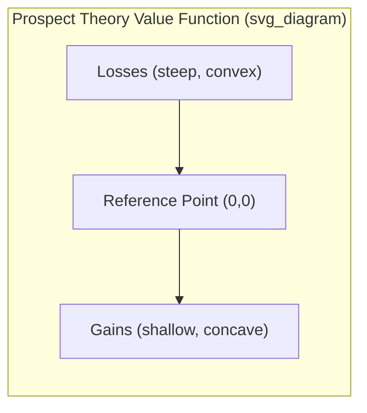
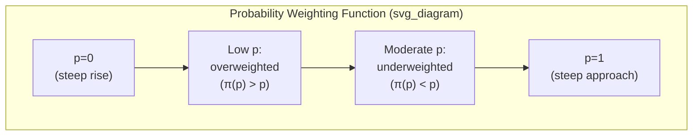

## Prospect Theory

### Overview

Prospect Theory, developed by Daniel Kahneman and Amos Tversky (1979, with a cumulative extension in 1992), is a descriptive model of decision-making under risk that systematically explains observed deviations from Expected Utility Theory (EUT). Rather than assuming individuals evaluate choices based on final wealth states with a single, globally concave utility function, Prospect Theory models decisions as evaluated relative to a reference point, with distinct psychological treatment of gains versus losses and of probabilities themselves.

### Motivation: Violations of Expected Utility Theory

**Key Points**

- Prospect Theory was developed specifically to explain systematic, replicable experimental violations of EUT's axioms, most notably the **Allais Paradox**-style violations of the independence axiom.
- **Certainty effect:** individuals overweight outcomes perceived as certain relative to outcomes that are merely probable, even when expected values are held constant — this violates the EUT independence axiom, which requires consistent treatment of probability regardless of whether an outcome is at the certain end of the probability scale.
- **Isolation effect:** individuals frequently disregard components that choices share in common and focus on the components that differ, which can lead to inconsistent preferences depending on how a choice is decomposed or framed, even when the underlying probabilities and outcomes are mathematically equivalent.
- These documented inconsistencies motivated a model built directly from observed choice behavior rather than derived axiomatically from rationality postulates.

### The Value Function

**Key Points**

- Prospect Theory replaces EUT's utility function (defined over final wealth) with a **value function** defined over gains and losses **relative to a reference point** (typically the status quo or an expectation-based reference level), reflecting the core insight that people evaluate outcomes as changes from a reference point rather than in absolute terms.

**Three defining properties of the value function:**

1. **Reference dependence** — outcomes are coded as gains or losses relative to a reference point, not evaluated as absolute final wealth states.
2. **Loss aversion** — the function is steeper for losses than for gains of equivalent magnitude, meaning a loss of a given size produces a larger (negative) psychological impact than a gain of the same size produces (positive) impact.
3. **Diminishing sensitivity** — the function is concave for gains (risk-averse behavior over gains) and convex for losses (risk-seeking behavior over losses), reflecting that the marginal psychological impact of an additional unit of gain or loss diminishes as the outcome moves further from the reference point in either direction.

**Commonly used functional form (Tversky and Kahneman, 1992):**

$$v(x) = \begin{cases} x^{\alpha} & \text{if } x \geq 0 \\ -\lambda(-x)^{\beta} & \text{if } x < 0 \end{cases}$$

where $x$ is the outcome relative to the reference point, $\alpha, \beta$ (commonly estimated around 0.88 in the original study) govern the degree of diminishing sensitivity, and $\lambda$ (commonly estimated around 2.25 in the original study) is the **loss aversion coefficient**. [Unverified] These specific parameter estimates are drawn from Tversky and Kahneman's original 1992 experimental estimation and subsequent replications have found varying values depending on context, elicitation method, and population studied; they should be treated as illustrative reference figures rather than universal constants.

### Value Function Diagram

An S-shaped curve: concave and shallow above the reference point (gains), convex and steep below it (losses) — the asymmetric steepness on either side of the reference point is the graphical signature of loss aversion, while the changing curvature within each region reflects diminishing sensitivity.

$$v(-x) < -v(x) \text{ for } x > 0 \quad \text{(loss aversion: the loss function is steeper than the mirrored gain function)}$$

### The Probability Weighting Function

**Key Points**

- Prospect Theory's second major departure from EUT: individuals do not evaluate outcomes using objective probabilities directly, but instead apply a **decision weight** derived from a nonlinear probability weighting function $\pi(p)$.

**Key empirical patterns in the weighting function:**

- **Overweighting of small probabilities** — low-probability events are given disproportionately more decision weight than their objective probability warrants (helps explain both lottery ticket purchasing and demand for insurance against rare catastrophic losses — both involve small-probability events being overweighted).
- **Underweighting of moderate-to-high probabilities** — probabilities in the mid-to-high range receive disproportionately less decision weight than their objective value.
- **Certainty/near-certainty is treated distinctly** — the function typically shows a discontinuity or particularly steep change near $p=0$ and $p=1$, consistent with the certainty effect: moving from 99% to 100% probability has a disproportionately large impact on decision weight relative to an equivalent-sized move elsewhere in the probability range.

**Commonly used functional form (Tversky and Kahneman, 1992):**

$$\pi(p) = \frac{p^{\gamma}}{(p^{\gamma} + (1-p)^{\gamma})^{1/\gamma}}$$

where $\gamma$ (commonly estimated around 0.61 for gains in the original study) governs the degree of curvature; a value of $\gamma < 1$ produces the characteristic inverse-S shape (overweighting small $p$, underweighting large $p$), while $\gamma = 1$ would collapse to the identity function ($\pi(p) = p$), reproducing standard expected-value probability treatment. [Unverified] As with the value function parameters, this specific functional form and its parameter estimates are commonly cited from the original study; alternative functional forms and parameter estimates have been proposed and estimated in the subsequent literature.

### Probability Weighting Diagram

### Prospect Theory Valuation Formula

**Key Points**

- For a simple prospect with outcomes $x_1, x_2, \ldots$ occurring with probabilities $p_1, p_2, \ldots$, the overall value under (original, non-cumulative) Prospect Theory is:

$$V = \sum_i \pi(p_i) \, v(x_i)$$

replacing the EUT formulation $EU = \sum_i p_i \, u(x_i)$ with decision weights $\pi(p_i)$ in place of objective probabilities $p_i$, and the reference-dependent value function $v(x_i)$ in place of the utility-of-wealth function $u(x_i)$.

- The **1992 Cumulative Prospect Theory (CPT)** extension modifies how decision weights are applied to outcomes ranked by magnitude (using cumulative probability distributions rather than applying the weighting function to each individual outcome probability independently), which resolves certain theoretical inconsistencies (violations of stochastic dominance) present in the original 1979 formulation, particularly for prospects with more than two possible outcomes.

### Four-Fold Pattern of Risk Attitudes

**Key Points**

- A key predictive implication combining the value function's diminishing sensitivity with the probability weighting function's overweighting of small probabilities:

|  | High Probability | Low Probability |
| --- | --- | --- |
| **Gains** | Risk-averse (prefer certain smaller gain over risky larger gain) | Risk-seeking (prefer risky large gain over certain smaller gain — "lottery ticket" behavior) |
| **Losses** | Risk-seeking (prefer risky larger loss over certain smaller loss — "one last gamble to avoid a sure loss") | Risk-averse (prefer certain small loss over risky larger loss — insurance-buying behavior) |

- This four-fold pattern helps explain seemingly inconsistent real-world behavior: the same individual may simultaneously purchase both insurance (risk-averse behavior for low-probability losses) and lottery tickets (risk-seeking behavior for low-probability gains), a pattern that classical EUT with a single globally concave utility function struggles to accommodate without additional assumptions.

### Financial Applications

**Loss Aversion and the Equity Premium Puzzle**

**Key Points**

- Benartzi and Thaler's (1995) "myopic loss aversion" framework combines loss aversion with frequent portfolio evaluation to help explain the historically large observed equity risk premium — investors who evaluate their portfolios frequently (e.g., annually) experience the pain of loss aversion more often given equities' short-term volatility, and demand a correspondingly larger risk premium to hold equities relative to what a standard EUT-based model with reasonable risk aversion parameters would predict.

**Disposition Effect**

**Key Points**

- The combination of the value function's differing curvature for gains (concave, risk-averse) versus losses (convex, risk-seeking) directly predicts the empirically observed tendency to sell winning positions too early (locking in the diminishing-marginal-value gain) and hold losing positions too long (risk-seeking behavior in the loss domain, hoping to "get back to even" and avoid realizing the loss).

**Reference Point Formation in Practice**

**Key Points**

- A practically important and empirically studied question is what serves as an individual investor's reference point — commonly cited candidates include the original purchase price, a recent high-water mark, or a peer/benchmark comparison level. [Inference] The specific reference point used likely varies by investor, asset class, and context, and is generally treated in the applied literature as an empirical question to be identified per situation rather than something Prospect Theory itself specifies as a fixed universal rule.

### Prospect Theory vs. Expected Utility Theory: Comparison

| Dimension | Expected Utility Theory | Prospect Theory |
| --- | --- | --- |
| Evaluation basis | Final wealth states | Gains/losses relative to reference point |
| Function shape | Single, globally concave utility function | S-shaped value function (concave for gains, convex for losses) |
| Loss/gain treatment | Symmetric (same function throughout) | Asymmetric (losses weighted more heavily — loss aversion) |
| Probability treatment | Objective probabilities used directly | Nonlinear probability weighting (decision weights) |
| Handles Allais-type paradoxes | No (violates observed behavior) | Yes (designed to accommodate them) |
| Normative or descriptive | Normative (how rational agents *should* choose) | Descriptive (how people actually *do* choose) |

### Practical and Theoretical Significance

**Key Points**

- Prospect Theory is widely regarded as the foundational formal model underlying much of subsequent behavioral finance research, providing the theoretical basis for empirically observed phenomena such as the disposition effect, myopic loss aversion, and asymmetric risk-taking patterns across gain/loss domains.
- Its descriptive (rather than normative) framing distinguishes it explicitly from EUT: Prospect Theory does not claim that loss-averse, reference-dependent behavior is optimal or rational in a normative sense, only that it accurately describes observed human choice patterns under risk.
- Kahneman was awarded the 2002 Nobel Memorial Prize in Economic Sciences substantially for this body of work (Tversky, who died in 1996, was ineligible as the prize is not awarded posthumously).

**Related Topics**

- Heuristics and cognitive biases in decision-making
- The disposition effect and mental accounting
- Myopic loss aversion and the equity premium puzzle
- Cumulative Prospect Theory and stochastic dominance
- Behavioral asset pricing models incorporating reference dependence
- Limits to arbitrage and market efficiency implications