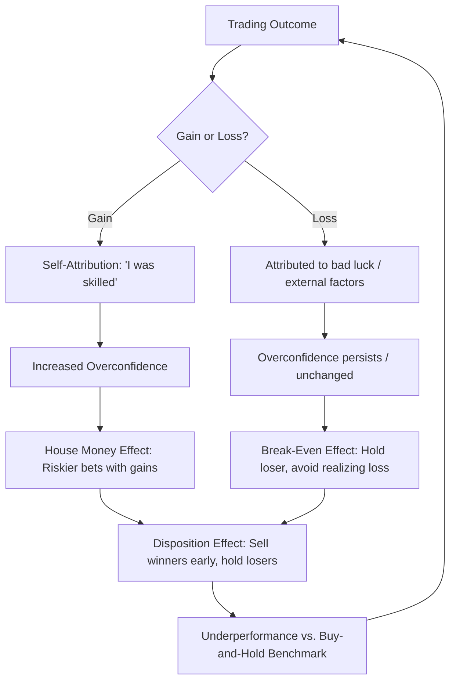

## Overconfidence and Mental Accounting

### Overview

Overconfidence and mental accounting are two of the most extensively documented cognitive biases in behavioral finance. Both depart from the rational-agent assumptions of Expected Utility Theory and the Efficient Market Hypothesis, and both produce systematic, predictable effects on trading behavior, portfolio construction, and asset pricing.

- **Overconfidence** refers to the tendency of individuals to overestimate the precision of their knowledge, the accuracy of their forecasts, and their own abilities relative to others.
- **Mental accounting** refers to the tendency of individuals to categorize and treat money differently depending on its source, intended use, or the "account" it is mentally assigned to, violating the economic principle of fungibility.

---

### Overconfidence

#### Definition and Taxonomy

Overconfidence is not a single unified construct. The behavioral finance literature typically decomposes it into three related but distinct sub-biases:

1. **Miscalibration (overprecision)** — Individuals underestimate the variance of uncertain quantities. When asked to give 90% confidence intervals for unknown quantities, the true value falls outside the interval far more than 10% of the time.
2. **Better-than-average effect (overplacement)** — Individuals rate themselves as above-average on desirable traits (e.g., driving skill, investment acumen) more often than is statistically possible.
3. **Illusion of control / overestimation** — Individuals overestimate their ability to control outcomes that are actually determined by chance, and overestimate the probability of favorable outcomes from their own actions.

**Key Points**

- Miscalibration is the most relevant sub-type for financial decision-making, since it directly maps onto how investors set confidence intervals around return forecasts.
- Overplacement is strongest in domains perceived as skill-based (e.g., stock-picking), even when outcomes are dominated by luck.
- Overconfidence tends to be more pronounced among men than women in financial contexts, a finding central to the Barber and Odean (2001) trading literature.

#### Behavioral Mechanisms

- **Self-attribution bias**: Investors attribute successful outcomes to their own skill and unsuccessful outcomes to bad luck or external factors, reinforcing overconfidence over time even in the absence of true skill.
- **Illusion of knowledge**: Access to more information (e.g., financial news, technical charts) increases confidence in a forecast without necessarily increasing forecast accuracy.
- **Hindsight bias interaction**: After an event, investors believe they "knew it all along," which retroactively inflates their perceived forecasting ability and feeds future overconfidence.

#### Effects on Financial Markets

**1. Excessive Trading Volume**

The canonical theoretical result, formalized by Odean (1998), is that overconfident investors trade more than rational investors because they overestimate the precision of their private signals relative to the market's aggregate information.

$$E[\text{Trading Volume}] = f(\sigma_{\epsilon}^2, \hat{\sigma}_{\epsilon}^2), \quad \hat{\sigma}_{\epsilon}^2 < \sigma_{\epsilon}^2$$

Where $\sigma_{\epsilon}^2$ is the true variance of the private signal error and $\hat{\sigma}_{\epsilon}^2$ is the investor's (understated) perceived variance. Because overconfident traders believe their signal is more precise than it truly is, they trade on noise, which mechanically increases market-wide volume.

Barber and Odean's empirical work on discount brokerage accounts found that households that trade frequently earn significantly worse returns than those that trade infrequently, not because of poor stock selection but because of the performance penalty from trading costs. Their broader finding, based on over 60,000 U.S. household brokerage accounts, was that men trade 45% more than women, which reduces men's net returns by 2.65 percentage points a year versus 1.72 points for women — consistent with the overconfidence hypothesis that men are more overconfident about investing than women.

**2. Underdiversification**

Overconfident investors, believing they possess superior stock-picking ability, concentrate their portfolios in a small number of holdings (often employer stock or local/familiar companies), violating the diversification prescriptions of Modern Portfolio Theory.

**3. Excess Market Volatility and Volume**

At the market level, aggregate overconfidence among investors can generate trading volume and volatility beyond what fundamentals justify, since disagreement rooted in overprecision (rather than genuine information asymmetry) still produces trades.

**4. Underestimation of Risk**

Miscalibrated confidence intervals lead investors to hold portfolios with more risk than they believe they are bearing, since they underestimate the dispersion of possible outcomes.

#### Formal Modeling Approach

A standard way to embed overconfidence into an asset-pricing framework is to assume an investor observes a private signal:

$$s = v + \epsilon, \quad \epsilon \sim N(0, \sigma_{\epsilon}^2)$$

where $v$ is the asset's true value. A rational Bayesian investor updates beliefs using the true $\sigma_{\epsilon}^2$. An overconfident investor instead uses a perceived variance $\hat{\sigma}_{\epsilon}^2 < \sigma_{\epsilon}^2$, causing them to overweight the signal $s$ relative to the prior and to trade more aggressively on it than is warranted.

**Example**

Suppose a fund manager believes their earnings forecast has a standard error of $0.10 per share, while the true historical standard error of similar forecasts is $0.40 per share. The manager will:

- Set a 90% confidence interval roughly 4x too narrow.
- Take a larger position than a rational Bayesian would given the same information.
- Be more likely to experience a "surprise" outcome that falls outside their stated interval.

---

### Mental Accounting

#### Definition

Mental accounting, a term coined and developed extensively by Richard Thaler, describes the cognitive process by which individuals code, categorize, and evaluate financial outcomes by grouping them into separate, non-fungible "accounts," rather than treating wealth as a single fungible pool as standard economic theory (and the concept of fungibility) would predict.

#### Core Components

Thaler's framework identifies three primary components of mental accounting:

1. **Framing of transactions (perceiving outcomes)** — How gains and losses are perceived and coded, often through the lens of Prospect Theory's value function.
2. **Assignment of activities to specific accounts** — Both categorization (e.g., "housing budget," "vacation fund," "windfall money") and time frame (e.g., daily budgets vs. lifetime wealth).
3. **Frequency of account evaluation ("choice bracketing")** — How often accounts are reviewed and balanced (e.g., evaluating a portfolio daily vs. annually).

#### Key Manifestations in Financial Behavior

**1. The House Money Effect**

Investors treat gains from prior trades ("house money") differently from their original capital, becoming more willing to take risks with profits than with their initial principal — even though both are equally part of total wealth. This was formalized by Thaler and Johnson (1990).

**2. Break-Even Effects**

After a loss, investors often become more risk-seeking in an attempt to "get back to even" within the same mental account, rather than treating the loss as a sunk cost and evaluating new decisions independently.

**3. The Disposition Effect**

A direct market application of mental accounting combined with Prospect Theory: investors tend to sell winning positions too early (to "lock in" a gain in that mental account) and hold losing positions too long (to avoid "closing" the loss account and realizing the loss as final). This was documented empirically by Shefrin and Statman (1985) and later confirmed in large-scale brokerage data by Odean (1998).

**4. Income vs. Capital Segregation ("Behavioral Life-Cycle Hypothesis")**

Households mentally segregate wealth into distinct accounts with different marginal propensities to consume:

- **Current income** — high propensity to spend
- **Current assets (savings)** — moderate propensity to spend
- **Future income (e.g., pension wealth)** — low propensity to spend

This contradicts the Life-Cycle/Permanent Income Hypothesis, which predicts that consumption should depend only on total lifetime wealth, not on the account in which a dollar currently resides.

**5. Dividend Preference ("Dividends vs. Homemade Dividends")**

Investors often prefer to spend cash dividends while being reluctant to sell an equivalent value of stock to generate the same cash flow ("homemade dividends"), even though the Modigliani-Miller dividend irrelevance framework treats these as economically identical. Mental accounting explains this: dividends are coded as "income" (safe to spend), while selling shares is coded as depleting "capital" (a account governed by different self-control rules).

**6. Budgeting and Non-Fungibility**

Households often maintain separate mental budgets for categories such as groceries, entertainment, or gifts, refusing to reallocate surplus funds across categories even when doing so would be utility-maximizing — a direct violation of fungibility.

#### Formal Illustration via Prospect Theory Value Function

Mental accounting interacts closely with Prospect Theory's value function:

$$v(x) = \begin{cases} x^{\alpha} & x \geq 0 \\ -\lambda(-x)^{\beta} & x < 0 \end{cases}$$

where $\lambda > 1$ represents loss aversion. Because the value function is applied *separately* to each mental account rather than to aggregate wealth, the way outcomes are bracketed and segregated across accounts materially changes the perceived utility of an identical set of aggregate outcomes.

**Example**

An investor with a $10,000 portfolio experiences a $1,000 gain in Stock A and a $1,000 loss in Stock B in the same month.

- **Integrated (rational) view**: Net change = $0; no action warranted based on P&L alone.
- **Segregated (mental accounting) view**: The investor feels the pain of the Stock B loss account and the pleasure of the Stock A gain account separately. Because $v(1000) + v(-1000) < v(0)$ under a loss-averse value function evaluated separately, the investor may sell Stock A to "realize" the pleasant gain and hold Stock B to avoid "realizing" the account as a loss — the disposition effect in action.

---

### Interaction Between Overconfidence and Mental Accounting

The two biases frequently compound each other in practice:

- An overconfident investor who believes they correctly picked a winning stock will attribute the gain to skill (self-attribution) and mentally segregate it into a "house money" account, encouraging riskier subsequent bets.
- Overconfidence in the ability to "make back" a loss reinforces break-even effects within the loss account, prolonging the holding of losing positions (disposition effect) beyond what pure mental accounting alone would predict.
- Both biases are amplified by narrow framing (evaluating each position in isolation, or "narrow bracketing") rather than assessing the portfolio holistically.

Diagram illustrating the interaction (svg_diagram):

---

### Empirical Evidence Summary

| Study | Finding |
| --- | --- |
| Barber & Odean (2000) | Frequent traders underperform infrequent traders primarily due to trading costs |
| Barber & Odean (2001) | Men trade 45% more than women and earn annual returns 2.65 points lower net of costs, versus 1.72 points for women, consistent with greater male overconfidence |
| Odean (1998) | Investors sell winners more readily than losers (disposition effect); theoretical model shows overconfidence increases trading volume and can increase market volatility |
| Thaler & Johnson (1990) | Documented the house money effect and break-even effects experimentally |
| Shefrin & Statman (1985) | Formalized the disposition effect and linked it to mental accounting and Prospect Theory |

**[Inference]** The magnitude of overconfidence-driven underperformance likely varies by market structure, transaction cost regime, and time period; the Barber and Odean estimates reflect the late-1990s U.S. discount brokerage environment and may not generalize identically to other market microstructures or eras.

---

### Practical Implications for Investors and Institutions

**Key Points**

- **De-biasing overconfidence**: Maintain a written trading journal with ex-ante confidence intervals to track calibration over time; use systematic, rules-based rebalancing rather than discretionary re-entry timing.
- **Countering mental accounting**: Evaluate portfolio performance in aggregate (broad bracketing) rather than security-by-security; treat all capital — including "house money" and dividend income — as fungible when making risk decisions.
- **Institutional design**: Robo-advisors and target-date funds are partly designed to counteract mental accounting by automating rebalancing and presenting consolidated (rather than segregated) account views.
- **Tax-loss harvesting** exploits the disposition effect's mirror image: rational investors should realize losses for tax benefits, but mental accounting biases push in the opposite direction, making this a common target for behavioral "nudge" interventions.

---

### Related Topics

- Prospect Theory and the value function (loss aversion, reference dependence)
- Disposition Effect (as a standalone topic)
- Self-Attribution Bias and Hindsight Bias
- Narrow Framing and Choice Bracketing
- Herding Behavior and Social Proof in markets
- Limits to Arbitrage (why smart money doesn't fully correct these biases)
- Behavioral Life-Cycle Hypothesis vs. Permanent Income Hypothesis
- Gender differences in financial risk-taking and confidence
- Nudge Theory and Libertarian Paternalism in retirement savings design