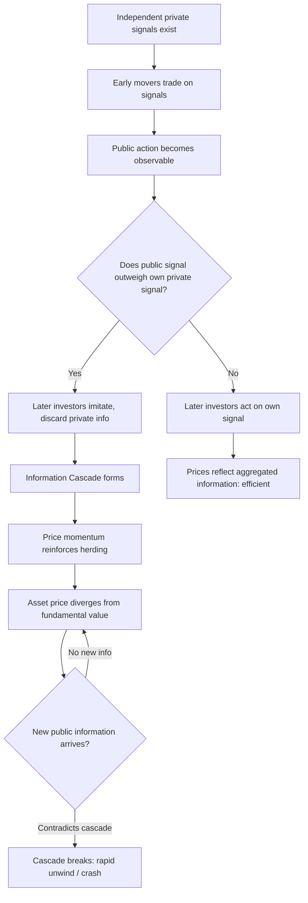

## Herding and Social Dynamics in Markets

### Overview

Herding behavior refers to the tendency of investors to mimic the actions (or perceived actions) of a larger group rather than acting on their own independent information or analysis. It is one of the central behavioral finance explanations for phenomena that classical Efficient Market Hypothesis (EMH) models struggle to accommodate: asset bubbles, crashes, excess volatility, and correlated trading patterns that are not fully explained by fundamentals. Social dynamics in markets extend this concept to the broader mechanisms — information cascades, social contagion, communication networks, and reputational concerns — through which individual decisions become correlated across market participants.

---

### Defining Herding

#### Rational vs. Irrational Herding

The literature distinguishes two broad categories of herding, which have different welfare and market-efficiency implications:

1. **Spurious (rational) herding** — Investors arrive at similar decisions independently because they are reacting to the same public information or fundamentals. This is not a bias; it is efficient information processing, even though the outcome (correlated trading) looks identical to true herding.
2. **Intentional (irrational) herding** — Investors deliberately imitate others' actions, suppressing or discarding their own private information, driven by psychological, reputational, or informational factors rather than by shared fundamentals.

**Key Points**

- Distinguishing rational from irrational herding empirically is difficult, since both produce the same observable clustering of trades.
- Most behavioral finance models focus on irrational herding because it is the component inconsistent with market efficiency and capable of generating mispricing.

#### Formal Definition

A common econometric measure, the Lakonishok, Shleifer, and Vishny (LSV, 1992) herding measure, is defined for a stock $i$ in period $t$ as:

$$H_{i,t} = |p_{i,t} - E[p_{i,t}]| - AF_{i,t}$$

where $p_{i,t}$ is the proportion of investors buying (relative to buying + selling) stock $i$, $E[p_{i,t}]$ is the expected proportion under no herding, and $AF_{i,t}$ is an adjustment factor correcting for the fact that $|p_{i,t} - E[p_{i,t}]|$ is expected to be positive even under random trading.

---

### Theoretical Mechanisms of Herding

#### 1. Information Cascades

Formalized by Bikhchandani, Hirshleifer, and Welch (1992), an information cascade occurs when individuals, observing the decisions of those who acted before them, rationally choose to ignore their own private signal and imitate the preceding decisions, because the weight of prior public actions outweighs their own single private signal.

**Mechanism**

Consider a sequence of investors deciding to buy or sell an asset, each with a private signal $s_i \in \{Buy, Sell\}$ of equal reliability $q > 0.5$. If the first two investors both buy (regardless of their true private signals converging by chance), a third investor whose private signal says "sell" faces a Bayesian calculation:

$$P(\text{Good state} \mid \text{2 buys observed}) > P(\text{Good state} \mid \text{own sell signal})$$

Under standard cascade conditions, the public information from the two prior buys dominates, and the third investor rationally buys despite their own contrary signal — discarding private information from the pool of aggregate market information. Once a cascade starts, subsequent investors' private signals never get revealed to the market, so the cascade can be based on very little actual information and can be wrong.

**Key Points**

- Cascades are inherently fragile: they can be reversed by a small amount of new public information, which explains sudden sentiment reversals in markets.
- Cascades differ from simple herding in that they can be individually rational (Bayesian-consistent) even though they produce a collectively inefficient outcome (information loss).

#### 2. Reputational Herding

Formalized by Scharfstein and Stein (1990), reputational herding arises when fund managers or analysts have career concerns and choose to mimic the consensus forecast or investment decision, even against their own better judgment, because:

- Being wrong *alongside* the crowd carries a smaller reputational penalty than being wrong *alone*.
- An incorrect but consensus decision is attributed to "bad luck" (a shared, uninformative state of the world), whereas an incorrect contrarian decision is attributed to the manager's own lack of skill.

This creates a "sharing the blame" incentive structure that is independent of actual informational content.

#### 3. Investigative/Informational Herding

Institutional investors may herd because they process similar information using similar analytical models (e.g., similar valuation methodologies, similar risk models, or similar signals from sell-side research), producing correlated trades that resemble herding but stem from correlated (not copied) information processing.

#### 4. Empirical/Characteristic Herding

Some institutions herd toward stocks sharing observable characteristics (e.g., large-cap, high-momentum, ESG-rated), driven by mandate constraints, prudent-man rules, or benchmarking requirements rather than genuine belief updating.

---

### Social Dynamics: Broader Mechanisms

#### Social Contagion and Communication Networks

Beyond formal cascades, social dynamics research (e.g., Shiller's work on market narratives, and network-based studies of investor communication) documents that investment ideas, fears, and enthusiasm spread through social networks — historically via word-of-mouth, and increasingly via social media, financial forums, and messaging platforms.

- **Narrative contagion**: Compelling, emotionally resonant stories (e.g., "this technology will change everything") spread faster and more persistently than dry statistical arguments, and can sustain speculative bubbles well beyond what fundamentals justify.
- **Attention-driven herding**: Investors are limited-attention agents; stocks that receive disproportionate media coverage or social media mentions experience abnormal trading volume from retail investors, independent of a change in fundamentals — documented extensively in the "attention-grabbing stocks" literature (Barber & Odean, 2008).
- **Meme-stock phenomenon**: A modern, high-velocity illustration of social herding, where coordinated retail attention via social platforms (e.g., Reddit's r/WallStreetBets) generated extreme price and volume moves in names such as GameStop (2021) largely disconnected from fundamental valuation changes.

#### Social Proof and Conformity Pressure

Rooted in Asch's classical conformity experiments, social proof describes the tendency to assume that the actions of others reflect correct behavior in an ambiguous situation. In financial markets, this manifests as:

- Increased confidence in a trade when it is validated by visible crowd behavior (e.g., trending tickers, high trading volume, analyst consensus).
- Reduced willingness to hold a contrarian position when it is socially costly (isolation from a peer group, being "the only one" who disagrees).

---

### Market-Level Consequences of Herding

**1. Bubble Formation and Amplification**

Herding is a key mechanism by which asset prices can deviate persistently from fundamental value. As more participants herd into an asset, price momentum itself becomes a self-reinforcing signal, attracting further herding — a positive feedback loop.

**2. Excess Volatility and Fat Tails**

Herding-driven trading clusters produce return distributions with heavier tails (more extreme moves) than would be predicted by a random walk with normally distributed innovations, since large numbers of participants can move in the same direction simultaneously.

**3. Correlated Crashes**

When a cascade reverses (e.g., due to a piece of negative public information), the unwind can be abrupt because participants who were following the crowd — rather than independent fundamentals — exit simultaneously, producing sharp price declines (e.g., flash crashes).

**4. Impaired Price Discovery**

Because herding suppresses the aggregation of independent private information (per the cascade mechanism), prices may fail to reflect the dispersed information that, in an efficient market, would be impounded through independent trading decisions.

Diagram illustrating the cascade and reversal dynamic (svg_diagram):

---

### Empirical Evidence

| Study | Finding |
| --- | --- |
| Bikhchandani, Hirshleifer & Welch (1992) | Formalized information cascades; showed cascades can form on very little actual information and are fragile to new public signals |
| Scharfstein & Stein (1990) | Modeled reputational herding among fund managers driven by career concerns |
| Lakonishok, Shleifer & Vishny (1992) | Found modest herding among pension fund managers, more pronounced in small-cap stocks |
| Grinblatt, Titman & Wermers (1995) | Documented "momentum herding" among mutual funds — buying past winners |
| Barber & Odean (2008) | Found retail investors disproportionately buy attention-grabbing stocks (high volume, extreme returns, in the news) rather than a random or fundamentals-driven selection |
| Shiller (various, including *Irrational Exuberance*) | Argued narrative contagion and social dynamics are central drivers of speculative bubble episodes |

**[Inference]** The relative contribution of social-media-driven herding to price dynamics (as opposed to traditional institutional herding channels) is likely growing over time given increased retail market participation and platform accessibility, though precisely quantifying this shift versus other concurrent structural changes (e.g., zero-commission trading, options market growth) remains methodologically difficult.

---

### Herding in Institutional vs. Retail Contexts

**Institutional Herding**

- Driven more by reputational concerns, benchmarking, and shared analytical inputs (correlated research signals).
- Tends to concentrate in specific style factors (e.g., momentum, glamour stocks) and small-cap names where price impact is largest.
- Can be measured using position-level 13F-style holdings data via the LSV measure.

**Retail Herding**

- Driven more by attention, narrative contagion, and social media/community dynamics.
- Amplified by low-friction trading platforms, gamification features, and real-time social validation (likes, upvotes, trending lists).
- Historically underexplored empirically until the rise of granular retail order-flow datasets and social media text data in the 2010s–2020s.

---

### Practical and Policy Implications

**Key Points**

- **For portfolio managers**: Explicit awareness of reputational herding incentives can inform mandate design (e.g., tracking-error limits that inadvertently encourage benchmark-hugging behavior).
- **For risk management**: Herding implies correlated tail risk across seemingly diversified positions when many participants are exposed to the same crowded trades; monitoring "crowding metrics" (e.g., short interest concentration, factor crowding scores) is a standard institutional risk practice.
- **For regulators**: Circuit breakers and trading halts are partly designed as mechanisms to interrupt cascade dynamics and allow new information to be incorporated before a cascade-driven crash fully propagates.
- **For individual investors**: Recognizing herding as a bias (rather than a genuine signal) supports maintaining a pre-committed, rules-based investment process that is less sensitive to short-term social/attention-driven price moves.

---

### Related Topics

- Information Cascades and Bayesian Learning Models
- Overconfidence and Mental Accounting
- Bubbles and Crashes: Behavioral Models
- Limits to Arbitrage and Noise Trader Risk (De Long, Shleifer, Summers, Waldmann, 1990)
- Prospect Theory and Loss Aversion
- Narrative Economics (Shiller)
- Momentum and Reversal Anomalies
- Social Media Sentiment Analysis in Asset Pricing
- Behavioral Portfolio Theory
- Systemic Risk and Crowded Trades