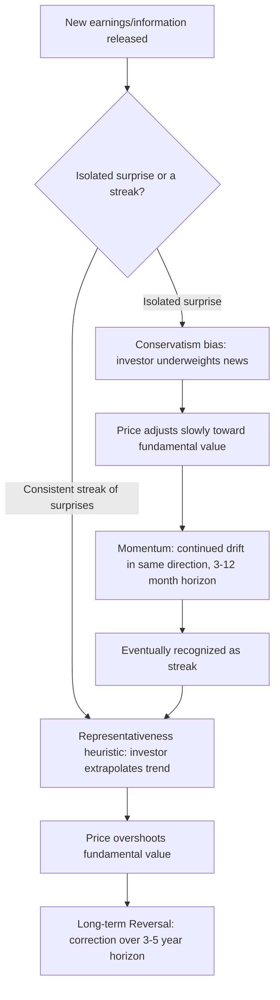

## Behavioral Explanations of Asset Pricing Anomalies

### Overview

Asset pricing anomalies are empirical patterns in security returns that are difficult to reconcile with standard rational-expectations models such as the Capital Asset Pricing Model (CAPM) or the Efficient Market Hypothesis (EMH). Behavioral finance offers an alternative explanatory framework: rather than treating anomalies as pure market inefficiencies to be arbitraged away, or as compensation for unmodeled risk factors, behavioral models argue that anomalies arise from the systematic, predictable errors of investors (overreaction, underreaction, biased beliefs) combined with **limits to arbitrage** that prevent rational traders from fully correcting mispricing.

This topic synthesizes the individual biases covered elsewhere in the chapter (overconfidence, mental accounting, herding) into specific, testable explanations for well-documented market anomalies.

---

### The Two-Pillar Structure of Behavioral Asset Pricing

Behavioral asset pricing models generally rest on two complementary pillars, following the framework popularized by Shleifer (2000) and Barberis & Thaler (2003):

1. **Limits to Arbitrage** — Rational arbitrageurs cannot always correct mispricing caused by irrational investors ("noise traders"), because arbitrage is costly and risky.
2. **Investor Psychology** — Systematic departures from Bayesian rationality (overconfidence, representativeness, conservatism, loss aversion) generate the *direction* and *pattern* of mispricing.

**Key Points**

- Pillar 1 explains *why* mispricing can persist; Pillar 2 explains *why* mispricing takes a particular, predictable form rather than being random noise.
- Without limits to arbitrage, rational traders would eliminate any mispricing caused by irrational investors, so both pillars are necessary for a coherent behavioral theory.

---

### Pillar 1: Limits to Arbitrage

#### Theoretical Foundation

Formalized by Shleifer and Vishny (1997) and De Long, Shleifer, Summers, and Waldmann (1990) (the "DSSW noise trader model"), limits to arbitrage identifies the real-world frictions that prevent rational arbitrageurs from fully exploiting mispricing:

1. **Fundamental risk** — Even a mispriced asset carries risk that fundamentals could move against the arbitrageur (no perfect substitute/hedge exists for most securities).
2. **Noise trader risk** — Prices can diverge *further* from fundamental value before they converge, because irrational sentiment can deepen in the short run. This is risky for arbitrageurs with finite horizons.
3. **Implementation costs** — Transaction costs, short-selling constraints (borrowing costs, short-sale bans, unavailability of shares to borrow), and margin requirements limit the scale of corrective trades.
4. **Agency problems** — Professional arbitrageurs (fund managers) manage other people's capital. If a mispricing worsens before it corrects, investors may redeem capital at the worst possible time ("arbitrageurs may be forced to liquidate their positions at just the wrong time"), forcing early unwinding regardless of the arbitrageur's own conviction.

$$\text{Effective Arbitrage Capacity} = f(\text{Capital}, \text{Horizon}, \text{Short-sale constraints}, \text{Agency risk})$$

**Example**

During the dot-com bubble (1998–2000), sophisticated hedge funds correctly identified that many internet stocks were overvalued and shorted them. However, because prices continued rising for an extended period before collapsing, several well-capitalized funds suffered severe losses or client redemptions *before* the correction occurred — a textbook illustration of noise trader risk and agency-driven limits to arbitrage.

---

### Pillar 2: Investor Psychology — Overreaction and Underreaction

Two of the most robust return anomalies — **momentum** and **long-term reversal** — are explained by behavioral models as arising from *opposite* psychological biases operating over different horizons.

#### Underreaction (Short-Horizon)

Investors underreact to new information (e.g., earnings announcements), causing prices to adjust only gradually toward fundamental value. This produces **momentum**: stocks with strong recent past returns continue to outperform over the subsequent 3–12 months (Jegadeesh & Titman, 1993).

Underreaction is attributed primarily to:

- **Conservatism bias** — Investors update beliefs too slowly in response to new evidence, anchoring too heavily on prior beliefs (Edwards, 1968; applied to markets by Barberis, Shleifer, & Vishny, 1998 — the "BSV model").
- **Anchoring** — Analysts and investors anchor earnings forecasts near recent historical values, underweighting new information.

#### Overreaction (Long-Horizon)

Investors overreact to a consistent pattern of good or bad news over a longer period, extrapolating recent trends too far into the future. This produces **long-term reversal**: stocks with strong returns over the past 3–5 years subsequently underperform, and past losers subsequently outperform (De Bondt & Thaler, 1985).

Overreaction is attributed primarily to:

- **Representativeness heuristic** — Investors judge the probability that a company is a "great growth company" by how similar its recent performance pattern looks to the canonical case, over-extrapolating a short run of good results into a long-run growth narrative (Kahneman & Tversky, 1972; applied by Barberis, Shleifer & Vishny, 1998).
- **Salience and availability** — A vivid recent trend (e.g., several consecutive quarters of earnings beats) is weighted more heavily than base-rate information about long-run mean reversion in corporate performance.

#### Unified Model: Barberis, Shleifer & Vishny (1998)

The BSV model formalizes both anomalies using a single investor who alternates between two erroneous "regimes" of belief, modeled via a hidden Markov switching process between:

- **Model 1 (conservatism-driven):** Earnings are assumed to follow a mean-reverting regime, so investors underweight a single earnings surprise → underreaction → momentum.
- **Model 2 (representativeness-driven):** After a *streak* of surprises, investors assume the firm has switched to a trending regime, over-extrapolating → overreaction → subsequent reversal.

Diagram of the underreaction/overreaction cycle (svg_diagram):

---

### Anomaly-by-Anomaly Behavioral Explanations

#### 1. Momentum Effect

- **Pattern**: Winners over the past 3–12 months continue to outperform losers over the following 3–12 months (Jegadeesh & Titman, 1993).
- **Behavioral explanation**: Underreaction due to conservatism and anchoring (BSV model); also reinforced by herding as later investors imitate the emerging price trend, extending the drift (Hong & Stein, 1999 — the "gradual information diffusion" model, where heterogeneously informed "newswatchers" and trend-following "momentum traders" interact).
- **Limits to arbitrage**: Momentum strategies carry crash risk (sharp momentum reversals during market stress), which itself deters arbitrage capital from fully eliminating the anomaly.

#### 2. Long-Term Reversal

- **Pattern**: Past 3–5 year losers outperform past 3–5 year winners over the subsequent 3–5 years (De Bondt & Thaler, 1985).
- **Behavioral explanation**: Overreaction/representativeness — investors over-extrapolate a long run of good or bad news into the indefinite future, pricing in an unsustainable growth or decline trajectory.

#### 3. Post-Earnings-Announcement Drift (PEAD)

- **Pattern**: Stock prices continue to drift in the direction of an earnings surprise for weeks after the announcement, rather than adjusting instantly (Ball & Brown, 1968; Bernard & Thomas, 1989).
- **Behavioral explanation**: A direct, high-frequency manifestation of underreaction/conservatism — a single, clean test case of investors failing to fully impound public information immediately.

#### 4. Value Premium (Value vs. Growth)

- **Pattern**: Stocks with low price-to-fundamental ratios (value stocks: low P/E, low P/B) have historically outperformed high-ratio "glamour"/growth stocks (Fama & French, 1992; Lakonishok, Shleifer & Vishny, 1994).
- **Behavioral explanation**: LSV (1994) argue this reflects investor overreaction and extrapolation — investors overpay for "glamour" stocks with strong recent growth (representativeness), pushing growth-stock prices above fundamental value and value-stock prices below it, followed by mean reversion. This contrasts with the risk-based explanation (Fama & French) that value stocks are simply riskier.

#### 5. Small-Firm Effect and Neglected-Firm Effect

- **Pattern**: Small-capitalization stocks have historically earned higher average returns than large-cap stocks, beyond what is explained by standard risk models; stocks with low analyst coverage ("neglected") show similar patterns.
- **Behavioral explanation**: Limited investor attention (a bounded-rationality concept related to overconfidence's "illusion of knowledge") means fewer market participants process information about these stocks, slowing price discovery and allowing mispricing to persist longer; also linked to higher implementation costs (Pillar 1) which deter arbitrage in illiquid small-cap names.

#### 6. Equity Premium Puzzle

- **Pattern**: The historical excess return of equities over risk-free bonds is far larger than standard expected-utility models with plausible risk-aversion parameters can justify (Mehra & Prescott, 1985).
- **Behavioral explanation**: Benartzi and Thaler (1995) propose **myopic loss aversion** — investors combine loss aversion (from Prospect Theory) with frequent (short-horizon) portfolio evaluation (mental accounting's "choice bracketing"). Because losses loom larger than equivalent gains, and because investors evaluate their portfolios often enough to "see" equities' short-term volatility, they demand an excessive risk premium to hold stocks relative to what a long-horizon, loss-neutral investor would require.

$$\text{Required Equity Premium} \uparrow \text{ as evaluation frequency} \uparrow \text{ and } \lambda \text{ (loss aversion coefficient)} \uparrow$$

#### 7. Excess Volatility Puzzle

- **Pattern**: Aggregate stock prices are more volatile than can be justified by the volatility of subsequent realized dividends/fundamentals under the rational expectations present-value model (Shiller, 1981).
- **Behavioral explanation**: Herding, narrative contagion, and correlated overreaction to public news cause price swings beyond what discounted fundamental cash flows warrant; limits to arbitrage (noise trader risk in DSSW) permit these deviations to persist rather than being corrected instantly.

#### 8. Closed-End Fund Puzzle

- **Pattern**: Closed-end fund shares frequently trade at persistent discounts (or occasionally premiums) to their net asset value (NAV), which is difficult to reconcile with the law of one price.
- **Behavioral explanation**: DSSW (1990) use this anomaly as a primary illustration of noise trader risk — sentiment among the (largely retail) holder base of closed-end fund shares fluctuates and is priced separately from the fund's underlying (largely institutionally held) assets; discounts are correlated across funds and comove with proxies for retail investor sentiment.

#### 9. Disposition Effect and Cross-Sectional Return Predictability

- **Pattern**: Stocks with a high proportion of shareholders sitting on unrealized capital gains tend to have higher subsequent returns; those with many shareholders sitting on losses (who are reluctant to sell) tend to show muted downward price adjustment (Grinblatt & Han, 2005).
- **Behavioral explanation**: A direct market-level pricing consequence of the disposition effect (covered under Mental Accounting) — the reluctance to realize losses creates a supply/demand imbalance that generates predictable, exploitable return patterns.

---

### Summary Table: Anomaly to Bias Mapping

| Anomaly | Time Horizon | Primary Behavioral Driver | Key Study |
| --- | --- | --- | --- |
| Momentum | 3–12 months | Underreaction (conservatism, anchoring) | Jegadeesh & Titman (1993) |
| Long-term reversal | 3–5 years | Overreaction (representativeness) | De Bondt & Thaler (1985) |
| Post-earnings drift | Weeks | Underreaction (conservatism) | Bernard & Thomas (1989) |
| Value premium | Multi-year | Overreaction/extrapolation | Lakonishok, Shleifer & Vishny (1994) |
| Small-firm/neglect effect | Multi-year | Limited attention + implementation costs | Merton (1987) |
| Equity premium puzzle | Long-run average | Myopic loss aversion (loss aversion + narrow bracketing) | Benartzi & Thaler (1995) |
| Excess volatility | Short-to-medium run | Herding, narrative contagion, noise trader risk | Shiller (1981); DSSW (1990) |
| Closed-end fund discount | Persistent | Investor sentiment / noise trader risk | Lee, Shleifer & Thaler (1991) |

---

### Competing Explanations: Behavioral vs. Risk-Based

**Key Points**

- The academic debate over anomalies is frequently framed as "behavioral mispricing" (Barberis, Shleifer, Thaler camp) vs. "compensation for unmodeled risk" (Fama-French multifactor camp) — the two are not always mutually exclusive.
- A common empirical test to distinguish the two: if an anomaly is risk-based, its premium should *not* be arbitraged away and should be robust across time and independent samples; if behavioral, the premium may decay or reverse after the anomaly becomes well-known and attracts arbitrage capital ("anomaly decay").
- [Inference] Some documented anomalies have weakened or disappeared in post-publication samples (a pattern consistent with both increased arbitrage activity correcting behavioral mispricing, and with data-mining/multiple-testing explanations for the original findings), and disentangling these two explanations for any specific anomaly remains an active empirical question.

---

### Practical Implications

**Key Points**

- **For active managers**: Behavioral anomalies (value, momentum) have historically formed the basis of systematic "factor investing" strategies, though capacity constraints and crowding can erode returns as more capital chases the same signals.
- **For risk management**: Because behavioral anomalies are linked to limits to arbitrage, portfolios exploiting them (e.g., momentum, short volatility) are prone to sudden, correlated drawdowns when arbitrage capital is forced to unwind simultaneously (a link to systemic/crowding risk covered under Herding).
- **For market design/regulation**: Short-sale constraints and circuit breakers directly affect the "limits to arbitrage" pillar, meaning market microstructure rules can materially affect how quickly (or whether) behavioral mispricing corrects.

---

### Related Topics

- Overconfidence and Mental Accounting
- Herding and Social Dynamics in Markets
- Prospect Theory and Loss Aversion
- Limits to Arbitrage and Noise Trader Models (DSSW)
- Efficient Market Hypothesis: Forms and Empirical Tests
- Fama-French Multifactor Models
- Momentum and Value Investing Strategies
- Myopic Loss Aversion and the Equity Premium Puzzle
- Market Microstructure and Short-Selling Constraints
- Behavioral Portfolio Theory