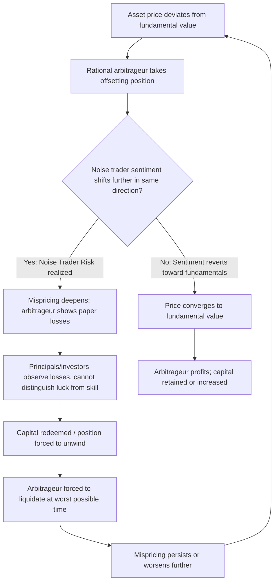

## Noise Trader Risk

### Overview

Noise trader risk is the central concept in the "Limits to Arbitrage" literature explaining why rational arbitrageurs cannot always eliminate mispricing caused by irrational investors. Formalized primarily by De Long, Shleifer, Summers, and Waldmann (1990) — commonly abbreviated **DSSW** — the theory shows that even when rational arbitrageurs correctly identify that an asset is mispriced, the unpredictable, sentiment-driven behavior of "noise traders" can push prices further from fundamental value before any correction occurs. Because arbitrageurs typically operate with finite horizons and finite capital, this risk of *further* mispricing (rather than immediate correction) limits how aggressively they are willing or able to trade against noise traders, allowing mispricing to persist in equilibrium.

---

### Definitions

- **Noise traders**: Investors whose demand for assets is driven by beliefs or sentiments that are not fully justified by fundamental information — they trade on "noise" (pseudo-signals, fads, overconfidence, sentiment) as if it were informative.
- **Rational arbitrageurs (smart money)**: Investors who form unbiased expectations of fundamental value and trade to exploit the gap between price and fundamental value.
- **Noise trader risk**: The risk that noise traders' sentiment becomes *more* extreme in the same direction before it reverts, causing the price to move further away from fundamental value in the short-to-medium run — creating losses for an arbitrageur who has already taken a position betting on convergence.

**Key Points**

- Noise trader risk is distinct from fundamental risk. Fundamental risk concerns uncertainty about the asset's true intrinsic value; noise trader risk concerns uncertainty about *other investors' beliefs*, even when the arbitrageur is fully confident about fundamentals.
- This distinction is what makes noise trader risk a genuinely new form of systematic risk in the DSSW framework — one that exists purely because of the presence of irrational traders in the market, not because of any real economic uncertainty.

---

### The DSSW Model

#### Setup

The DSSW (1990) model uses an overlapping-generations framework with two types of traders in a market for a single risky asset with fixed fundamental dividend:

1. **Sophisticated (rational) investors**, fraction $(1-\mu)$ of the population, who have rational expectations of returns.
2. **Noise traders**, fraction $\mu$ of the population, whose beliefs about the asset's future price are distorted by a random "misperception" term $\rho_t$, which follows:

$$\rho_t \sim N(\rho^*, \sigma_{\rho}^2)$$

where $\rho^*$ is the average bullishness of noise traders and $\sigma_{\rho}^2$ represents the *unpredictability* of noise trader sentiment — the source of noise trader risk.

#### Key Result: Noise Traders Can Earn Higher Expected Returns Than Rational Arbitrageurs

Counterintuitively, the model shows that noise traders can, in equilibrium, earn *higher* expected returns than rational arbitrageurs, despite trading on beliefs uncorrelated with fundamentals. This occurs because:

- Noise traders who are bullish increase their own demand for the risky asset, bidding up its price.
- If sophisticated arbitrageurs, fearing further unpredictable increases in bullishness (noise trader risk), reduce their own holdings of the asset relative to the no-noise-trader benchmark, then the risky asset must offer a *higher expected return* to compensate rational investors for bearing noise trader risk.
- Because noise traders (by construction) hold more of the asset on average during bullish periods, they capture more of this extra "noise trader risk premium" than a purely rational strategy would — even though their beliefs are, on average, wrong.

$$E[R_{\text{noise trader}}] > E[R_{\text{rational, no noise traders}}] \quad \text{is possible in equilibrium}$$

**[Inference]** This result is often summarized as "noise traders create their own space" — it does not imply noise traders are better investors in a risk-adjusted (Sharpe ratio) sense, since they also bear more volatility; the comparison is specifically about raw expected returns under the model's parameterization.

#### Price Deviation from Fundamental Value

The equilibrium price in the DSSW model can be decomposed as:

$$p_t = \bar{p} + \gamma(\rho_t - \rho^*) - \phi(1+r)^{-1}\rho^*$$

where $\bar{p}$ is the fundamental value, $\gamma(\rho_t - \rho^*)$ captures the price impact of *unexpected* shifts in noise trader sentiment, and the final term captures the average price impact of persistently optimistic (or pessimistic) noise traders. The key insight is that both the *level* and the *unpredictability* of noise trader sentiment affect prices.

---

### Why Noise Trader Risk Limits Arbitrage

#### The Core Mechanism

A rational arbitrageur identifying an asset trading above fundamental value faces the following problem when considering a short position:

1. **Correct in the long run**: Given enough time, the arbitrageur may be proven right as price converges to fundamental value.
2. **Wrong in the short run**: Before convergence, noise trader sentiment may become *more* bullish, pushing the price even further above fundamental value.
3. **Finite horizon**: If the arbitrageur must close the position (or report performance) before eventual convergence, they can suffer losses even while being fundamentally "correct" about the mispricing.

This generates the famous informal proposition often attributed to John Maynard Keynes: markets can remain irrational longer than a rational arbitrageur can remain solvent (a widely cited paraphrase rather than a verified direct quotation, commonly used to summarize this exact mechanism).

#### Interaction with Agency Problems (Shleifer & Vishny, 1997)

Shleifer and Vishny (1997) extend the DSSW framework by emphasizing that most real-world arbitrage capital is managed by professional agents (fund managers) on behalf of principals (investors, allocators) who cannot perfectly observe whether a losing position reflects bad luck or bad judgment.

- If a mispricing worsens, the arbitrageur's fund shows losses.
- Uninformed principals, unable to distinguish "temporarily wrong but eventually right" from "simply wrong," may redeem capital or cut the manager's allocation at precisely the point of maximum mispricing.
- This forces the arbitrageur to liquidate the position at the worst possible time, converting noise trader risk into *realized* losses rather than a paper loss that would have reversed.

$$\text{Arbitrage Capacity}_t = f(\text{AUM}_t), \quad \frac{\partial \text{AUM}_t}{\partial (\text{Realized Losses}_t)} < 0$$

This creates a **performance-based arbitrage** feedback loop: the segments of the market most in need of correction (extreme mispricing) are also the segments where arbitrage capital is most likely to be *withdrawn*, precisely when it is needed most.

Diagram of the noise trader risk / performance-based arbitrage feedback loop (svg_diagram):

---

### Sources of Noise Trader Risk

Noise trader sentiment shifts that generate noise trader risk are typically linked to the psychological biases covered elsewhere in the Behavioral Finance material:

- **Overconfidence**: Noise traders overestimate the precision of their own signals, sustaining conviction in a mispriced direction longer than warranted.
- **Herding and social dynamics**: Correlated sentiment shifts across a large population of noise traders (rather than idiosyncratic, diversifiable noise) are what make noise trader risk a priced, non-diversifiable risk factor rather than something that averages out across traders.
- **Representativeness/extrapolation**: Noise traders extrapolating a recent price trend generate momentum in sentiment, which is precisely the kind of unpredictable, self-reinforcing shift that DSSW models as $\rho_t$.

**Key Points**

- Noise trader risk requires *correlated* irrationality across a meaningful fraction of market participants; if noise traders' errors were independent and uncorrelated, they would cancel out in the aggregate and pose no systematic risk to arbitrageurs (this is a foundational point in DSSW distinguishing their model from earlier "irrelevance of irrational traders" arguments, e.g., Friedman 1953).

---

### Empirical Evidence

| Study / Case | Evidence |
| --- | --- |
| Lee, Shleifer & Thaler (1991) | Closed-end fund discounts comove with proxies for individual investor sentiment, consistent with noise trader risk being priced and correlated across similar securities |
| De Long, Shleifer, Summers & Waldmann (1990) | Theoretical foundation; shows noise traders can survive and even earn higher expected returns in equilibrium |
| Shleifer & Vishny (1997) | "The Limits of Arbitrage" — formalizes performance-based arbitrage and agency-driven forced liquidation |
| LTCM collapse (1998) | Widely cited as a real-world illustration: LTCM's convergence trades were fundamentally sound in direction but suffered severe mark-to-market losses as spreads widened further before (and beyond) any correction, triggering margin calls and forced deleveraging |
| Dot-com bubble short sellers (1999–2000) | Hedge funds shorting overvalued internet stocks faced substantial losses as prices rose further before the eventual 2000–2002 collapse, illustrating both noise trader risk and agency-forced unwinding |

**[Inference]** The LTCM and dot-com examples are commonly cited pedagogically as illustrations of noise trader risk and limits to arbitrage; the extent to which each episode is *fully* explained by this mechanism versus other concurrent factors (e.g., leverage, liquidity spirals, genuine model risk) is debated in the broader academic literature and should not be treated as a clean, controlled test of the DSSW model.

---

### Distinguishing Noise Trader Risk from Related Concepts

| Concept | Distinction from Noise Trader Risk |
| --- | --- |
| Fundamental risk | Concerns uncertainty about the asset's true value itself, not about other traders' beliefs |
| Synchronization risk (Abreu & Brunnermeier, 2002) | Concerns uncertainty about *when* other rational arbitrageurs will act, not about noise trader sentiment specifically — a coordination problem among the rational |
| Idiosyncratic noise trading | Uncorrelated, diversifiable noise trading across many independent traders poses no systematic risk; noise trader risk specifically requires correlated sentiment shifts |
| Model risk | Uncertainty about whether the arbitrageur's own valuation model is correct — a form of the arbitrageur's own epistemic risk, separate from noise trader behavior |

---

### Implications for Market Efficiency

**Key Points**

- Noise trader risk provides a coherent theoretical answer to the "why doesn't smart money just correct mispricing" objection to behavioral finance, complementing the psychological bias explanations of *why* mispricing has a particular direction and shape.
- It implies that observed asset prices are a function not only of fundamentals but of the *distribution* and *unpredictability* of investor sentiment — meaning standard risk-based asset pricing models omitting a sentiment factor may be systematically misspecified during periods of high noise trader activity.
- It also implies markets with a higher share of noise traders relative to arbitrage capital (e.g., markets with high retail participation, low institutional ownership, or thin liquidity) should exhibit greater and more persistent mispricing — a testable cross-sectional prediction supported by findings on closed-end funds and small/neglected stocks.

---

### Practical Implications

**Key Points**

- **For arbitrageurs/hedge funds**: Position sizing and horizon management should explicitly account for the possibility that a correctly identified mispricing worsens before it corrects; this motivates practices like avoiding excessive leverage on convergence trades and negotiating longer capital lock-up periods to reduce forced-liquidation risk.
- **For allocators/fund investors**: Understanding noise trader risk explains why redeeming capital from a manager purely on the basis of a drawdown, without assessing whether the underlying thesis remains valid, can be self-defeating — it can force exactly the liquidation that locks in losses on an otherwise sound position.
- **For market structure**: The prevalence of noise trader risk is one justification for measures that stabilize arbitrage capital supply during stress (e.g., circuit breakers, and — historically debated — capital requirements or liquidity backstops for market-making arbitrageurs).

---

### Related Topics

- Limits to Arbitrage: Shleifer & Vishny (1997) Full Framework
- Herding and Social Dynamics in Markets
- Overconfidence and Mental Accounting
- Closed-End Fund Puzzle
- Behavioral Explanations of Asset Pricing Anomalies
- Synchronization Risk and Coordinated Arbitrage (Abreu & Brunnermeier)
- Investor Sentiment Indices and Measurement
- Performance-Based Arbitrage and Fund Flows
- Liquidity Spirals and Margin Calls (LTCM Case Study)