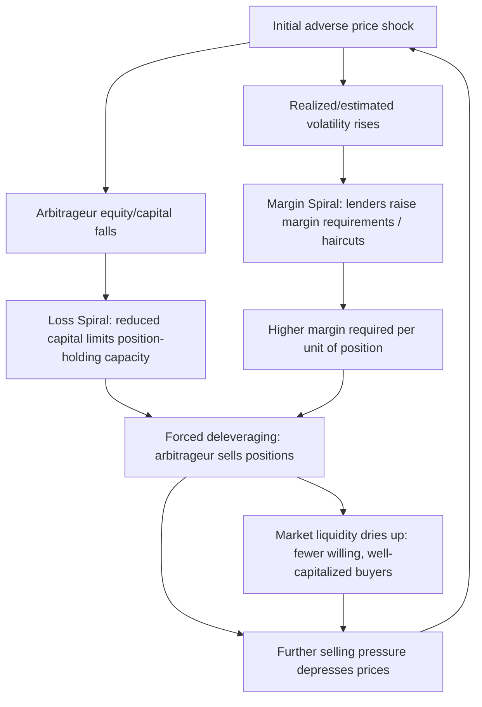

## Funding Constraints and Margin Requirements

### Overview

Funding constraints and margin requirements represent a second major channel — alongside noise trader risk — through which real-world frictions prevent rational arbitrageurs from fully correcting mispricing, and through which these frictions can themselves become a source of systemic risk. While noise trader risk (DSSW, 1990) focuses on the *sentiment* side of the market, the funding-constraints literature, most rigorously formalized by Brunnermeier and Pedersen (2009), focuses on the *capital* side: arbitrageurs typically operate with leverage, financed through margin loans and repo markets, and the terms of this financing (margin requirements, haircuts, funding availability) are themselves endogenous to market conditions — creating feedback loops that can amplify rather than dampen mispricing during periods of stress.

---

### Core Concepts

#### Margin and Haircuts

- **Margin requirement**: The amount of an investor's own capital (equity) required to establish a leveraged position, expressed as a percentage of the position's value.
- **Haircut**: The discount applied to the market value of collateral when a lender determines how much they will lend against it (e.g., a 10% haircut on a bond means the lender will only advance 90% of its market value).
- **Leverage ratio**: The inverse relationship between margin and position size —

$$\text{Leverage} = \frac{1}{\text{Margin Requirement}}$$

A 10% margin requirement permits 10x leverage; a 50% margin requirement permits 2x leverage.

#### Funding Liquidity vs. Market Liquidity

Brunnermeier and Pedersen (2009) draw a critical distinction:

- **Market liquidity**: The ease of trading an asset — reflected in bid-ask spreads, market depth, and price impact of trades.
- **Funding liquidity**: The ease with which traders can obtain funding (cash, credit, margin loans) to finance their positions.

The central contribution of the model is showing that these two forms of liquidity are mutually reinforcing, and their interaction can produce sudden, severe **liquidity spirals**.

---

### The Brunnermeier-Pedersen Model: Liquidity Spirals

#### Setup

In the model, margin requirements are typically set based on the *volatility* (or Value-at-Risk) of the underlying asset, since higher volatility implies greater risk to the lender that the collateral's value will fall before the loan can be called:

$$\text{Margin}_t = f(\hat{\sigma}_t), \quad \frac{\partial \text{Margin}_t}{\partial \hat{\sigma}_t} > 0$$

where $\hat{\sigma}_t$ is the (typically backward-looking, estimated) volatility of the asset's returns.

#### Two Reinforcing Spiral Mechanisms

**1. The Margin Spiral**

An initial price shock increases realized/estimated volatility, which causes lenders to raise margin requirements (larger haircuts), which forces leveraged arbitrageurs to reduce position sizes (deleverage) to meet the new margin, which generates further selling pressure, which further depresses prices and increases volatility — reinforcing the initial shock.

**2. The Loss Spiral**

An initial price decline directly reduces the value of arbitrageurs' existing positions and hence their capital/equity, which — combined with margin requirements that do not fall proportionally — reduces their ability to hold or add to positions, forcing further deleveraging and selling, which further depresses prices, further reducing capital.

Both mechanisms feed into each other: falling prices reduce capital (loss spiral) *and* simultaneously trigger higher margin requirements (margin spiral) as volatility spikes, compounding the forced deleveraging.

$$\text{Capital}_t = \text{Capital}_{t-1} + \Delta P_t \cdot \text{Position}_{t-1}$$

$$\text{Max Position}_t = \frac{\text{Capital}_t}{\text{Margin}_t(\hat{\sigma}_t)}$$

When $\Delta P_t < 0$ and $\hat{\sigma}_t \uparrow$ simultaneously, $\text{Max Position}_t$ falls sharply from both the numerator (capital) shrinking and the denominator (margin) rising — a **doubly reinforcing** contraction in arbitrage capacity.

Diagram of the dual liquidity spiral mechanism (svg_diagram):

#### Key Predictions of the Model

1. **Liquidity can evaporate suddenly**: Rather than degrading smoothly, market liquidity can decline abruptly once funding constraints bind, producing "liquidity dry-ups" or "flash" liquidity crises.
2. **Flight to quality**: During funding stress, margin requirements often rise disproportionately for riskier/less-liquid assets, causing arbitrage capital and liquidity to concentrate in the safest, most liquid instruments — a documented pattern in the model and in empirical crisis episodes.
3. **Commonality in liquidity**: Because many arbitrageurs face correlated funding shocks (e.g., a common prime broker or common lending conditions), market liquidity for otherwise unrelated assets can become correlated during stress, even absent any correlation in fundamentals.
4. **Fragility increases with leverage**: Markets with higher baseline leverage among liquidity-providing arbitrageurs are more susceptible to sudden spirals when a shock occurs, since less capital cushion exists before margin calls bind.

---

### Interaction with Noise Trader Risk and Agency Problems

Funding constraints compound the mechanisms covered under Noise Trader Risk:

- **Shleifer & Vishny (1997) agency channel**: Performance-based redemptions from principals are one *source* of the capital withdrawal that triggers a loss spiral; margin calls from prime brokers are a second, often faster-acting, source of the same forced-deleveraging dynamic.
- **Noise trader risk amplification**: If noise trader sentiment worsens a mispricing (increasing paper losses on an arbitrage position), this can itself trigger the margin/loss spiral described above, converting a "risk" (noise trader unpredictability) into a "forced, realized loss" (margin call) even faster than would occur through investor redemptions alone, since margin calls typically operate on much shorter timeframes (days, not months/quarters).

**Key Points**

- Margin-based funding constraints tend to bind *faster* than the agency-based fund-redemption channel, since margin calls can be triggered intraday or overnight, while investor redemption notice periods are typically monthly or quarterly.
- This makes margin/funding constraints especially important for understanding acute crisis dynamics (e.g., 2008, LTCM 1998), while agency-based limits to arbitrage are often more relevant for explaining the *persistence* of mispricing over longer horizons.

---

### Real-World Illustrations

#### LTCM (1998)

Long-Term Capital Management's positions were largely convergence trades (betting that related securities' prices would converge). Following the 1998 Russian debt default, spreads *widened* rather than converged (a manifestation of noise trader risk / flight-to-quality behavior). This triggered margin calls from LTCM's counterparties precisely as its capital base was shrinking from mark-to-market losses — a textbook simultaneous loss spiral and margin spiral, ultimately requiring a Federal Reserve-facilitated private-sector recapitalization to avoid disorderly unwinding.

#### 2007–2008 Global Financial Crisis

The crisis featured funding-liquidity spirals across multiple asset classes:

- Rising haircuts on mortgage-backed securities and other structured credit in the repo market forced leveraged holders (banks, broker-dealers, hedge funds) to deleverage.
- The collapse of Bear Stearns and Lehman Brothers involved acute funding-liquidity failures (an inability to roll over short-term repo financing) compounding underlying asset-quality (fundamental) concerns.
- Brunnermeier (2009) explicitly analyzes the crisis through this lens in "Deciphering the Liquidity and Credit Crunch 2007–2008."

#### Quant Quake (August 2007)

A brief but sharp episode in which many quantitative equity long-short hedge funds, employing similar factor strategies, experienced simultaneous severe losses over a few days, widely attributed to one or more large funds being forced to deleverage (for funding or risk-management reasons), triggering correlated forced selling among funds with similar factor exposures — illustrating the "commonality in liquidity" prediction of the model even though the funds were not formally connected.

---

### Formal Measurement Concepts

| Concept | Description |
| --- | --- |
| VaR-based margining | Margin set as a function of Value-at-Risk, directly linking margin requirements to estimated volatility |
| Procyclicality of margin | The tendency of margin requirements to rise during stress (when volatility spikes) and fall during calm periods, amplifying rather than dampening the cycle |
| Funding liquidity risk measures | TED spread, repo-rate spreads, and cross-currency basis swaps are commonly used market proxies for funding stress |
| Leverage/deleveraging cycles | Empirically observable in aggregate broker-dealer leverage data, which tends to be procyclical (rising in booms, falling sharply in busts) |

---

### Policy and Risk Management Implications

**Key Points**

- **Countercyclical margining**: Some post-2008 regulatory reforms and central counterparty (CCP) practices have explored setting margin requirements to be less procyclical (e.g., using longer volatility-estimation windows, or explicit floors/buffers) specifically to dampen the margin-spiral mechanism.
- **Central bank liquidity facilities**: Emergency lending facilities (e.g., Federal Reserve programs during 2008 and March 2020) function as a direct policy response to funding-liquidity spirals, providing an alternative funding source when private funding markets seize up.
- **For arbitrageurs/risk managers**: Maintaining excess capital buffers beyond minimum margin requirements, diversifying funding sources (multiple prime brokers/counterparties), and stress-testing positions against simultaneous adverse price moves *and* margin increases (rather than testing each in isolation) are standard risk-management responses to this literature.
- **For regulators**: Understanding that market liquidity and funding liquidity are mutually reinforcing informs stress-testing frameworks (e.g., requiring institutions to model liquidity spirals, not just standalone price shocks) and macroprudential leverage limits aimed at reducing systemic fragility.

---

### Distinguishing This Topic from Related Concepts

| Concept | Distinction |
| --- | --- |
| Noise Trader Risk (DSSW) | Concerns *sentiment*-driven mispricing risk; funding constraints concern *capital/leverage*-driven forced deleveraging — the two frequently interact but are distinct mechanisms |
| Shleifer & Vishny (1997) agency channel | Concerns fund-level investor redemptions (slower-moving); margin requirements concern counterparty-level collateral calls (faster-moving) |
| Market microstructure liquidity (bid-ask spreads) | A *symptom*/component of market liquidity; the Brunnermeier-Pedersen model explains *why* this liquidity can suddenly deteriorate via the funding channel |

---

### Related Topics

- Noise Trader Risk (DSSW Model)
- Limits to Arbitrage: Shleifer & Vishny (1997) Full Framework
- Liquidity Spirals and the 2008 Financial Crisis
- Repo Markets and Collateral Haircuts
- Value-at-Risk and Procyclical Risk Management
- Systemic Risk and Crowded Trades
- Behavioral Explanations of Asset Pricing Anomalies
- Central Bank Liquidity Facilities and Lender of Last Resort
- Prime Brokerage and Counterparty Risk Management