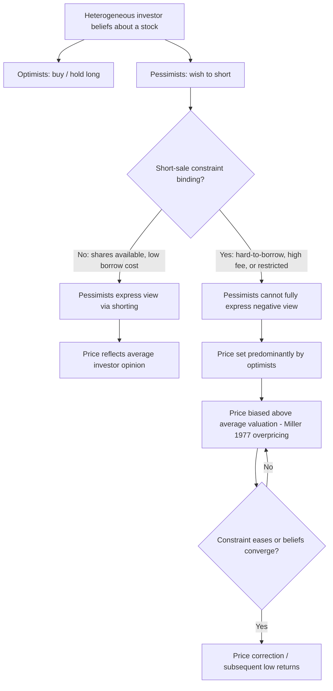

## Short-Sale Constraints

### Overview

Short-sale constraints refer to the frictions and restrictions that limit an investor's ability to profit from a belief that an asset is overvalued by selling it short. Because short-selling is mechanically and institutionally more difficult than buying, these constraints represent a structurally asymmetric limit to arbitrage: correcting *overvaluation* is systematically harder than correcting *undervaluation*, which has significant implications for the direction and persistence of mispricing, price efficiency, and the interpretation of several documented asset pricing anomalies.

---

### Mechanics of Short-Selling

#### The Standard Short-Sale Process

1. **Locate**: The short-seller must borrow shares of the target security, typically through a broker who sources them from institutional lenders (mutual funds, pension funds, index funds) willing to lend their holdings.
2. **Sell**: The borrowed shares are sold in the market at the current price.
3. **Post collateral**: The short-seller must post margin/collateral (typically cash) with the lender, usually exceeding 100% of the position's value.
4. **Pay a borrowing fee**: The short-seller pays a fee (the "rebate rate" or "short fee") to the share lender for the duration of the loan.
5. **Cover**: The short-seller eventually buys back the shares in the market and returns them to the lender, closing the position.

$$\text{Short-Sale Profit} = (P_0 - P_1) - \text{Borrow Fee} - \text{Dividends Paid to Lender} - \text{Transaction Costs}$$

where $P_0$ is the initial sale price and $P_1$ is the price at which the position is covered. Note the short-seller is also typically obligated to pay any dividends issued during the borrowing period to the share lender, adding a cost not present in a long position.

#### Key Structural Asymmetry vs. Long Positions

**Key Points**

- A long position's maximum loss is capped at 100% of the initial investment (the price cannot fall below zero), while the maximum gain is theoretically unlimited.
- A short position's maximum *gain* is capped at 100% of the initial sale price (the price cannot fall below zero), while the maximum *loss* is theoretically unlimited (the price can rise indefinitely).
- This asymmetric risk profile alone (independent of any institutional friction) makes short-selling a less attractive strategy on a pure risk/reward basis, even before considering borrowing costs and constraints — sometimes referred to as the inherent risk asymmetry of shorting.

---

### Categories of Short-Sale Constraints

#### 1. Supply-Side Constraints (Loan Availability)

- **Share lending supply**: Not all shares are available to borrow; supply depends on institutional holders' willingness to lend, which itself varies with index membership, ownership concentration, and lending program participation.
- **"Hard-to-borrow" / "Special" stocks**: When demand to short a stock exceeds available lending supply, borrowing fees rise sharply (sometimes to double-digit annualized percentages), and in extreme cases shares become unavailable to borrow at any price ("no locate available").
- **Recall risk**: A share lender can recall loaned shares at any time (e.g., to sell the underlying position or to vote at a shareholder meeting), forcing the short-seller to either find a new lender or involuntarily close the position — an additional, unpredictable risk absent from long positions.

#### 2. Cost-Side Constraints

- **Borrowing fees (short fees)**: Directly reduce the profitability of a short position and, in the case of "special" stocks, can exceed plausible expected returns from the mispricing itself.
- **Margin requirements on short positions**: Regulatory (e.g., Regulation T in the U.S.) and broker-specific margin requirements for short positions are typically more stringent than for long positions, reflecting the unlimited-loss risk profile.

#### 3. Regulatory and Institutional Constraints

- **Uptick rule / alternative uptick rule**: Historically (and in various revived forms, e.g., the SEC's Rule 201 "circuit breaker" alternative uptick rule adopted in 2010), regulations have restricted short-selling of a stock following a sharp price decline, to prevent short-sellers from accelerating a decline.
- **Temporary short-selling bans**: Regulators have periodically imposed outright bans on short-selling specific sectors (e.g., financial stocks) during acute crisis periods (notably during the 2008 financial crisis in the U.S., U.K., and other jurisdictions) on the rationale of preventing destabilizing downward price spirals.
- **Institutional mandate restrictions**: Many institutional investors (e.g., traditional long-only mutual funds, many pension funds) are prohibited by their own investment mandates from short-selling at all, regardless of market-level regulatory rules — mechanically reducing the pool of potential short-sellers far below the pool of potential buyers.
- **Naked short-selling restrictions**: Regulations (e.g., Regulation SHO in the U.S.) generally require a "locate" of borrowable shares before a short sale can be executed, prohibiting "naked" shorting (selling short without a locate) except in narrow, exempted circumstances.

**Key Points**

- The combined effect of these constraints is that far fewer market participants are willing or able to express a negative view on a stock via shorting than are able to express a positive view via buying — a structural asymmetry with direct implications for price efficiency.

---

### Theoretical Implications: The Miller (1977) Overpricing Hypothesis

Edward Miller's foundational 1977 model formalizes the core prediction of short-sale constraint theory:

- Assume investors have heterogeneous beliefs about a stock's value.
- If short-selling is costless and unconstrained, pessimistic investors can express their negative views by shorting, and the equilibrium price reflects the *average* opinion across all investors (both optimists and pessimists).
- If short-selling is constrained, pessimistic investors are effectively prevented from participating (or fully expressing their negative view) in the market for that stock.
- The equilibrium price is then set predominantly by the *more optimistic* subset of investors (those willing to hold long positions), causing the price to be biased upward relative to the average (unconstrained) valuation.

$$P_{\text{constrained}} > E[\text{Average Investor Valuation}] \quad \text{when short-sale constraints bind}$$

**Key Points**

- This is sometimes summarized as: short-sale constraints cause prices to reflect the beliefs of the *marginal optimist* rather than the *average* investor.
- The Miller (1977) hypothesis predicts that stocks with high dispersion of investor opinion (high disagreement) combined with binding short-sale constraints should be the most overpriced and should subsequently earn the *lowest* future returns as the constraint eventually eases or beliefs converge.

---

### Interaction with Overconfidence, Herding, and Disagreement

Short-sale constraints interact directly with the psychological biases covered elsewhere in the curriculum:

- **Overconfidence-driven disagreement**: Overconfident investors overestimate the precision of their own signals, generating wider dispersion of beliefs (some very bullish, some very bearish) about the same stock. Under Miller's model, this dispersion — combined with binding short-sale constraints — directly predicts overpricing.
- **Herding reinforcement**: If optimistic investors herd into a stock (amplifying upward price momentum) while pessimistic investors are mechanically prevented from countering that pressure via shorting, the resulting price can diverge further and for longer than in a symmetric-constraint market.
- **Behavioral bubble episodes**: Notable historical bubble/short-squeeze episodes (e.g., the 2008 Volkswagen short squeeze, the 2021 GameStop episode) are frequently analyzed through the combined lens of short-sale constraints (limited borrowable supply, high borrow fees) interacting with coordinated herding-driven buying pressure — see the Herding and Social Dynamics topic for the demand-side mechanism.

Diagram of the short-sale constraint / overpricing mechanism (svg_diagram):

---

### Empirical Evidence

| Study | Finding |
| --- | --- |
| Miller (1977) | Foundational theoretical model of overpricing under binding short-sale constraints and dispersed beliefs |
| Diether, Malloy & Scherbina (2002) | Stocks with higher analyst forecast dispersion (a proxy for disagreement) earn lower future returns, consistent with the Miller hypothesis |
| Chen, Hong & Stein (2002) | Breadth of mutual fund ownership (a proxy for short-sale constraint tightness, since low ownership breadth implies fewer shares available to borrow) predicts lower future returns, consistent with binding constraints causing overpricing |
| Jones & Lamont (2002) | Directly using historical stock loan fee data, found stocks that are expensive to short (indicating binding constraints) subsequently earn abnormally low returns |
| Ofek & Richardson (2003) | Found evidence linking short-sale constraints and lock-up expirations to the internet stock bubble's overvaluation and eventual correction |
| Volkswagen short squeeze (2008) | An extreme illustration: limited float and a Porsche ownership disclosure caused VW's share price to briefly become the world's most valuable company by market cap, driven by a short squeeze among constrained short-sellers forced to cover |
| GameStop episode (Jan 2021) | High short interest relative to float, combined with coordinated retail buying (a herding/social dynamics mechanism), produced an extreme short squeeze; widely studied as a modern case combining short-sale constraint mechanics with social-media-driven herding |

**[Inference]** While the Miller (1977) overpricing prediction is broadly supported across the cited empirical literature, isolating the short-sale-constraint channel from other correlated explanations (e.g., ownership breadth also correlating with firm size, liquidity, and information environment) remains a methodological challenge in this literature, and researchers typically use multiple proxies (loan fees, ownership breadth, analyst dispersion) together to strengthen identification.

---

### Regulatory Debate: Do Short-Sale Bans Work?

**Key Points**

- Proponents of short-sale restrictions during crises argue they prevent self-reinforcing downward price spirals (a demand-side complement to the "limits to arbitrage" logic, aimed at containing panic-driven declines).
- Critics, and a substantial body of empirical research on the 2008 short-selling bans, generally find that such bans were associated with *reduced* market liquidity, wider bid-ask spreads, and did *not* clearly prevent the price declines they were intended to stop, since restricting a market's shorting capacity impairs price discovery without addressing the underlying fundamental or funding-driven causes of the decline.
- This tension — investor protection/stability rationale vs. price-discovery/liquidity cost — remains a live regulatory policy debate rather than a settled empirical question. [Unverified] The precise net welfare effect of any specific short-sale ban episode depends on market-specific conditions and is contested across studies using different methodologies and event windows.

---

### Practical Implications

**Key Points**

- **For arbitrageurs**: Before initiating a short thesis, practitioners typically check stock loan availability and borrow-fee levels (data from stock loan/securities lending data providers) as a precondition, since a fundamentally correct but "impossible to borrow" thesis cannot be monetized via direct shorting.
- **Alternative strategies under binding constraints**: Where direct shorting is unavailable or prohibitively expensive, arbitrageurs often substitute put options, total return swaps, or pairs trades (long a comparable, undervalued peer while avoiding the constrained short leg) to approximate the same directional exposure.
- **For risk managers**: High short interest combined with low borrowable float is a standard warning signal for short-squeeze risk, requiring explicit position-sizing and stop-loss discipline distinct from ordinary long-position risk management, given the theoretically unlimited loss potential.
- **For researchers/analysts**: Short interest ratio, days-to-cover, and borrow fee levels are standard, publicly available proxies used to assess whether a given stock's short-sale constraint is likely to be binding.

---

### Related Topics

- Noise Trader Risk (DSSW Model)
- Funding Constraints and Margin Requirements
- Behavioral Explanations of Asset Pricing Anomalies
- Herding and Social Dynamics in Markets
- Miller (1977) Overpricing Hypothesis
- Securities Lending Markets and Stock Loan Fees
- Short Squeezes: Case Studies (Volkswagen 2008, GameStop 2021)
- Regulation SHO and Naked Short-Selling Rules
- Options Markets as a Substitute for Direct Shorting