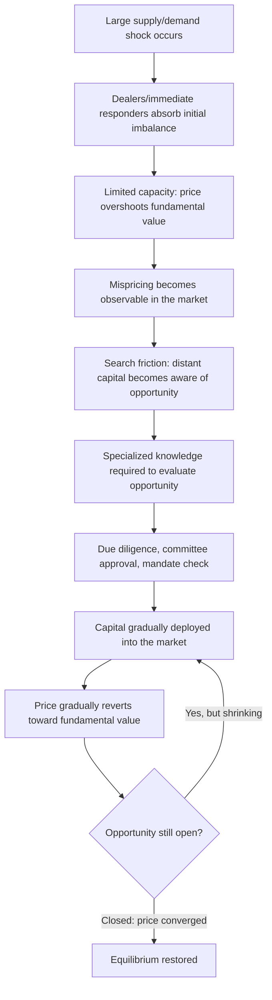

## Slow-Moving Capital

### Overview

Slow-moving capital refers to the phenomenon in which arbitrage capital does not flow instantaneously to exploit an identified mispricing, but instead responds only gradually — over days, weeks, or even months — due to search frictions, capital allocation frictions, and institutional decision-making lags among the investors who ultimately supply arbitrage capital. Formalized most directly by Duffie (2010) in his American Finance Association presidential address "Presidential Address: Asset Price Dynamics with Slow-Moving Capital," this concept complements noise trader risk and funding constraints as a third core mechanism explaining why observed price dislocations can persist even when informed capital exists in the broader economy and is, in principle, willing to correct the mispricing.

---

### Core Distinction from Related Limits-to-Arbitrage Concepts

**Key Points**

- Noise trader risk (DSSW) explains why arbitrageurs *hesitate* to trade against mispricing because of the risk it worsens.
- Funding constraints (Brunnermeier-Pedersen) explain why *existing* leveraged arbitrageurs may be *forced* to reduce positions during stress.
- Slow-moving capital explains why *new* capital — capital that is not already positioned in the relevant market, and faces no funding constraint of its own — takes time to arrive and engage with an opportunity, even when the mispricing is large and the opportunity is attractive on a risk-adjusted basis.

This distinguishes slow-moving capital as fundamentally a **search and information friction** on the capital-supply side, rather than a risk-bearing or leverage-constraint friction on the capital-demand side.

---

### Theoretical Mechanism (Duffie, 2010)

#### The Basic Setup

Duffie models a market shock (e.g., a large, sudden supply/demand imbalance — such as a forced sale by a distressed institution) that creates an immediate, sharp price dislocation. In frictionless markets, capital would flow instantly to absorb this imbalance and the price would immediately reflect fundamentals. In practice:

1. **Immediate responders (specialized dealers/market-makers)** absorb the initial shock, but their capacity is limited by their own capital and inventory constraints.
2. **A price overshoot occurs**, since the immediate absorption capacity is smaller than the shock.
3. **New capital gradually enters** as it becomes aware of the opportunity, evaluates it, obtains internal approvals, and deploys funds.
4. **Price gradually reverts** toward fundamental value as this new capital arrives, following a predictable *decay pattern* rather than an instantaneous jump.

$$P_t = \bar{P} + (P_0 - \bar{P})e^{-\kappa t}$$

where $\bar{P}$ is fundamental value, $P_0$ is the immediate post-shock (dislocated) price, and $\kappa$ represents the *speed* at which capital arrives — the central parameter of interest in the slow-moving capital literature. A larger $\kappa$ implies faster capital mobilization and quicker price recovery; the empirical and theoretical contribution of this literature is characterizing what determines $\kappa$ and estimating it in real episodes.

#### Sources of Delay ($1/\kappa$)

1. **Search frictions**: Capital holders (e.g., institutional allocators, pension funds, sovereign wealth funds) must first *identify* that an opportunity exists — this is not automatic or instantaneous, particularly for capital not already actively monitoring the specific market segment.
2. **Specialized knowledge requirements**: Many arbitrage opportunities require specialized expertise (e.g., mortgage-backed securities structuring, merger arbitrage mechanics) that only a limited set of capital providers possess, narrowing the pool of capital that can respond even after becoming aware of the opportunity.
3. **Due diligence and decision lags**: Institutional capital allocation is rarely instantaneous — committees must approve new strategies or increased allocations, operational and legal due diligence must be completed, and new trading relationships/documentation must be established.
4. **Fundraising lags**: A specialist fund manager who identifies the opportunity but lacks sufficient existing capital may need to raise a new dedicated vehicle, which itself takes months, by which time the opportunity may have partially or fully closed.
5. **Contractual and mandate frictions**: Institutional investors often operate under mandates that specify asset classes, geographies, or risk parameters, meaning even willing capital may require a formal mandate change before it can be deployed into a new opportunity.

Diagram of the price dislocation and gradual capital-arrival recovery path (svg_diagram):

---

### Empirical Evidence and Illustrative Episodes

| Episode / Study | Evidence of Slow-Moving Capital |
| --- | --- |
| Mitchell, Pedersen & Pulvino (2007) | Convertible bond arbitrage market post-2005 hedge fund redemption wave: prices dislocated sharply and took an extended period to recover as new capital only gradually re-entered the specialized convertible arbitrage space |
| Duffie (2010) | Cites post-Lehman corporate bond and CDS markets, where price dislocations relative to fundamentals persisted for weeks to months, consistent with slow capital mobilization rather than instantaneous arbitrage |
| Mitchell & Pulvino (2012) | Documents "arbitrage crashes" where established arbitrage strategies experience simultaneous capital withdrawal, and subsequent recovery of pricing efficiency is gradual, tracking the pace of new capital entry rather than an instantaneous correction |
| Merger arbitrage spread widening episodes | Merger arbitrage spreads (the gap between a target's market price and the announced deal price) have historically widened sharply during periods of capital withdrawal from the strategy (e.g., 2008), narrowing only gradually as dedicated capital returned |
| 2020 COVID-19 market dislocation (March 2020) | U.S. Treasury market — normally the most liquid market globally — experienced unusual price dislocations and basis trades unwound sharply; Federal Reserve intervention (rather than waiting for private slow-moving capital) was used explicitly to accelerate the correction, itself an implicit acknowledgment of the slow-moving capital problem by policymakers |

**[Inference]** The March 2020 Treasury market episode is frequently cited as a real-time illustration of policymakers acting to substitute for (rather than wait for) slow-moving private capital; the precise counterfactual speed at which private capital would have corrected the dislocation absent intervention cannot be directly observed and is necessarily an inferred/simulated comparison in the relevant research.

---

### Interaction with Other Limits-to-Arbitrage Concepts

- **With noise trader risk**: Slow-moving capital can *deepen* noise trader risk — if correcting capital takes a long time to arrive, an existing arbitrageur's position is exposed to noise trader-driven price swings for a longer window, increasing the effective risk of the trade purely due to the capital-supply delay.
- **With funding constraints**: The Brunnermeier-Pedersen framework concerns capital *already deployed* facing a margin/loss spiral; slow-moving capital concerns *undeployed* capital that could, in principle, step in to absorb the resulting selling pressure but does not do so quickly enough to prevent the spiral from playing out. The two mechanisms can operate sequentially: existing arbitrageurs deleverage rapidly (funding constraint), while new capital that could offset this selling arrives only slowly (slow-moving capital), jointly producing a sharper and more prolonged dislocation than either mechanism alone would predict.
- **With short-sale constraints**: Search and mobilization frictions apply on both sides of the market, but are often more severe for locating specialized short-side capital (e.g., dedicated short-sellers or specific securities lending relationships) than for long-side capital, compounding the asymmetry already present in short-sale constraint theory.

---

### Determinants of Capital Mobilization Speed ($\kappa$)

**Key Points**

- **Market segment specialization**: Highly specialized/niche markets (e.g., esoteric structured credit, specific merger arbitrage situations) tend to have smaller natural pools of informed capital, implying slower average mobilization than broad, well-understood asset classes (e.g., large-cap equities).
- **Existing dedicated capital base**: Markets with large standing pools of dedicated arbitrage capital (e.g., established merger arbitrage funds with committed, undeployed capital) can respond faster than markets requiring entirely new capital formation.
- **Information transparency**: Opaque markets (where the existence and magnitude of a mispricing is hard to verify from outside) slow the search-and-discovery phase relative to transparent, widely observed markets.
- **Regulatory/operational barriers to entry**: Markets requiring specific licenses, broker relationships, or infrastructure (e.g., certain derivatives or emerging-market instruments) inherently narrow and slow the pool of capital that can respond.

---

### Policy Implications

**Key Points**

- **Central bank intervention as capital-speed substitution**: Programs such as the Federal Reserve's various crisis-era facilities (2008, 2020) can be understood partly as the public sector substituting for, or accelerating, the arrival of private slow-moving capital during episodes where the natural mobilization speed is judged too slow relative to the systemic costs of the dislocation persisting.
- **Market design implications**: Efforts to broaden the natural investor base for specific asset classes (e.g., through standardization, improved transparency, or clearer benchmarks) can be understood as structural attempts to reduce search frictions and increase the natural $\kappa$ for a given market over time.
- **For fund managers/practitioners**: Understanding slow-moving capital dynamics motivates maintaining "dry powder" (uninvested committed capital) specifically to be able to respond quickly to sudden dislocations, since the manager who can act *before* the broader pool of slow capital arrives captures a disproportionate share of the reversion profit.

---

### Practical Implications and Trading Strategy Relevance

**Key Points**

- **Dislocation-based strategies**: Some specialist funds explicitly position themselves to provide the "first responder" capital in dislocation episodes (e.g., distressed debt funds, dedicated dislocation/relative-value funds), profiting specifically from the gap between the immediate post-shock price and the price that will prevail once slower capital eventually arrives.
- **Timing considerations**: Because the speed of capital arrival ($\kappa$) is itself uncertain, positions designed to exploit a dislocation should account for the risk that convergence takes longer than expected — connecting back to the finite-horizon problem central to noise trader risk.
- **Monitoring capital flow proxies**: Practitioners often track proxies for capital mobilization (e.g., hedge fund flow data, prime brokerage financing volumes, new fund launches in a specific strategy) as leading indicators of how quickly a given dislocation is likely to correct.

---

### Related Topics

- Noise Trader Risk (DSSW Model)
- Funding Constraints and Margin Requirements
- Short-Sale Constraints
- Merger Arbitrage and Deal Spread Dynamics
- Convertible Bond Arbitrage
- Central Bank Crisis Interventions and Lender-of-Last-Resort Facilities
- March 2020 Treasury Market Dislocation (Case Study)
- Search Frictions in Capital Markets
- Behavioral Explanations of Asset Pricing Anomalies