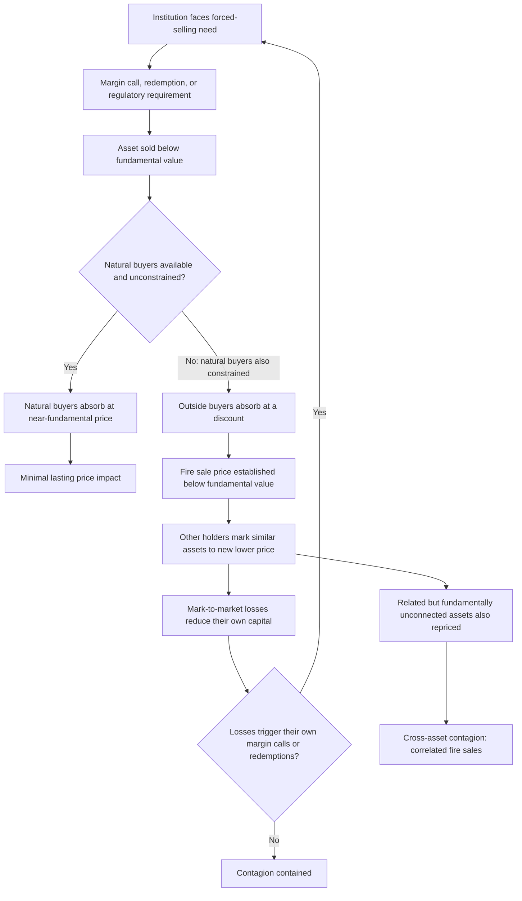

## Liquidity Spirals and Fire Sales

### Overview

Liquidity spirals and fire sales describe the self-reinforcing mechanisms through which an initial forced-selling episode can generate cascading price declines, worsening market conditions, and further forced selling — well beyond what the initial shock or underlying fundamentals would justify. While the Brunnermeier-Pedersen (2009) margin/loss spiral (covered under Funding Constraints) formalizes one specific channel of this dynamic, fire sales represent the broader class of phenomena in which distressed, non-fundamental selling depresses prices for reasons unrelated to asset quality, with effects that can propagate across institutions and even across seemingly unrelated asset classes.

---

### Defining Fire Sales

#### Core Concept

A **fire sale**, formalized in the seminal work of Shleifer and Vishny (1992, 2011), is the sale of an asset at a price below its fundamental (or "best-use") value, driven by the seller's urgent need for liquidity or capital rather than by information about the asset's true worth.

**Key distinguishing features:**

- The sale is **forced** or urgently motivated (margin calls, redemptions, regulatory capital requirements, insolvency proceedings) rather than a voluntary, information-driven decision.
- The price received falls below fundamental value specifically because **natural buyers** (those who would value the asset most highly and use it most productively) are themselves capital-constrained or otherwise unable to participate at the moment of sale.
- The asset is instead absorbed by **outside buyers** (those with available capital but lower valuation of the asset, e.g., generalist rather than specialist investors), who demand a discount to compensate for their inferior ability to use or value the asset, and for the risk of holding it.

$$P_{\text{fire sale}} = V_{\text{outside buyer}} < V_{\text{natural buyer}} = P_{\text{fundamental}}$$

#### Shleifer-Vishny (1992, 2011) Framework

The original Shleifer-Vishny (1992) model examined this in the context of physical/real assets (e.g., airplanes sold by a bankrupt airline), where the natural buyers (other airlines) may themselves be financially constrained during an industry-wide downturn, forcing the seller to accept a discounted price from a non-specialist buyer. Shleifer and Vishny (2011) extend this logic explicitly to financial assets and securities markets, connecting it directly to the limits-to-arbitrage literature.

**Key Points**

- The fire-sale discount is largest precisely when it is most costly: during systemic/industry-wide downturns, when the natural buyer class is itself financially constrained (the same underlying shock that forces the sale also impairs the capacity of the best-positioned buyers to absorb it).
- This creates a form of **endogenous illiquidity**: market liquidity is not a fixed structural feature of an asset but varies with the financial condition of the specific set of investors who would naturally be its buyers.

---

### The Liquidity Spiral Mechanism

Building on the Brunnermeier-Pedersen (2009) framework (see Funding Constraints and Margin Requirements), a liquidity spiral formalizes how an initial fire sale can become self-reinforcing:

1. **Initial shock**: A shock forces one or more institutions to sell assets (margin call, redemption, regulatory requirement).
2. **Price impact**: Because natural buyers are constrained or few in number, the forced sale moves the price down more than a similarly sized "informed" trade would.
3. **Mark-to-market effects**: Other institutions holding the same or related assets must mark their own positions down to the new (depressed) market price, even if they are not forced sellers themselves.
4. **Capital and margin effects**: These mark-to-market losses reduce the equity/capital of other holders and can trigger their own margin calls (via the margin spiral mechanism), converting a bystander into a forced seller.
5. **Contagion**: The forced selling spreads to a widening circle of institutions and, potentially, to related asset classes held by the same distressed institutions, even where no fundamental linkage between the assets exists — a phenomenon sometimes termed "correlated fire sales" or "cross-asset contagion."

Diagram of the fire sale contagion mechanism (svg_diagram):

---

### Cross-Asset and Cross-Institution Contagion

#### Why Fundamentally Unrelated Assets Can Be Jointly Affected

A defining feature of fire-sale contagion, distinct from purely fundamentals-driven price co-movement, is that assets with no genuine economic relationship can become correlated purely because they are held in overlapping portfolios by institutions facing a common funding shock:

- **Common holder channel**: If a distressed institution holds both Asset A and Asset B, forced selling of Asset A to raise cash can occur alongside forced selling of Asset B, even if the two assets are in entirely unrelated markets — simply because both are convenient sources of liquidity for the same distressed seller.
- **Commonality in liquidity providers**: If the same set of specialist arbitrageurs or market-makers provide liquidity across multiple related markets, a funding shock to those specific providers reduces liquidity provision simultaneously across all the markets they serve, even absent any direct fundamental link between those markets (this connects directly to the "commonality in liquidity" prediction from the Brunnermeier-Pedersen framework).
- **Deleveraging spillovers**: Institutions responding to losses in one asset class by reducing leverage across their *entire* balance sheet (rather than only the affected asset class) mechanically transmits stress into unrelated positions.

#### Real-World Illustrations

| Episode | Fire Sale / Contagion Mechanism |
| --- | --- |
| LTCM (1998) | Forced unwinding of LTCM's diverse portfolio (spanning fixed income, equity volatility, and merger arbitrage positions) transmitted stress across seemingly unrelated markets purely through the common-holder channel |
| 2008 Global Financial Crisis | Forced sales of mortgage-backed securities by distressed institutions depressed prices well below models' estimates of fundamental cash-flow value; the resulting mark-to-market losses (under fair-value accounting) forced further sales across the broader financial system, a widely studied amplification mechanism during the crisis |
| Quant Quake (August 2007) | Likely triggered by one or more large quantitative funds deleveraging, which forced correlated losses and further selling among funds using similar factor strategies, despite no clear fundamental trigger in the underlying equities |
| Money market fund "breaking the buck" episodes | Forced asset sales by money market funds facing redemption pressure (e.g., September 2008, Reserve Primary Fund) can depress short-term credit market prices, a fire-sale dynamic in typically very liquid, low-risk instruments |

**[Inference]** Attribution of any specific historical price decline to fire-sale/liquidity-spiral dynamics versus a genuine, rational repricing of fundamentals (e.g., updated expectations of future cash flows or default risk) is often contested in the academic literature; most rigorous studies attempt to isolate the fire-sale component using specific identification strategies (e.g., comparing forced vs. voluntary sellers, or examining price recovery patterns after the forced-selling pressure subsides).

---

### Empirical Identification Strategies

Because fire sales are, by definition, price movements *not* explained by fundamentals, researchers require specific empirical strategies to distinguish them from ordinary information-driven price changes:

1. **Forced vs. voluntary seller comparison**: Comparing price impact and subsequent price recovery for trades identifiable as forced (e.g., mutual fund sales driven by extreme redemptions, or index-fund rebalancing trades) versus voluntary trades of similar size.
2. **Price reversal analysis**: A hallmark prediction of fire-sale theory is that prices should *partially revert* once the forced-selling pressure ends and if no genuine fundamental information was conveyed — a pattern distinguishable from a permanent, information-driven price adjustment.
3. **Index reconstitution studies**: Stocks added to or removed from major indices experience forced buying/selling by index funds unrelated to any change in fundamentals, providing a widely used "natural experiment" setting for measuring pure fire-sale price impact (Shleifer, 1986; Harris & Gurel, 1986; and subsequent literature).
4. **Mutual fund fire sale studies**: Coval and Stafford (2007) directly document that mutual funds facing large outflows are forced to sell disproportionately from their existing holdings, and that stocks heavily held by such distressed funds experience abnormal price declines and *subsequent reversals*, providing some of the clearest empirical evidence for fire-sale pricing effects distinct from fundamentals.

---

### Fire Sales, Systemic Risk, and Financial Stability

**Key Points**

- Fire-sale and liquidity-spiral dynamics are central to modern **macroprudential regulation** and systemic risk analysis, since they explain how distress at one institution can propagate system-wide through pure price/balance-sheet channels, independent of direct counterparty exposure (i.e., without any institution directly lending to or trading with the failing entity).
- **Pecuniary externalities**: Because an individual institution's forced sale imposes costs on *other* institutions (via mark-to-market losses on similar holdings) that the selling institution does not internalize in its own decision-making, fire sales represent a classic externality — providing an economic rationale for regulatory intervention (e.g., capital buffers, liquidity requirements) beyond what any single institution would choose privately.
- **Systemic risk measurement**: Regulatory stress tests increasingly incorporate fire-sale externalities explicitly (e.g., estimating the price impact of hypothetical simultaneous deleveraging across the banking system) rather than assessing institutions' resilience purely in isolation.

---

### Policy Responses

**Key Points**

- **Lender-of-last-resort facilities**: Central bank interventions (e.g., 2008 and March 2020 Federal Reserve facilities) function partly as a direct countermeasure to fire sales — providing an alternative source of funding or a buyer of last resort so that distressed institutions do not need to sell into an illiquid, depressed market.
- **Capital and liquidity regulation**: Post-2008 reforms (e.g., Basel III liquidity coverage ratio and net stable funding ratio requirements) are partly designed to reduce the likelihood that individual institutions are forced into fire-sale positions in the first place.
- **Mark-to-market accounting debates**: The extent to which fair-value/mark-to-market accounting rules amplify fire-sale spirals (by forcing recognition of depressed fire-sale prices onto the balance sheets of non-selling institutions, triggering further capital and margin effects) was a significant point of regulatory and accounting-standard debate during and after the 2008 crisis.
- **Central counterparty (CCP) and market structure design**: Efforts to reduce procyclicality in margining (see Funding Constraints) and to improve orderly-liquidation mechanisms for failing institutions are direct policy responses aimed at limiting the size and speed of forced-sale events.

---

### Distinguishing This Topic from Related Concepts

| Concept | Distinction |
| --- | --- |
| Funding Constraints (Brunnermeier-Pedersen) | Provides the specific *mechanism* (margin/loss spiral) by which one institution's fire sale can propagate to force selling by others; fire sales are the broader phenomenon this mechanism helps generate |
| Noise Trader Risk (DSSW) | Concerns sentiment-driven mispricing risk faced by arbitrageurs; fire sales concern forced, non-information-driven selling — the two can interact (noise trader-driven price declines can themselves trigger margin calls that produce fire sales) but are conceptually distinct |
| Slow-Moving Capital (Duffie) | Explains *why* the recovery from a fire sale is gradual rather than instantaneous — natural buyers take time to mobilize even after a fire-sale discount becomes apparent |

---

### Practical Implications

**Key Points**

- **For portfolio/risk managers**: Understanding fire-sale contagion motivates stress-testing not only for direct exposure to a distressed sector, but for *indirect* mark-to-market exposure via commonly held assets, even in seemingly unrelated positions.
- **For distressed-asset investors**: Fire-sale theory provides the explicit rationale for specialist "dislocation" or distressed-asset strategies — profiting from the gap between fire-sale prices and eventual fundamental-value recovery, directly connecting to the slow-moving capital literature on the speed of that recovery.
- **For regulators/central banks**: Recognizing fire sales as a systemic externality (rather than purely an individual institution's risk-management failure) supports macroprudential tools targeting system-wide leverage and liquidity, rather than relying solely on institution-by-institution supervision.

---

### Related Topics

- Funding Constraints and Margin Requirements (Brunnermeier-Pedersen)
- Slow-Moving Capital
- Noise Trader Risk (DSSW Model)
- Shleifer & Vishny (1992, 2011): Fire Sales and Limits of Arbitrage
- Systemic Risk and Macroprudential Regulation
- Index Reconstitution as a Natural Experiment
- Mark-to-Market Accounting and Procyclicality
- Central Bank Crisis Interventions and Lender-of-Last-Resort Facilities
- 2008 Global Financial Crisis: Case Study