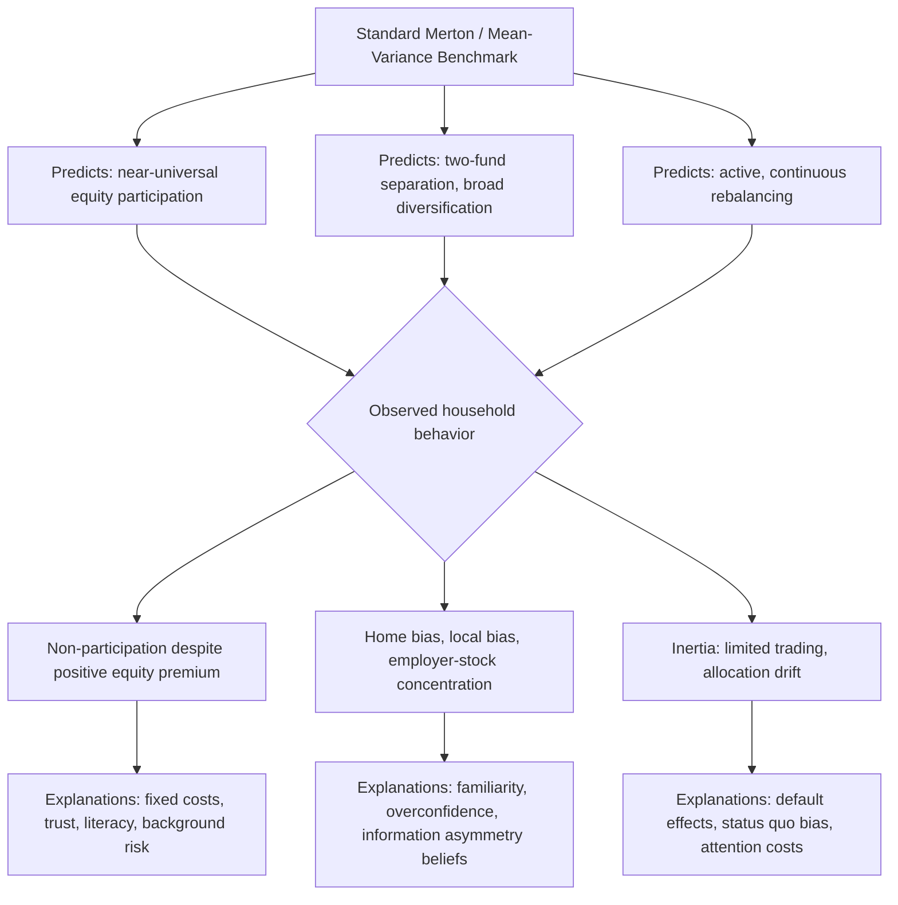

## Household Portfolio Choice in Practice

### Overview

Household portfolio choice in practice examines how real households actually allocate wealth across asset classes, and documents the substantial and persistent gap between these observed behaviors and the predictions of standard normative portfolio theory (e.g., Markowitz mean-variance optimization, Merton's lifecycle consumption-portfolio model). Where classical finance theory prescribes broad diversification, full stock market participation for essentially all households with any risk tolerance, and portfolio compositions driven primarily by risk aversion and horizon, empirical household finance research — pioneered by Campbell (2006) in his own presidential address "Household Finance" — finds systematic deviations that require explanations beyond frictionless rational-agent models, connecting directly to the behavioral biases and information/participation frictions covered elsewhere in the curriculum.

---

### The Standard Theoretical Benchmark

#### Two-Fund Separation and the Merton Model

Classical portfolio theory, building on Markowitz (1952) mean-variance optimization and Merton's (1969, 1971) continuous-time lifecycle model, generates several sharp predictions:

1. **Two-fund separation**: All investors should hold some combination of only two funds — a risk-free asset and a single optimal risky-asset portfolio (the "market portfolio" under CAPM assumptions) — with the *proportion* between them, not the *composition* of the risky portfolio, varying by risk aversion.
2. **Full participation**: Since the equity risk premium is (in standard calibrations) positive and equities are not perfectly correlated with other risks, essentially all households — even the highly risk-averse — should hold at least some positive allocation to risky assets.
3. **Constant relative risk aversion (CRRA) implications**: Under standard CRRA preferences and i.i.d. returns, the *proportion* of wealth allocated to risky assets should be roughly constant across wealth levels and, in the simplest Merton model, across the investment horizon.

$$w^* = \frac{E[R_m] - R_f}{\gamma \sigma_m^2}$$

where $w^*$ is the optimal proportion allocated to the risky asset, $\gamma$ is the coefficient of relative risk aversion, and $\sigma_m^2$ is the variance of risky-asset returns — a formula implying continuous, universal risky-asset holding by any investor with finite risk aversion.

**Key Points**

- These benchmark predictions provide the yardstick against which the empirical household finance literature measures actual behavior; large, systematic, and hard-to-rationalize deviations from these predictions are the central subject matter of this field.

---

### Documented Empirical Deviations

#### 1. Limited Stock Market Participation ("The Participation Puzzle")

Contrary to the full-participation prediction, a substantial fraction of households in most countries hold *no* direct or indirect equity exposure at all, even among households with meaningful financial wealth and no obvious liquidity constraint.

- Direct participation rates vary widely across countries and time, and are consistently far below the near-universal participation predicted by frictionless models with a positive equity premium.
- The puzzle is sharpened by the fact that even a *small* equity allocation should be attractive under standard risk-aversion calibrations given historically observed equity premia, making complete non-participation difficult to rationalize with fixed but modest participation costs alone.

**Leading explanations:**

- **Fixed participation costs**: Learning, time, and (historically) transaction/brokerage costs create a fixed cost of entering equity markets, which can rationally deter participation for households whose potential equity allocation, given their wealth, would be too small to justify the fixed cost (Vissing-Jørgensen, 2002).
- **Trust**: Guiso, Sapienza, and Zingales (2008) find that generalized trust — in other people and in financial institutions/counterparties — is a significant, independent predictor of stock market participation, distinct from risk aversion or wealth.
- **Financial literacy**: Households with lower measured financial literacy participate at significantly lower rates, even controlling for wealth, income, and education (van Rooij, Lusardi & Alessie, 2011).
- **Background risk**: Substantial uninsurable risks in other parts of a household's life (e.g., labor income risk, entrepreneurial/business risk, illiquid housing exposure) can rationally reduce optimal risky financial-asset holdings, since these background risks already consume part of the household's risk-bearing capacity.

#### 2. Underdiversification

Among households that *do* participate in equity markets, actual portfolios are frequently far less diversified than theory prescribes:

- **Home bias**: Households (and even institutional investors) disproportionately hold domestic equities relative to their share of global market capitalization, well beyond what can be explained by hedging domestic-currency consumption risk alone.
- **Local bias**: Within a given country, households disproportionately hold shares of geographically nearby, familiar, or employer-related companies (Huberman, 2001; Massa & Simonov, 2006), consistent with a "familiarity" or overconfidence-driven preference documented in the Overconfidence and Mental Accounting topic.
- **Employer stock concentration**: A substantial share of employees who hold employer stock in retirement accounts hold highly concentrated positions, creating a doubly correlated exposure (labor income and financial wealth both tied to the same employer's fortunes) that direct contradicts standard diversification advice.

#### 3. Non-Participation and Under-Holding of Specific Asset Classes

- **Bond market non-participation**: Direct bond holdings among households are typically even rarer than direct equity holdings, with bond exposure — where it exists — usually obtained indirectly via mutual funds, pensions, or insurance products rather than direct securities.
- **Housing as the dominant asset**: For the median household in many countries, primary residence equity constitutes the largest single component of net worth, often dwarfing financial asset holdings — meaning "household portfolio choice" in practice is frequently dominated by an illiquid, highly leveraged, geographically concentrated real asset that classical financial portfolio theory does not naturally incorporate.

#### 4. Insufficient Rebalancing and Trading Inertia

- Household portfolios are frequently observed to be "sticky" — showing far less active rebalancing than optimal dynamic strategies would prescribe, allowing risky-asset allocations to drift substantially with market performance (a form of passive, inertia-driven allocation rather than active target maintenance).
- Ameriks and Zeldes (2004), studying retirement account allocations, find a substantial fraction of accounts show *no* observed trading activity over multi-year periods, consistent with strong status-quo/inertia effects.

#### 5. Life-Cycle Patterns Diverging from Theory

- Simple Merton-style models with constant relative risk aversion predict a roughly constant risky-asset share across the lifecycle (absent labor-income considerations); once labor income is incorporated as an implicit "bond-like" asset (since it is relatively stable and uncorrelated with equity markets, especially early in a career), theory instead predicts risky-asset shares should *decline* with age as the implicit bond-like value of remaining human capital shrinks.
- Empirically, observed age-risky-share profiles are often flatter, more idiosyncratic, and more strongly influenced by target-date fund defaults and plan design (in defined-contribution retirement systems) than by any individually optimized calculation — see Default Effects below.

Diagram of the gap between benchmark theory and observed household behavior (svg_diagram):

---

### Behavioral and Structural Explanations Synthesized

**Key Points**

- **Information and attention costs**: Beyond fixed monetary participation costs, the ongoing cognitive/attention cost of monitoring a diversified portfolio can itself deter participation or rebalancing, particularly for households already stretched by other financial and time demands.
- **Behavioral biases (linking to the Behavioral Finance chapter)**: Overconfidence in familiar/local stocks, mental accounting-driven segregation of "safe" versus "risky" mental buckets (e.g., treating housing equity as fundamentally different from financial risky assets, despite both carrying systematic risk), and herding into popular asset classes or funds all contribute to the observed deviations from the theoretical benchmark.
- **Default effects and choice architecture**: In defined-contribution retirement systems, default investment options (e.g., automatic enrollment into target-date funds) have an outsized influence on actual household portfolios relative to theoretically optimal individualized choices, since large fractions of participants passively accept defaults rather than actively optimizing (Madrian & Shea, 2001; Thaler & Benartzi's Save More Tomorrow program is a related, prominent design response).
- **Financial advice and delegation**: Many households delegate portfolio decisions to financial advisors or rely on employer-provided defaults rather than direct optimization; the quality and incentive-alignment of this advice (e.g., advisor compensation structures) is itself an active area of household finance research, since delegated decisions may embed advisor-level frictions or conflicts on top of household-level ones.

---

### Empirical Evidence Summary

| Study | Finding |
| --- | --- |
| Campbell (2006) | Presidential address establishing "household finance" as a distinct field; catalogs major puzzles including non-participation and underdiversification |
| Vissing-Jørgensen (2002) | Fixed participation costs can rationalize significant non-participation, particularly among lower-wealth households |
| Guiso, Sapienza & Zingales (2008) | Generalized trust is an independent, economically significant predictor of stock market participation |
| Huberman (2001) | Documents "home bias at home" — investors disproportionately hold shares of their regional Bell operating company, evidence of familiarity-driven local bias |
| Massa & Simonov (2006) | Swedish household data shows investors prefer geographically and professionally familiar stocks, and that this preference does not improve portfolio performance |
| Ameriks & Zeldes (2004) | Substantial fraction of retirement accounts show no active trading over multi-year windows, evidence of strong inertia |
| Madrian & Shea (2001) | Automatic enrollment defaults dramatically increase 401(k) participation and shape contribution/allocation patterns, evidence of default-driven (rather than actively optimized) portfolio choice |
| Calvet, Campbell & Sodini (2007) | Using Swedish administrative data, find household portfolios show substantial cross-sectional variation in "investment mistakes" (underdiversification, inertia), correlated with wealth, education, and financial sophistication |

**[Inference]** Because financial sophistication, wealth, and access to advice are themselves correlated, isolating the independent causal contribution of any single explanation (e.g., trust vs. literacy vs. fixed costs) for a specific observed deviation is empirically challenging, and most credible studies in this area rely on rich administrative datasets (often from countries with detailed registry data, such as Sweden) or natural experiments (e.g., default policy changes) to strengthen identification.

---

### Practical and Policy Implications

**Key Points**

- **For financial advisors/planners**: Recognizing that clients' actual behavioral tendencies (status quo bias, local/employer-stock preference, infrequent rebalancing) diverge from textbook-optimal behavior motivates explicit behavioral coaching, automatic rebalancing tools, and structured default options within managed accounts.
- **For retirement plan design (policy relevance)**: The empirical power of defaults (Madrian & Shea) has directly informed pension and retirement-system policy design internationally, favoring auto-enrollment and qualified default investment alternatives (e.g., target-date funds) as a structural response to observed household inertia, rather than relying solely on financial education campaigns.
- **For employer stock plan design**: Given documented risks of employer-stock concentration (correlated labor-financial risk), many plan sponsors and regulators have moved toward limiting or discouraging concentrated employer-stock holdings within retirement accounts.
- **For researchers/policymakers assessing financial education**: Because financial literacy alone has shown only partial success in closing participation and diversification gaps in various studied interventions, current household finance research increasingly emphasizes *choice architecture* (defaults, simplification, automation) as a complementary or alternative lever to pure information/education-based interventions.

---

### Related Topics

- Overconfidence and Mental Accounting
- Life-Cycle Consumption and Portfolio Models (Merton)
- Behavioral Explanations of Asset Pricing Anomalies
- Default Effects and Choice Architecture in Retirement Savings
- Financial Literacy and Household Decision-Making
- Housing as a Household Asset Class
- Defined-Contribution vs. Defined-Benefit Retirement Systems
- Target-Date Funds and Glide Path Design
- Delegated Portfolio Management and Financial Advice