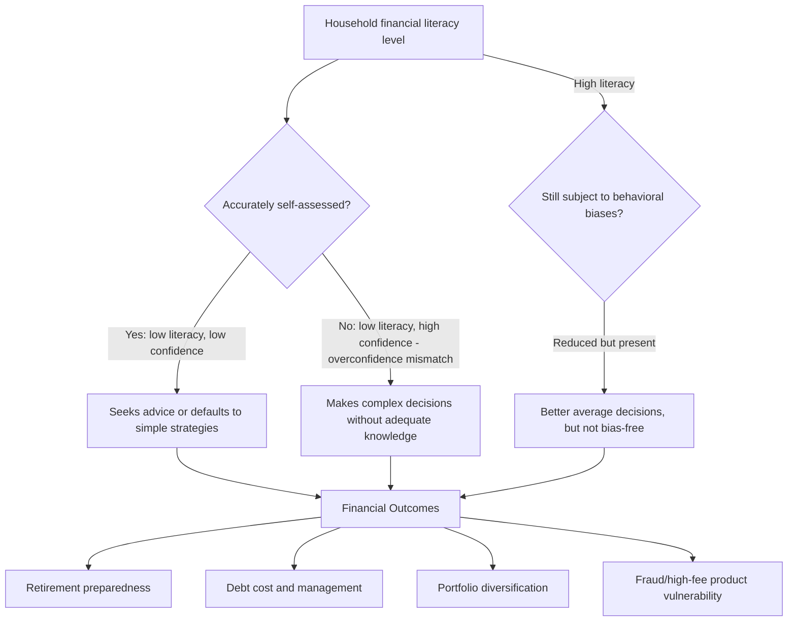

## Financial Literacy and Decision-Making

### Overview

Financial literacy and decision-making examines how households' knowledge of basic financial concepts — compound interest, inflation, risk diversification, and related quantitative reasoning — affects the quality of their real-world financial decisions, and asks whether closing measured literacy gaps can close the behavioral gaps documented throughout household finance (limited participation, underdiversification, poor debt management, inadequate retirement saving). This topic sits at the intersection of the empirical household finance literature (Household Portfolio Choice in Practice) and the behavioral biases catalogued in the Behavioral Finance chapter, and has become one of the most policy-relevant strands of household finance research given its direct implications for financial education mandates and consumer protection regulation.

---

### Defining and Measuring Financial Literacy

#### Core Definition

Financial literacy is generally defined in the academic literature (following Lusardi & Mitchell, the field's most influential researchers) as the ability to process economic information and make informed decisions about financial planning, wealth accumulation, debt, and pensions — encompassing both factual knowledge and the capacity to apply it under uncertainty.

#### The "Big Three" Questions

Lusardi and Mitchell's most widely used measurement instrument consists of three standardized questions testing:

1. **Numeracy / compound interest understanding**: Whether respondents can correctly compute how savings grow with compound interest over time.
2. **Inflation understanding**: Whether respondents understand the relationship between inflation and purchasing power of savings.
3. **Risk diversification understanding**: Whether respondents understand that spreading investments across multiple assets reduces risk relative to concentrating in a single stock.

**Key Points**

- These three questions have been fielded, with minor adaptations, across dozens of countries and large-scale surveys (e.g., the U.S. Health and Retirement Study, the National Financial Capability Study), enabling extensive cross-country and cross-time comparability.
- Correct-response rates on all three questions simultaneously are consistently found to be low across most studied populations — a robust, cross-country finding rather than an artifact of any single survey instrument.

#### Extended Measures

Beyond the "Big Three," researchers have developed broader instruments capturing:

- **Financial knowledge breadth**: Understanding of mortgages, insurance, taxes, and specific investment products.
- **Numeracy (general, non-financial)**: Basic probability and arithmetic reasoning, since financial literacy performance is highly correlated with — but conceptually distinct from — general numeracy.
- **Financial self-efficacy / confidence**: Self-assessed confidence in one's own financial knowledge, which researchers explicitly distinguish from *actual* measured literacy, since the two can diverge (connecting directly to the Overconfidence topic — a documented pattern of overconfidence in self-assessed financial knowledge relative to objectively measured knowledge).

---

### Demographic Patterns in Financial Literacy

Across the extensive cross-country literature, several patterns recur with notable consistency:

- **Age**: Financial literacy tends to follow a hump-shaped pattern across the lifecycle, rising through middle age and declining among the oldest cohorts — a pattern of particular policy concern given that financial decision-making demands (e.g., retirement drawdown decisions) often peak later in life.
- **Gender**: Measured financial literacy scores are consistently lower on average for women than men across most studied countries, though this gap narrows substantially (and in some studies disappears) once "don't know" response patterns and confidence-related response behavior are accounted for, since women are more likely to select "don't know" rather than guess.
- **Education and income**: Positive correlation with formal education and income is consistently documented, though financial literacy retains independent explanatory power for financial outcomes even after controlling for these factors.
- **Cross-country variation**: Substantial variation exists across countries, with financial literacy levels not perfectly tracking GDP per capita or general educational attainment, suggesting country-specific factors (financial system structure, curriculum content, cultural factors) also matter.

---

### Financial Literacy and Household Financial Outcomes

#### Documented Associations

The empirical literature finds financial literacy is a robust predictor of numerous financial behaviors and outcomes, generally *even after* controlling for wealth, income, and education:

1. **Retirement planning**: Individuals with higher financial literacy are significantly more likely to plan for retirement and to report having calculated how much they need to save (Lusardi & Mitchell, 2007, 2011).
2. **Stock market participation**: Higher financial literacy is associated with higher rates of stock market participation, connecting directly to the Participation Puzzle discussed under Household Portfolio Choice in Practice (van Rooij, Lusardi & Alessie, 2011).
3. **Debt management**: Lower financial literacy is associated with higher-cost borrowing behavior — including greater use of high-cost credit (payday loans, credit card cash advances), lower likelihood of comparison-shopping for loan terms, and higher rates of over-indebtedness (Lusardi & Tufano, 2015, studying credit card debt specifically).
4. **Mortgage choices**: Lower financial literacy is associated with mortgage choices carrying higher costs (e.g., higher relative interest rates, more frequent use of costly refinancing, greater susceptibility to mortgage-related fees), and with a higher incidence of mortgage default/delinquency during the 2008 crisis in some studies.
5. **Susceptibility to fraud and high-fee products**: Lower financial literacy correlates with greater vulnerability to financial fraud and with lower awareness of investment fees, which — given the compounding nature of fees over long horizons — can materially erode retirement wealth accumulation.

#### The Causality Question

**Key Points**

- A central methodological challenge in this literature is disentangling causal direction: does low financial literacy *cause* poor financial outcomes, or do both stem from a common underlying factor (e.g., general cognitive ability, patience/time preference, or family financial background)?
- Some studies exploit natural experiments (e.g., state-level mandates requiring financial education in high school curricula, staggered across states and time) to better isolate causal effects; results from this quasi-experimental literature are more mixed than the raw correlational findings, with some studies finding modest, persistent positive effects of mandated financial education and others finding limited or short-lived effects (see Financial Education Effectiveness below).
- [Inference] The overall weight of the quasi-experimental evidence suggests financial literacy has a genuine but modest causal role in shaping financial behavior, operating alongside — rather than as a complete substitute for — other structural and behavioral factors; this remains an area of continued academic debate rather than a fully settled question.

---

### Financial Literacy, Overconfidence, and Behavioral Biases

Financial literacy interacts closely with the biases covered in the Behavioral Finance chapter, producing a more nuanced picture than "more literacy is always better":

- **The overconfidence-literacy mismatch**: Individuals who *believe* they have high financial knowledge, but do not, are found to make particularly poor decisions — arguably worse than individuals who correctly recognize their own low literacy and consequently seek advice or default to simpler strategies. This connects directly to the Overconfidence topic's finding that miscalibration (rather than low ability per se) is often the most consequential driver of costly decisions.
- **Literacy does not eliminate behavioral biases**: Higher measured financial literacy is associated with *reduced* — but not eliminated — susceptibility to certain behavioral biases (e.g., framing effects, present bias in savings decisions); financially literate individuals are not immune to herding, mental accounting, or loss aversion, meaning literacy and debiasing are related but distinct interventions.
- **Numeracy versus financial-specific knowledge**: Some research suggests general numeracy (the ability to reason about probabilities and percentages) may be a more fundamental driver of good financial decision-making than financial-specific factual knowledge, implying that generic quantitative education may transfer to financial decision quality even without finance-specific curriculum content. [Inference] The relative importance of general numeracy versus finance-specific knowledge likely varies by the type of decision (e.g., numeracy may matter more for compound-interest-related decisions, while finance-specific product knowledge may matter more for mortgage or insurance product choice), though this decomposition is not fully settled in the literature.

Diagram of the financial literacy → decision quality pathway, including the overconfidence interaction (svg_diagram):

---

### Financial Education Effectiveness: What the Evidence Shows

#### Meta-Analytic Findings

Fernandes, Lynch, and Netemeyer (2014), a widely cited meta-analysis, examined the relationship between financial education interventions and downstream financial behaviors across a large number of studies, and reported two influential findings:

1. Financial education interventions explain only a small share of variance in financial behaviors in the studies reviewed.
2. The measured effects of financial education interventions on behavior tend to **decay rapidly** with time elapsed since the intervention — effects measured shortly after an intervention are often substantially larger than effects measured a year or more later.

**Key Points**

- This meta-analysis has been influential in shifting policy discussion toward "just-in-time" financial education (delivered close to the moment of a specific financial decision, e.g., at mortgage origination or retirement enrollment) rather than one-time general education delivered disconnected from an actual decision point, on the theory that the *decay* problem is less severe when the applicable knowledge is used immediately.
- Critics of the meta-analysis's methodology and interpretation have noted heterogeneity across the underlying studies (varying intervention intensity, population, and outcome measures), meaning the aggregate "small effect" finding may mask larger effects for specific, well-designed, and well-targeted interventions — an active point of methodological debate in the field.

#### Complementary and Alternative Interventions

Given the mixed evidence on general financial education, household finance research increasingly emphasizes complementary or alternative levers:

- **Choice architecture and defaults**: As discussed under Household Portfolio Choice in Practice, automatic enrollment and default investment options have shown large, robust effects on outcomes (e.g., retirement plan participation), arguably because they reduce the *decision burden* itself rather than attempting to improve decision-making capacity.
- **Simplification**: Reducing the complexity of financial products and disclosures (e.g., standardized, simplified mortgage or credit card disclosure formats) can improve decision quality without requiring the consumer to acquire additional financial knowledge.
- **Financial advice and delegation**: Professional or algorithmic (robo-advisory) financial advice can substitute for individual financial literacy, though the quality and incentive alignment of such advice is itself a documented concern (see Household Portfolio Choice in Practice).
- **Peer and social learning effects**: Some studies find financial behaviors and knowledge diffuse through social networks and workplace peer effects, suggesting a role for social/community-based financial education models distinct from formal classroom instruction.

---

### Empirical Evidence Summary

| Study | Finding |
| --- | --- |
| Lusardi & Mitchell (2007, 2011) | Foundational "Big Three" literacy measure; strong association between literacy and retirement planning |
| van Rooij, Lusardi & Alessie (2011) | Financial literacy independently predicts stock market participation, controlling for other factors |
| Lusardi & Tufano (2015) | Lower financial literacy associated with higher-cost credit card debt behaviors |
| Fernandes, Lynch & Netemeyer (2014) | Meta-analysis finding financial education effects on behavior are modest and decay rapidly over time |
| Bucher-Koenen & Ziegelmeyer (2014) | Study of German household investors during the financial crisis found lower financial literacy associated with worse investment decisions during market turmoil |
| Agarwal, Driscoll, Gabaix & Laibson (2009) | Documents a "U-shaped" pattern of financial mistake frequency across the lifecycle (borrowing/credit card fee mistakes), with a minimum around middle age, broadly paralleling the hump-shaped literacy pattern |

**[Inference]** The literature's overall conclusion — that financial literacy matters but is neither the sole nor necessarily the most cost-effective lever for improving household financial outcomes — reflects a genuine, still-evolving academic consensus rather than a fully closed debate; different researchers continue to weigh the relative promise of education-based versus architecture-based (default/simplification) interventions differently.

---

### Practical and Policy Implications

**Key Points**

- **For policymakers designing financial education mandates**: The decay-effect finding motivates timing education close to relevant decision points (e.g., at mortgage or retirement-plan enrollment) rather than relying solely on general early-life curricula, without necessarily abandoning early education given its potential foundational/numeracy benefits.
- **For financial institutions and product design**: Simplifying disclosures and product structures can improve outcomes for lower-literacy consumers more reliably than expecting consumer education alone to close the gap, particularly for complex products (mortgages, insurance, structured investment products).
- **For retirement system design**: Given the interaction between literacy, overconfidence, and decision quality, default-based approaches (as covered under Household Portfolio Choice in Practice) are often viewed as complementary risk-mitigation tools alongside — not substitutes for — financial education efforts.
- **For individual practitioners/advisors**: Recognizing that a client's *confidence* in their financial knowledge may not track their *actual* literacy is directly relevant to how advisors calibrate the depth of explanation and the framing of recommendations for different clients.

---

### Related Topics

- Household Portfolio Choice in Practice
- Overconfidence and Mental Accounting
- Default Effects and Choice Architecture in Retirement Savings
- Behavioral Explanations of Asset Pricing Anomalies
- Consumer Credit and Debt Behavior
- Retirement Planning and Life-Cycle Saving
- Nudge Theory and Libertarian Paternalism
- Financial Product Disclosure and Regulation
- Numeracy and Cognitive Ability in Economic Decision-Making