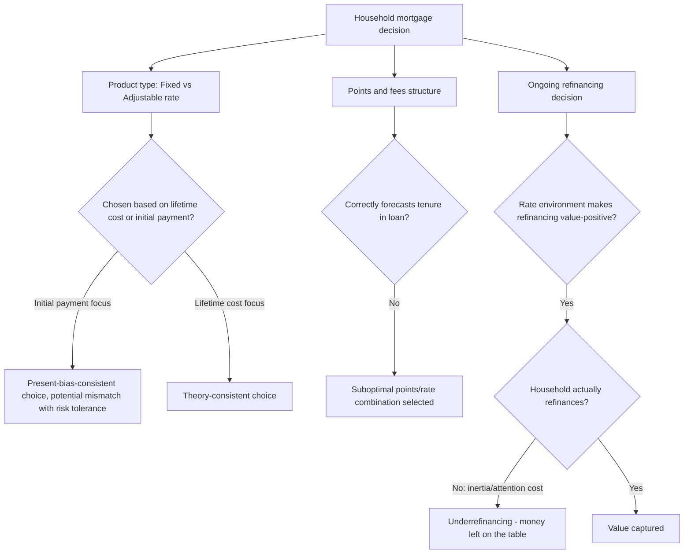

## Mortgage and Household Debt Decisions

### Overview

Mortgage and household debt decisions examine how households borrow — particularly for housing, but also through consumer credit more broadly — and document the substantial gap between normatively optimal borrowing behavior and observed household practice. Mortgages represent the largest single liability and, typically, the largest financial decision most households ever make, while consumer debt (credit cards, auto loans, student loans) constitutes a second major domain where the empirical household finance literature has identified persistent, costly deviations from rational benchmarks. This topic connects directly to the Financial Literacy and Household Portfolio Choice material earlier in this chapter, since debt decisions are frequently where measured literacy gaps translate into the most quantifiable financial costs.

---

### The Mortgage Decision: Theoretical Benchmark

#### Optimal Borrowing Under Standard Life-Cycle Theory

Under standard life-cycle/permanent-income theory, mortgage choice should reflect a household's optimal trade-off between:

1. **Consumption smoothing**: Borrowing against future (housing-service) consumption to avoid the liquidity constraint of paying the full home price upfront.
2. **Interest rate risk allocation**: Choosing between fixed-rate and adjustable-rate mortgages based on the household's risk tolerance, expected mobility/tenure in the home, and views on future interest rate paths, since a fixed-rate mortgage effectively transfers interest-rate risk to the lender (at a typically higher initial rate) while an adjustable-rate mortgage retains that risk with the borrower (typically at a lower initial "teaser" rate).
3. **Prepayment option value**: Most fixed-rate mortgages (especially in the U.S.) embed a valuable prepayment option, allowing the borrower to refinance if rates fall, without a symmetric penalty if rates rise — a feature that should be priced into the household's fixed-vs-adjustable decision and their refinancing behavior over the life of the loan.

$$\text{Mortgage Value to Borrower} = \text{Loan Proceeds} - \text{PV(Future Payments)} + \text{Value of Prepayment Option}$$

**Key Points**

- The prepayment option is a genuine financial derivative embedded in most fixed-rate mortgage products; optimal exercise of this option (refinancing) is a well-defined quantitative problem depending on the interest-rate differential, remaining loan balance, expected time-to-move, and refinancing transaction costs.

---

### Documented Deviations: Mortgage Choice

#### 1. Suboptimal Refinancing Behavior

A large empirical literature finds that households frequently fail to refinance their mortgages even when the prevailing interest-rate environment makes refinancing clearly value-maximizing net of transaction costs.

- **Underrefinancing ("leaving money on the table")**: Studies using detailed mortgage-servicing data find a meaningful share of eligible households do not refinance even when the potential savings substantially exceed typical refinancing costs, with the gap widening for lower-income, lower-education, and older households (Keys, Pope & Pope, 2016; Andersen, Campbell, Nielsen & Ramadorai, 2020).
- **Inertia and attention costs**: Much of this behavior is attributed to inertia and the ongoing cognitive/attention cost of monitoring the refinancing opportunity, rather than to transaction costs alone, since transaction costs are typically far smaller than the estimated foregone savings in the identified cases.
- **Financial-literacy correlation**: Underrefinancing is more prevalent among households scoring lower on standard financial literacy measures, directly connecting to the Financial Literacy and Decision-Making topic's finding that literacy predicts higher-cost borrowing outcomes across debt categories.

#### 2. Mortgage Product Choice Complexity

- **Fixed vs. adjustable choice**: Some households appear to select mortgage products based on short-run affordability of the initial payment (e.g., choosing an adjustable-rate mortgage primarily because its initial "teaser" rate produces a lower first-year payment) rather than a full evaluation of expected lifetime cost and interest-rate risk exposure — a pattern consistent with present bias and myopic, current-payment-focused decision-making rather than full life-cycle optimization.
- **Complex/exotic mortgage products**: In the years preceding the 2008 financial crisis, a substantial share of U.S. mortgage originations involved complex features (interest-only periods, negative amortization, low initial "teaser" rates followed by sharp resets) that many borrowers appear to have poorly understood at origination, a pattern extensively documented in the post-crisis household finance and consumer-credit literature.

#### 3. Points and Fees Decisions

Mortgage borrowers typically face a menu of interest-rate/upfront-points combinations (paying more points upfront for a lower rate, or vice versa) — a decision requiring the borrower to correctly forecast their expected tenure in the loan to determine the value-maximizing combination. Empirical studies find borrowers frequently make choices inconsistent with a reasonable range of tenure expectations, suggesting either poor forecast formation or difficulty with the underlying present-value calculation itself.

Diagram of the mortgage decision points and observed deviations (svg_diagram):

---

### The Consumer Debt Decision: Beyond Mortgages

#### Credit Card Debt and Revolving Balances

- **The "credit card debt puzzle"**: A substantial share of households simultaneously hold significant credit card debt (at high interest rates) *and* meaningful liquid savings or low-yielding assets (Gross & Souleles, 2002), which is difficult to reconcile with a simple rational optimization model, since paying down high-interest debt with low-yielding savings would typically be unambiguously wealth-increasing.
- **Explanations**: Proposed explanations include mental accounting (treating "savings" and "debt" as separate accounts rather than netting them, connecting directly to the Mental Accounting topic), self-control/commitment device motives (maintaining a savings buffer specifically to resist overspending it, even at the cost of carrying expensive debt), and precautionary liquidity motives (unwillingness to draw down savings that provide insurance against future income shocks, given credit-limit uncertainty).
- **Minimum payment anchoring**: Behavioral studies find that the minimum payment amount printed on credit card statements functions as a powerful anchor, with many revolving cardholders paying close to the minimum even when they have the capacity to pay significantly more — a direct anchoring-bias effect with substantial cumulative interest cost implications (Stewart, 2009; connects to the anchoring concept referenced under Behavioral Explanations of Asset Pricing Anomalies).

#### High-Cost Credit Usage (Payday Loans and Alternatives)

- Lower financial literacy and lower access to mainstream credit are both independently associated with higher usage of high-cost alternative credit products (payday loans, pawn loans, rent-to-own arrangements), which carry effective annual interest rates far exceeding mainstream credit card or personal loan rates.
- Behavioral explanations include present bias/self-control problems (borrowing against a near-certain near-future paycheck despite the high effective cost) and limited alternative access (some usage reflects genuine credit constraints rather than purely behavioral factors, making disentangling access-driven from behaviorally driven usage a live empirical challenge).

#### Student Loan Decisions

- Emerging household finance research on student debt documents similar patterns: borrowers frequently show limited understanding of loan terms, repayment plan options (e.g., income-driven repayment plans), and the long-run cost implications of deferment or forbearance choices, mirroring the mortgage-refinancing underoptimization pattern in a different debt category.

---

### Interaction with Financial Literacy and Behavioral Biases

**Key Points**

- **Compounding of literacy gaps**: The compound-interest component of the "Big Three" financial literacy measure (see Financial Literacy and Decision-Making) is directly and mechanically relevant to debt decisions, since misunderstanding how interest compounds leads to systematic underestimation of the true cost of revolving or long-tenure debt.
- **Present bias and hyperbolic discounting**: Much of the observed mismatch between initial-payment-focused mortgage choice, minimum-payment credit card behavior, and payday loan usage is consistent with present-biased (hyperbolic) discounting — overweighting immediate costs/benefits relative to future ones — a distinct behavioral mechanism from the beliefs-based biases (overconfidence, representativeness) more central to the asset-pricing anomaly literature.
- **Overconfidence in debt management ability**: Survey evidence finds many revolving credit card holders overestimate their own likelihood of paying off balances quickly, a specific manifestation of the general overconfidence/miscalibration pattern documented in the Overconfidence topic, applied to debt repayment forecasting rather than investment forecasting.

---

### Empirical Evidence Summary

| Study | Finding |
| --- | --- |
| Keys, Pope & Pope (2016) | Substantial number of U.S. mortgage borrowers fail to refinance despite clear value-positive opportunities; effect concentrated among lower-income, lower-education households |
| Andersen, Campbell, Nielsen & Ramadorai (2020) | Danish administrative data confirms widespread mortgage refinancing inertia; financial sophistication strongly predicts timely refinancing |
| Gross & Souleles (2002) | Documents the co-holding of high-interest credit card debt and low-yield liquid assets — the "credit card debt puzzle" |
| Stewart (2009) | Experimental evidence that minimum payment disclosure anchors actual credit card payment amounts downward |
| Campbell (2006) | Broader household finance framework identifying mortgage and debt decisions as a central, high-stakes domain of household financial mistakes |
| Agarwal, Driscoll, Gabaix & Laibson (2009) | Documents lifecycle "U-shaped" pattern in borrowing-related financial mistakes (credit card fees, etc.), paralleling the financial literacy hump-shape |

**[Inference]** As with the broader financial literacy literature, isolating whether debt-decision deviations reflect knowledge gaps, self-control/present-bias problems, or genuine liquidity/access constraints requires careful empirical identification, and the relative contribution of each likely varies across the specific debt categories (mortgages, credit cards, payday loans) rather than following a single unified explanation.

---

### Practical and Policy Implications

**Key Points**

- **For mortgage market design/regulation**: Findings on refinancing inertia have informed policy discussions around automatic or simplified refinancing mechanisms (sometimes termed "auto-refinancing" proposals) intended to capture value-positive refinancing opportunities without requiring active household initiation, paralleling the default-based interventions discussed under Household Portfolio Choice in Practice.
- **For consumer credit disclosure regulation**: The minimum-payment anchoring finding directly informed regulatory changes (e.g., U.S. CARD Act disclosure requirements) mandating that credit card statements show the cost and time-to-payoff implications of making only minimum payments, an example of choice-architecture-based regulation motivated directly by behavioral household finance research.
- **For lenders and financial product design**: Understanding present-bias-driven product selection (e.g., teaser-rate mortgages) has informed both product design debates and suitability/underwriting standards aimed at ensuring borrowers' product choices align with their likely ability to manage longer-run payment obligations.
- **For financial counseling and advice**: Given the literacy-refinancing and literacy-debt cost linkages, targeted financial counseling at key decision points (mortgage origination, first credit card issuance) is frequently proposed as a complementary intervention to broad-based financial education, echoing the "just-in-time" education principle discussed under Financial Literacy and Decision-Making.

---

### Related Topics

- Financial Literacy and Decision-Making
- Household Portfolio Choice in Practice
- Overconfidence and Mental Accounting
- Present Bias and Hyperbolic Discounting
- Default Effects and Choice Architecture in Retirement Savings
- Consumer Credit Regulation and Disclosure Design
- 2008 Global Financial Crisis: Mortgage Market Origins
- Behavioral Explanations of Asset Pricing Anomalies
- Nudge Theory and Libertarian Paternalism