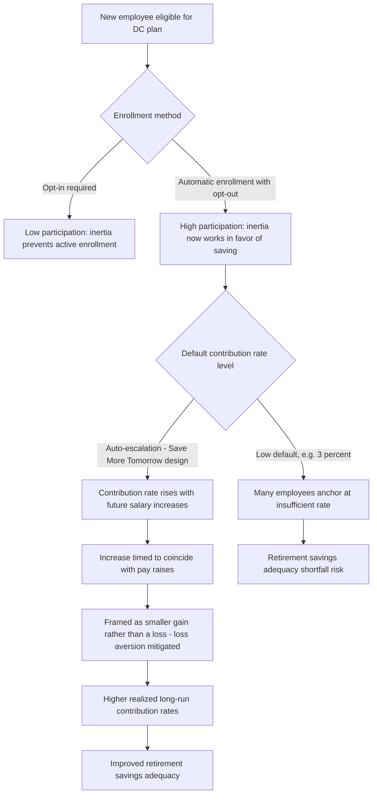

## Retirement Savings and Defined-Contribution Plans

### Overview

Retirement savings and defined-contribution (DC) plans represent one of the most consequential and heavily studied domains in household finance, both because retirement wealth accumulation constitutes a first-order determinant of lifetime economic welfare, and because the decades-long global shift from defined-benefit (DB) to defined-contribution retirement systems has transferred substantial investment, contribution, and decumulation decision-making from institutions and actuaries onto individual households — precisely the population shown throughout this chapter to exhibit systematic, costly deviations from normative financial decision-making. This topic synthesizes the household portfolio choice, financial literacy, and mental accounting/behavioral material developed earlier in the curriculum into the single domain where behavioral household finance research has had its most direct and measurable policy impact.

---

### The DB-to-DC Shift: Structural Background

#### Defined-Benefit vs. Defined-Contribution Systems

- **Defined-benefit (DB) plans**: The employer/plan sponsor promises a specified retirement benefit (typically based on salary history and tenure), bearing investment risk, longevity risk, and the burden of contribution-adequacy decisions on behalf of the employee.
- **Defined-contribution (DC) plans**: The employer and/or employee contribute a specified amount to an individual account (e.g., a 401(k) in the U.S., or analogous individual-account systems internationally), with the employee bearing investment risk, choosing (within plan-offered options) how to invest contributions, and — at retirement — bearing longevity and decumulation risk directly.

**Key Points**

- This shift places the full weight of every behavioral household finance issue covered in this chapter — participation, diversification, literacy, inertia — directly onto individual retirement adequacy in a way that did not exist under DB systems, making DC plan design a uniquely important applied setting for behavioral household finance research.
- The shift has occurred at different paces and to different degrees across countries, but is a broadly global trend across most advanced economies over the past several decades.

---

### The Three Core DC Plan Decisions

DC plan participation involves three sequential decisions, each of which the empirical literature finds is subject to substantial behavioral deviation from optimal choice:

1. **Participation/enrollment decision**: Whether to enroll in the plan at all (where not automatic).
2. **Contribution rate decision**: How much of income to contribute, given any employer matching structure.
3. **Investment allocation decision**: How to allocate contributions across the plan's menu of investment options.

A fourth, increasingly studied decision occurs at retirement:

4. **Decumulation decision**: How to draw down accumulated DC wealth in retirement (lump sum, systematic withdrawal, annuitization).

---

### Decision 1: Participation and Enrollment

#### The Power of Automatic Enrollment

Madrian and Shea's (2001) landmark study found that switching a 401(k) plan from opt-in enrollment (employees must actively choose to enroll) to automatic enrollment (employees are enrolled by default unless they actively opt out) produces dramatic increases in measured participation rates, even though the economic incentive to participate (employer match, tax advantages) is unchanged by the switch.

**Key Points**

- This finding is among the most influential single results in behavioral household finance, since it demonstrates that a purely administrative/default change — with zero change in the underlying financial incentives — can shift behavior far more than plausible financial-education interventions of similar cost, directly connecting to the "choice architecture as complement to financial education" theme developed under Financial Literacy and Decision-Making.
- The effect is generally interpreted as reflecting a combination of inertia/status-quo bias, the implicit endorsement effect of a default (employees may interpret the default as an implicit recommendation), and procrastination in the face of a decision requiring effortful comparison of investment options.

#### Automatic Enrollment Design Considerations

- **Opt-out rates remain low** even under automatic enrollment across most studied plans, confirming the strength of the default/inertia effect rather than merely shifting friction from one direction to another.
- **Interaction with contribution rate defaults**: Because automatic enrollment requires specifying a default contribution rate, the *level* of that default itself becomes a highly influential parameter (see Decision 2), given that many employees passively accept whatever default is set.

---

### Decision 2: Contribution Rate

#### Default Contribution Rate Effects

Just as default enrollment status strongly influences participation, the default contribution rate set within an automatic enrollment design strongly influences the actual contribution rate employees end up with, since many employees do not actively adjust away from the default (Madrian & Shea, 2001; Choi, Laibson, Madrian & Metrick, 2004).

**Key Points**

- This creates a design tension: low default contribution rates (historically often set around 3% in early U.S. automatic enrollment plans, partly to minimize opt-out) can anchor many employees at a rate insufficient for adequate retirement saving, since the default functions as a strong anchor rather than merely a fallback for the inattentive.

#### Save More Tomorrow (SMarT)

Thaler and Benartzi's (2004) "Save More Tomorrow" program directly addresses this tension using two behavioral design principles:

1. **Present bias mitigation**: Employees commit *in advance* to future contribution rate increases (rather than an immediate increase), exploiting the greater willingness to accept future sacrifices than present ones — a design response to hyperbolic/present-biased discounting (see Mortgage and Household Debt Decisions for the same underlying behavioral mechanism applied to a different domain).
2. **Loss aversion mitigation**: Contribution rate increases are timed to coincide with scheduled salary increases, so the contribution increase is experienced as a smaller *gain* being forgone (less take-home pay increase than otherwise) rather than an outright *loss* (a reduction in current take-home pay) — directly exploiting the loss-averse asymmetry central to Prospect Theory and the Mental Accounting topic.

$$\text{Take-home pay change under SMarT} = \Delta(\text{Salary increase}) - \Delta(\text{Contribution rate increase}) \geq 0$$

Program evaluations found substantially higher average contribution rates among participants enrolled in SMarT-style automatic escalation compared to those offered only a one-time contribution rate increase recommendation, with the escalation feature now widely adopted in retirement plan design internationally.

Diagram of the automatic enrollment and escalation design logic (svg_diagram):

---

### Decision 3: Investment Allocation Within DC Plans

#### Naive Diversification ("1/n" Heuristic)

Benartzi and Thaler (2001) find that many DC plan participants appear to use a naive "1/n" diversification heuristic — allocating contributions roughly evenly across whatever set of $n$ investment options the plan menu happens to offer, rather than optimizing based on the underlying asset classes represented.

**Key Points**

- A direct implication is that the *composition of the plan menu itself* mechanically shapes participant portfolios: a menu with many equity fund options and few bond options will, under 1/n behavior, produce a more equity-heavy average allocation than a differently composed menu offering the identical underlying asset classes in different proportions — a striking example of choice architecture directly determining outcomes independent of participants' actual risk preferences.
- This finding has directly informed subsequent plan design guidance emphasizing thoughtful menu curation (limiting redundant or narrowly overlapping fund options) rather than simply maximizing the number of choices offered.

#### Employer Stock and Concentration Risk

As discussed under Household Portfolio Choice in Practice, DC plans that offer employer stock as an investment option (or that provide employer matching contributions in the form of employer stock) are associated with significant concentration risk, compounding the correlation between an employee's labor income and financial wealth. Regulatory and plan-design responses (e.g., limits on employer stock concentration, mandatory diversification rights) have directly targeted this documented risk.

#### The Rise of Target-Date Funds as a Default Solution

Target-date funds (TDFs) — diversified, professionally managed funds that automatically adjust their risk allocation ("glide path") as the participant approaches a target retirement date — have become the dominant qualified default investment alternative (QDIA) in many DC systems, directly as a policy and plan-design response to the naive-diversification and inertia findings above.

**Key Points**

- By bundling diversification and age-appropriate risk reduction into a single default option, TDFs are designed to deliver a "reasonable" outcome for participants who would otherwise passively default into an inadequately diversified or inappropriately risky allocation, without requiring the participant to actively make either the diversification or the glide-path decision.
- TDF adoption has grown substantially as a share of DC plan defaults following regulatory changes (e.g., U.S. Pension Protection Act of 2006 provisions establishing QDIA safe harbors) that explicitly encouraged their use as default investment options.

---

### Decision 4: Decumulation — The Retirement Drawdown Problem

#### The Annuitization Puzzle

Classical life-cycle theory (building on Yaari, 1965) predicts that risk-averse retirees facing uncertain lifespan should, under fairly general conditions, find it optimal to annuitize a substantial share of their retirement wealth (converting it into a guaranteed lifetime income stream), since annuities pool longevity risk across a population and can therefore deliver a given expected payout at lower cost than self-insuring against the possibility of unusually long life.

- **Empirically**, voluntary annuitization rates among retirees with DC wealth are consistently far below what standard life-cycle models predict — a persistent and well-documented "annuitization puzzle."
- **Behavioral and structural explanations** include: bequest motives (annuities typically forfeit remaining value upon death, reducing bequeathable wealth), mental accounting (retirees may mentally frame annuitization as "losing control" of a lump sum rather than "buying insurance," a framing effect demonstrated experimentally to significantly affect stated annuitization preferences), distrust of insurance companies/counterparty risk concerns, and existing partial annuitization through DB pensions or public pension systems reducing the marginal need for additional annuitization.
- Complexity and lack of understanding of annuity products themselves (connecting to the Financial Literacy topic) is also cited as a contributing factor, since annuity product terms are often complex relative to typical household financial literacy levels.

#### Systematic Withdrawal and Longevity Risk Management

In the absence of full annuitization, most DC retirees manage decumulation through systematic withdrawal rules (e.g., the "4% rule" heuristic and its many variants and critiques) or discretionary drawdown, both of which leave the retiree bearing investment risk, sequence-of-returns risk, and longevity risk directly — an area of active ongoing research and product innovation (e.g., managed payout funds, deferred/longevity annuities) attempting to bridge the gap between full annuitization and pure self-managed drawdown.

---

### Empirical Evidence Summary

| Study | Finding |
| --- | --- |
| Madrian & Shea (2001) | Automatic enrollment dramatically increases 401(k) participation relative to opt-in enrollment |
| Choi, Laibson, Madrian & Metrick (2004) | Documents strong default effects on both enrollment and contribution rates across multiple firms |
| Thaler & Benartzi (2004) | "Save More Tomorrow" program design substantially raises long-run contribution rates using precommitment and loss-aversion-informed framing |
| Benartzi & Thaler (2001) | Documents naive "1/n" diversification heuristic among DC plan participants, showing menu composition directly shapes portfolio outcomes |
| Yaari (1965) | Foundational life-cycle theoretical result establishing conditions under which full annuitization is optimal for risk-averse agents facing longevity uncertainty |
| Benartzi, Previtero & Thaler (2011) | Survey and review of the annuitization puzzle literature, documenting the gap between theoretical predictions and observed low voluntary annuitization rates |
| Brown, Kling, Mullainathan & Wrobel (2008) | Experimental evidence that framing annuities as an "investment" (versus a "consumption/insurance" product) significantly affects stated preference for annuitization |

**[Inference]** As with financial literacy interventions generally, the long-run persistence of behavioral-design effects (automatic enrollment, auto-escalation) on ultimate retirement wealth adequacy — as opposed to shorter-run participation and contribution-rate metrics — is an area where longitudinal evidence continues to accumulate, and the magnitude of the ultimate welfare improvement depends on assumptions about counterfactual behavior absent these design features that cannot be directly observed.

---

### Practical and Policy Implications

**Key Points**

- **For retirement plan sponsors/designers**: The cumulative weight of this literature has directly shaped modern DC plan "best practice" design: automatic enrollment, automatic escalation, a curated (not excessively large) fund menu, and a professionally managed target-date default — collectively sometimes referred to as a behaviorally informed or "libertarian paternalist" plan design approach.
- **For policymakers**: Regulatory frameworks in multiple countries (e.g., U.S. Pension Protection Act of 2006, UK auto-enrollment reforms) have directly codified these behavioral findings into legal safe harbors and requirements, representing one of the clearest examples of academic behavioral economics research translating into large-scale, real-world policy design.
- **For decumulation product design**: The persistent annuitization puzzle motivates continued innovation in partial-annuitization defaults, simplified/framed annuity products, and hybrid decumulation solutions, given that pure opt-in annuitization has consistently underdelivered relative to normative benchmarks.
- **For individual practitioners/advisors**: Understanding that plan defaults and menu design have first-order effects on client outcomes — independent of the client's stated risk preferences — is directly relevant when advising clients whose retirement wealth may reflect passive acceptance of employer-chosen defaults rather than active, considered choices.

---

### Related Topics

- Household Portfolio Choice in Practice
- Financial Literacy and Decision-Making
- Mortgage and Household Debt Decisions
- Overconfidence and Mental Accounting
- Default Effects and Choice Architecture
- Nudge Theory and Libertarian Paternalism
- Prospect Theory and Loss Aversion
- Present Bias and Hyperbolic Discounting
- Life-Cycle Consumption and Portfolio Models (Merton, Yaari)
- Longevity Risk and Annuity Markets