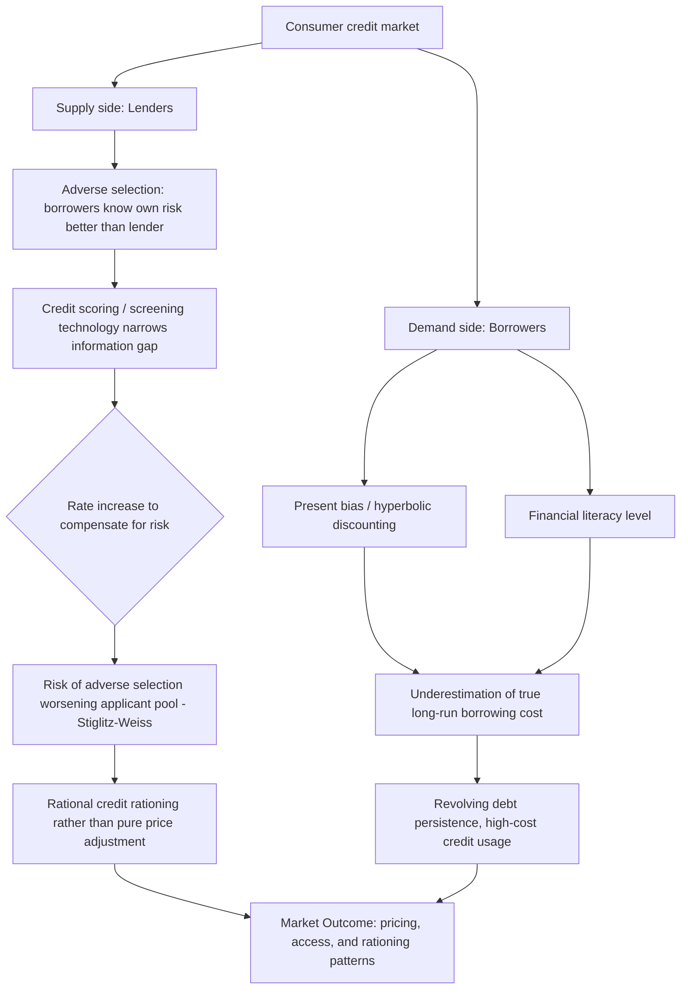

## Consumer Credit Markets

### Overview

Consumer credit markets encompass the full institutional and analytical framework through which households borrow outside of mortgage finance — credit cards, personal loans, auto loans, student loans, and alternative/high-cost credit products (payday loans, pawn loans, rent-to-own). Where the earlier Mortgage and Household Debt Decisions topic focused primarily on individual household decision-making within these markets, this topic broadens the lens to the market-level structure: how consumer credit is priced, underwritten, and regulated, and how information asymmetries, screening technology, and behavioral factors on both the supply (lender) and demand (borrower) sides jointly determine market outcomes. This synthesizes household finance behavioral material with core information-economics concepts (adverse selection, screening, signaling) applied specifically to the consumer lending context.

---

### Structure of Consumer Credit Markets

#### Major Product Categories

1. **Revolving credit (credit cards)**: Open-ended credit lines with a minimum payment requirement and interest charged on unpaid balances; the dominant form of unsecured consumer credit in most developed economies.
2. **Installment credit (auto loans, personal loans, student loans)**: Fixed-term loans with scheduled repayment, typically secured (auto loans) or unsecured (many personal and student loans).
3. **Alternative/high-cost credit**: Payday loans, auto title loans, pawn loans, rent-to-own arrangements, and similar products, characterized by short terms, high effective annual interest rates, and typically minimal underwriting relative to mainstream credit.
4. **Buy-now-pay-later (BNPL)**: A more recently prominent point-of-sale installment credit product, typically offering short-term, often interest-free installment plans, that has grown rapidly and introduced new regulatory and credit-reporting questions given its historically lighter-touch underwriting and reporting relative to traditional credit products.

**Key Points**

- These product categories differ substantially in underwriting rigor, interest-rate levels, and the borrower populations they primarily serve, with alternative/high-cost credit and (historically) BNPL products disproportionately used by credit-constrained or subprime-rated households.

---

### Information Economics of Consumer Lending

#### Adverse Selection and Screening

Consumer credit markets are a canonical application of asymmetric-information economics (building on Akerlof's 1970 "lemons" framework and Stiglitz-Weiss's 1981 credit-rationing model): borrowers know more about their own true repayment probability than lenders do, creating an adverse selection problem in loan pricing.

- **Stiglitz-Weiss credit rationing**: Raising interest rates to compensate for higher expected default risk can be self-defeating for a lender, because higher rates may disproportionately drive away *lower*-risk borrowers (who have better outside options and are less willing to pay high rates) while retaining higher-risk borrowers (who have fewer alternatives) — worsening the average quality of the applicant pool. This can lead lenders to rationally *ration* credit (deny loans to some observationally similar applicants) rather than simply raising the price to clear the market, since price alone cannot fully solve the adverse selection problem.

$$\frac{\partial (\text{Expected Lender Return})}{\partial r} \gtrless 0$$

depending on whether the rate increase's direct return effect outweighs the adverse-selection-driven deterioration in the applicant pool's average default risk — the central non-monotonicity result of the Stiglitz-Weiss model.

#### Credit Scoring as a Screening Technology

Modern consumer credit markets rely heavily on statistical credit scoring (e.g., FICO scores in the U.S., and analogous systems internationally) as the primary mechanism for mitigating adverse selection, using historical repayment data and observable borrower characteristics to estimate default probability and price/ration credit accordingly.

**Key Points**

- Credit scoring substantially narrows, but does not eliminate, the information asymmetry central to the Stiglitz-Weiss framework, since scores are necessarily based on observable, historically predictive variables and cannot capture all private information a borrower holds about their own repayment intentions and circumstances.
- The rise of "alternative data" underwriting (utility payment history, cash-flow/bank-transaction data, and increasingly machine-learning-based scoring models) represents an ongoing effort to further narrow this information gap, particularly for "thin-file" borrowers with limited traditional credit history — a population disproportionately affected by the credit-rationing problem described above.

---

### Behavioral Demand-Side Factors in Consumer Credit

This section connects directly to the household-level decision patterns established under Mortgage and Household Debt Decisions and Financial Literacy and Decision-Making, now viewed as market-level phenomena:

#### Present Bias and Overborrowing

- **Present-biased (hyperbolic) discounting** — a systematic tendency to overweight immediate gratification (a purchase now) relative to well-understood future costs (interest payments) — is widely cited as a demand-side driver of revolving credit card debt persistence and high-cost credit usage, distinct from the market-level information-asymmetry factors above.
- **Naive versus sophisticated present bias**: A distinction in the theoretical literature (following O'Donoghue & Rabin, 1999) between "sophisticated" present-biased agents (who are aware of their own future self-control problems and may seek commitment devices) and "naive" present-biased agents (who underestimate their own future susceptibility to overborrowing) has direct implications for how consumer credit products are marketed and used — naive borrowers are more susceptible to underestimating the true cost of low-minimum-payment revolving credit precisely because they underestimate how long they will actually carry the balance.

#### Financial Literacy and Credit Market Outcomes

As established under Financial Literacy and Decision-Making, lower measured financial literacy is robustly associated with worse consumer credit outcomes: higher-cost borrowing, lower propensity to comparison-shop loan terms, and greater usage of high-cost alternative credit products, even after controlling for income and access-related factors.

#### The BNPL Behavioral Question

**Key Points**

- Buy-now-pay-later products' typically interest-free, small-installment structure has raised specific behavioral concerns in recent consumer-finance research and regulatory discussion: the framing of a purchase as several small, interest-free installments may reduce the perceived total cost salience relative to an equivalent single-payment purchase, potentially encouraging overconsumption relative to a fully transparent framing — though [Unverified] the magnitude and generalizability of this specific effect across different BNPL products, provider disclosure practices, and consumer populations remains an active and still-developing area of empirical research rather than a settled finding, given the product category's relative novelty.

Diagram of the interacting supply-side and demand-side dynamics in consumer credit markets (svg_diagram):

---

### Regulation of Consumer Credit Markets

#### Disclosure-Based Regulation

The dominant historical regulatory approach in most developed consumer credit markets has been mandated standardized disclosure (e.g., the U.S. Truth in Lending Act's Annual Percentage Rate, or APR, disclosure requirement), intended to reduce search costs and enable comparison shopping across lenders by standardizing how the cost of credit is expressed.

**Key Points**

- The CARD Act (2009) minimum-payment disclosure requirement discussed under Mortgage and Household Debt Decisions is a direct example of behaviorally informed disclosure regulation — moving beyond simple rate disclosure toward disclosure specifically designed to counteract a documented behavioral bias (minimum-payment anchoring), rather than assuming disclosure alone is sufficient regardless of format.
- A recurring finding in the behavioral consumer-finance literature is that disclosure *format*, not just disclosure *content*, materially affects consumer decision-making — motivating an evolving regulatory emphasis on evidence-based, tested disclosure design rather than purely legalistic completeness.

#### Interest Rate Caps ("Usury" Regulation)

Many jurisdictions impose caps on the maximum interest rate lenders can charge, particularly targeting high-cost alternative credit products (e.g., payday loan rate caps).

- **Rationale**: Protecting financially vulnerable, potentially present-biased or credit-constrained borrowers from what regulators view as exploitative pricing.
- **Trade-off (standard economic critique)**: Binding rate caps can, per the Stiglitz-Weiss logic, push lenders to ration credit entirely to higher-risk borrower segments rather than lend at a capped (and, for those borrowers, unprofitable) rate — potentially eliminating legal access to credit altogether for some populations rather than simply making it cheaper, pushing demand toward unregulated informal credit sources. [Inference] The empirical magnitude of this credit-access trade-off versus the consumer-protection benefit varies considerably across studied jurisdictions and cap levels, and remains a genuinely contested empirical and policy question rather than one with a single settled answer.

#### Underwriting and Suitability Standards

Beyond disclosure, some regulatory frameworks impose direct underwriting requirements (e.g., "ability-to-repay" rules in certain mortgage and, increasingly, other consumer credit contexts) requiring lenders to affirmatively assess a borrower's capacity to repay, rather than relying solely on disclosure to allow borrowers to self-select appropriately — a more paternalistic regulatory approach reflecting skepticism (informed by the behavioral evidence catalogued in this chapter) that disclosure alone reliably produces good outcomes for all borrower segments.

---

### Empirical Evidence Summary

| Study | Finding |
| --- | --- |
| Stiglitz & Weiss (1981) | Foundational credit rationing model showing adverse selection can lead lenders to ration credit rather than raise prices to clear the market |
| Akerlof (1970) | Foundational "market for lemons" information asymmetry framework underlying adverse selection analysis in credit (and other) markets |
| O'Donoghue & Rabin (1999) | Theoretical framework distinguishing sophisticated versus naive present-biased agents, with direct application to overborrowing behavior |
| Agarwal, Chomsisengphet, Mahoney & Stroebel (2015) | Studies the CARD Act's effects on U.S. credit card borrowing costs and behavior, providing evidence on disclosure and underwriting regulation effectiveness |
| Bertrand & Morse (2011) | Experimental evidence that enhanced, behaviorally informed disclosure at payday loan storefronts measurably reduces subsequent borrowing, demonstrating disclosure format's causal effect on behavior |
| Melzer (2011) | Finds payday loan access associated with increased difficulty paying important bills, contributing to the empirical debate on high-cost credit's net welfare effect for users |

**[Inference]** As with other areas of household finance, distinguishing genuine behavioral-bias-driven demand for high-cost or suboptimal credit products from rational responses to severe credit constraints (where high-cost credit may be a borrower's best *available* option, not necessarily an irrational choice among a wider feasible set) remains a central identification challenge across this empirical literature, and results can vary depending on the specific product, population, and regulatory context studied.

---

### Practical and Policy Implications

**Key Points**

- **For lenders/fintech underwriters**: The ongoing shift toward alternative-data and machine-learning-based credit scoring directly targets the core information-asymmetry problem underlying credit rationing, though it raises separate, actively debated concerns around fairness, disparate impact, and model transparency that extend beyond the pure information-economics framing.
- **For regulators**: The consumer credit literature's behavioral findings have shifted regulatory emphasis from pure rate/APR disclosure toward evidence-tested, format-sensitive disclosure design and, in some contexts, direct underwriting/suitability requirements, reflecting accumulated evidence that disclosure format materially affects real-world borrowing behavior.
- **For financial counselors/advisors**: Understanding the interaction between present bias, financial literacy, and product structure (e.g., minimum payments, BNPL installment framing) is directly relevant to counseling clients on debt management strategies, connecting this topic back to the practical guidance developed under Mortgage and Household Debt Decisions.
- **For researchers**: The rapid growth of BNPL and other novel credit-adjacent products represents an active, evolving research frontier where the established behavioral consumer-finance framework (present bias, disclosure salience, credit-scoring information asymmetry) is actively being extended and tested against new product structures.

---

### Related Topics

- Mortgage and Household Debt Decisions
- Financial Literacy and Decision-Making
- Household Portfolio Choice in Practice
- Present Bias and Hyperbolic Discounting
- Adverse Selection and Screening (Information Economics)
- Retirement Savings and Defined-Contribution Plans
- Consumer Credit Regulation and Disclosure Design
- Credit Scoring and Alternative Data Underwriting
- Nudge Theory and Libertarian Paternalism