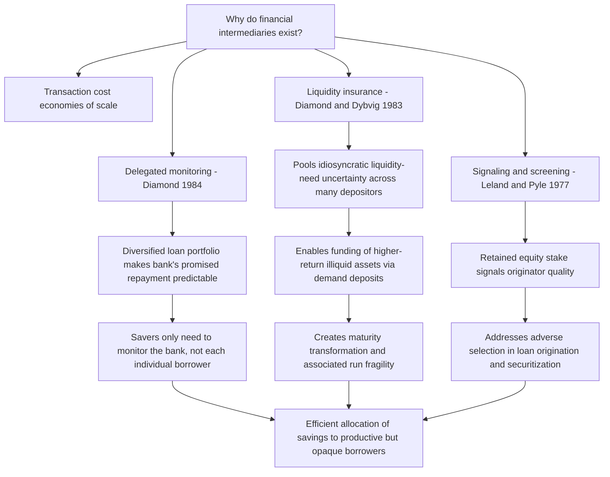

## The Theory of Financial Intermediation

### Overview

The theory of financial intermediation addresses a foundational question in financial economics: why do banks and other financial intermediaries exist at all? In a frictionless Modigliani-Miller world with complete markets and no informational asymmetries, savers could lend directly to borrowers without any need for an intervening institution. The persistent, large-scale existence of banks and similar intermediaries is therefore itself an economic phenomenon requiring explanation, and the modern theory of financial intermediation — developed primarily by Diamond (1984), Diamond and Dybvig (1983), Leland and Pyle (1977), and related contributors — grounds this explanation in the same informational and contractual frictions (asymmetric information, transaction costs, liquidity risk) that motivate the household finance and limits-to-arbitrage material covered earlier in this course.

---

### Why Intermediaries Exist: The Core Rationales

#### 1. Transaction Cost Economies of Scale

The earliest formal rationale for intermediation (predating the informational-economics turn) is that intermediaries achieve economies of scale in transaction costs that individual savers and borrowers cannot replicate on their own:

- **Pooling small denominations**: Intermediaries aggregate many small deposits into loans of a size individual savers could not efficiently originate or monitor alone.
- **Specialized transaction infrastructure**: Payment processing, loan documentation, and search costs are subject to genuine scale economies, favoring a specialized institution over decentralized direct lending.

**Key Points**

- This rationale, while real, is generally considered insufficient on its own to explain the specific institutional form banks take (e.g., demandable deposits, illiquid loan portfolios); the modern theory instead emphasizes informational and risk-sharing frictions as the more fundamental explanatory factors.

#### 2. Information Production and Delegated Monitoring (Diamond, 1984)

Diamond's (1984) "Financial Intermediation and Delegated Monitoring" provides the most influential single explanation grounded in information economics.

**Setup**: Borrowers' true creditworthiness and effort are not directly observable by lenders (a moral hazard/costly-state-verification problem). If many small individual savers each attempted to independently monitor a borrower's actions and creditworthiness, the *aggregate* monitoring cost across all these savers would be highly duplicative and inefficient.

**The delegated monitoring solution**: A single intermediary (the bank) is delegated the monitoring function on behalf of many savers, who instead only need to monitor the *intermediary* (a much smaller and more standardized task than monitoring diverse, opaque borrowers directly).

$$\text{Total Monitoring Cost (Direct Lending)} = n \times (\text{Monitoring Cost per Saver})$$

$$\text{Total Monitoring Cost (Delegated Monitoring)} = (\text{Bank's Monitoring Cost}) + (\text{Cost of Savers Monitoring the Bank})$$

Diamond shows that under diversification (the bank holds a large, well-diversified portfolio of loans), the cost of savers monitoring the bank itself can be made arbitrarily small relative to $n$ (the number of underlying borrowers) as the bank's portfolio grows, since diversification reduces the variance of the bank's own aggregate portfolio return, making the bank's promised repayment to savers highly predictable and hence cheap to verify.

**Key Points**

- This is the theoretical foundation for why banks are simultaneously large, diversified lenders *and* issuers of relatively simple, standardized (deposit) claims to savers — the diversification is precisely what makes the delegation credible and cost-effective.

#### 3. Liquidity Insurance and Maturity Transformation (Diamond & Dybvig, 1983)

Diamond and Dybvig's (1983) canonical model, covered in more institutional and crisis-specific depth under Bank Runs later in this chapter, provides a second core rationale: banks exist to provide **liquidity insurance** to savers who face uncertain, idiosyncratic future liquidity needs.

**Setup**: Individual savers do not know in advance whether they will need to consume (withdraw funds) early or late; long-term, illiquid investments (e.g., productive but illiquid physical capital or long-duration loans) earn a higher return than short-term liquid investments, but committing fully to the illiquid investment leaves an individual saver unable to respond to an early liquidity need without a costly early liquidation.

**The insurance solution**: A bank pools many savers' funds and offers demand deposit contracts, promising a fixed withdrawal amount to any depositor withdrawing "early" and a higher amount to those withdrawing "late" — effectively pooling and insuring against each individual's idiosyncratic liquidity-need uncertainty, since the *aggregate* proportion of early versus late withdrawers across a large depositor pool is far more predictable than any single individual's own future liquidity need.

$$\text{Bank offers: } r_1 \text{ (early withdrawal)}, \quad r_2 > r_1 \text{ (late withdrawal)}, \quad r_2 \text{ reflecting the illiquid asset's higher return}$$

**Key Points**

- This maturity-transformation function — funding long-term, illiquid assets with short-term, liquid liabilities (demand deposits) — is the defining structural feature of traditional banking, and is precisely what creates the fragility (susceptibility to bank runs) that motivates the deposit insurance and regulatory material developed later in this chapter.
- The Diamond-Dybvig framework demonstrates that this liquidity-transformation function is not an accident of institutional history but an economically efficient response to a genuine underlying friction (uninsurable idiosyncratic liquidity risk) — banks perform a real economic service that a purely frictionless market for individually-tradable claims could not replicate as efficiently.

---

### Adverse Selection, Signaling, and Screening in Intermediation

#### Leland and Pyle (1977): Signaling Through Retained Ownership

Leland and Pyle (1977) extend the informational-economics rationale to explain why intermediaries themselves are structured with owner-retained equity stakes: an intermediary's willingness to hold a substantial equity stake in the assets it originates or monitors serves as a credible signal of the quality of its private information about those assets, since a poorly-informed or knowingly-low-quality originator would be reluctant to retain significant "skin in the game."

**Key Points**

- This signaling logic connects directly to modern securitization-market debates (e.g., post-2008 "risk retention" regulatory requirements, discussed under Securitization later in this chapter), which mandate that loan originators retain a minimum economic stake in securitized loan pools, precisely to address the adverse-selection concern that originators might otherwise sell off only their lowest-quality originations.

#### Screening and Relationship Lending

Beyond delegated monitoring of already-originated loans, intermediaries perform an ex-ante **screening** function — using both hard, quantifiable information (credit scores, financial statements) and soft, relationship-based information (accumulated knowledge from an ongoing banking relationship) to select which borrowers to lend to in the first place.

- **Relationship banking**: Repeated interactions between a bank and a borrower over time allow the bank to accumulate proprietary "soft information" (e.g., observed cash-flow patterns, management quality assessments) not available to arm's-length capital-market lenders, providing an informational rationale for bank lending's persistence even in economies with well-developed public capital markets.
- **Transactional versus relationship lending**: The theoretical literature distinguishes standardized, hard-information-based "transactional" lending (more easily securitized or transferred) from soft-information-based "relationship" lending (more resistant to disintermediation, since the informational advantage is specific to the ongoing bank-borrower relationship and does not transfer easily to a third-party buyer of the loan).

Diagram of the core theoretical rationales for intermediation (svg_diagram):

---

### The Balance Sheet View: Banks as Asset Transformers

Synthesizing the above rationales, the modern theory characterizes banks (and similar intermediaries) as performing several simultaneous transformation functions on their balance sheet:

| Transformation Function | Description |
| --- | --- |
| Size transformation | Pooling many small deposits to fund larger, individually lumpy loans |
| Maturity transformation | Funding long-term illiquid assets with short-term liquid liabilities |
| Risk transformation | Diversifying idiosyncratic borrower risk across a broad loan portfolio, and (via deposit insurance/capital structure) shielding depositors from most of that residual risk |
| Information transformation | Converting borrower-specific, opaque information into standardized, easily verified claims (deposits) held by savers |

**Key Points**

- These four transformation functions are not independent — the theory shows they are deeply interconnected (e.g., diversification, central to the risk-transformation function, is also what makes delegated monitoring credible and cost-effective per Diamond 1984), meaning banks' distinctive institutional form reflects a jointly optimized response to multiple frictions simultaneously rather than any single friction in isolation.

---

### Contrast with Direct (Disintermediated) Finance

**Key Points**

- **Capital markets as an alternative**: Large, well-known borrowers with abundant public information (e.g., large public corporations) can often access capital markets directly (issuing bonds or equity), bypassing intermediaries, since the informational-asymmetry rationale for intermediation is weakest precisely where public information is most abundant.
- **The "bank versus market" question**: A substantial cross-country literature (connecting to the Finance and Development material in the Economics subject area) studies why some economies rely more heavily on bank-based intermediation while others rely more on market-based (direct) finance, with theoretical explanations spanning legal-origin/investor-protection differences, the relative maturity of public information/disclosure infrastructure, and historical path dependence in financial system development.
- **Disintermediation and fintech**: Modern developments in peer-to-peer lending, marketplace lending platforms, and fintech credit scoring can be understood theoretically as attempts to reduce the informational-asymmetry and screening frictions that traditionally required a full-scale, diversified intermediary — an active area of ongoing research into whether and how far these technologies can substitute for traditional bank-based delegated monitoring and liquidity insurance functions.

---

### Empirical and Foundational Literature Summary

| Study | Contribution |
| --- | --- |
| Diamond (1984) | Delegated monitoring theory: diversified intermediaries efficiently economize on duplicative direct-lending monitoring costs |
| Diamond & Dybvig (1983) | Liquidity insurance theory: banks pool idiosyncratic liquidity risk, enabling higher-return illiquid investment, at the cost of run fragility |
| Leland & Pyle (1977) | Signaling theory: intermediary equity retention signals private information quality, addressing adverse selection in origination |
| Stiglitz & Weiss (1981) | Adverse selection and credit rationing framework, directly underlying screening rationales for intermediation (see also Consumer Credit Markets) |
| Boyd & Prescott (1986) | Extends delegated monitoring/coalition-formation logic, formalizing intermediaries as information-sharing coalitions among lenders |
| Rajan (1992) | Studies the trade-offs of relationship (informed) versus arm's-length (transactional) lending, including the "hold-up" risk a borrower faces from an informationally advantaged relationship lender |

---

### Practical and Policy Implications

**Key Points**

- **For bank regulation and supervision**: Because the delegated-monitoring rationale depends on intermediary diversification and credible monitoring incentives, capital regulation and supervisory oversight are partly justified as mechanisms ensuring the intermediary itself remains a credible, well-monitored delegate on behalf of dispersed savers — directly motivating the capital adequacy material developed later in this chapter.
- **For understanding financial system structure**: The bank-versus-market theoretical framework informs cross-country comparative analysis of financial development and its relationship to economic growth, connecting to Finance and Development material in the Economics subject area.
- **For fintech and market design**: Evaluating whether new lending technologies (marketplace lending, algorithmic underwriting) can safely substitute for traditional intermediation requires assessing whether they genuinely replicate the delegated-monitoring and liquidity-insurance functions this theory identifies as banks' core economic rationale, or merely replicate the transaction-facilitation function while leaving the deeper informational and liquidity-risk functions unaddressed.

---

### Related Topics

- Bank Runs and the Diamond-Dybvig Model
- Deposit Insurance and Moral Hazard
- Capital Adequacy and Bank Regulation (Basel Framework)
- Securitization and Risk Retention
- Adverse Selection and Screening (Consumer Credit Markets)
- Relationship Lending versus Transactional Lending
- Financial Development and Economic Growth (Finance and Development)
- Shadow Banking and Non-Bank Financial Intermediation
- Fintech Lending and Disintermediation